{0}------------------------------------------------

# AVIONS MARCEL DASSAULT - BREGUET AVIATION

I. A. C. I. TECHNICAL LIBEARY MASTER FILE.

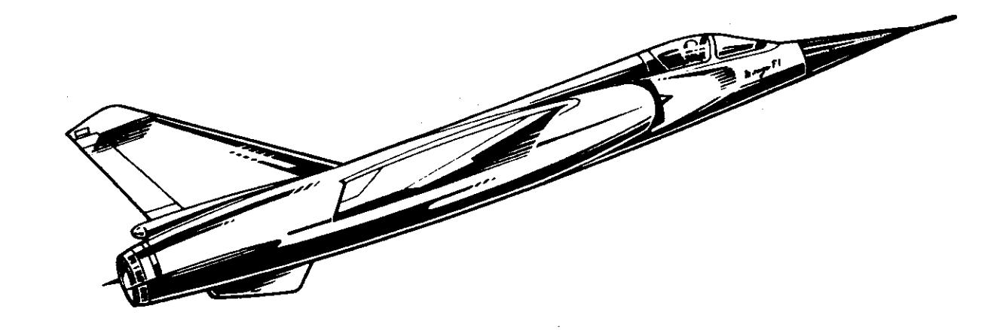

AVIONS MARCEL DASSAULT

CONFIDENTIAL

BREGUET AVIATION

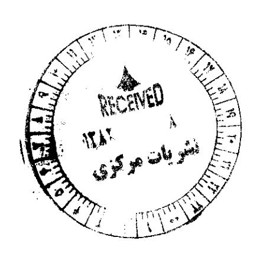

TEMPORES :

Mirage F1

{1}------------------------------------------------

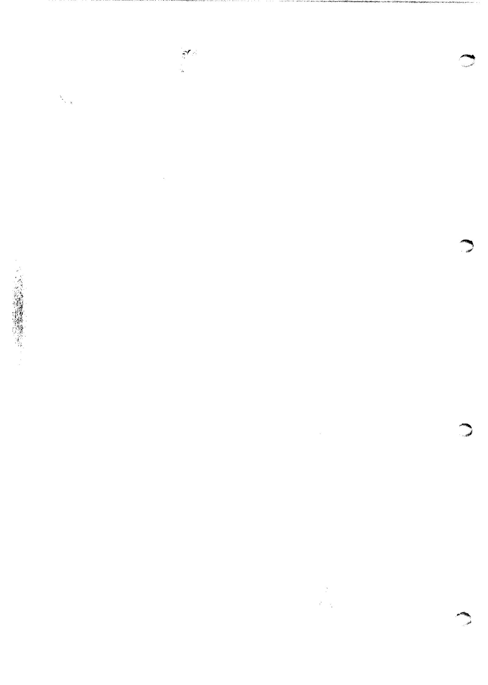

{2}------------------------------------------------

#### **MAINTENANCE MANUAL**

### **MANUAL 12**

# NWS CONTROL AND NAVIGATION

### **MIRAGE F1EQ**

AIRCRAFT

AVIONS MARCEL DASSAULT - BREGUET AVIATION

RESTRICTED

{3}------------------------------------------------

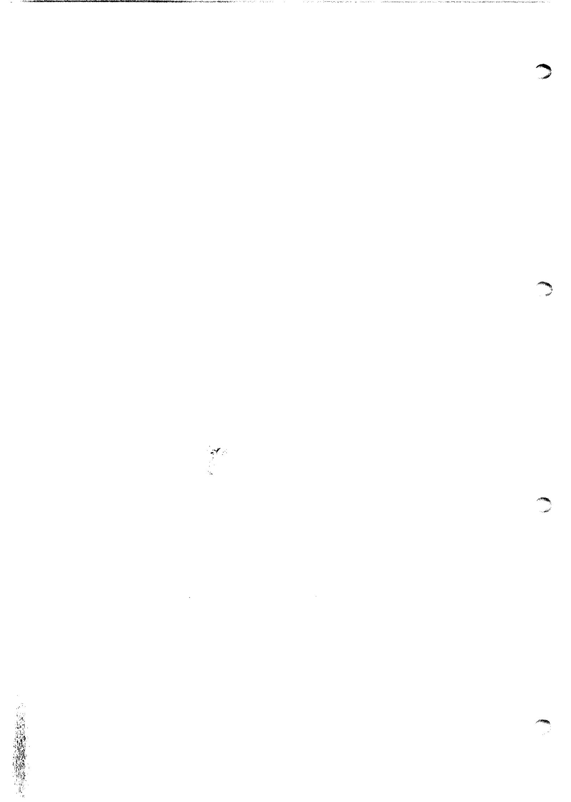

{4}------------------------------------------------

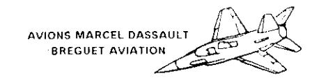

INDEX DES PAGES

L'astérisque indique les pages révisées ou nouvelles et la lettre A indique les pages annulées par la présente mise a jour.

The asterisk indicates pages changed or added and letter A indicates pages deleted by the current change.

CHANGE 04

| PAGE           | С        | DATE    | R | PAGE           | С        | DATE           | Ŕ | PAGE            | С        | DATE           | R       |
|----------------|----------|---------|---|----------------|----------|----------------|---|-----------------|----------|----------------|---------|
| A              | EQ       | 12/87   | * | 1-115          | AE       | 12/80          |   | 3-002           | AP       | 08/79          |         |
| B/C            | ΕQ       | 12/87   | * | 1-116          | AA       | 11/74          |   | 3-101           | AH       | 08/79          |         |
| D/E            | EQ       | 12/87   | * | 1-117          | AA       | 04/80          |   | 3-102           | AJ       | 07/87          | *       |
|                | 3        |         | ŀ | 1-118          | AB       | 07/87          | * | 3-103           | AM       | 04/80          |         |
| I/II           | AM       | 06/83   |   | 1-119          | AG       | 05/79          |   | 3-104           | AJ       | 08/79          |         |
| III/IV V/VI | AD       | 02/80   |   | 1-120 1-121 | AE       | 10/78          |   | 3-104M 3-105 | AF AJ | 08/79          |         |
| VII/VIII       | AD AZ | 11/87   | * | 1-121          | AH AA | 12/80 10/73 |   | 3-105           | AK       | 04/80 08/79 |         |
| IX             | AA       | 02/80   |   | 1-123          | AK       | 12/80          |   | 3-107           | AJ       | 08/79          |         |
| X              | AA       | 02/80   |   | 1-124          | AK       | 11/81          |   | 3-107M          | AF       | 08/79          |         |
| P.             | AA       | 02/80   |   | 1-125          | AK       | 11/81          |   | 3-107P          | AC       | 04/80          |         |
| XII            | AA       | 02/80   |   | 1-126          | AA       | 11/72          |   | 3-108           | AK       | 08/79          |         |
| XIII/XIV       | AC       | 06/74   |   | 1-127          | AK       | 11/81          |   | 3-109           | AJ       | 08/79          |         |
| XV             | AC       | 06/74   |   | 1-129          | AM       | 04/80          |   | 3-110           | AP       | 08/79          |         |
| XVI            | AC AC | 06/74   |   | 1-130 1-131 | AC AC | 09/74 11/83 |   | 3-111 3-111M | AN AA | 08/79 08/79 |         |
| XVIII          | AC       | 06/74   | İ | 1-201          | AA       | 05/74          |   | 3-111           | AG       | 11/79          |         |
| XIX            | AC       | 06/74   |   | 1-202          | AC       | 07/74          |   | 3-112M          | AA       | 08/79          |         |
| XX             | AC       | 02/80   |   |                |          |                |   | 3-113           | AH       | 01/80          |         |
| XXI            | AA       | 11/87   | * | 2- 1           | AG       | 06/80          |   | 3-114           | AN       | 04/80          |         |
| XXII           | AA       | 11/87   | * | 2-001          | AD       | 01/79          |   | 3-115           | AK       | 04/80          |         |
|                |          |         |   | 2-002          | AL       | 10/79          |   | 3-116           | AF       | 08/79          |         |
| 0- 1           | AH       | 09/79   |   | 2-101          | AK       | 05/83          |   | 3-117           | AJ       | 08/79          |         |
| 0-101          | AN AP | 08/79   |   | 2-102 2-103 | AG AF | 02/84 05/79 |   | 3-119 3-120  | AC AP | 08/79 01/80 |         |
| 0-103          | AB       | 08/77   |   | 2-103          | AJ       | 10/79          |   | 3-120           | AC       | 01/80          |         |
| 0-104M         | AA       | 02/76   |   | 2-104          | AE       | 01/79          |   | 3-121           | AK       | 08/79          |         |
| 0-105          | AK       | 08/79   |   | 2-106          | AJ       | 05/79          |   | 3-123           | AL       | 08/79          | Ì       |
| 0-108          | AF       | 12/79   |   | 2-107          | AE       | 04/83          |   | 3-125           | AL       | 08/79          | 1       |
| .09            | AF       | 12/79   | ŀ | 2-108          | AD       | 01/79          |   | 3-125M          | AB       | 08/79          |         |
| U-201          | AG       | 06/83   |   | 2-109          | AF       | 05/79          |   | 3-125P          | AB       | 04/80          |         |
| 1 1            | λE       | 00 (70  |   | 2-109M         | AB       | 11/83          |   | 3-126           | AL       | 01/80          |         |
| 1- 1 1- 2      | AE AC | 09/79   |   | 2-110 2-111 | AE AF | 01/79 10/79 |   | 3-128           | AN       | 08/79          |         |
| 1-001          | AC       | 04/83   |   | 2-112          | AH       | 10/79          |   | 5- 1            | AJ       | 02/80          |         |
| 1-101          | AD       | 04/80   |   | 2-113          | AF       | 10/79          |   | 5-001           | AH       | 09/79          |         |
| 1-102          | AH       | 04/80   |   | 2-114          | AF       | 01/79          |   | 5-101           | AG       | 09/79          |         |
| 1-103          | AD       | 03/79   |   | 2-116          | AF       | 05/79          |   | 5-106           | AK       | 09/79          |         |
| 1-104          | AA       | 03/79   |   | 2-117          | AH       | 06/80          |   | 5-119           | AD       | 09/79          | ľ       |
| 1-105          | AD       | 04/83   | * | 2-118          | AJ       | 10/79          |   | 5-120           | AG       | 02/84          |         |
| 1-106 1-107 | AB AG | 02/85   | * | 2-119 2-120 | AE AK | 05/79 05/79 |   | 6- 1            | AK       | 02/80          |         |
| 1-107          | AB       | 04/80   |   | 2-120          | AG       | 05/79          |   | 6- 1M           | AB       | 02/80          |         |
| 1-109          | AG.      | 04/80   |   | 2-122          | AM       | 01/80          |   | 6- 2            | AH       | 02/80          |         |
| 1-110          | AJ       | 11/79   |   | 2-201          | AA       | 12/74          |   | 6-001           | AN       | 02/80          |         |
| 1-111          | AE       | 12/80   |   | 2-202          | AH       | 12/80          |   | 6-002           | AN       | 04/81          |         |
| 1-112          | AM       | 10,/0,1 | * |                |          |                |   | 6-003           | AH       | 02/80          |         |
| 1 113          | AC       | 12/80   |   | 3- 1           | AK       | 11/79          |   | 6-005           | AB       | 10/81          |         |
| .14            | AC       | 12/80   |   | 3-001          | AJ       | 08/79          | ] | 6~101           | AM       | 02/80          |         |
| <u> </u>       | 1        | 1 1     |   |                |          |                |   | L               | <u> </u> | إثبا           | لـــــا |

{5}------------------------------------------------

{6}------------------------------------------------

INDEX DES PAGES
LIST OF EFFECTIVE PAGES

L'astérisque indique les pages révisées ou nouvelles et la lettre A indique les pages annulées par la présente mise a jour.

The asterisk indicates pages changed or added and letter A indicates pages deleted by the current change.

CHANGE 04

| CHANGE                                                               |                                                                                                                                                                                                                                                                               |                                                                                                                                                                                                                                                                                                                                                                                                                                                                                        |                                                                                                                                                                                                                                                                                                                                                                                                                                                                                                                                                                                                                                                                                                                                                                                                                           |                                                                                                                                                                                                                                                                                                                                                                                                                                                                                                                                                                                                                                                                                                                                                                                                                                                                                             |                                                                                                                                                                                                                                                                                                                                                                                                                                                                                                                                                                                                                                                                                                                                                                                                                                                                                                                                                                                                                                                                                                            |                                                                                                                                                                                                                                                                                                                                                                                                                                                                                                                                                                                                                                                                                                                                                                                                                                                                                                                                                                                                                                                                                                                                                                                                                                                                                                                                                     |                                                                                                                                                                                                                                                                                                                                                                                                                                                                                                                                                                                                                                                                                                                                                                                                                                                                                                                                                                                                                                                                                                                                                                                                                                                                                                                                                                                                                                                                                                                                                                                                                                                                                                                                                                                                                                                                      |                                                                                                                                                                                                                                                                                                                                                                                                                                                                                                                                                                                                                                                                                                                                                                                                                                                                                                                                                                                                                                                                                                                                                                                                                                                                                                                                                                                                                                                                                                                                                                                                                                                                         |                                                                                                                                                                                                                                                                                                                                                                                                                                                                                                                                                                                                                                                                                                                                                                                                                                                                                                                                                                                                                                                                                                                                                                                                                                                                                                                                                                                                                                                                                                                                                                                                                                                                                                                                                                                                                                                                                                                                                                                                                                                                                                                                |                                                                                                                                                                                                                                                                                                                                                                                                                                                                                                                                                                                                                                                                                                                                                                                                                                                                                                                                                                                                                                                                                                                                                                                                                                                                                                                                                                                                                                                                                                                                                                                                                                                                                                                                                                                                                                                                                                                                                                                                                                                                                                                                |                                                                                                                                                                                                                                                                                                                                                                                                                                                                                                                                                                                                                                                                                                                                                                                                                                                                                                                                                                                                                                                                                                                                                                                                                                                                                                                                                                                                                                                                                                                                                                                                                                                                                                                                                                                                                                                                                                                                                                                                  |
|----------------------------------------------------------------------|-------------------------------------------------------------------------------------------------------------------------------------------------------------------------------------------------------------------------------------------------------------------------------|----------------------------------------------------------------------------------------------------------------------------------------------------------------------------------------------------------------------------------------------------------------------------------------------------------------------------------------------------------------------------------------------------------------------------------------------------------------------------------------|---------------------------------------------------------------------------------------------------------------------------------------------------------------------------------------------------------------------------------------------------------------------------------------------------------------------------------------------------------------------------------------------------------------------------------------------------------------------------------------------------------------------------------------------------------------------------------------------------------------------------------------------------------------------------------------------------------------------------------------------------------------------------------------------------------------------------|---------------------------------------------------------------------------------------------------------------------------------------------------------------------------------------------------------------------------------------------------------------------------------------------------------------------------------------------------------------------------------------------------------------------------------------------------------------------------------------------------------------------------------------------------------------------------------------------------------------------------------------------------------------------------------------------------------------------------------------------------------------------------------------------------------------------------------------------------------------------------------------------|------------------------------------------------------------------------------------------------------------------------------------------------------------------------------------------------------------------------------------------------------------------------------------------------------------------------------------------------------------------------------------------------------------------------------------------------------------------------------------------------------------------------------------------------------------------------------------------------------------------------------------------------------------------------------------------------------------------------------------------------------------------------------------------------------------------------------------------------------------------------------------------------------------------------------------------------------------------------------------------------------------------------------------------------------------------------------------------------------------|-----------------------------------------------------------------------------------------------------------------------------------------------------------------------------------------------------------------------------------------------------------------------------------------------------------------------------------------------------------------------------------------------------------------------------------------------------------------------------------------------------------------------------------------------------------------------------------------------------------------------------------------------------------------------------------------------------------------------------------------------------------------------------------------------------------------------------------------------------------------------------------------------------------------------------------------------------------------------------------------------------------------------------------------------------------------------------------------------------------------------------------------------------------------------------------------------------------------------------------------------------------------------------------------------------------------------------------------------------|----------------------------------------------------------------------------------------------------------------------------------------------------------------------------------------------------------------------------------------------------------------------------------------------------------------------------------------------------------------------------------------------------------------------------------------------------------------------------------------------------------------------------------------------------------------------------------------------------------------------------------------------------------------------------------------------------------------------------------------------------------------------------------------------------------------------------------------------------------------------------------------------------------------------------------------------------------------------------------------------------------------------------------------------------------------------------------------------------------------------------------------------------------------------------------------------------------------------------------------------------------------------------------------------------------------------------------------------------------------------------------------------------------------------------------------------------------------------------------------------------------------------------------------------------------------------------------------------------------------------------------------------------------------------------------------------------------------------------------------------------------------------------------------------------------------------------------------------------------------------|-------------------------------------------------------------------------------------------------------------------------------------------------------------------------------------------------------------------------------------------------------------------------------------------------------------------------------------------------------------------------------------------------------------------------------------------------------------------------------------------------------------------------------------------------------------------------------------------------------------------------------------------------------------------------------------------------------------------------------------------------------------------------------------------------------------------------------------------------------------------------------------------------------------------------------------------------------------------------------------------------------------------------------------------------------------------------------------------------------------------------------------------------------------------------------------------------------------------------------------------------------------------------------------------------------------------------------------------------------------------------------------------------------------------------------------------------------------------------------------------------------------------------------------------------------------------------------------------------------------------------------------------------------------------------|--------------------------------------------------------------------------------------------------------------------------------------------------------------------------------------------------------------------------------------------------------------------------------------------------------------------------------------------------------------------------------------------------------------------------------------------------------------------------------------------------------------------------------------------------------------------------------------------------------------------------------------------------------------------------------------------------------------------------------------------------------------------------------------------------------------------------------------------------------------------------------------------------------------------------------------------------------------------------------------------------------------------------------------------------------------------------------------------------------------------------------------------------------------------------------------------------------------------------------------------------------------------------------------------------------------------------------------------------------------------------------------------------------------------------------------------------------------------------------------------------------------------------------------------------------------------------------------------------------------------------------------------------------------------------------------------------------------------------------------------------------------------------------------------------------------------------------------------------------------------------------------------------------------------------------------------------------------------------------------------------------------------------------------------------------------------------------------------------------------------------------|--------------------------------------------------------------------------------------------------------------------------------------------------------------------------------------------------------------------------------------------------------------------------------------------------------------------------------------------------------------------------------------------------------------------------------------------------------------------------------------------------------------------------------------------------------------------------------------------------------------------------------------------------------------------------------------------------------------------------------------------------------------------------------------------------------------------------------------------------------------------------------------------------------------------------------------------------------------------------------------------------------------------------------------------------------------------------------------------------------------------------------------------------------------------------------------------------------------------------------------------------------------------------------------------------------------------------------------------------------------------------------------------------------------------------------------------------------------------------------------------------------------------------------------------------------------------------------------------------------------------------------------------------------------------------------------------------------------------------------------------------------------------------------------------------------------------------------------------------------------------------------------------------------------------------------------------------------------------------------------------------------------------------------------------------------------------------------------------------------------------------------|--------------------------------------------------------------------------------------------------------------------------------------------------------------------------------------------------------------------------------------------------------------------------------------------------------------------------------------------------------------------------------------------------------------------------------------------------------------------------------------------------------------------------------------------------------------------------------------------------------------------------------------------------------------------------------------------------------------------------------------------------------------------------------------------------------------------------------------------------------------------------------------------------------------------------------------------------------------------------------------------------------------------------------------------------------------------------------------------------------------------------------------------------------------------------------------------------------------------------------------------------------------------------------------------------------------------------------------------------------------------------------------------------------------------------------------------------------------------------------------------------------------------------------------------------------------------------------------------------------------------------------------------------------------------------------------------------------------------------------------------------------------------------------------------------------------------------------------------------------------------------------------------------------------------------------------------------------------------------------------------------|
| PAGE                                                                 | С                                                                                                                                                                                                                                                                             | DATE                                                                                                                                                                                                                                                                                                                                                                                                                                                                                   | R                                                                                                                                                                                                                                                                                                                                                                                                                                                                                                                                                                                                                                                                                                                                                                                                                         | PAGE                                                                                                                                                                                                                                                                                                                                                                                                                                                                                                                                                                                                                                                                                                                                                                                                                                                                                        | С                                                                                                                                                                                                                                                                                                                                                                                                                                                                                                                                                                                                                                                                                                                                                                                                                                                                                                                                                                                                                                                                                                          | DATE                                                                                                                                                                                                                                                                                                                                                                                                                                                                                                                                                                                                                                                                                                                                                                                                                                                                                                                                                                                                                                                                                                                                                                                                                                                                                                                                                | R                                                                                                                                                                                                                                                                                                                                                                                                                                                                                                                                                                                                                                                                                                                                                                                                                                                                                                                                                                                                                                                                                                                                                                                                                                                                                                                                                                                                                                                                                                                                                                                                                                                                                                                                                                                                                                                                    | PAGE                                                                                                                                                                                                                                                                                                                                                                                                                                                                                                                                                                                                                                                                                                                                                                                                                                                                                                                                                                                                                                                                                                                                                                                                                                                                                                                                                                                                                                                                                                                                                                                                                                                                    | С                                                                                                                                                                                                                                                                                                                                                                                                                                                                                                                                                                                                                                                                                                                                                                                                                                                                                                                                                                                                                                                                                                                                                                                                                                                                                                                                                                                                                                                                                                                                                                                                                                                                                                                                                                                                                                                                                                                                                                                                                                                                                                                              | DATE                                                                                                                                                                                                                                                                                                                                                                                                                                                                                                                                                                                                                                                                                                                                                                                                                                                                                                                                                                                                                                                                                                                                                                                                                                                                                                                                                                                                                                                                                                                                                                                                                                                                                                                                                                                                                                                                                                                                                                                                                                                                                                                           | R                                                                                                                                                                                                                                                                                                                                                                                                                                                                                                                                                                                                                                                                                                                                                                                                                                                                                                                                                                                                                                                                                                                                                                                                                                                                                                                                                                                                                                                                                                                                                                                                                                                                                                                                                                                                                                                                                                                                                                                                |
| 6-102 6-103                                                       | AL                                                                                                                                                                                                                                                                            | 02/80                                                                                                                                                                                                                                                                                                                                                                                                                                                                                  |                                                                                                                                                                                                                                                                                                                                                                                                                                                                                                                                                                                                                                                                                                                                                                                                                           | 6-163 6-164                                                                                                                                                                                                                                                                                                                                                                                                                                                                                                                                                                                                                                                                                                                                                                                                                                                                              | AC AH                                                                                                                                                                                                                                                                                                                                                                                                                                                                                                                                                                                                                                                                                                                                                                                                                                                                                                                                                                                                                                                                                                   | 02/80                                                                                                                                                                                                                                                                                                                                                                                                                                                                                                                                                                                                                                                                                                                                                                                                                                                                                                                                                                                                                                                                                                                                                                                                                                                                                                                                               |                                                                                                                                                                                                                                                                                                                                                                                                                                                                                                                                                                                                                                                                                                                                                                                                                                                                                                                                                                                                                                                                                                                                                                                                                                                                                                                                                                                                                                                                                                                                                                                                                                                                                                                                                                                                                                                                      | 8-104 8-105                                                                                                                                                                                                                                                                                                                                                                                                                                                                                                                                                                                                                                                                                                                                                                                                                                                                                                                                                                                                                                                                                                                                                                                                                                                                                                                                                                                                                                                                                                                                                                                                                                                          | BD BD                                                                                                                                                                                                                                                                                                                                                                                                                                                                                                                                                                                                                                                                                                                                                                                                                                                                                                                                                                                                                                                                                                                                                                                                                                                                                                                                                                                                                                                                                                                                                                                                                                                                                                                                                                                                                                                                                                                                                                                                                                                                                                                       | 09/79 09/79                                                                                                                                                                                                                                                                                                                                                                                                                                                                                                                                                                                                                                                                                                                                                                                                                                                                                                                                                                                                                                                                                                                                                                                                                                                                                                                                                                                                                                                                                                                                                                                                                                                                                                                                                                                                                                                                                                                                                                                                                                                                                                                 |                                                                                                                                                                                                                                                                                                                                                                                                                                                                                                                                                                                                                                                                                                                                                                                                                                                                                                                                                                                                                                                                                                                                                                                                                                                                                                                                                                                                                                                                                                                                                                                                                                                                                                                                                                                                                                                                                                                                                                                                  |
| 6-105 6-106 6-107 6-108                                     | AL AN AH AF                                                                                                                                                                                                                                                          | 02/80 02/80 02/80 02/80                                                                                                                                                                                                                                                                                                                                                                                                                                                       |                                                                                                                                                                                                                                                                                                                                                                                                                                                                                                                                                                                                                                                                                                                                                                                                                           | 6-165 6-166 6-167 6-169                                                                                                                                                                                                                                                                                                                                                                                                                                                                                                                                                                                                                                                                                                                                                                                                                                                            | AG AH AJ AF                                                                                                                                                                                                                                                                                                                                                                                                                                                                                                                                                                                                                                                                                                                                                                                                                                                                                                                                                                                                                                                                                       | 06/79 02/80 02/80 02/80                                                                                                                                                                                                                                                                                                                                                                                                                                                                                                                                                                                                                                                                                                                                                                                                                                                                                                                                                                                                                                                                                                                                                                                                                                                                                                                    |                                                                                                                                                                                                                                                                                                                                                                                                                                                                                                                                                                                                                                                                                                                                                                                                                                                                                                                                                                                                                                                                                                                                                                                                                                                                                                                                                                                                                                                                                                                                                                                                                                                                                                                                                                                                                                                                      | 8-107 8-108 8-109 8-110                                                                                                                                                                                                                                                                                                                                                                                                                                                                                                                                                                                                                                                                                                                                                                                                                                                                                                                                                                                                                                                                                                                                                                                                                                                                                                                                                                                                                                                                                                                                                                                                                                        | BA BA BA BD                                                                                                                                                                                                                                                                                                                                                                                                                                                                                                                                                                                                                                                                                                                                                                                                                                                                                                                                                                                                                                                                                                                                                                                                                                                                                                                                                                                                                                                                                                                                                                                                                                                                                                                                                                                                                                                                                                                                                                                                                                                                                                           | 09/79 09/79 09/79 02/84                                                                                                                                                                                                                                                                                                                                                                                                                                                                                                                                                                                                                                                                                                                                                                                                                                                                                                                                                                                                                                                                                                                                                                                                                                                                                                                                                                                                                                                                                                                                                                                                                                                                                                                                                                                                                                                                                                                                                                                                                                                                                               | A. 1970                                                                                                                                                                                                                                                                                                                                                                                                                                                                                                                                                                                                                                                                                                                                                                                                                                                                                                                                                                                                                                                                                                                                                                                                                                                                                                                                                                                                                                                                                                                                                                                                                                                                                                                                                                                                                                                                                                                                                                                          |
| 6-110 6-111 6-115 6-116 6-117                            | AL AN AN AD                                                                                                                                                                                                                                                          | 02/80 02/80 09/81 02/80 02/80                                                                                                                                                                                                                                                                                                                                                                                                                                              |                                                                                                                                                                                                                                                                                                                                                                                                                                                                                                                                                                                                                                                                                                                                                                                                                           | 6-171 6-172 6-173 6-179 6-180                                                                                                                                                                                                                                                                                                                                                                                                                                                                                                                                                                                                                                                                                                                                                                                                                                                   | AC AJ AJ AA AA                                                                                                                                                                                                                                                                                                                                                                                                                                                                                                                                                                                                                                                                                                                                                                                                                                                                                                                                                                                                                                                                                 | 02/80 02/80 02/80 01/80 01/80                                                                                                                                                                                                                                                                                                                                                                                                                                                                                                                                                                                                                                                                                                                                                                                                                                                                                                                                                                                                                                                                                                                                                                                                                                                                                                           |                                                                                                                                                                                                                                                                                                                                                                                                                                                                                                                                                                                                                                                                                                                                                                                                                                                                                                                                                                                                                                                                                                                                                                                                                                                                                                                                                                                                                                                                                                                                                                                                                                                                                                                                                                                                                                                                      | 8-112 8-121 8-122                                                                                                                                                                                                                                                                                                                                                                                                                                                                                                                                                                                                                                                                                                                                                                                                                                                                                                                                                                                                                                                                                                                                                                                                                                                                                                                                                                                                                                                                                                                                                                                                                                                 | BB BA BA                                                                                                                                                                                                                                                                                                                                                                                                                                                                                                                                                                                                                                                                                                                                                                                                                                                                                                                                                                                                                                                                                                                                                                                                                                                                                                                                                                                                                                                                                                                                                                                                                                                                                                                                                                                                                                                                                                                                                                                                                                                                                                                 | 09/79 01/78 09/79                                                                                                                                                                                                                                                                                                                                                                                                                                                                                                                                                                                                                                                                                                                                                                                                                                                                                                                                                                                                                                                                                                                                                                                                                                                                                                                                                                                                                                                                                                                                                                                                                                                                                                                                                                                                                                                                                                                                                                                                                                                                                                        | 1、日本の事業の大の関係をよる。                                                                                                                                                                                                                                                                                                                                                                                                                                                                                                                                                                                                                                                                                                                                                                                                                                                                                                                                                                                                                                                                                                                                                                                                                                                                                                                                                                                                                                                                                                                                                                                                                                                                                                                                                                                                                                                                                                                                                                                 |
| 6-117R 6-118 6-119 6-120 6-121                           | AA AC AC AE AC                                                                                                                                                                                                                                                    | 02/80 02/80 06/79 01/84                                                                                                                                                                                                                                                                                                                                                                                                                                                       | *                                                                                                                                                                                                                                                                                                                                                                                                                                                                                                                                                                                                                                                                                                                                                                                                                         | 6-181 6-185 6-186 6-187 6-188 6-189                                                                                                                                                                                                                                                                                                                                                                                                                                                                                                                                                                                                                                                                                                                                                                                                                                          | AA AA AA AA                                                                                                                                                                                                                                                                                                                                                                                                                                                                                                                                                                                                                                                                                                                                                                                                                                                                                                                                                                                                                                                                                       | 02/80 02/80 02/80 02/80                                                                                                                                                                                                                                                                                                                                                                                                                                                                                                                                                                                                                                                                                                                                                                                                                                                                                                                                                                                                                                                                                                                                                                                                                                                                                                                    |                                                                                                                                                                                                                                                                                                                                                                                                                                                                                                                                                                                                                                                                                                                                                                                                                                                                                                                                                                                                                                                                                                                                                                                                                                                                                                                                                                                                                                                                                                                                                                                                                                                                                                                                                                                                                                                                      |                                                                                                                                                                                                                                                                                                                                                                                                                                                                                                                                                                                                                                                                                                                                                                                                                                                                                                                                                                                                                                                                                                                                                                                                                                                                                                                                                                                                                                                                                                                                                                                                                                                                         |                                                                                                                                                                                                                                                                                                                                                                                                                                                                                                                                                                                                                                                                                                                                                                                                                                                                                                                                                                                                                                                                                                                                                                                                                                                                                                                                                                                                                                                                                                                                                                                                                                                                                                                                                                                                                                                                                                                                                                                                                                                                                                                                |                                                                                                                                                                                                                                                                                                                                                                                                                                                                                                                                                                                                                                                                                                                                                                                                                                                                                                                                                                                                                                                                                                                                                                                                                                                                                                                                                                                                                                                                                                                                                                                                                                                                                                                                                                                                                                                                                                                                                                                                                                                                                                                                | 93.8                                                                                                                                                                                                                                                                                                                                                                                                                                                                                                                                                                                                                                                                                                                                                                                                                                                                                                                                                                                                                                                                                                                                                                                                                                                                                                                                                                                                                                                                                                                                                                                                                                                                                                                                                                                                                                                                                                                                                                                             |
| 6-122 6-123 6-124 6-125 6-126 6-127 6-128          | AE AC AB AD AF AC                                                                                                                                                                                                                                              | 02/80 02/80 02/80 06/79 02/80 06/79 02/80                                                                                                                                                                                                                                                                                                                                                                                                                            |                                                                                                                                                                                                                                                                                                                                                                                                                                                                                                                                                                                                                                                                                                                                                                                                                           | 6-190 6-191 6-192 6-193 6-194 6-195 6-196                                                                                                                                                                                                                                                                                                                                                                                                                                                                                                                                                                                                                                                                                                                                                                                                                                 | AA AA AA AA AA AA                                                                                                                                                                                                                                                                                                                                                                                                                                                                                                                                                                                                                                                                                                                                                                                                                                                                                                                                                                                                                                                                           | 02/80 02/80 02/80 02/80 02/80 02/80 02/80                                                                                                                                                                                                                                                                                                                                                                                                                                                                                                                                                                                                                                                                                                                                                                                                                                                                                                                                                                                                                                                                                                                                                                                                                                                                                         |                                                                                                                                                                                                                                                                                                                                                                                                                                                                                                                                                                                                                                                                                                                                                                                                                                                                                                                                                                                                                                                                                                                                                                                                                                                                                                                                                                                                                                                                                                                                                                                                                                                                                                                                                                                                                                                                      |                                                                                                                                                                                                                                                                                                                                                                                                                                                                                                                                                                                                                                                                                                                                                                                                                                                                                                                                                                                                                                                                                                                                                                                                                                                                                                                                                                                                                                                                                                                                                                                                                                                                         |                                                                                                                                                                                                                                                                                                                                                                                                                                                                                                                                                                                                                                                                                                                                                                                                                                                                                                                                                                                                                                                                                                                                                                                                                                                                                                                                                                                                                                                                                                                                                                                                                                                                                                                                                                                                                                                                                                                                                                                                                                                                                                                                |                                                                                                                                                                                                                                                                                                                                                                                                                                                                                                                                                                                                                                                                                                                                                                                                                                                                                                                                                                                                                                                                                                                                                                                                                                                                                                                                                                                                                                                                                                                                                                                                                                                                                                                                                                                                                                                                                                                                                                                                                                                                                                                                |                                                                                                                                                                                                                                                                                                                                                                                                                                                                                                                                                                                                                                                                                                                                                                                                                                                                                                                                                                                                                                                                                                                                                                                                                                                                                                                                                                                                                                                                                                                                                                                                                                                                                                                                                                                                                                                                                                                                                                                                  |
| 6-132 6-133 6-134 6-135 6-136 6-137 6-142 6-143 | AC AD AC AC AD AC AC                                                                                                                                                                                                                                        | 02/80 04/81 02/80 02/80 02/80 02/80 02/80 02/80                                                                                                                                                                                                                                                                                                                                                                                                                   |                                                                                                                                                                                                                                                                                                                                                                                                                                                                                                                                                                                                                                                                                                                                                                                                                           | 7- 1 7-001 7-002 7-101 7-102 7-103 7-104 7-105                                                                                                                                                                                                                                                                                                                                                                                                                                                                                                                                                                                                                                                                                                                                                                                                                         | AE AK AJ AH AG AF                                                                                                                                                                                                                                                                                                                                                                                                                                                                                                                                                                                                                                                                                                                                                                                                                                                                                                                                                                                                                                                                           | 09/79 08/79 08/81 08/79 08/79 08/79 08/79                                                                                                                                                                                                                                                                                                                                                                                                                                                                                                                                                                                                                                                                                                                                                                                                                                                                                                                                                                                                                                                                                                                                                                                                                                                                                         |                                                                                                                                                                                                                                                                                                                                                                                                                                                                                                                                                                                                                                                                                                                                                                                                                                                                                                                                                                                                                                                                                                                                                                                                                                                                                                                                                                                                                                                                                                                                                                                                                                                                                                                                                                                                                                                                      |                                                                                                                                                                                                                                                                                                                                                                                                                                                                                                                                                                                                                                                                                                                                                                                                                                                                                                                                                                                                                                                                                                                                                                                                                                                                                                                                                                                                                                                                                                                                                                                                                                                                         |                                                                                                                                                                                                                                                                                                                                                                                                                                                                                                                                                                                                                                                                                                                                                                                                                                                                                                                                                                                                                                                                                                                                                                                                                                                                                                                                                                                                                                                                                                                                                                                                                                                                                                                                                                                                                                                                                                                                                                                                                                                                                                                                | ,                                                                                                                                                                                                                                                                                                                                                                                                                                                                                                                                                                                                                                                                                                                                                                                                                                                                                                                                                                                                                                                                                                                                                                                                                                                                                                                                                                                                                                                                                                                                                                                                                                                                                                                                                                                                                                                                                                                                                                                                                                                                                                                              |                                                                                                                                                                                                                                                                                                                                                                                                                                                                                                                                                                                                                                                                                                                                                                                                                                                                                                                                                                                                                                                                                                                                                                                                                                                                                                                                                                                                                                                                                                                                                                                                                                                                                                                                                                                                                                                                                                                                                                                                  |
| 6-145 6-146 6-147 6-148 6-150 6-155                   | AC AC AC AC AH AG                                                                                                                                                                                                                                              | 02/80 02/80 02/80 02/80 02/80                                                                                                                                                                                                                                                                                                                                                                                                                                              |                                                                                                                                                                                                                                                                                                                                                                                                                                                                                                                                                                                                                                                                                                                                                                                                                           | 7-108 7-107 7-107M 7-108 7-109 7-110                                                                                                                                                                                                                                                                                                                                                                                                                                                                                                                                                                                                                                                                                                                                                                                                                                         | AB AE AK AG AH                                                                                                                                                                                                                                                                                                                                                                                                                                                                                                                                                                                                                                                                                                                                                                                                                                                                                                                                                                                                                                                                                 | 01/79 01/79 01/79 08/81 01/79 08/81                                                                                                                                                                                                                                                                                                                                                                                                                                                                                                                                                                                                                                                                                                                                                                                                                                                                                                                                                                                                                                                                                                                                                                                                                                                                                                  |                                                                                                                                                                                                                                                                                                                                                                                                                                                                                                                                                                                                                                                                                                                                                                                                                                                                                                                                                                                                                                                                                                                                                                                                                                                                                                                                                                                                                                                                                                                                                                                                                                                                                                                                                                                                                                                                      |                                                                                                                                                                                                                                                                                                                                                                                                                                                                                                                                                                                                                                                                                                                                                                                                                                                                                                                                                                                                                                                                                                                                                                                                                                                                                                                                                                                                                                                                                                                                                                                                                                                                         |                                                                                                                                                                                                                                                                                                                                                                                                                                                                                                                                                                                                                                                                                                                                                                                                                                                                                                                                                                                                                                                                                                                                                                                                                                                                                                                                                                                                                                                                                                                                                                                                                                                                                                                                                                                                                                                                                                                                                                                                                                                                                                                                |                                                                                                                                                                                                                                                                                                                                                                                                                                                                                                                                                                                                                                                                                                                                                                                                                                                                                                                                                                                                                                                                                                                                                                                                                                                                                                                                                                                                                                                                                                                                                                                                                                                                                                                                                                                                                                                                                                                                                                                                                                                                                                                                |                                                                                                                                                                                                                                                                                                                                                                                                                                                                                                                                                                                                                                                                                                                                                                                                                                                                                                                                                                                                                                                                                                                                                                                                                                                                                                                                                                                                                                                                                                                                                                                                                                                                                                                                                                                                                                                                                                                                                                                                  |
| 6-156 6-157 6-158 6-159 6-160 6-161 6-162          | AG AG AG AJ AJ AG                                                                                                                                                                                                                                              | 02/80 02/80 02/80 02/80 02/80 02/80 02/80                                                                                                                                                                                                                                                                                                                                                                                                                            |                                                                                                                                                                                                                                                                                                                                                                                                                                                                                                                                                                                                                                                                                                                                                                                                                           | 8- 1 8-001 8-002 8-101 8-102 8-103 8-103M                                                                                                                                                                                                                                                                                                                                                                                                                                                                                                                                                                                                                                                                                                                                                                                                                                 | BC BD BD BC BB BC                                                                                                                                                                                                                                                                                                                                                                                                                                                                                                                                                                                                                                                                                                                                                                                                                                                                                                                                                                                                                                                                           | 09/79 09/79 09/79 09/79 09/79 09/79                                                                                                                                                                                                                                                                                                                                                                                                                                                                                                                                                                                                                                                                                                                                                                                                                                                                                                                                                                                                                                                                                                                                                                                                                                                                                                  |                                                                                                                                                                                                                                                                                                                                                                                                                                                                                                                                                                                                                                                                                                                                                                                                                                                                                                                                                                                                                                                                                                                                                                                                                                                                                                                                                                                                                                                                                                                                                                                                                                                                                                                                                                                                                                                                      |                                                                                                                                                                                                                                                                                                                                                                                                                                                                                                                                                                                                                                                                                                                                                                                                                                                                                                                                                                                                                                                                                                                                                                                                                                                                                                                                                                                                                                                                                                                                                                                                                                                                         |                                                                                                                                                                                                                                                                                                                                                                                                                                                                                                                                                                                                                                                                                                                                                                                                                                                                                                                                                                                                                                                                                                                                                                                                                                                                                                                                                                                                                                                                                                                                                                                                                                                                                                                                                                                                                                                                                                                                                                                                                                                                                                                                |                                                                                                                                                                                                                                                                                                                                                                                                                                                                                                                                                                                                                                                                                                                                                                                                                                                                                                                                                                                                                                                                                                                                                                                                                                                                                                                                                                                                                                                                                                                                                                                                                                                                                                                                                                                                                                                                                                                                                                                                                                                                                                                                |                                                                                                                                                                                                                                                                                                                                                                                                                                                                                                                                                                                                                                                                                                                                                                                                                                                                                                                                                                                                                                                                                                                                                                                                                                                                                                                                                                                                                                                                                                                                                                                                                                                                                                                                                                                                                                                                                                                                                                                                  |
|                                                                      | PAGE  6-102 6-103 6-104 6-105 6-106 6-107 6-108 6-109 6-110 6-111 6-115 6-116 6-117 6-117 6-118 6-119 6-120 6-121 6-122 6-123 6-124 6-125 6-126 6-127 6-128 6-133 6-134 6-135 6-136 6-137 6-142 6-143 6-145 6-146 6-147 6-148 6-150 6-155 6-156 6-157 6-158 6-159 6-160 6-161 | PAGE C  6-102 AL 6-103 AP  6-104 AN 6-105 AL 6-106 AN 6-107 AH 6-108 AF 6-109 AE 6-110 AL 6-111 AL 6-115 AN 6-116 AN 6-117 AD 6-117 AA 6-118 AC 6-119 AC 6-121 AC 6-121 AC 6-122 AE 6-123 AG 6-124 AC 6-125 AB 6-126 AD 6-127 AF 6-128 AC 6-128 AC 6-128 AC 6-133 AC 6-134 AC 6-135 AC 6-136 AC 6-137 AD 6-142 AC 6-143 AC 6-144 AC 6-145 AC 6-147 AC 6-148 AC 6-147 AC 6-148 AC 6-147 AC 6-148 AC 6-150 AH 6-155 AG 6-157 AC 6-158 AG 6-157 AC 6-158 AG 6-159 AG 6-159 AG 6-160 AJ AJ | PAGE C DATE  6-102 AL 02/80 6-103 AP 02/80 6-105 AL 02/80 6-106 AN 02/80 6-107 AH 02/80 6-109 AE 02/80 6-110 AL 02/80 6-111 AL 02/80 6-115 AN 09/81 6-116 AN 02/80 6-117 AD 02/80 6-117 AD 02/80 6-117 AD 02/80 6-117 AA 02/80 6-118 AC 02/80 6-119 AC 06/79 6-120 AE 01/84 6-121 AC 06/84 6-121 AC 06/84 6-122 AE 02/80 6-123 AG 02/80 6-124 AC 02/80 6-125 AB 06/79 6-126 AD 02/80 6-127 AF 06/79 6-128 AC 02/80 6-128M AA 02/80 6-132 AC 02/80 6-133 AC 04/81 6-134 AD 02/80 6-135 AC 02/80 6-136 AC 02/80 6-137 AD 02/80 6-136 AC 02/80 6-144 AC 02/80 6-143 AC 02/80 6-144 AC 02/80 6-145 AC 02/80 6-146 AC 02/80 6-147 AC 02/80 6-148 AC 02/80 6-150 AH 02/80 6-155 AG 02/80 6-156 AG 02/80 6-157 AC 02/80 6-158 AG 02/80 6-159 AG 02/80 6-159 AG 02/80 6-159 AG 02/80 6-159 AG 02/80 6-159 AG 02/80 6-160 AJ 02/80 | PAGE C DATE R  6-102 AL 02/80 6-103 AP 02/80 6-104 AN 02/80 6-105 AL 02/80 6-106 AN 02/80 6-107 AH 02/80 6-109 AE 02/80 6-110 AL 02/80 6-111 AL 02/80 6-115 AN 09/81 6-116 AN 02/80 6-117 AD 02/80 6-117 AD 02/80 6-117R AA 02/80 6-118 AC 02/80 6-119 AC 06/79 6-120 AE 01/84 6-121 AC 06/84 * 6-121 AC 06/84 * 6-122 AE 02/80 6-123 AG 02/80 6-124 AC 02/80 6-125 AB 06/79 6-128 AC 02/80 6-127 AF 06/79 6-128 AC 02/80 6-131 AC 02/80 6-132 AC 02/80 6-133 AC 04/81 6-134 AD 02/80 6-135 AC 02/80 6-136 AC 02/80 6-137 AD 02/80 6-138 AC 02/80 6-139 AC 02/80 6-140 AC 02/80 6-141 AC 02/80 6-141 AC 02/80 6-142 AC 02/80 6-143 AC 02/80 6-144 AC 02/80 6-145 AC 02/80 6-146 AC 02/80 6-147 AC 02/80 6-148 AC 02/80 6-149 AC 02/80 6-140 AC 02/80 6-150 AH 02/80 6-155 AG 02/80 6-156 AG 02/80 6-157 AC 02/80 6-158 AG 02/80 6-159 AG 02/80 6-159 AG 02/80 6-160 AJ 02/80 6-161 AJ 02/80 | PAGE C DATE R PAGE  6-102 AL 02/80 6-163 6-103 AP 02/80 6-164M 6-105 AL 02/80 6-165 6-106 AN 02/80 6-166 6-107 AH 02/80 6-166 6-108 AF 02/80 6-167 6-109 AE 02/80 6-170 6-110 AL 02/80 6-170 6-111 AL 02/80 6-170 6-111 AL 02/80 6-171 6-111 AL 02/80 6-173 6-115 AN 09/81 6-173 6-116 AN 02/80 6-180 6-117 AD 02/80 6-180 6-117 AD 02/80 6-181 6-117 AA 02/80 6-181 6-117 AA 02/80 6-181 6-118 AC 02/80 6-181 6-119 AC 06/79 6-120 AE 01/84 6-187 6-121 AC 06/84 * 6-189 6-122 AE 02/80 6-190 6-123 AG 02/80 6-193 6-124 AC 02/80 6-193 6-125 AB 06/79 6-193 6-126 AD 02/80 6-194 6-127 AF 06/79 6-193 6-128 AC 02/80 6-196 6-132 AC 02/80 6-196 6-132 AC 02/80 6-196 6-133 AC 04/81 7-001 6-134 AD 02/80 7-102 6-135 AC 02/80 7-101 6-134 AD 02/80 7-102 6-135 AC 02/80 7-102 6-136 AC 02/80 7-103 6-142 AC 02/80 7-104 6-143 AC 02/80 7-105 6-144 AC 02/80 7-106 6-145 AC 02/80 7-106 6-147 AC 02/80 7-107 6-148 AC 02/80 7-107 6-147 AC 02/80 7-109 6-150 AH 02/80 7-109 6-150 AH 02/80 7-109 6-150 AH 02/80 8-001 6-157 AC 02/80 8-001 6-159 AG 02/80 8-001 6-159 AG 02/80 8-101 6-160 AJ 02/80 8-103 | PAGE C DATE R PAGE C  6-102 AL 02/80 6-163 AC 6-103 AP 02/80 6-164 AA 6-105 AL 02/80 6-165 AG 6-106 AN 02/80 6-166 AH 6-107 AH 02/80 6-166 AH 6-108 AF 02/80 6-167 AJ 6-109 AE 02/80 6-167 AJ 6-110 AL 02/80 6-167 AJ 6-111 AL 02/80 6-170 AC 6-111 AL 02/80 6-170 AC 6-115 AN 09/81 6-173 AJ 6-115 AN 09/81 6-173 AJ 6-116 AN 02/80 6-181 AB 6-117 AD 02/80 6-180 AA 6-117 AD 02/80 6-181 AB 6-117R AA 02/80 6-181 AB 6-117R AA 02/80 6-185 AA 6-119 AC 06/79 6-187 AA 6-110 AE 02/80 6-188 AA 6-121 AC 06/84 * 6-189 AA 6-121 AC 06/84 * 6-189 AA 6-123 AG 02/80 6-190 AA 6-124 AC 02/80 6-191 AA 6-125 AB 06/79 6-193 AA 6-127 AF 06/79 6-193 AA 6-128 AC 02/80 6-194 AA 6-128 AC 02/80 6-194 AA 6-127 AF 06/79 6-195 AA 6-132 AC 02/80 7-104 AA 6-133 AC 04/81 7-001 AK 6-134 AD 02/80 7-102 AK 6-135 AC 02/80 7-103 AG 6-144 AC 02/80 7-103 AG 6-144 AC 02/80 7-104 AF 6-145 AC 02/80 7-105 AF 6-146 AC 02/80 7-107 AB 6-147 AC 02/80 7-108 AG 6-148 AC 02/80 7-109 AG 6-148 AC 02/80 7-100 AG 6-147 AC 02/80 7-100 AG 6-148 AC 02/80 7-100 AG 6-148 AC 02/80 7-100 AG 6-148 AC 02/80 7-100 AG 6-148 AC 02/80 7-100 AG 6-148 AC 02/80 7-100 AG 6-148 AC 02/80 7-100 AG 6-148 AC 02/80 7-100 AG 6-155 AG 02/80 7-100 AG 6-156 AG 02/80 8-102 BC 6-157 AC 02/80 8-002 BD 6-158 AG 02/80 8-102 BC 6-160 AJ 02/80 8-102 BC 6-161 AJ 02/80 8-103 BB | PAGE C DATE R PAGE C DATE  6-102 AL 02/80 6-163 AC 02/80 6-103 AP 02/80 6-164 AH 02/80 6-105 AL 02/80 6-165 AG 06/79 6-106 AN 02/80 6-166 AH 02/80 6-107 AH 02/80 6-167 AJ 02/80 6-109 AE 02/80 6-167 AJ 02/80 6-110 AL 02/80 6-167 AJ 02/80 6-110 AL 02/80 6-170 AC 02/80 6-111 AL 02/80 6-171 AC 02/80 6-115 AN 09/81 6-173 AJ 02/80 6-116 AN 02/80 6-173 AJ 02/80 6-117 AD 02/80 6-179 AA 01/80 6-117 AD 02/80 6-180 AA 01/80 6-117 AD 02/80 6-181 AB 02/80 6-117 AD 02/80 6-181 AB 02/80 6-117 AD 02/80 6-185 AA 02/80 6-118 AC 02/80 6-185 AA 02/80 6-119 AC 06/79 6-187 AA 02/80 6-120 AE 01/84 6-188 AA 02/80 6-121 AC 06/84 6-189 AA 02/80 6-122 AE 02/80 6-190 AA 02/80 6-123 AG 02/80 6-191 AA 02/80 6-124 AC 02/80 6-192 AA 02/80 6-125 AB 06/79 6-193 AA 02/80 6-126 AD 02/80 6-194 AA 02/80 6-127 AF 06/79 6-195 AA 02/80 6-128 AC 02/80 6-196 AA 02/80 6-127 AF 06/79 6-195 AA 02/80 6-133 AC 04/81 7-001 AK 08/79 6-134 AD 02/80 7-101 AJ 08/79 6-135 AC 02/80 7-101 AJ 08/79 6-136 AC 02/80 7-102 AH 08/79 6-144 AC 02/80 7-103 AG 08/79 6-144 AC 02/80 7-104 AF 08/79 6-135 AC 02/80 7-102 AH 08/79 6-144 AC 02/80 7-104 AF 08/79 6-145 AC 02/80 7-104 AF 08/79 6-146 AC 02/80 7-105 AF 08/79 6-147 AC 02/80 7-104 AF 08/79 6-148 AC 02/80 7-104 AF 08/79 6-148 AC 02/80 7-104 AF 08/79 6-148 AC 02/80 7-104 AF 08/79 6-148 AC 02/80 7-104 AF 08/79 6-148 AC 02/80 7-104 AF 08/79 6-148 AC 02/80 7-104 AF 08/79 6-148 AC 02/80 7-104 AF 08/79 6-148 AC 02/80 7-104 AF 08/79 6-148 AC 02/80 7-104 AF 08/79 6-148 AC 02/80 7-104 AF 08/79 6-148 AC 02/80 7-104 AF 08/79 6-148 AC 02/80 7-104 AF 08/79 6-150 AH 02/80 7-107 AB 01/79 6-151 AC 02/80 8-001 BC 09/79 6-158 AC 02/80 8-001 BC 09/79 6-158 AC 02/80 8-001 BC 09/79 6-158 AC 02/80 8-001 BD 09/79 6-158 AC 02/80 8-001 BD 09/79 6-158 AC 02/80 8-001 BD 09/79 6-150 AJ 02/80 8-102 BC 09/79 | PAGE C DATE R PAGE C DATE R  6-102 AL 02/80 6-163 AC 02/80 6-103 AP 02/80 6-164 AH 02/80 6-105 AL 02/80 6-165 AG 06/79 6-106 AN 02/80 6-166 AH 02/80 6-107 AH 02/80 6-167 AJ 02/80 6-109 AE 02/80 6-167 AJ 02/80 6-110 AL 02/80 6-167 AJ 02/80 6-110 AL 02/80 6-170 AC 02/80 6-111 AL 02/80 6-171 AC 02/80 6-112 AL 02/80 6-171 AC 02/80 6-115 AN 09/81 6-173 AJ 02/80 6-116 AN 02/80 6-179 AA 01/80 6-117 AD 02/80 6-181 AB 02/80 6-117R AA 02/80 6-181 AB 02/80 6-119 AC 02/80 6-181 AB 02/80 6-119 AC 06/79 6-185 AA 02/80 6-120 AE 01/84 6-188 AA 02/80 6-121 AC 06/84 * 6-189 AA 02/80 6-122 AE 02/80 6-190 AA 02/80 6-123 AG 02/80 6-191 AA 02/80 6-124 AC 02/80 6-192 AA 02/80 6-125 AB 06/79 6-193 AA 02/80 6-126 AD 02/80 6-190 AA 02/80 6-127 AF 06/79 6-193 AA 02/80 6-128 AC 02/80 6-190 AA 02/80 6-128 AC 02/80 6-190 AA 02/80 6-129 AC 02/80 6-190 AA 02/80 6-121 AC 06/84 * 6-189 AA 02/80 6-123 AG 02/80 6-190 AA 02/80 6-124 AC 02/80 6-190 AA 02/80 6-125 AB 06/79 6-193 AA 02/80 6-126 AD 02/80 6-194 AA 02/80 6-127 AF 06/79 6-193 AA 02/80 6-128 AC 02/80 6-194 AA 02/80 6-132 AC 02/80 6-194 AA 02/80 6-133 AC 02/80 6-196 AA 02/80 6-134 AD 02/80 6-135 AC 02/80 7-10 AB 08/79 6-143 AC 02/80 7-102 AH 08/79 6-144 AC 02/80 7-102 AH 08/79 6-145 AC 02/80 7-103 AG 08/79 6-146 AC 02/80 7-104 AF 08/79 6-147 AC 02/80 7-105 AF 08/79 6-148 AC 02/80 7-107 AB 01/79 6-150 AH 02/80 7-108 AK 08/81 6-150 AH 02/80 7-109 AG 01/79 6-155 AC 02/80 8-001 BC 09/79 6-158 AC 02/80 8-001 BD 09/79 6-158 AC 02/80 8-001 BD 09/79 6-158 AC 02/80 8-001 BD 09/79 6-158 AC 02/80 8-001 BD 09/79 6-158 AC 02/80 8-002 BD 09/79 6-158 AC 02/80 8-001 BD 09/79 | PAGE C DATE R PAGE C DATE R PAGE  6-102 AL 02/80 6-163 AC 02/80 8-105 6-104 AN 02/80 6-164 AH 02/80 8-105 6-105 AL 02/80 6-164 AH 02/80 8-106 6-106 AN 02/80 6-166 AH 02/80 8-106 6-107 AH 02/80 6-166 AH 02/80 6-108 AF 02/80 6-166 AH 02/80 6-109 AE 02/80 6-169 AF 02/80 6-110 AL 02/80 6-171 AC 02/80 8-110 6-110 AL 02/80 6-171 AC 02/80 8-111 AL 02/80 6-171 AC 02/80 8-112 6-115 AN 09/81 6-173 AJ 02/80 8-112 6-115 AN 02/80 6-180 AA 01/80 6-1174 AD 02/80 6-1174 AD 02/80 6-1179 AA 01/80 6-1174 AD 02/80 6-181 AB 02/80 6-1178 AA 02/80 6-181 AB 02/80 6-118 AC 02/80 6-181 AB 02/80 6-119 AC 06/79 6-185 AA 02/80 6-121 AC 06/84 * 6-188 AA 02/80 6-122 AE 02/80 6-180 AA 01/80 6-122 AE 02/80 6-190 AA 02/80 6-124 AC 02/80 6-190 AA 02/80 6-124 AC 02/80 6-190 AA 02/80 6-124 AC 02/80 6-190 AA 02/80 6-128 AC 02/80 6-191 AA 02/80 6-124 AC 02/80 6-190 AA 02/80 6-128 AC 02/80 6-190 AA 02/80 6-128 AC 02/80 6-190 AA 02/80 6-128 AC 02/80 6-190 AA 02/80 6-128 AC 02/80 6-190 AA 02/80 6-128 AC 02/80 6-190 AA 02/80 6-128 AC 02/80 6-190 AA 02/80 6-128 AC 02/80 6-190 AA 02/80 6-128 AC 02/80 6-190 AA 02/80 6-128 AC 02/80 6-190 AA 02/80 6-128 AC 02/80 6-190 AA 02/80 6-128 AC 02/80 6-190 AA 02/80 6-128 AC 02/80 6-190 AA 02/80 6-128 AC 02/80 6-190 AA 02/80 6-128 AC 02/80 6-190 AA 02/80 6-128 AC 02/80 6-190 AA 02/80 6-128 AC 02/80 6-190 AA 02/80 6-128 AC 02/80 6-190 AA 02/80 6-128 AC 02/80 6-190 AA 02/80 6-190 AA 02/80 6-128 AC 02/80 6-190 AA 02/80 6-190 AA 02/80 6-128 AC 02/80 6-190 AA 02/80 6-190 AA 02/80 6-128 AC 02/80 6-190 AA 02/80 6-190 AA 02/80 6-190 AA 02/80 6-190 AA 02/80 6-190 AA 02/80 6-190 AA 02/80 6-190 AA 02/80 6-190 AA 02/80 6-190 AA 02/80 6-190 AA 02/80 6-190 AA 02/80 6-190 AA 02/80 6-190 AA 02/80 6-190 AA 02/80 6-190 AA 02/80 6-190 AA 02/80 6-190 AA 02/80 6-190 AA 02/80 6-190 AA 02/80 6-190 AA 02/80 6-190 AA 02/80 6-190 AA 02/80 6-190 AA 02/80 6-190 AA 02/80 6-190 AA 02/80 6-190 AA 02/80 6-190 AA 02/80 6-190 AA 02/80 6-190 AA 02/80 6-190 AA 02/80 6-190 AA 02/80 6-190 AA 02/80 6-190 AA 02/80 6-190 AA 02/80 6-190 AA 02/80 6-190 AA 02/8 | PAGE C DATE R PAGE C DATE R PAGE C  6-102 AL 02/80 6-163 AC 02/80 8-105 BD  6-104 AN 02/80 6-164 AH 02/80 8-105 BD  6-105 AL 02/80 6-165 AG 06/79 8-107 BA  6-106 AN 02/80 6-166 AH 02/80 8-108 BA  6-107 AH 02/80 6-166 AH 02/80 8-109 BA  6-108 AF 02/80 6-169 AF 02/80 8-109 BA  6-109 AE 02/80 6-170 AC 02/80 8-110 BD  6-110 AL 02/80 6-171 AC 02/80 8-111 BA  6-111 AL 02/80 6-171 AC 02/80 8-111 BA  6-115 AN 09/81 6-173 AJ 02/80 8-112 BB  6-117 AD 02/80 6-180 AA 01/80 6-117 AC 02/80 8-122 BA  6-117 AD 02/80 6-181 AB 02/80 6-1171 AC 02/80 8-122 BA  6-118 AC 02/80 6-181 AB 02/80 6-1181 AB 02/80 6-119 AC 02/80 6-181 AB 02/80 6-181 AB 02/80 6-120 AE 01/84 6-189 AA 02/80 6-181 AB 02/80 6-122 AE 02/80 6-186 AA 02/80 6-122 AE 02/80 6-195 AA 02/80 6-124 AC 02/80 6-191 AA 02/80 6-125 AB 06/79 6-193 AA 02/80 6-125 AB 06/79 6-194 AA 02/80 6-194 AA 02/80 6-127 AF 06/79 6-195 AA 02/80 6-196 AA 02/80 6-128 AC 02/80 6-195 AA 02/80 6-128 AC 02/80 6-195 AA 02/80 6-128 AC 02/80 6-195 AA 02/80 6-134 AD 02/80 6-196 AA 02/80 6-128 AC 02/80 6-196 AA 02/80 6-128 AC 02/80 6-196 AA 02/80 6-128 AC 02/80 6-196 AA 02/80 6-128 AC 02/80 6-196 AA 02/80 6-128 AC 02/80 6-196 AA 02/80 6-196 AA 02/80 6-128 AC 02/80 6-196 AA 02/80 6-196 AA 02/80 6-196 AA 02/80 6-196 AA 02/80 6-196 AA 02/80 6-196 AA 02/80 6-196 AA 02/80 6-196 AA 02/80 6-196 AA 02/80 6-196 AA 02/80 6-196 AA 02/80 6-196 AA 02/80 6-196 AA 02/80 6-196 AA 02/80 6-196 AA 02/80 6-196 AA 02/80 6-196 AA 02/80 6-196 AA 02/80 6-196 AA 02/80 6-196 AA 02/80 6-196 AA 02/80 6-196 AA 02/80 6-196 AA 02/80 6-196 AA 02/80 6-196 AA 02/80 6-196 AA 02/80 6-196 AA 02/80 6-196 AA 02/80 6-196 AA 02/80 6-196 AA 02/80 6-196 AA 02/80 6-196 AA 02/80 6-196 AA 02/80 6-196 AA 02/80 6-196 AA 02/80 6-196 AA 02/80 6-196 AA 02/80 6-196 AA 02/80 6-196 AA 02/80 6-196 AA 02/80 6-196 AA 02/80 6-196 AA 02/80 6-196 AA 02/80 6-196 AA 02/80 6-196 AA 02/80 6-196 AA 02/80 6-196 AA 02/80 6-196 AA 02/80 6-196 AA 02/80 6-196 AA 02/80 6-196 AA 02/80 6-196 AA 02/80 6-196 AA 02/80 6-196 AA 02/80 6-196 AA 02/80 6-196 AA 02/80 6-196 AA 02/8 | PAGE C DATE R PAGE C DATE R PAGE C DATE R PAGE C DATE  6-102 AL 02/80 6-163 AC 02/80 8-104 BD 09/79 6-105 AL 02/80 6-1664 AH 02/80 8-106 BD 09/79 6-105 AL 02/80 6-165 AG 06/79 8-107 BA 09/79 6-107 AH 02/80 6-166 AH 02/80 8-108 BA 09/79 6-108 AF 02/80 6-166 AH 02/80 8-108 BA 09/79 6-109 AE 02/80 6-167 AJ 02/80 8-108 BA 09/79 6-110 AL 02/80 6-167 AJ 02/80 8-110 BD 09/79 6-1110 AL 02/80 6-167 AJ 02/80 8-110 BD 09/79 6-1110 AL 02/80 6-170 AC 02/80 8-111 BA 09/79 6-1110 AL 02/80 6-171 AC 02/80 8-111 BA 09/79 6-1110 AL 02/80 6-173 AJ 02/80 8-111 BA 09/79 6-1117 AD 02/80 6-173 AJ 02/80 8-121 BA 09/79 6-118 AN 09/81 6-173 AJ 02/80 8-121 BA 09/79 6-117 AD 02/80 6-181 AB 02/80 6-117 AD 02/80 6-181 AB 02/80 6-117 AD 02/80 6-181 AB 02/80 6-119 AC 02/80 6-181 AB 02/80 6-119 AC 06/79 6-186 AA 02/80 6-119 AC 06/79 6-186 AA 02/80 6-122 AE 02/80 6-186 AA 02/80 6-123 AG 02/80 6-186 AA 02/80 6-124 AC 02/80 6-186 AA 02/80 6-125 AB 06/79 6-128 AC 02/80 6-194 AA 02/80 6-128 AC 02/80 6-194 AA 02/80 6-128 AC 02/80 6-196 AA 02/80 6-128 AC 02/80 6-191 AA 02/80 6-128 AC 02/80 6-194 AA 02/80 6-128 AC 02/80 6-196 AA 02/80 6-128 AC 02/80 6-196 AA 02/80 6-128 AC 02/80 6-196 AA 02/80 6-128 AC 02/80 6-196 AA 02/80 6-128 AC 02/80 6-196 AA 02/80 6-128 AC 02/80 6-196 AA 02/80 6-128 AC 02/80 6-196 AA 02/80 6-128 AC 02/80 6-196 AA 02/80 6-128 AC 02/80 6-196 AA 02/80 6-128 AC 02/80 6-196 AA 02/80 6-128 AC 02/80 6-196 AA 02/80 6-128 AC 02/80 6-196 AA 02/80 6-128 AC 02/80 6-196 AA 02/80 6-128 AC 02/80 6-196 AA 02/80 6-128 AC 02/80 6-196 AA 02/80 6-133 AC 02/80 7-103 AC 08/79 6-144 AC 02/80 6-196 AA 02/80 6-135 AC 02/80 7-105 AF 08/79 6-144 AC 02/80 6-196 AA 02/80 6-155 AG 02/80 7-107 AB 01/79 6-146 AC 02/80 7-109 AC 01/79 6-147 AC 02/80 8-001 BC 09/79 6-158 AG 02/80 8-001 BC 09/79 6-158 AG 02/80 8-001 BC 09/79 6-158 AG 02/80 8-001 BC 09/79 6-160 AJ 02/80 8-001 BC 09/79 6-160 AJ 02/80 8-001 BC 09/79 6-160 AJ 02/80 8-103 BB 09/79 |

{7}------------------------------------------------

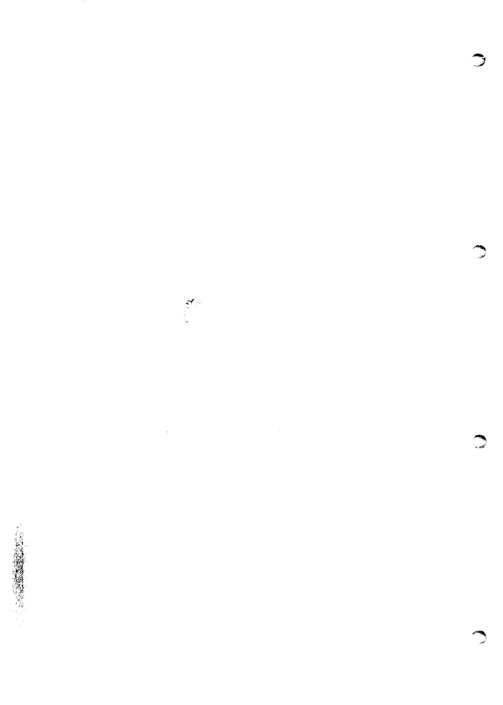

{8}------------------------------------------------

MANUAL 12

# MISE A JOUR PROVISOIRE PROVISIONAL CHANGES

Nº 004-12

INSTRUCTIONS DE CLASSEMENT : A ajouter au début du manuel 12 derrière la «liste des décisions de modifications appliquées au manuel»

FILING INSTRUCTIONS: To be added at the beginning of the manual 12 after the clist of modifications included in the manual»

CONSIGNES CONCERNANT L'OPERATION
DEPOSE-POSE DE L'UNITE DE NAVIGATION
PAR INERTIE

#### ATTENTION

Toute dépose ou pose de l'UNI doit être faite, groupe électrique non branché.

INSTRUCTIONS APPLICABLE TO THE REMOVAL-INSTALLATION OF THE INERTIAL NAVIGATION UNIT

#### CAUTION

Each installation or removal of the INU shall be accomplished with électrical power not connected.

Trak

EH - EE - EDA - DDA - EQ.5

12/09/84

{9}------------------------------------------------

{10}------------------------------------------------

MANUAL 12

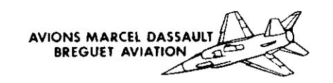

#### LISTE DES DECISIONS DE MODIFICATION AYANT ENTRAINE UNE MISE A JOUR DU MANUEL LIST OF AIRCRAFT MODIFICATIONS WHICH HAVE RESULTED IN MANUAL UPDATING

The present manual includes the modifications applicable to the aircraft basic technical definition

Original issue of July 1980

Change 1 of February 1982 including following modifications : FX125 (FH13) - FX231 (FH142)

Change 2 of January 1983

Change 3 of September 1984.

Change 4 of December 1988 including following modification : FX355 (FH310)

NOTE: For modifications prior to the aircraft basic technical definition, systematically apply the "modification incorporated" text,

{11}------------------------------------------------

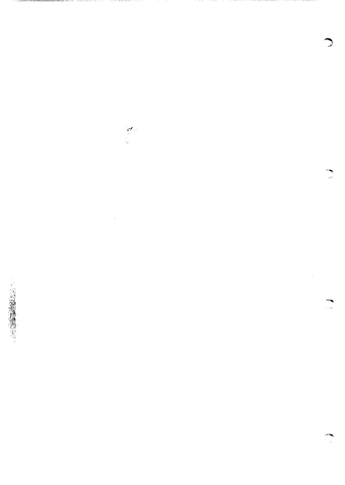

{12}------------------------------------------------

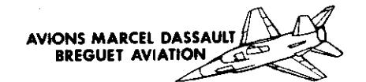

#### **NWS - CONTROL AND NAVIGATION**

#### TABLE OF CONTENTS

| SEC | CTION                                                               | Page |
|-----|---------------------------------------------------------------------|------|
|     | PREAMBLE                                                            | iii  |
|     | GENERAL INDEX OF MAINTENANCE MANUALS                                | v/vi |
|     | ELABORATION AND USE OF MAINTENANCE MANUALS                          | ix   |
|     | REVISION TO MAINTENANCE MANUALS                                     | xix  |
|     | MAIN CHARACTERISTICS OF THE VARIOUS SINGLE-SEATER AIRCRAFT VERSIONS | xxi  |
| 0   | GENERAL INFORMATION AND SAFETY                                      | 0-1  |
| 1   | PITOT-STATIC SYSTEM AND FLIGHT INSTRUMENTS                          | 1-1  |
| 2   | AIR DATA SYSTEM                                                     | 2-1  |
| 3   | ATTITUDE AND HEADING SYSTEM                                         | 3-1  |
| 5   | MARKER BEACON SYSTEM                                                | 5-1  |
| 6   | NAVIGATION SYSTEM                                                   | 6-1  |
| 7   | RADIO ALTIMETER                                                     | 7-1  |
| Ω   | RADIO-COMPASS                                                       | 8-1  |

{13}------------------------------------------------

{14}------------------------------------------------

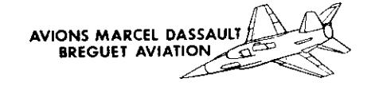

#### INTRODUCTION

- 1 The Maintenance manuals are intended for the personnel in charge of technical work on the equipment.
- 2 The Maintenance manuals contain:
- all the technical information concerning the description and operation of the various component systems of the aircraft as well as of those equipment items whose documentation is incorporated;
  - all information necessary to perform technical work involved in :
    - servicing
    - trouble shooting
    - removal-disassembly
    - inspection-maintenance-adjustment
    - reconditioning and storage,

which may be carried out by the users. As such, they establish the limits of the maintenance authorized at organization level.

- 3 These Maintenance manuals and the related sets of work cards form an integral part of the aircraft operation documentation. Therefore, it will be necessary to refer to:
  - the Illustrated Parts List for identifying assemblies, subassemblies and detail parts;
- individual documentation of equipment as concerns function and layout of components as well as maintenance operations to be carried out on these equipment after removal from aircraft.
- 4 This maintenance documentation is made of 17 manuals. Some of these manuals cover the <u>aircraft</u> systems and structure according to a breakdown to homogeneous classes of functions; other manuals deal with general information and with specific information such as maintenance periodicities, servicing instructions, structural repairs.

Each manual is divided into sections and each section deals with a functional part or system.

This breakdown is shown in the «General Index of Maintenance Manuals».

{15}------------------------------------------------

A.

{16}------------------------------------------------

#### GENERAL INDEX OF MAINTENANCE MANUALS

|             |                                                                           |                                                 | M                                                     | ANUA                                 | LOR                                     | CHAPT                                              | ER                                   |                                         |                                       |
|-------------|---------------------------------------------------------------------------|-------------------------------------------------|-------------------------------------------------------|--------------------------------------|-----------------------------------------|----------------------------------------------------|--------------------------------------|-----------------------------------------|---------------------------------------|
| SECT        | 01                                                                        | 02                                              | 03                                                    | 04                                   | 05                                      | 06                                                 | 07                                   | 08                                      | 09                                    |
| SUB CHAP | General                                                                   | Servicing instructions                          | Structure and airframe                          | Flight controls                   | Take-off and landing system       | Power-plant                                        | Hydraulic system                  | Electrical system                    | Pilot environment installations |
| 0           | General information and-safety                                      | General information and safety            | General information and safety                  | General information and safety | General information and safety          | General information and safety               | General information and safety | General information and safety    | General information and safety  |
| 1           | Maintenance cycle Table of periodic maintenance operations | Parking Mooring                              | Wings                                                 | Lateral controls                     | Main L/G                                | Accessory drive                                 | Hydraulic power generation     | Electrical power generation       | Cockpit furnishings                |
| 2           | Lubrication points Tightening torques Inspection doors                    | Ground handling                              | Fuselage forward section (up to frame 22) | Pitch controls                    | Main L/G doors                       | Fuel system                                        |                                      | Lighting internal and external | Air conditioning                   |
| 3           | Tools and Ground Support Equipment                            | Replenishing Draining                        | Fuselage rear section (from frame 22)        | Rudder controls                   | Nose L/G                                | Air intake and ventilation system         |                                      | Failure warning systems           | Anti-g and oxygen systems    |
| 4           | List of various products and materials                              | Tires                                           | Tail บกit                                             | High-lift controls                | Nose L/G doors                       | Engine installation Bleeding and Draining |                                      |                                         | Pilot ejection system           |
| 5           | Storage                                                                   | Pre-flight and post-flight inspections | Removable structural components                 | Airbrake controls                 | Wheels and tires                        | Ængine check and control                     |                                      |                                         |                                       |
| 6           | Transporta- tion                                                       | Preparation for mission                   |                                                       |                                      | L/G and door controls                |                                                    |                                      |                                         |                                       |
| 7           |                                                                           | Engine starting                              |                                                       |                                      | Brakes and braking system         |                                                    |                                      |                                         |                                       |
| 8           |                                                                           | Run-up Check flights                         |                                                       |                                      | Anti-shimmy and steering controls |                                                    |                                      |                                         |                                       |
| 9           |                                                                           | Miscellaneous                                   |                                                       |                                      | Drag chute                              |                                                    |                                      |                                         |                                       |

{17}------------------------------------------------

{18}------------------------------------------------

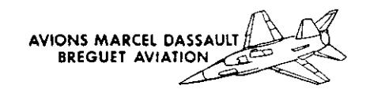

|             |                                                               |                                                            | M                                                        | ANUAL                                          | OR C                                                      | НАРТЕ                                           | ER                                                        |                                                               |                              |
|-------------|---------------------------------------------------------------|------------------------------------------------------------|----------------------------------------------------------|------------------------------------------------|-----------------------------------------------------------|-------------------------------------------------|-----------------------------------------------------------|---------------------------------------------------------------|------------------------------|
| SECT OR  | 10                                                            | 11 NWS - radio                                          | 12                                                       | 13                                             | 14                                                        | 15                                              | 16                                                        | 17                                                            |                              |
| SUB CHAP | NWS general                                                | and communi- cation systems                       | NWS control and navigation                         | NWS flight control electronics and AP | NWS operational systems                             | NWS armament                                 | Wiring                                                    | Data recording                                             |                              |
| 0           | General information and safety                                | General information and safety                       | General information and safety                     | General information and safety           | General information and safety                      | General information and safety            | General information and safety                      | General information and safety                          |                              |
| 1           | Use of NWS testing and trouble shooting equipment | V/UHF system (1)                                     | Pitot - static system and flight instruments | Flight control electronics               | Armament control system                             | Gun system                                   | Index of electrical and electronic components | Crash recorder system                                   |                              |
| 2           | 26V - 400 Hz AC power supply                            |                                                            | Air data system                                       | Autopilot system                            | Radar system                                           | Rocket system                                | Wiring diagrams                                        | Fatigue meter                                              |                              |
| 3           | Multiple chassis                                           | Intercom- munication system                          | Attitude and heading reference system        |                                                | Sight system                                           | Bomb system                                  | Connections                                               |                                                               |                              |
| 4           | Standby ground conditio- ning                        | VHF system (1)                                       |                                                          |                                                |                                                           | Interception AIR-TO-AIR missile system |                                                           |                                                               |                              |
| 5           | Management units                                           | Protected radio- communi- cation system (3) | VOR/ILS and marker beacon system             |                                                | IFF system                                             | Dogfight AIR-TO-AIR missile system     |                                                           | APPLICA                                                       | BILITY                       |
| 6           |                                                               |                                                            | Navigation system                                     |                                                | Counter- measures                                      | AIR-TO- GROUND missile system          |                                                           | (1) - <u>AIRCR</u> 4004 to 4500 to 4506 to 4560 - | 4035 4503 4529 4561 |
| . 7         |                                                               |                                                            | Radio altimeter                                       |                                                | Electroma- gnetic reconnais- sance system (2) | AIR-TO- SEA missile system (2)      |                                                           | (2) - <u>AIRCR</u> 4560 to 4600 to                      | 4579 4608                 |
| 8           | Presentation of NWS                                     |                                                            | Radio- compæs                                         |                                                | Reconnais- sance system                             | Miscella- neous stores                    |                                                           | (3) - <u>AIRCR</u> 4562 4600 to                         | AFT Nos. :                   |
| 9           |                                                               |                                                            |                                                          |                                                | Laser system (2)                                    | Towing system for practice targets  |                                                           | 4615 to                                                       |                              |

{19}------------------------------------------------

{20}------------------------------------------------

#### PREPARATION AND USE OF MAINTENANCE MANUALS

#### 1 - BREAKDOWN OF A MAINTENANCE MANUAL

Each manual comprises:

- A A title page identifying the document.
- B A list of effective pages which is the record of all the pages making up the manual. It determines the breakdown of the manual.
- C A list of modifications incorporated in the manual. This list is specific to each manual and records only those modifications which affect the manual concerned.
- D A table of contents which lists the sections making up the manual.
- E The various sections making up the manual.

#### 2 - BREAKDOWN OF A MAINTENANCE MANUAL SECTION

Two different kinds of «sections» can be defined in a Maintenance manual dealing with an aircraft system.

#### A - Section «0» - «General Information»

This section has an «as required» structure and deals with all the matters which are common to the other sections of the manual. It gives the general maintenance methods and instructions not dealt with in work cards.

#### B - Common sections in a manual dealing with an aircraft system

Each of these sections is subdivided into 9 sub-sections which are assigned an unchanging title and sequence number :

| Sub-section No. | Sub-section title                                      |
|--------------------|--------------------------------------------------------|
| 0                  | - General                                              |
| 1                  | <ul> <li>Description and operation</li> </ul>          |
| 2                  | - Trouble shooting                                     |
| 3                  | - Removal-Installation                                 |
| 4                  | - Disassembly-Assembly &                               |
| 5                  | - Inspection-Check-Adjustment                          |
| 6                  | - Cleaning-Corrosion preventive treatment- Painting |
| 7                  | - Storage - Preservation - Transportation              |
| 8                  | - Repair                                               |

In each sub-section, the description of maintenance operations is dealt with in the form of a set of work cards. Each set corresponds to the manual dealing with the system and is issued separately.

{21}------------------------------------------------

NOTE:

(1) Maintenance and lubrication are covered by sub-section 6.

(2) In each manual, sub-section 7 deals with preservation-packaging and transportation matters relating to the individual items of the system to which the manual is applicable and which form the subject of an incorporated documentation. As concerns the complete aircraft, these matters are dealt with in the «GENERAL» manual.

(3) Sub-section 8 covers the reconditioning operations for the items of the system to which the Manual is devoted. The structural repairs of the aircraft form the subject of a separate Manual:

«STRUCTURAL REPAIRS».

(4) Any sub-section which is not applicable is not shown.

#### 3 - ARRANGEMENT OF A COMMON SECTION IN A MANUAL DEALING WITH A SYSTEM

#### A — Sub-section 0 - GENERAL

This is an introductory sub-section which gives the general principles of the functional system covered by the section. A schematic diagram is usually attached to this sub-section.

#### B - Sub-section 1 - DESCRIPTION - OPERATION

This sub-section is arranged as follows:

(1) A table of components lists all the units, accessories and equipment items of the system concerned, in the logical descriptive sequence. It gives the essential characteristics of these equipment items, their function in the system concerned, their location within the aircraft, and it indicates whether the relevant documentation is separate or incorporated.

Layout illustrations are usually attached to this sub-section, which also refers to the functional diagram.

The purpose of the table of components is to clarify the system description, by specifying the purpose and characteristics of the various components.

In this table, the units, accessories or equipment items are identified by :

- a symbol index number for those equipment items which have an electrical function,

- a sequential index number (1 to X) when the item is not assigned any reference designation.

Note that the values shown in the table of components are <u>rated values</u>. When tolerances apply to these values, they are always given in the sub-section which deals with maintenance.

(2) A description of the system operation.

This refers to the functional diagram.

NOTE: The detailed description and operation of the individual equipment items are given in their separate documentation or, if applicable, in the «incorporated documentation» (see below).

(3) The description-operation part of the «incorporated documentation» for some equipment items is contained in pages or groups of pages which are independent and placed next to the description and operation of the system to which they belong.

{22}------------------------------------------------

The «incorporated documentation» is given in the same order as it appears in the table of components; it is illustrated whenever necessary and the internal index numbers are given in the sequence 1 to X for each component, independently of the index numbers shown in the table of components.

#### C — Sub-section 2 - TROUBLE SHOOTING

This sub-section shows, in the form of a synopsis, the methods to be applied to determine the causes of possible malfunctions.

#### D - Sub-sections 3 to 8

Except for general check and maintenance methods, these sub-sections are dealt with in the form of work cards issued separately.

#### 4 - IDENTIFICATION OF INSPECTION DOORS

The figures showing the location of the inspection doors are part of manual 01 «GENERAL», to which reference should be made.

The door numbering principles are as follows:

- (a) Sub-assembly on which a door is located
  - Fuselage the number consists of four digits.
  - Wings the number consists of letter V followed by three digits.
  - Stabilator the number consists of letter E followed by three digits.
  - Fin the number consists of letter D followed by three digits.

#### (b) Fuselage doors

The first two digits show the number of the frame forward of the door; the next two digits are the clock position of the door within the fuselage section in which it is located.

- Example: fuselage door between F.29 and 30 in the middle part of the RH side: door 29-03.

#### (c) Wing doors

The first digit locates the door in relation to the rib which precedes the door as considered from the aircraft centerline to the wing tip.

The last two digits indicate in which of the following areas the door is located:

1 to 29 - leading edge

30 to 59 - center wing box

60 to 90 - trailing edge.

{23}------------------------------------------------

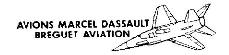

The door numbering direction is from the wing root to the wing tip and from the leading edge to the trailing edge.

Even numbers apply to the upper surface doors and odd numbers apply to the lower surface doors.

Example: door located between ribs 1 and 2 on the upper surface within the center wing box: V 138.

#### (d) Fin doors

Same principle as for the wings.

The odd numbers apply to the LH side and the even numbers apply to the RH side.

#### (e) Stabilator doors

Same principle as for the wings.

#### 5 - DIAGRAM DRAWING RULES

There are three kinds of diagrams:

- schematic diagrams
- functional diagrams
- wiring diagrams.

#### A - Schematic diagram.

The schematic diagram is drawn in the form of a block showing the main component interconnections, and illustrating the functional principle of the system and the connections to the other systems or functions.

#### B - Functional diagram.

The functional diagram represents all the units, accessories and equipment items making up the system and their functional connections. The detailed operation of the function can be followed on that diagram.

The functional diagrams are usually shown in <u>inoperative</u> condition (i.e. no pressure, no power, aircraft on its wheels). The complex functions may be illustrated by several functional diagrams associated with the main operating phases.

The equipment inside is represented in the form of a block or symbol. For the actual equipment illustration, refer to the relevant publication.

The functional diagrams show the terminals, except for the relays, on/off switches, selector switches and indicator lights.

The functional diagrams define the type of the information conveyed. Cut-off and grounding connectors are not shown unless an aircraft boundary is concerned.

#### (1) Test connectors on equipment.

The test points are shown by the associated terminal number which is encircled and hooked to the tested circuit. If there are several test connectors, the reference designation of the connector to which the point belongs is written next to the test point.

#### (2) Aircraft test connectors.

These are shown with their terminal numbers and reference designations in the same manner as the other aircraft wiring connectors.

#### C - Wiring diagram.

The wiring diagrams form the subject of manual 16 to which reference should be made.

#### D - Symbols used in the diagrams.

The symbols used in the diagrams are shown in the following charts:

{24}------------------------------------------------

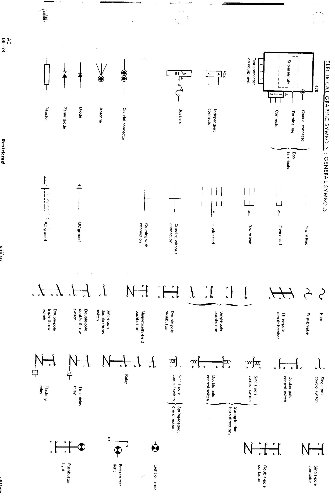

Qu.

Restricted

xiii/xiv

{25}------------------------------------------------

### ELECTRICAL GRAPHIC SYMBOLS:

### SYMBOLS SPECIFIC TO EQUIPMENT COMPONENTS

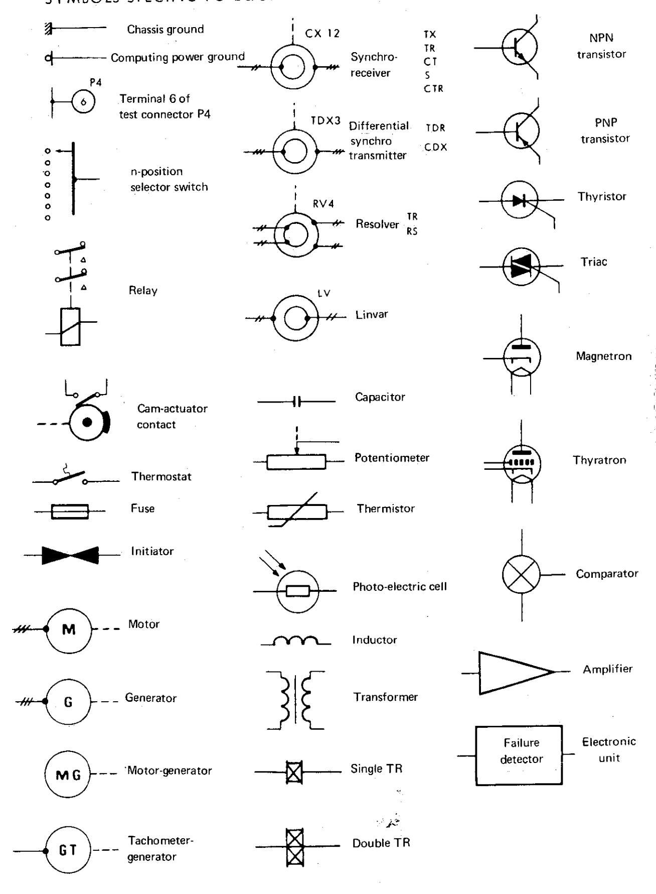

{26}------------------------------------------------

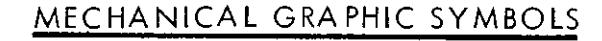

Mechanical link

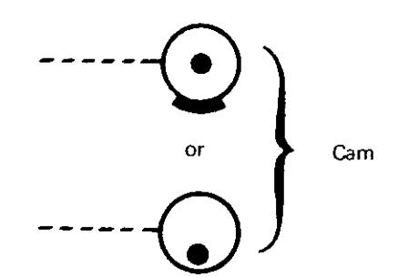

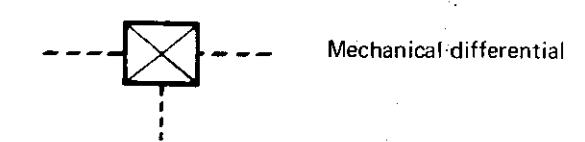

| LUID SY     | <u>YSTEM GRAPHIC SYMBO</u>       | LS          |                                                         |
|-------------|----------------------------------|-------------|---------------------------------------------------------|
| _           |                                  |             |                                                         |
|             | Filter                           | ⊡≕□         | Float needle valve                                      |
| $\boxtimes$ | Self-sealing coupling            | ð           | Manually-operated cock                                  |
|             | Non-return valve                 | <b>-</b> 5  | Level switch (thermistor)                               |
| <u>am</u>   | Pressure reducing valve          | <del></del> | Electrically-operated cock, Electro-cock, electro-valve |
|             | Restrictor valve                 |             | Solenoid valve                                          |
| •           | Outwards or inwards relief valve |             | Float switch                                            |
| /_          | Non-return flapper               |             | Pressure switch                                         |
|             | Fuel stop valve                  | ## EP       | EP = Electro-pump P = Pump                           |
| T           | Pressure or test connection      | <b>(</b>    | Stop air valve                                          |
| <b>(</b>    | Restrictor                       |             | Transfer valve                                          |
| <u></u>     | Filler plug                      |             | Pressure transmitter                                    |
|             |                                  |             |                                                         |

System No.2 Hydraulic systems Emergency system Return system

System No. 1

Basic or main system

Ancillary systems

Systems other than hydraulic systems

Return system

{27}------------------------------------------------

| SYMBOL | DESCRIPTION                                                                                                                |
|--------|----------------------------------------------------------------------------------------------------------------------------|
|        | Logic operator, general symbol dimension Note: - The relationship between the sides of the rectangle is not a requirement. |
| 8      | AND  the output state is 1 if, and only if, all the input states are 1's.                                                  |
| ≥1  | OR  the output state is 1 if, and only if, one or more input states are 1's.                                               |
| -[1]   | the output state is 1 if, and only if, the input state is 0.                                                               |
|        | NAND (NOT-AND)  the output state is 0 if, and only if, all the input states are 1's.                                       |
| ≥1  | NOR (OR-NOT)  the output state is 0 if, and only if, one or more input states are 1's.                                     |
| F      | Time delay operator, general symbol.                                                                                       |

#### LOGIC EQUATIONS

Definition: Sign +: OR operation

 $\underline{\mathsf{Sign}}\ \mathsf{x}\ : \mathsf{AND}\ \mathsf{operation}$ 

R : absence of information R

Example :  $S = (A + B + \overline{C}) (D + E)$ 

Condition S = (Information A or B or no information C)

AND (information D or E)

that is : S = A and D or E

or S = B and D or E

or S = no information C and D or E

{28}------------------------------------------------

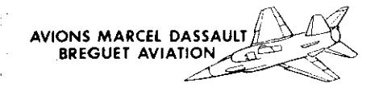

#### 6 - IDENTIFICATION OF PAGES

#### A - Each page is identified by:

- the Manual number in the top R/H corner.
- the date of issue of the page in the bottom L/H corner.
- the page number in the bottom R/H corner.
- if applicable, the technical definition of the page just on top of the date of issue. This shows the number of the modification applied.

The page number consists of two groups of digits separated by a dash:

- (1) The Section number
- (2) The page number within the Section.

This page number is made up as follows:

- a first digit shows the Sub-Section number (0 to 8).
- the next two digits show the page rank within the Sub-Section (01 to 99).
- B- The figures are assigned numbers within a Section (1 to x).

#### 7 - CROSS-REFERENCES

#### A - From text to text :

from Manual to Manual from Section to Section within a same section

Manual/Section

#### B - From text to Figure and from Figure to Figure :

from Manual to Manual: Manual/Section/Fig. (if necessary) from Section to Section: Manual/Section/Fig. (if necessary) within a same section: Figure.

#### 8 - UNITS OF MEASURE USED

The units of measure are written as follows:

«International measuring system (IMS) units (converted values, possible complementary units)».

The converted values are given in the order: British units and US units.

Whenever converted units of measure are suspect, it is mandatory to refer to the international measuring system (IMS) unit of measure.

In some specific cases, for which the units of measure are taken from standards, the units of measure remain those of the IMS international system except for US Standards where the units are US units.

In addition, characteristics specific to some equipment are given in IMS units (example : aircraft dimensions, etc.).

#### 9 - REFERENCE TO OFFICIAL DOCUMENTS

In the publications, references are made to French official documents, such as Technical Regulations (RT), Technical Circulars (CT), BNAé Standards, etc. All these documents are namely listed in Manual 01 «GENERAL».

{29}------------------------------------------------

#### **REVISION OF MAINTENANCE MANUALS**

#### 1 - PUBLICATION DEVELOPMENT PRINCIPLE

This development is performed in two steps:

- A Issue of supplements which are temporarily incorporated in the publications.
- B Actual revision which permanently incorporates information in the publications. Such information may be newly issued or previously published in supplements (replacement of pages or addition of new pages).

#### 2 - REVISION TO PUBLICATIONS

#### A - Procedure

Revision involves two operations:

- insertion of new pages and replacement of modified pages.

- systematic replacement of the title page and list of effective pages which serves as a guide to the insertion of revised pages.

#### B - Page numbering

First case - Addition of one or more new pages following the last page of a Sub-Section. The pages are numbered in the normal order.

Second case - Insertion of one or more new pages between two existing pages.

The new page(s) bears the number of the preceding page followed by a capital letter, with the exception of letters I. O and Z.

The letters are chosen in every case so as to provide for maximum further insertions unless the initial numbering sequence is changed.

The principle is illustrated in the table below:

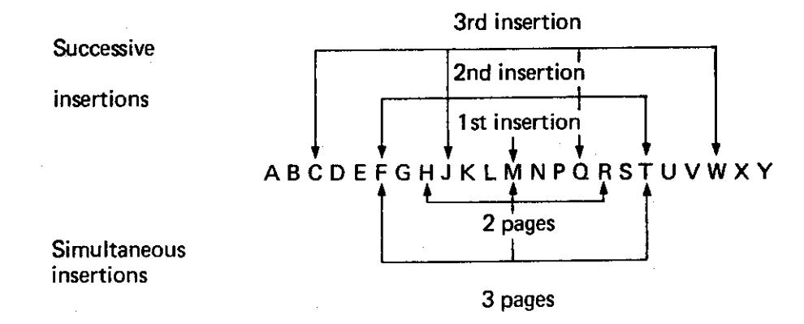

{30}------------------------------------------------

#### Example:

Assuming that several pages are to be inserted in succession between pages 6 and 7. The first one will be numbered 6M, the second one 6F if it is to be placed before 6M, or 6T if it is to be placed after 6M. Similarly, if it is necessary to insert a third page later on, its number will be 6F or 6T, 6C or 6J, 6Q or 6W as applicable.

Assuming that the following are to be inserted simultaneously:

- 2 pages: they will be numbered 6H and 6R.
- 3 pages: they will be numbered 6F, 6M and 6T.

Third case - Insertion of a new page following application of an official modification. The principle consists in showing up the two states simultaneously in the publication, i.e. post- and pre-modification.

- (a) The modification can be inserted according to the principle stated above without altering the page numbering sequence: There will be a new page which supersedes the preceding one.
- (b) As a result of the insertion of both states (post- and pre-modification), if the number of pages increases, the solution will be as follows:
- both the pre- and post-modification pages will bear the same number. «MOD...X» will be shown on top of the date on the modified page (this means modification X applied). Both pages will be shown in the list of effective pages with.

Remark: These two pages may have different dates.

(c) Where a complete paragraph or a Section is deeply affected by a modification (most of the pages changed), the complete paragraph which is modified will be found first and followed by the complete paragraph which is not modified. The table of contents will list both paragraphs (or Sections).

The unmodified pages will be deleted during a further revision only when the modification has been applied to all aircraft.

C - Identification of revised text portions

The modifications to the text, insertion or deletion, are identified by a vertical line in the margin.

Those pages which are entirely changed are identified by a vertical line in the margin on a level with the date of issue.

#### TRANSLATION OF REPETITIVE ABBREVIATIONS

To avoid the necessity of creating English versions of certain illustrations the translations of the legends have been added in italic script and the standard french abbreviations have been unchanged.

Furthermore, to ensure ready reference, the same abbreviations have been used in the parts of the text which correspond to such illustrations.

A key to the standard french abbreviations is given below:

| AR  | («arrière»)   | = Rear        | L («lisse») =        | Stringer   |
|-----|---------------|---------------|----------------------|------------|
| ΑT  | («attaque»)   | = Drive       | Lg («longeron») =    | : Spar     |
| A۷  | («avant»)     | = Front       | Lgt («longeronnet»)= | False spar |
| С   | («cadre»)     | = Frame       | M («médiane») =      | Middle     |
| Cst | («constant»)  | = Constant    | N («nervure») =      | Rib        |
| е   | («épaisseur») | ) = Thickness | R ((rail)) =         | Track      |

{31}------------------------------------------------

# MAIN CHARACTERISTICS OF THE DIFFERENT VERSIONS OF SINGLE-SEATER AIRCRAFT

Each aircraft has an identification number on both sides of the fuselage, ahead of the engine air intake.

The following table gives the main characteristics of the different aircraft versions:

| AIRCRAFT No.                              | MAIN CHARACTERISTICS                                                                                                                                                    |
|----------------------------------------------|-------------------------------------------------------------------------------------------------------------------------------------------------------------------------|
| 4004 to 4014 4016 to 4023 4025 to 4035 | "Basic aircraft".                                                                                                                                                       |
| 4015 - 4024 4500 - 4503 4506 to 4529   | Aircraft whose main characteristics are identical to those of the "basic" aircraft, but to which the following modifications have been incorporated during manufacture: |
|                                              | FX.184 (FH. 108): Provision for carriage and employment of the Harold long-focal length reconnaissance pod.                                                             |
|                                              | FX.145 (FH. 116): Addition of an inflight refueling system.                                                                                                             |
|                                              | FX.218 (FH. 124): Aircraft configured for refueling of receiver aircraft                                                                                                |
|                                              | FX.222 (FH.129): Conservation measures for carriage of a high-capacity underfuselage pylon tank.                                                                        |
| 4560 - 4561 4563 to 4579                  | Aircraft whose main characteristics are identical to those of the "basic" aircraft, but to which the following modifications have been incorporated during manufacture: |
|                                              | FX.184 (FH. 108): Provision for carriage and employment of the Harold long-focal length reconnaissance pod.                                                             |
|                                              | FX.145 (FH. 116): Addition of an inflight refueling system.                                                                                                             |
|                                              | FX.218 (FH. 124): Aircraft configured for refueling of receiver aircraft.                                                                                               |
|                                              | FX.222 (FH. 129): Conservation measures for carriage of a high-capacity underfuselage pylon tank.                                                                       |
|                                              | FX.219 (FH. 125): Provision for carriage and employment of the AM 39 missile.                                                                                           |
|                                              | FX.146 (FH. 126): Installation of a VOR/ILS set.                                                                                                                        |
|                                              | FX.213 (FH. 158): Replacement of MK4 ejection seat with MK10 ejection seat.                                                                                             |
|                                              | FX.255 (FH. 180): Conservation measures for carriage and employment of MATRA SYCOMOR decoy dispenser gondolas hard-mounted under wings.                                 |
|                                              | FX.262 (FH. 181): Provision for a new IFF system.                                                                                                                       |
|                                              | FX.263 (FH. 182): Conservation measures for carriage and employment of SLAR type RAPHAEL-TH reconnaissance pod                                                          |
|                                              | FX.247 (FH. 183): Conservation measures for carriage and employment of type P laser designation pod.                                                                    |

{32}------------------------------------------------

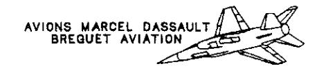

| AIRCRAFT No.                      | MAIN CHARACTERISTICS                                                                                                                                                    |
|--------------------------------------|-------------------------------------------------------------------------------------------------------------------------------------------------------------------------|
| 4562 4600 to 4608 4615 to 4623 | Aircraft whose main characteristics are identical to those of the "basic" aircraft, but to which the following modifications have been incorporated during manufacture: |
|                                      | FX.184 (FH. 108): Provision for carriage and employment of the Harold long-focal length reconnaissance pod.                                                             |
|                                      | FX.145 (FH. 116): Addition of an inflight refueling system.                                                                                                             |
|                                      | FX.218 (FH. 124): Aircraft configured for refueling of receiver aircraft.                                                                                               |
|                                      | FX.222 (FH. 129): Conservation measures for carriage of a high-capacity underfuselage pylon tank.                                                                       |
|                                      | FX.219 (FH. 125): Provision for carriage and employment of the AM 39 missile.                                                                                           |
|                                      | FX.146 (FH. 126): Installation of a VOR/ILS set.                                                                                                                        |
|                                      | FX.213 (FH. 158): Replacement of MK4 ejection seat with MK10 ejection seat.                                                                                             |
|                                      | FX.255 (FH. 180): Conservation measures for carriage and employment of MATRA SYCOMOR decoy dispenser gondolas hard-mounted under wings.                                 |
|                                      | FX.262 (FH. 181): Provision for a new IFF system.                                                                                                                       |
|                                      | FX.263 (FH. 182): Conservation measures for carriage and employment of SLAR type RAPHAEL-TH reconnaissance pod.                                                         |
|                                      | FX.247 (FH. 183): Conservation measures for carriage and employment of type P laser designation pod.                                                                    |
|                                      | FX.369 (FH. 305): Electrooptical interface box - Additional coded input/output capacity.                                                                                |
|                                      | FX.370 (FH. 306): New radio system.                                                                                                                                     |
|                                      | FX.371 (FH. 307): Asymmetrical loading configuration for laser-guided weapons.                                                                                          |
|                                      | FX.372 (FH. 308): Provision for carriage and employment of an underwing AM 39 missile.                                                                                  |
|                                      | FX.373 (FH. 309): Carriage of two AM 39 missiles in symmetrical configuration under wing inboard stations.                                                              |
|                                      | FX.355 (FH. 310): Replacement of type BF radar detector system with a type SHERLOC system.                                                                              |
|                                      | FX.374 (FH. 311): Ground crew box - New technology logic circuit.                                                                                                       |
|                                      | FX.375 (FH. 312): Additionnal display of radio-altimeter height information on sight.                                                                                   |
|                                      | FX.376 (FH. 313): Cyrano IV SPI radar system.                                                                                                                           |

{33}------------------------------------------------

### MIRAGE F

MANUAL 12

#### SECTION 0

Restricted

### GENERAL INFORMATION AND SAFETY

#### TABLE OF CONTENTS

|      |                                                                                                                                 | Page                 |
|------|---------------------------------------------------------------------------------------------------------------------------------|----------------------|
| 0-1  | GENERAL INFORMATION                                                                                                             |                      |
|      | Description of control and navigation system     Description of the reference systems used by the navigation system     Symbols | 0-104iv 0-105     |
| 0-2  | SAFETY MEASURES                                                                                                                 |                      |
|      | - Safety measures to be taken for personnel protection Instructions to be followed when working on systems                      | See 01-0 See 01-0 |
|      | General instructions for starting and operating the various aircraft systems                                                    | See 01-0             |
|      | - Instructions for using the ground support equipment                                                                           | See 01-0 0-201    |
|      | navigation system                                                                                                               |                      |
|      | LIST OF ILLUSTRATIONS                                                                                                           |                      |
| Figu | ure No.                                                                                                                         | Page                 |
| 1 2  | CONTROL AND NAVIGATION                                                                                                          | . 0-102 . 0-103   |

{34}------------------------------------------------

{35}------------------------------------------------

MANUAL 12

MIRAGE F

#### DESCRIPTION OF CONTROL AND NAVIGATION SYSTEM (Figures 1, 2 and 3)

Restricted

The control and navigation system includes:

- one pitot static system sensing and distributing pitot and static pressures,
- flight instruments in the cockpit, supplied by the pitot static system :
  - standby altimeter
  - mach/airspeed indicator
  - vertical speed indicator
- independent flight instruments in the cockpit :
  - accelerometer
  - standby horizon
  - standby magnetic compass
- one angle-of-attack system measuring, distributing and displaying the aircraft angle of attack,
- one air data computer supplied by the pitot static and angle-of-attack systems, which generates and distributes the following data:
  - static pressure
  - dynamic pressure
  - pressure altitude
  - mach number
  - vertical speed
  - true airspeed
  - indicated airspeed
  - true angle of attack

the pressure altitude, indicated airspeed and mach number are displayed to the pilot on the head-up display.

- one attitude and heading system including:

- one normal channel (gyro/accelerometer center) which detects and computes the aircraft

attitude :

- transverse attitude
- longitudinal attitude
- heading
- one emergency channel which, in case of failure of the normal channel, distributes the heading information to the same associated systems.

These data are displayed to the pilot on:

- spherical indicator (transverse and longitudinal attitudes and heading)
- head-up display (transverse and longitudinal attitudes and heading)
- navigation indicator (heading)
- one radio compass system locating the aircraft in relation to a ground beacon (bearing)
- one marker beacon system signalling passage over marker beacons
- one navigation system including:
  - a Doppler radar
  - a main computer
  - a navigation control panel
  - a navigation indicator
- one radio-altimeter system measuring the height of the aircraft with respect to the ground; this information is displayed to the pilot on the head-up display.

NOTE: Figures 2 and 3 define the operating data and the use of a radio-electrical beacon.

{36}------------------------------------------------

{37}------------------------------------------------

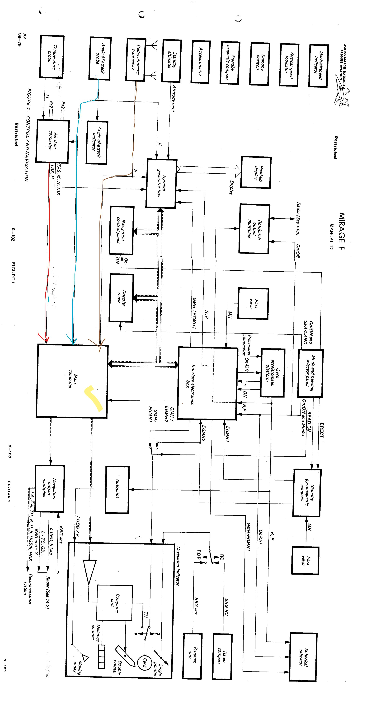

{38}------------------------------------------------

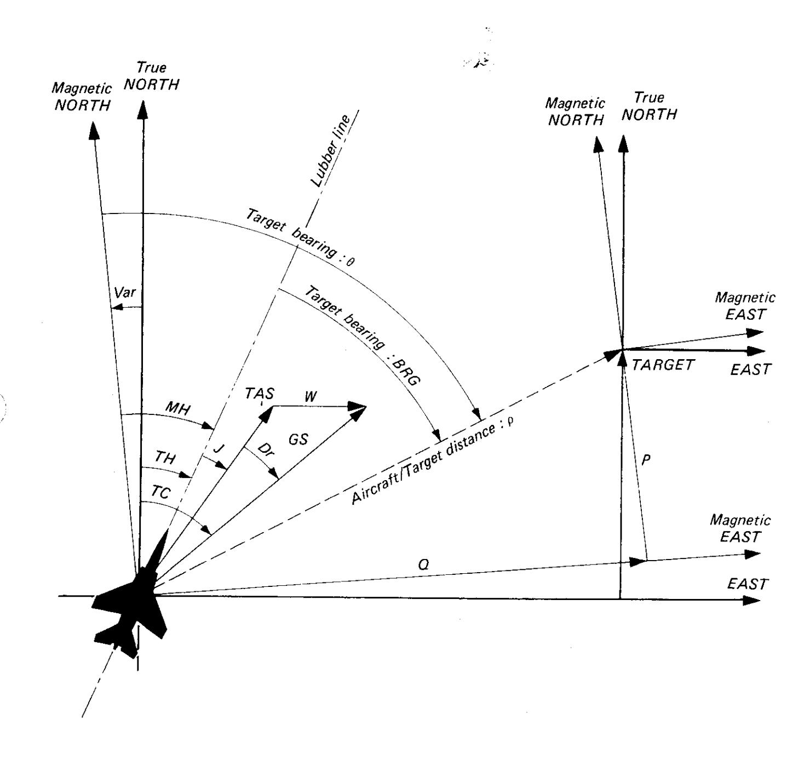

FIGURE 2 — DEFINITION OF ANGLES, DISTANCES AND VELOCITIES USED IN NAVIGATION

{39}------------------------------------------------

MANUAL 12

# DESCRIPTION OF THE REFERENCE SYSTEMS USED BY THE NAVIGATION SYSTEM

#### 1 - GEOGRAPHIC AXIS

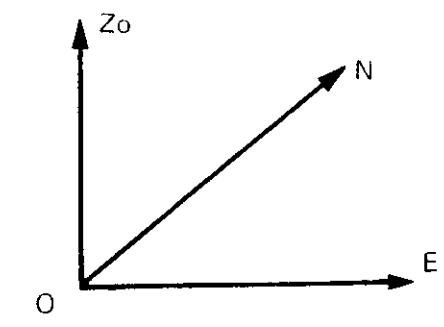

- Axis ON pointing to geographic North
- Axis OE pointing to geographic East
- Axis OZo perpendicular to axes ON and OE.

#### 2 - REFERENCE AXIS

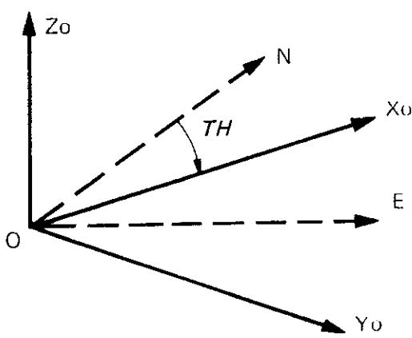

Is obtained from the geographic reference by one rotation around OZo of the true heading angle TH.

#### 3 - AIRCRAFT AXIS

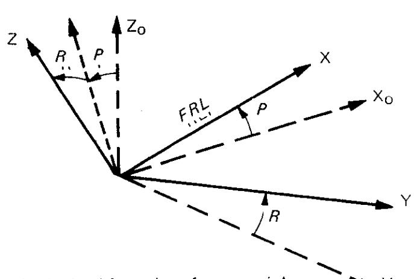

Is obtained from the reference axis by:

- one pitch rotation P around OYo.
- one roll rotation R around OX.

{40}------------------------------------------------

| SYMBOLS | DESCRIPTION                                                     |
|---------|-----------------------------------------------------------------|
| BRG ant | Radar antenna bearing                                           |
|         | Radio compass bearing                                           |
|         | Directional heading                                             |
|         | Magnetic deviation                                              |
| •       | Emergency gyromagnetic heading                                  |
|         | Aircraft longitude                                              |
|         | Gyromagnetic heading                                            |
|         | Ground speed                                                    |
|         | Radio-altimeter height                                          |
| ha      | Preset height                                                   |
| Н       | Pressure altitude                                               |
| НВІ     | Inertial barometric altitude                                    |
| HGS     | Horizontal ground speed                                         |
|         | Aircraft-to-target height                                       |
| 1       | Indicated airspeed                                              |
|         | Sideslip                                                        |
|         | Aircraft latitude                                               |
|         | Mach number                                                     |
| MH      | Magnetic heading                                                |
|         | Pitch                                                           |
| [P _    | Aircraft-to-target vector components in rectangular coordinates |
| [u ]    | -                                                               |
| 1       | Static pressure                                                 |
|         | Total or pitot pressure                                         |
|         | Ram or dynamic pressure                                         |
|         | Roll                                                            |
|         | True airspeed                                                   |
|         | True course                                                     |
|         | True heading                                                    |
|         | Total temperature                                               |
|         | Ground speed component with respect to geographical East        |
|         | Ground speed component with respect to geographical North       |
|         | Ground speed component with respect to vertical axis            |
|         | Wind speed                                                      |
| l ,     | Drift                                                           |
|         | Local angle of attack True angle of attack                   |
|         | Autopilot heading deviation                                     |
| 1       | Navigation course deviation                                     |
|         | Aircraft-to-target bearing                                      |
| N *     | Aircraft-to-target bearing Aircraft-target distance             |
|         | Aircraft-target distance                                        |
|         | Acceleration                                                    |
| LB 1    | · ·                                                             |
|         | Memorized target coordinates                                    |
| НВ 」    | 3                                                               |
| ΔLB     |                                                                 |
|         | Auxiliary target coordinate deviation                           |
| ΔНВ     |                                                                 |
|         |                                                                 |

{41}------------------------------------------------

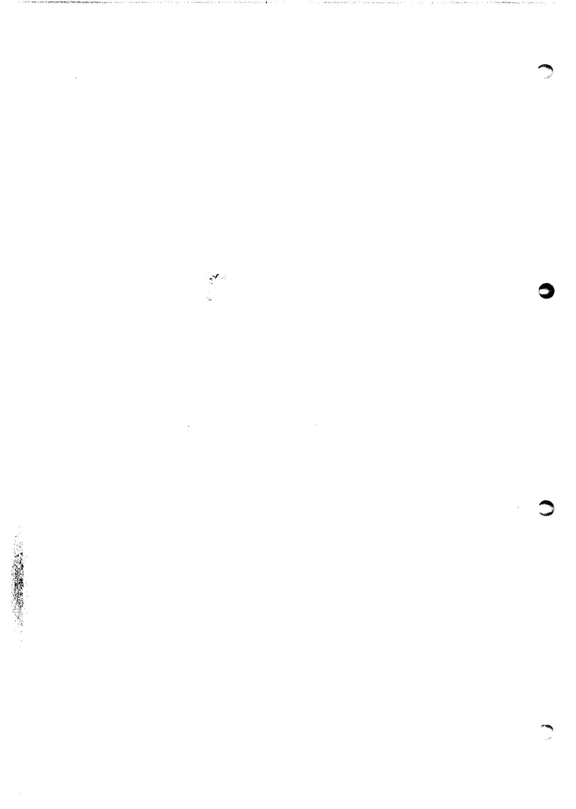

{42}------------------------------------------------

MANUAL 12

### SPECIAL OPERATIONS TO BE PERFORMED AFTER INSTALLING CONTROL AND NAVIGATION SYSTEM EQUIPMENT

#### 1 - SCOPE

To describe special operations to be performed after installing or replacing an equipment item. These apply only to items, the removal/installation of which is not covered by this manual. The description of the general operations is given in the «instructions to be followed when working on the systems» (see 01-0).

#### 2 - EQUIPMENT INVOLVED

- A Standby compass
  - Perform standby compass compensation setting.
- B Standby horizon
  - Cage gyro.
  - Check Roll and Pitch parameters at acquisition unit (see 17-1).
- C Accelerometer
  - Set white moving indexes to g = 1.
- D Angle-of-attack probe
  - Check local angle-of-attack parameter at acquisition unit (see 17-1).
- E Standby altimeter
  - Select pressure corresponding to field altitude (indicated altitude 0).
- F Vertical speed indicator
  - Set pointer to zero.
- G Top flux valve
  - Ensure that flux valve and access door attaching screws are non-magnetic.
  - Perform normal heading channel compensation setting (see 12-3).
- $\mathsf{H}-\mathsf{Removable}$  compensator (on interface electronics box)
  - Perform normal heading channel compensation setting (see 12-3).

{43}------------------------------------------------

{44}------------------------------------------------

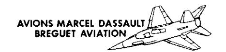

- I Bottom flux valve
  - Ensure that flux valve and access door attaching screws are non-magnetic.
  - Perform emergency heading channel compensation setting (see 12-3).
- J Emergency gyromagnetic compass
  - Select local latitude.
  - Perform emergency heading channel compensation setting (see 12-3).
- K Navigation indicator
  - Check heading parameter at acquisition unit (see 17-1).
- L Radio-compass loop antenna
  - Adjust the radio-compass loop antenna alignment (see 12-8).

{45}------------------------------------------------

# A

{46}------------------------------------------------

MIRAGE F

MANUAL 12

### SAFETY MEASURES TO BE TAKEN WHEN WORKING ON CONTROL AND NAVIGATION SYSTEM

#### 1 - SCOPE

To specify to the personnel the safety measures specific to the control and navigation systems.

#### **CAUTION:**

REFER TO MANUAL 01-0 FOR GENERAL SAFETY MEASURES.

#### 2 - INSTRUCTIONS FOR PROTECTION OF EQUIPMENT

#### A - Flux valve

Never use an ohmmeter to conduct continuity tests on the flux valve windings.

No handling should be made on the flux valve by means of a magnet; however, to perform the SDAP «Heading channel» test program, a special magnet taken from the SDAP tool kit, may be used, to the exclusion of any other.

#### B - Navigation computer

On the ground, energization of the navigation computer should not exceed 15 minutes without ventilation.

#### C - Gyro equipment

Wait at least two minutes after the gyro wheels have stopped before handling the gyro equipment. Failure to observe this time period could result in damage to the gyro equipment.

{47}------------------------------------------------

{48}------------------------------------------------

### MIRAGE F

MANUAL 12

#### **SECTION 1**

### PITOT STATIC SYSTEM AND FLIGHT INSTRUMENTS

#### TABLE OF CONTENTS

|     |                                                                                                                                                      | Page                                                        |
|-----|------------------------------------------------------------------------------------------------------------------------------------------------------|-------------------------------------------------------------|
| 1-0 | GENERAL                                                                                                                                              |                                                             |
|     | - Principle of pitot static system and flight instruments                                                                                            | 1-001                                                       |
| 1-1 | DESCRIPTION - OPERATION                                                                                                                              |                                                             |
|     | - Table of components Standby magnetic compass - Standby horizon - Accelerometer Angle-of-attack system - Pitot static system Probe heating circuits | 1-101 1-113 1-116 1-118 1-119 1-124 1-130 |
| 1-2 | TROUBLE SHOOTING                                                                                                                                     |                                                             |
|     | - Trouble shooting of probe heating circuits                                                                                                         | 1-201                                                       |

{49}------------------------------------------------

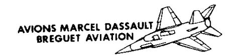

#### Pastricted

### MIRAGE F

MANUAL 12

### LIST OF ILLUSTRATIONS

| Figu | ure No.                                                               | Page  |
|------|-----------------------------------------------------------------------|-------|
| 90   |                                                                       | 1-111 |
| 1    | GENERAL LAYOUT                                                        | 1-112 |
| 2    | LAYOUT COCKPIT IN                                                     | 1-113 |
| 3    | $\sim$ $\sim$ $\sim$ $\sim$ $\sim$ $\sim$ $\sim$ $\sim$ $\sim$ $\sim$ | 1-115 |
| 4    | COMPENSATOR UNIT                                                      | 1-117 |
| 5    | STANDBY HORIZON                                                       | 1 121 |
| 6    | ANGLE-OF-ATTACK SYSTEM                                                | 1-122 |
| 7    | ANGLE-OF-ATTACK PROBE SETTINGS                                        | 1-123 |
| 8    | OPERATION OF ANGLE-OF-ATTACK SYSTEM                                   | 1-127 |
| 9    | DISTRIBUTION SCHEMATIC OF PITOT STATIC SYSTEM                         | 1-129 |
| 15   | PITOT STATIC SYSTEM                                                   | 1-131 |
| 10   | BROBE HEATING CIRCUITS                                                |       |

{50}------------------------------------------------

MIRAGE F

MANUAL 12

#### PRINCIPLE OF PITOT-STATIC SYSTEM AND FLIGHT INSTRUMENTS

The pitot-static system senses and distributes the pitot and static pressures to the associated systems:

- the pitot pressure is sensed by measuring the air flow stop pressure on a pitot tube,

- the static pressure is sensed by measuring the local atmospheric pressure through a probe mounted on the nose cone, and through three fuselage static inlets.

The flight instruments supplied by the pitot-static system are as follows:

- standby altimeter (static pressure)
- vertical speed indicator (static pressure)
- Mach/airspeed indicator (static and pitot pressures).

The flight instruments also include:

- accelerometer
- standby horizon
- standby compass
- clock
- angle-of-attack indicator.

An angle-of-attack system sensing the aircraft angle of attack :

- one angle-of-attack probe measuring the local aircraft angle of attack,

- one angle-of-attack indicator transforming the local angle of attack into true angle of attack and displaying it.

The local or true angle of attack (high or low airspeed correction schedule) is distributed to the associated systems by the angle-of-attack probe and the angle-to-attack indicator.

A probe heating circuit is used for deicing:

- pitot pressure probe
- static pressure probe
- angle-of-attack probe.

{51}------------------------------------------------

{52}------------------------------------------------

#### TABLE OF COMPONENTS

For layout, see figures 1 and 2

| Item | Name - Characteristics and Functions                                                                                                                                                                         | Location                                           | ( | Оос |
|------|--------------------------------------------------------------------------------------------------------------------------------------------------------------------------------------------------------------|----------------------------------------------------|---|-----|
|      | Static Stitutes and Fanctions                                                                                                                                                                                | Access Door No.                                    | S | 1   |
| 1    | PITOT-STATIC UNIT (see 16-0)  Includes: - current relay 5 F - pitot probe fuse-breaker 11F - static pressure probe supply relay 78F - heating control relay 79F - cut-off connector 152Δ.                    | Frames 1 and 2 (access through nose cone) |   | ×   |
| 3    | VERTICAL SPEED INDICATOR  Displays vertical aircraft speed in flight through a pointer moving in front of two symmetrical scales graduated from 0 to 30 m/s. A screw 1 is used to reset the pointer to zero. | Cockpit (Instrument panel)                   | X |     |
| 4    | CLOCK  Provided with a stop watch.                                                                                                                                                                           | Cockpit (top of LH windshield arch)          | × |     |
| 5    | STATIC PRESSURE INLET S3 (white identification color)  Static pressure sensor. Supplies with static pressure: - the vertical speed indicator, - the cabin pressure regulator.                                | LH frames 8-9                                   |   | ×   |

{53}------------------------------------------------

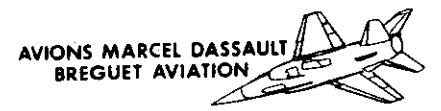

### MIRAGE F

|      |                                                                                              | Location         | Do | c. |
|------|----------------------------------------------------------------------------------------------|------------------|----|----|
| Item | Name - Characteristics and Functions                                                         | Access Door No.  | S  | 1  |
| 6    | STATIC PRESSURE INLET S4 (brown identification color)                                        | RH frames 8-9 |    | X  |
|      | Static pressure sensor. Supplies dash-pot jack 194C with static pressure.                    |                  |    |    |
| 7    | DRAIN FITTING S1 (blue identification color)                                                 | Door 02-06       |    | X  |
|      | Used for draining static pressure system S1.                                                 |                  |    |    |
| 8    | DRAIN BLOCK S2/T2 (S2 yellow - T2 orange)                                                    | Door 05-06       |    | X  |
|      | Used for draining static pressure system S2 and total pressure system T2.                    |                  |    |    |
| 9    | DRAIN FITTINGS T2/S4 (S4 brown - T2 orange)                                                  | Door 11-04i      |    | X  |
|      | Used for draining static pressure system S4 and total pressure system T2.                    |                  |    |    |
| 10   | CABIN PRESSURE REGULATOR (see 09-2)                                                          |                  |    |    |
| 11   | STATIC PRESSURE INLET S5 (green identification color)                                        | LH frames 8-9 |    | X  |
|      | Static pressure sensor. Supplies overpressure underpressure valve 26 H with static pressure. |                  |    |    |
| 35A  | SYMBOL GENERATOR UNIT (see 14-3)                                                          |                  |    |    |
| 39C  | AUTOPILOT (see 13-2)                                                                      |                  |    |    |
| 108C | SLAT IAS ANEROID (see 04-4)                                                               |                  |    |    |
| 109C | FLAP IAS ANEROID (see 04-4)                                                               |                  |    |    |
| 193C | SLAT SERVO UNIT (see 04-4)                                                                |                  |    |    |
| 194C | DASH-POT JACK (see 04-2)                                                                     |                  |    |    |
|      |                                                                                              |                  |    |    |
|      |                                                                                              |                  |    |    |
|      |                                                                                              |                  |    |    |
|      |                                                                                              |                  |    |    |
|      |                                                                                              |                  |    |    |
| 1    |                                                                                              |                  |    |    |

{54}------------------------------------------------

|      | Restricted                                                                                                                                                          | М                           | ANU | AL 1 |
|------|---------------------------------------------------------------------------------------------------------------------------------------------------------------------|-----------------------------|-----|------|
| Item | Name - Characteristics and Functions                                                                                                                                | Location Access Door No. | ·   | oc.  |
| 2E   | M = 1.4 OVERSPEED FUSE-BREAKER (See 06-5)                                                                                                                        |                             |     | •    |
| 1F   | PITOT STATIC FUSE-BREAKER                                                                                                                                           | Electrical master box    | ×   |      |
|      | Protects AC system 1 phase C of pitot static transformer 10F and dash-pot jack 194C.                                                                                |                             |     |      |
| 2F   | PROBE HEATER SWITCH                                                                                                                                                 | Cockpit (RH console)     | Х   |      |
|      | Supplies: - pilot's pitot probe 6F - angle-of-attack probe 14F - pitot static transformer 10F for power supply of pitot probe 13F - static pressure probe 80F.      |                             |     |      |
| 3F   | - dash-pot jack 194C.  ANGLE-OF-ATTACK PROBE HEATER FUSE-BREAKER                                                                                                    | Electrical master box    | х   |      |
|      | Protects DC system 1 of incidence probe 14F.                                                                                                                        |                             |     |      |
| 5F   | CURRENT RELAY                                                                                                                                                       | Pitot static unit        | X   |      |
|      | Monitors power supply of pilot's pitot probe 6F.  - When deenergized, signals to failure warning panel 1W (pitot static) that pilot's pitot probe 6F is not heated. |                             |     |      |
| 6F   | PILOT'S PITOT PROBE T1 (red color mark)                                                                                                                             | LH frames 1 and 2        | ×   |      |
|      | Pitot pressure sensor. Supplies certain aircraft equipment items with pitot pressure.                                                                               |                             |     |      |
|      | A resistor protects probe from icing. Attachment: to aircraft skin panel through screws ensuring electrical bonding of deicing resistor.                            |                             |     |      |
| 7F   | PILOT'S PITOT PROBE POWER SUPPLY FUSE BREAKER                                                                                                                    | Electrical master box    | x   |      |
|      | Protects DC system 1 of pilot's pitot probe 6F.                                                                                                                     |                             |     |      |
|      |                                                                                                                                                                     |                             |     |      |
|      |                                                                                                                                                                     |                             |     |      |

{55}------------------------------------------------

### MIRAGE F

|      |                                                                                                                                                          |                                              | Do       | ~ i        |
|------|----------------------------------------------------------------------------------------------------------------------------------------------------------|----------------------------------------------|----------|------------|
|      | Name - Characteristics and Functions                                                                                                                     | Location Access Door No.                     |          | <u>"</u> - |
| Item | Name - Characteristics and 7 directions                                                                                                                  | Access Door No.                              | <u>s</u> |            |
| 10F  | PITOT STATIC TRANSFORMER                                                                                                                                 | Frames 1-2 (access through                   |          | X          |
|      | Supplies pitot probe 13F with 28 V/400 Hz. Supplied by probe heater switch 2F with 115V/400 Hz, phase C of AC system 1.                                  | nose cone)                                   |          |            |
| 11F  | PITOT PROBE FUSE-BREAKER                                                                                                                                 | Pitot static unit                         | X        |            |
|      | Protects pitot static transformer 10F of pitot probe 13F.                                                                                                |                                              | -        |            |
| 13F  | PITOT PROBE T2 (Orange identification color)                                                                                                             | RH frames 1 and 2                         | X        |            |
|      | Similar to pilot's pitot probe 6F Supplies with pitot pressure: - Dash-pot jack 194C - pressure center 53Z - air data computer 17F.                      |                                              |          |            |
| 14F  | ANGLE-OF-ATTACK PROBE  Measures and distributes local aircraft angle of attack.                                                                          | LH frames 1 and 2 (access through nose cone) | ×        |            |
|      | A deicing device maintains the probe tube outside the aircraft fuselage at about 95° C.                                                                  | Hose coney                                   |          |            |
|      | Mounting: two positioning pins ensure the setting of the probe at 15° nose-down in relation to the FRL. The probe is secured in position by four clamps. |                                              |          |            |
|      | Test : a test motor controlled by angle-of-attack test switch 74F moves probe tube to $-5^{\circ}$ (0,3° read) and $+35^{\circ}$ (21,5° read).           |                                              |          |            |
| 17F  | AIR DATA COMPUTER (See 12-2)                                                                                                                          |                                              | į        |            |
| 18F  | ANGLE-OF-ATTACK FUSE-BREAKER                                                                                                                             | Electrical master box                     | ×        |            |
|      | Protects DC system 1 of : - angle-of-attack probe 14F - angle-of-attack indicator 19F.                                                                   |                                              |          |            |
|      |                                                                                                                                                          |                                              |          |            |
|      |                                                                                                                                                          |                                              |          |            |
|      |                                                                                                                                                          |                                              |          |            |

{56}------------------------------------------------

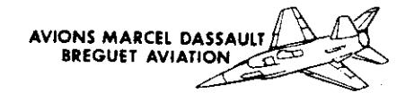

### MIRAGE F

|      |                                                                                                                                                                                                                                                                                                                                                                                                                                                                                                                                                                                                                                                                                                                                                                                                                                                                                            |                                      | NUA   |     |
|------|--------------------------------------------------------------------------------------------------------------------------------------------------------------------------------------------------------------------------------------------------------------------------------------------------------------------------------------------------------------------------------------------------------------------------------------------------------------------------------------------------------------------------------------------------------------------------------------------------------------------------------------------------------------------------------------------------------------------------------------------------------------------------------------------------------------------------------------------------------------------------------------------|--------------------------------------|-------|-----|
| ltem | Name - Characteristics and Functions                                                                                                                                                                                                                                                                                                                                                                                                                                                                                                                                                                                                                                                                                                                                                                                                                                                       | Location Access Door No.          | I ——— | oc. |
| 19F  | ANGLE-OF-ATTACK INDICATOR  Transforms the local aircraft angle of attack fed by angle-of-attack probe 14F into true angle of attack which it displays to the pilot (low airspeed schedule) and distributes. Display takes place when a tape 1 provided with a white thermometer-type strip 2 moves in front of a fixed scale; the latter is graduated every degree 0 to 22°, with a mark every 5 degrees.  The tape includes a window 3 centered at the top of the white strip and showing colored ranges behind the tape.  There are four ranges:  - red, yellow, green ranges which are illuminated when the true angle of attack exceeds 8°; lighting is from 28 V DC and can be adjusted with knurled knob 5;  - a blue range which is not illuminated.  Monitoring In case of malfunctioning, a monitoring device causes a red and black-striped flag 4 to show.  Lighting (see 08-2) | Cockpit (LH wind- shield post) | ×     |     |
| 20F  | HORIZON FUSE  Protects channel 1 emergency AC system of standby horizon 21F.                                                                                                                                                                                                                                                                                                                                                                                                                                                                                                                                                                                                                                                                                                                                                                                                               | Electrical master box             | X     |     |
|      |                                                                                                                                                                                                                                                                                                                                                                                                                                                                                                                                                                                                                                                                                                                                                                                                                                                                                            |                                      |       |     |

{57}------------------------------------------------

### MIRAGE F

|      |                                                                                                                                                                                                                                                                                                                                                                                                                | Location                         | Do | c. |
|------|----------------------------------------------------------------------------------------------------------------------------------------------------------------------------------------------------------------------------------------------------------------------------------------------------------------------------------------------------------------------------------------------------------------|----------------------------------|----|----|
| ltem | Name - Characteristics and Functions                                                                                                                                                                                                                                                                                                                                                                           | Access Door No.                  | S  | _  |
| 21F  | STANDBY HORIZON  Provides a vertical reference to the pilot with the following:  An aircraft symbol 1 linked to the aircraft moves in front of a cylinder 2 stabilized in space by a gyro. The inclination of the longitudinal lines on the cylinder, relative to the aircraft symbol indicates the lateral                                                                                                    | Cockpit (Instrument panel) | X  |    |
|      | inclination of the aircraft and their upward/downward movement relative to the aircraft symbol set to 2° nose-up, indicates the longitudinal attitude.  A roll index 3 moves along a fixed scale located at the bottom of the dial.  Knob 4 permits:  - manual setting by pulling  - gyro caging by pulling and turning clockwise  - setting of aircraft symbol (± 5°) by turning the knob in front of dial 5. |                                  |    |    |
|      | Monitoring Failure of the standby horizon is indicated by flag 6.  Lighting (see 08-2)                                                                                                                                                                                                                                                                                                                         |                                  |    |    |
|      | Characteristics Ready for use : 1 min. after energization.                                                                                                                                                                                                                                                                                                                                                  |                                  |    |    |
| 22F  | STANDBY HORIZON SWITCH  Permits power supply of standby horizon 21F.                                                                                                                                                                                                                                                                                                                                           | (RH console)                     | ×  |    |
| 26F  | AC SYSTEM 2 26-V TRANSFORMER (see 10-2)                                                                                                                                                                                                                                                                                                                                                                        |                                  |    |    |
|      |                                                                                                                                                                                                                                                                                                                                                                                                                |                                  |    |    |

{58}------------------------------------------------

# AVIONS MARCEL DASSAULT BREQUET AVIATION

#### Restricted

| Ditago | Restricted                                                                                                                                                                                                                                                                                                                                                                                                                                                                                                                                                                                                                                                                                                                                                                                                | IAM                                                   | IAUN | _ 1     |
|--------|-----------------------------------------------------------------------------------------------------------------------------------------------------------------------------------------------------------------------------------------------------------------------------------------------------------------------------------------------------------------------------------------------------------------------------------------------------------------------------------------------------------------------------------------------------------------------------------------------------------------------------------------------------------------------------------------------------------------------------------------------------------------------------------------------------------|-------------------------------------------------------|------|---------|
| Item   | Name-Characteristics and Functions                                                                                                                                                                                                                                                                                                                                                                                                                                                                                                                                                                                                                                                                                                                                                                        | Location Access Door No.                           |      | oc I |
| 51F    | Displays pressure altitude as follows: -pointer 1 reads hundreds of meters -pointer 2 reads thousands of meters -perforated sector 3 reads tens of thousands of meters. A hatched zone, entirely visible in the open part of the disc when the altitude is below 3048 m, progressively disappears as the altitude increases and is no longer visible above 7925 m. A counter 4 controlled by knob 5 permits the barometric pressure (QNH, QFE) to be set between 870 and 1050 mb. The setting knob drives the sliding contact of a potentiometer; an electrical voltage corresponding to the setting made by the pilot is thus transmitted to symbol generator box 35A. Locknut 6 is used to uncouple the totalizer from the pointer drive system when resetting the barometer scale. Lighting (see 08-2) | Cockpit (instrument panel)                      | X    |         |
| 53F    | ACCELEROMETER  Displays the aircraft acceleration along the apparent vertical as follows:  -main yellow index 1 moves along a rectilinear scale graduated every 2 g from - 5 to 10 g,  -two white, moving indexes 2 and 3 read the maximum g reached in each direction,  -reset button 4 returns the white indexes to g = 1.  Lighting (see 08-2)                                                                                                                                                                                                                                                                                                                                                                                                                                                         | Cockpit (above instrument panel, RH side) | X    |         |
| 53F    | ACCELEROMETER (MODIFICATION FH310 INCORPORATED)  Measures the aircraft load factors along axis ZZ' of the equipment and displays them on a dial 1 with linear graduations every half-g from — 5 to + 10 g through:  -a main pointer 2 continuously indicating the accelerations,  -a negative-g pointer or index 3 indicating the maximum value reached during the flight,  -a positive-g pointer or index 4 indicating the maximum value reached during the flight.  Control button 5 is pressed to return pointers 3 and 4 in line with main pointer 2.                                                                                                                                                                                                                                                 | Cockpit (above instrument panel RH side)  | X    |         |

{59}------------------------------------------------

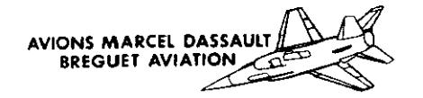

### MIRAGE F

|      |                                                                                                                                                                                                                                                                                                                                              | Location                      | Do | c. |
|------|----------------------------------------------------------------------------------------------------------------------------------------------------------------------------------------------------------------------------------------------------------------------------------------------------------------------------------------------|-------------------------------|----|----|
| Item | Name - Characteristics and Functions                                                                                                                                                                                                                                                                                                         | Access Door No.               | S  | _  |
| 74F  | ANGLE-OF-ATTACK INDICATOR TEST SWITCH Provided for testing the angle-of-attack probe at $-5^{\circ}$ (read as $0.3^{\circ}$ ) and $+35^{\circ}$ (read as $21.5^{\circ}$ ) angles, and for testing the angle-of-attack channel of warning horn 7W (triggering through $17^{\circ}$ or $14^{\circ}$ limit angle of attack when AP is engaged). | Cockpit (LH console)       | ×  |    |
| 76F  | Displays aircraft magnetic heading as follows:  - a moving card 1 moves in front of a fixed index 2 representing the aircraft lubber line;  - a plate 3 graduated from — 10 to + 10° permits lubber line correction;  - a knob 4 permits to replace the lamp (modification 407 not incorporated).  Lighting (see 08-2)                       | Cockpit (under RH arch) | X  |    |
| 77F  | STATIC PRESSURE PROBE HEATING FUSE-BREAKER - Protects DC system 1 of static pressure probe 80F.                                                                                                                                                                                                                                              | Electrical master box      | X  |    |
| 78F  | STATIC PRESSURE PROBE SUPPLY RELAY  When energized, permits power supply of static pressure probe 80F through relay 79F.  It is energized when heating control switch 2F is set to «on» position.                                                                                                                                            | Pitot- static unit         | X  |    |
| 79F  | HEATING CONTROL RELAY  When energized, permits to check that static pressure probe 80F heater is fed.  When deenergized, causes «PITOT» warning light to light up on failure warning panel 1W, thereby indicating that static pressure probe 80F is no longer heated.                                                                        | Pitot- static unit         | ×  |    |

{60}------------------------------------------------

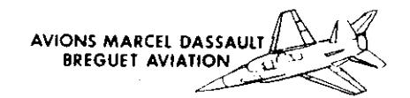

### MIRAGE F

|                   |                                                                                                                                                                                                                                                                         | M.A                           | AUUA    | L 12 |
|-------------------|-------------------------------------------------------------------------------------------------------------------------------------------------------------------------------------------------------------------------------------------------------------------------|-------------------------------|---------|------|
| ltem - | Name - Characteristics and Functions                                                                                                                                                                                                                                    | Location Access Door No.   | Do S | oc.  |
| 80F               | STATIC PRESSURE PROBE  - Provided with two inlets for sensing static pressure references S1 and S2 distributed to certain equipment of the aircraft.  - A resistor protects the inlets from icing.                                                                      | Nose cone (radome)         | 5       | X    |
| 81F               | <ul> <li>«it 1 &gt; 14°» RELAY</li> <li>When energized, it permits:</li> <li>transmission of a (28 V DC) i &gt; 14° signal to the engine,</li> <li>transmission of a ground signal to the warning horn, thereby indicating that the aircraft angle of attack</li> </ul> | 15-10 (LH junction box) | ×       |      |
| 104F              | exceeds 14° in operating mode with AP connected.  MAIN COMPUTER (see 10-5)                                                                                                                                                                                              |                               |         |      |
| 126F              | FILTERED 26-V AC TRANSFORMER (see 09-2)                                                                                                                                                                                                                                 |                               |         |      |
| 26Н               | OVERPRESSURE/UNDERPRESSURE VALVE (see 09-2)                                                                                                                                                                                                                             | ·                             |         |      |
| 17\$              | RADAR NOSE CONE (see 14-2)                                                                                                                                                                                                                                           |                               |         |      |
|                   |                                                                                                                                                                                                                                                                         |                               |         |      |

{61}------------------------------------------------

### MIRAGE F

#### Restricted

| Item | Name - Characteristics and Functions                                                                                                                                                                                                                                                                                                                                                                                                                                                                                                   | Location Access Door No. | Do S | c. |
|------|----------------------------------------------------------------------------------------------------------------------------------------------------------------------------------------------------------------------------------------------------------------------------------------------------------------------------------------------------------------------------------------------------------------------------------------------------------------------------------------------------------------------------------------|-----------------------------|---------|----|
| 1W   | FAILURE WARNING PANEL  See 08-3 for description and operation. As regards the pitot static system, the panel carries the amber «PITOT» warning light.  Illumination of the amber warning light is repeated by master failure warning light 17W of the same color.                                                                                                                                                                                                                                                                      | Cockpit (RH panel)       | ×       |    |
| 7W   | WARNING HORN (See 08-3)  Provides to the pilot an aural signal varying as the angle-of-attack angle and its gradient. The signal frequency varies from 1000 to 2200 Hz for an angle-of-attack angle between 13.1 and 17°.  When the angle-of-attack angle is > 17°, the horn delivers a chopped signal of 2000 Hz.  If autopilot is connected, the warning horn operates from 14°.  The warning horn is cut off when the aircraft is on ground, with compressed shock absorbers, except if the angle-of-attack system is being tested. |                             |         |    |
| 50Z  | ACQUISITION UNIT (See 17-1)                                                                                                                                                                                                                                                                                                                                                                                                                                                                                                         |                             |         |    |
| 53Z  | PRESSURE CENTER (See 17-1)                                                                                                                                                                                                                                                                                                                                                                                                                                                                                                          |                             |         |    |
| 137Z | VERTICAL REFERENCE CHANNEL TEST CONNECTOR  Permits connection of test equipment for checking and trouble shooting angle-of-attack probe 14F (output towards angle-of-attack indicator)                                                                                                                                                                                                                                                                                                                                                 | (See 10-1)                  |         |    |
| 138Z | SIGHT SYSTEM TEST CONNECTOR  Permits connection of test equipment for checking and trouble shooting angle-of-attack probe 14F                                                                                                                                                                                                                                                                                                                                                                                                          | (See 10-1)                  |         |    |
|      |                                                                                                                                                                                                                                                                                                                                                                                                                                                                                                                                        |                             |         |    |

{62}------------------------------------------------

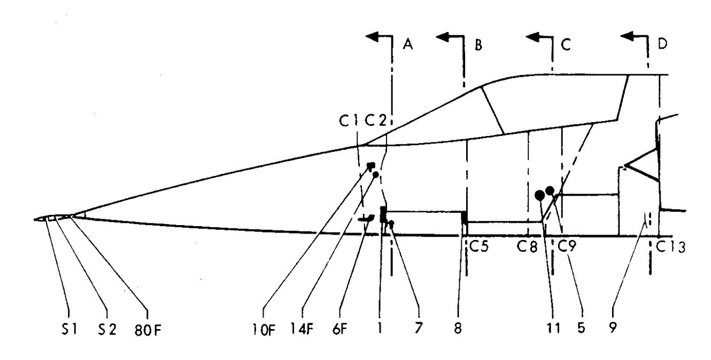

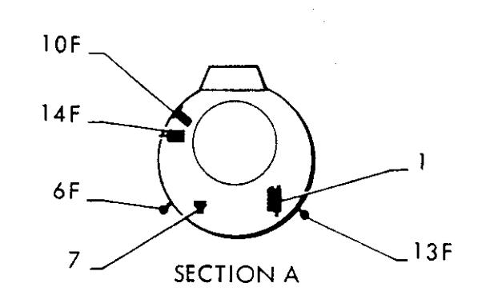

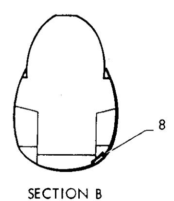

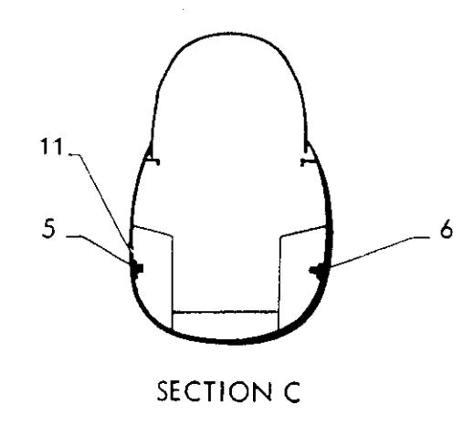

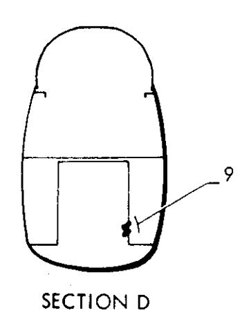

FIGURE 1 - IMPLANTATION GENERALE

GENERAL LAYOUT

{63}------------------------------------------------

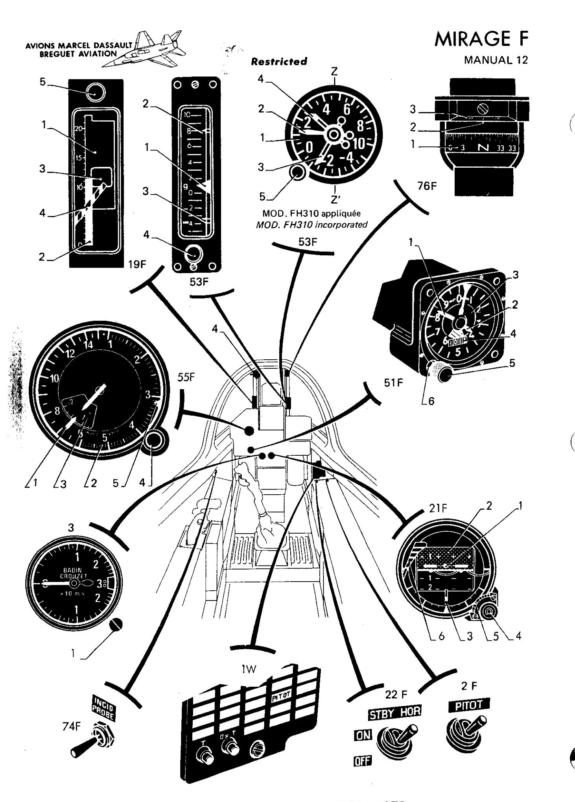

FIGURE 2 – IMPLANTATION AU POSTE PILOTE LAYOUT IN COCKPIT

{64}------------------------------------------------

## STANDBY MAGNETIC COMPASS (figures 3 and 4)

#### 1 - OPERATION

#### A - Principle

A moving assembly carrying a permanent magnet rotates in the local magnetic field.

#### B - Description (see figure 3)

The compass includes:

- mount 1
- compensator unit 2
- bowl 3
- moving assembly 4.

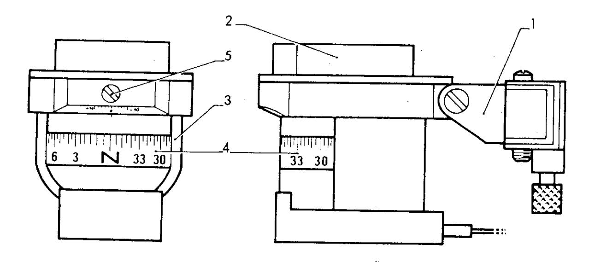

FIGURE 3 - STANDBY MAGNETIC COMPASS

The compensation devices are as follows:

(1) Lubber line compensation The bowl can turn about the vertical axis when screw 5 is not tightened.

{65}------------------------------------------------

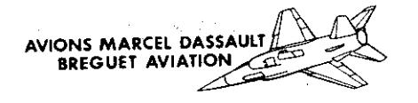

### MIRAGE F

MANUAL 12

#### (2) Compensator unit (figure 4)

The compensator unit includes:

- a semicircular plate
- an upper assembly
- a lower assembly
- a cover.

Semicircular plate

The semicircular plate is secured to the support plate of the mount. On its upper and lower surfaces, cylindrical recesses are provided for accommodating the two compensator assemblies.

Restricted

Upper compensator assembly

The upper compensator assembly (housed in the upper surface recesses) consists of two gearwheels 5 meshing with each other. One gearwheel meshes with a tangent screw 6 marked NS, which can be actuated from the front.

Each gearwheel accommodates a magnet 4. The relative gearwheel movement creates a magnetic field; the magnetic field direction is parallel with the gearwheel centerline, and its intensity can be varied as required. The gearwheels are held in position in the recesses by a screwed retaining plate 7.

Lower compensator assembly

The lower compensator assembly (housed in the lower surface recesses) is similar to the upper assembly. It is identified by letters EW. Its operation is similar to that of the upper assembly (gearwheels 2 and tangent screw 3) but its action is shifted by 90°.

The cover is installed from the front of the compensator unit; it protects the tangent screw heads.

{66}------------------------------------------------

0

### MIRAGE F

MANUAL 12

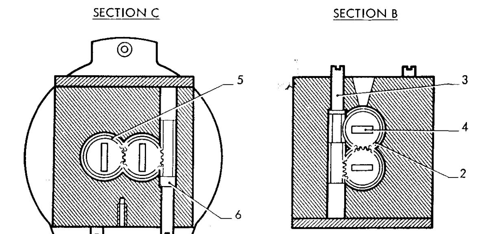

Restricted

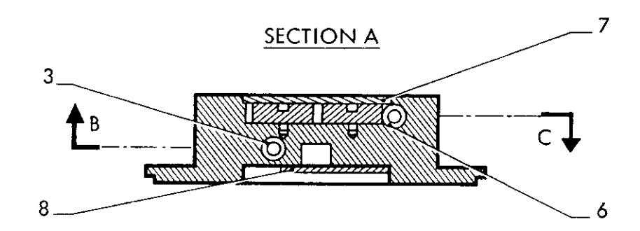

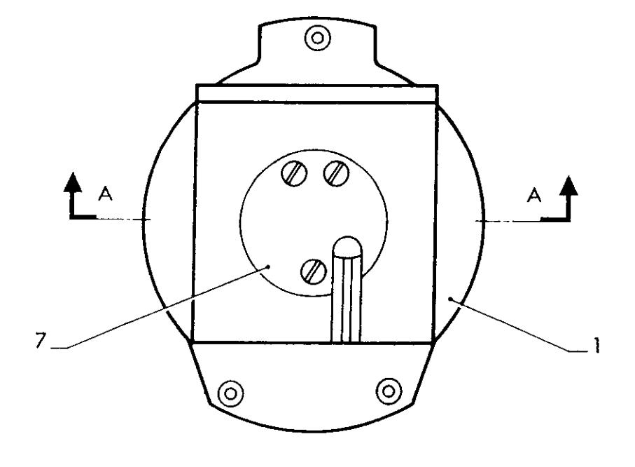

FIGURE 4 – BLOC COMPENSATEUR COMPENSATOR UNIT

{67}------------------------------------------------

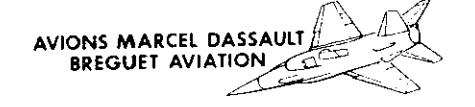

# MIRAGE F

#### STANDBY HORIZON (Figure 5)

#### 1 - OPERATION

The vertical reference is obtained by using the properties of a gyro with two degrees of freedom, associated with an erection system slaving the gyro axis to the local vertical.

A manual resetting device permits the gyro to be rapidly switched on in a direction close to the vertical, in straight flight or on ground.

The roll and pitch data are displayed to the pilot and distributed by potentiometer transmitters to acquisition unit 50Z.

The monitoring system controlling the warning flag acts on the power supply of the gyro rotor driving motor.

The warning flag is also visible during the manual gyro resetting sequence.

NOTE: The vertical information is available about 50 seconds after energization of the standby horizon.

When the apparent vertical departs from the gyro axis by more than  $9^{\circ}$ , the erection effect is cut off.

{68}------------------------------------------------

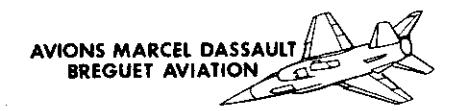

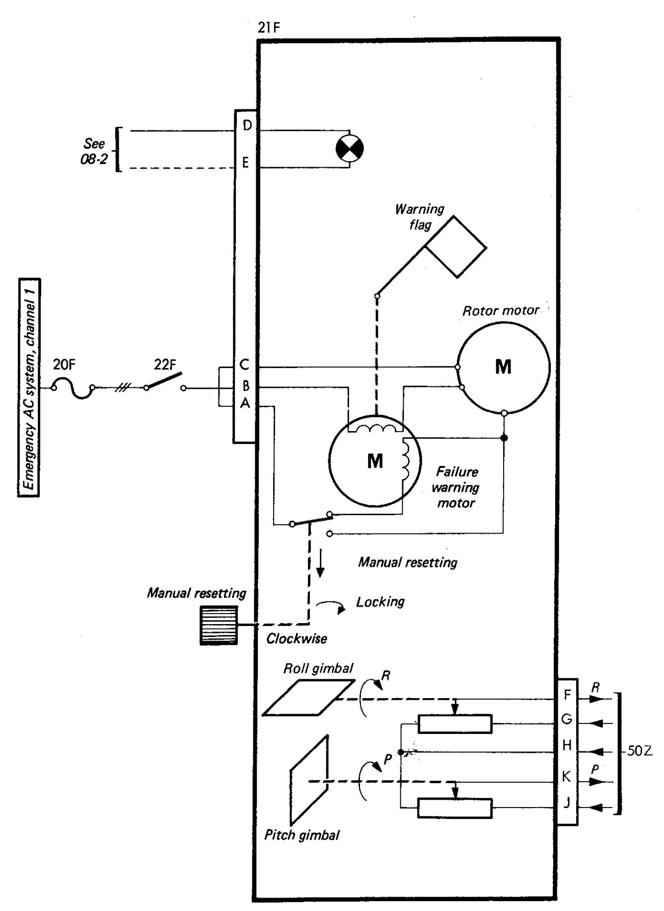

FIGURE 5 - STANDBY HORIZON

{69}------------------------------------------------

MIRAGE F
MANUAL 12

#### **ACCELEROMETER**

#### 1 - PRINCIPLE

A moving weight guided along the sensitive axis of the pickoff, moves as the acceleration component along this axis varies.

The movement is limited by the action of a spiral spring, the counteracting torque of which balances the torque resulting from the weight acceleration. A sealed oil damper stabilizes the weight in the balanced position. The weight movement is transmitted to an index through a gear train and a wire-and pulley device.

Two moving indexes display the maximum values reached in each direction. A pushbutton is used for returning the indexes to g=1. They are driven by the main index displaying the acceleration.

#### 2 - PRINCIPLE (Modification FH310 incorporated)

The front panel is in the form of a graduated circular dial in front of which three pointers move:

- -a main pointer continuously indicating the apparent vertical acceleration,
- -two secondary pointers used to record the maximum apparent vertical acceleration values reached in each direction,
  - -a button used to reset the secondary pointers to the main pointer position.

The operating principle is basically the same as the above-described principle. The weight movement is transmitted to the main pointer trhough a gear train.

{70}------------------------------------------------

### ANGLE-OF-ATTACK SYSTEM (Figures 6, 7 and 8)

#### 1 - SCOPE (Figure 6)

The scope of the angle-of-attack system is to furnish an angle-of-attack information.

The local angle of attack (il) measured by the probe is distributed :

- to the angle-of-attack indicator,
- to main computer (104F) and symbol generator box (35A) which compute :
  - it1 as per the low airspeed schedule,
  - it2 as per the high airspeed schedule
- to the air data computer which makes the angle-of attack corrections required for the radar,
- to the acquisition unit (50Z) and the slat servo unit (193C).

Figure 6 shows the distribution of the associated systems.

#### 2 - OPERATION (Figures 7 and 8)

#### A - Angle-of-attack probe :

#### (1) Principle

The probe comprises:

- a body fixed to the aircraft structure
- a cylindrical tube equipped with vanes. These vanes are housed inside chambers in the body and the tube can rotate in relation to the latter.

The tube protrudes out of the aircraft skin and is subjected to the air stream pressures. Two slots provided along the tube generatrixes, at  $\pm$  45° (when the tube is in position of equilibrium), receive the pressures which are directed toward the body chambers. When these pressures are equal, the vanes are in equilibrium and the tube remains in the direction of the air stream (aerodynamic zero). This position corresponds to the local angle of attack.

#### (2) Operation

The probe starts operating as the aircraft AC power systems are energized. Probe heater switch 2F supplies the deicing resistor of the tube which is temperature-controlled to 95° C.

When rotating, the tube drives:

- 2 synchro-receivers delivering the angle-of-attack information to the angle-of-attack indicator, air data computer, main computer and symbol generator box,
- 2 potentiometers transmitting the angle-of-attack information to acquisition unit 50Z and slat servo unit 193C.

The electrical zero of these components is set to the aerodynamic zero of the tube.

#### (3) Testing

A test motor controlled by switch 74F, moves the probe between -5 and  $+35^{\circ}$  in relation to the FRL (see figure 7).

{71}------------------------------------------------

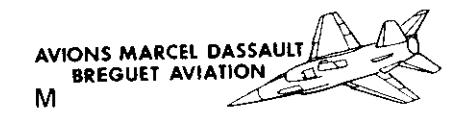

MIRAGE F

MANUAL 12

#### B - Angle-of-attack indicator

#### (1) Operation

The local angle of attack is received by synchro-receiver S2.

A servo system repeats the received angle of attack and drives transform :

- the local angle of attack into true angle of attack (low airspeed schedule at M=0.3) for actuating the indicator tape, it1 > 8° contact and it1 > 14° contact.

A threshold detector independent of the repeater channel and connected to the stator of synchroreceiver S2 controls a relay when the it1 angle-of-attack angles exceed 17°. The contact of this relay is used to operate the warning horn as this limit angle-of-attack angle is exceeded.

An it1  $\geqslant$  14° contact controlled by the it1 drive energizes relay 81F which sends a 28 V signal to the engine and a ground signal to warning horn 7W when autopilot 39C is connected.

The warning horn is cut off if the RH shock absorber is compressed.

An it1 > 8° contact controlled by the it1 drive illuminates the green, yellow and red lighted blocks when it1 exceeds 8°.

#### (2) Monitoring

The indicator monitoring system governs:

- 26 V/400 Hz power supply from 26 V AC transformer (26F),

- angle-of-attack repeating by analyzing the error signal of the slaving loop.

Malfunctioning causes extension of the warning flag on the angle-of-attack indicator.

#### C - Test of angle-of-attack system

The angle-of-attack system can be tested by performing:

- external simulation with an angle-of-attack gauge,
- integrated test through switch 74F.

The integrated test permits the probe to be set to  $\pm~20^\circ$  from the average position (mechanical zero). These positions correspond to  $5^\circ$  nose-down and  $35^\circ$  nose-up in relation to the FRL.

(1) Position  $-5^{\circ}$ . A winding of the test motor brings the probe to position  $-5^{\circ}$ .

At the same time, the angle-of-attack indicator reads  $0.35^{\circ}$ .

(2) Position 35°. A second winding of the test motor brings the probe to position 35°. At the same time, the angle-of-attack indicator reads 21.5°.

The information contact corresponding to it  $1>17^\circ$  operates warning horn 7W (or to it  $1>14^\circ$  when the autopilot is engaged).

The microswitch of the RH U/C leg is shorted during the test.

{72}------------------------------------------------

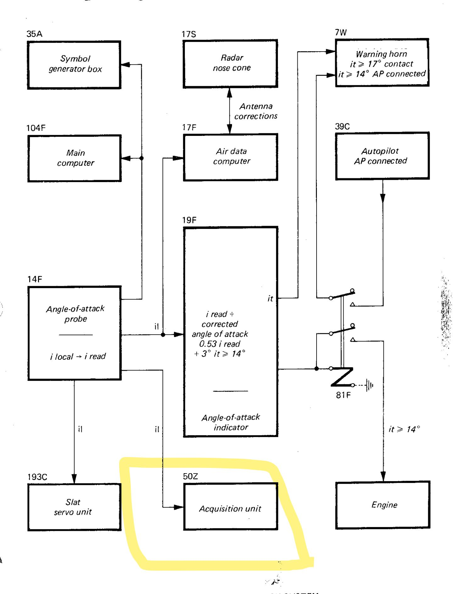

FIGURE 6 - ANGLE-OF-ATTACK SYSTEM

{73}------------------------------------------------

MANUAL 12

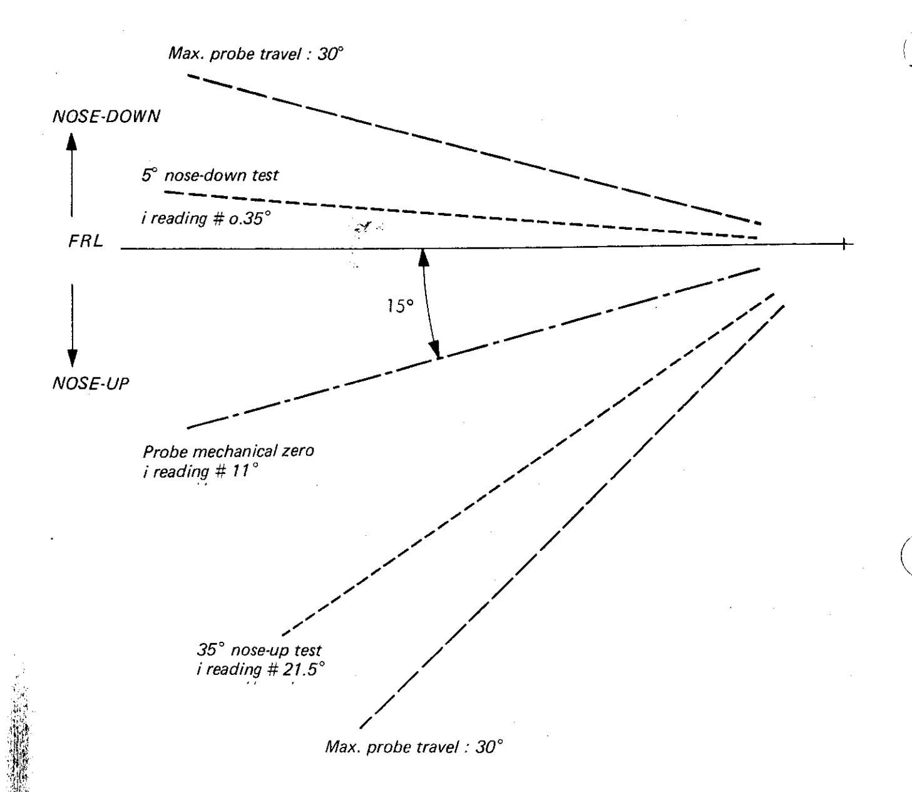

i reading = true i at low airspeed

 $i reading = 0.53 i local + 3^{\circ}$ 

{74}------------------------------------------------

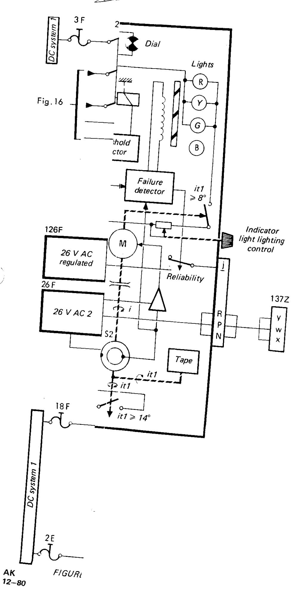

{75}------------------------------------------------

{76}------------------------------------------------

MIRAGE F

MANUAL 12

### PITOT-STATIC SYSTEM (figure 15)

The system includes the following components:

- static pressure probe 80F with static pressure inlets S1 and S2
- fuselage static pressure inlets S3, S4 and S5
- pitot pressure probes 6F and 13F
- pitot-static lines
- drain fittings and unit
- flight instruments directly connected to the pitot-static lines :
  - standby altimeter 51F
  - mach/airspeed indicator 55F
  - vertical speed indicator 3.

The purpose of the aircraft pitot-static system is to collect and distribute the total and static pressures.

NOTE: The metal tubing of static lines S1 and S2 provides bonding between the static pressure probe and radome ferrule.

### 1 - PRESSURE PROBES AND INLETS AND PITOT-STATIC LINES (figure 9)

A - Pitot pressure probe T1 and pilot's pitot pressure probe T2.

The pitot pressures from probes T1 and T2 are used by the following equipment:

- (1) Pressure T1: mach/airspeed indicator 55F, slat IAS aneroid 108C and flap IAS aneroid 109C,
- (2) Pressure T2: air data computer 17F, dashpot jack 194C and pressure center 53Z.
- B Static pressure inlets S1 and S2

The static pressures from static pressure inlets S1 and S2 of the probe are fed through the nose cone to a quick-disconnect connector block mounted on frame 1. The connector block directs the pressures to the following equipment:

- (1) Pressure S1: standby altimeter 51F, mach/airspeed indicator 55F, Mach number switch 56F, slat IAS aneroid 108C and flap IAS aneroid 109C.
- (2) Pressure S2: air data computer 17F, autopilot 39C and pressure center 53Z.
- C Static pressure inlets S3, S4 and S5.

The static pressures from fuselage inlets S3, S4 and S5 directly supply the following equipment:

- (1) Pressure S3: vertical speed indicator 3 and cabin pressure regulator 10.
- (2) Pressure S4: dashpot jack 194C.
- (3) Pressure S5: overpressure/underpressure valve 26H.

{77}------------------------------------------------

{78}------------------------------------------------

MANUAL 12

#### 2 - CONNECTION OF COMPONENTS

| COMPONENT                        | PRES  | SURE        |
|----------------------------------|-------|-------------|
| COMPONENT                        | Pitot | Static      |
| Mach/airspeed indicator          | Т1    | S1          |
| Standby altimeter                |       | <b>S</b> 1  |
| Vertical speed indicator         |       | \$3         |
| Air data computer                | T2    | \$2         |
| Autopilot                        |       | S2          |
| Dashpot jack                     | T2    | S4          |
| Cabin pressure regulator         |       | \$3         |
| Slat IAS aneroid                 | T1    | S1          |
| Flap IAS aneroid                 | T1    | S1          |
| Mach number switch               | T1 .  | S1          |
| Overpressure/underpressure valve |       | <b>\$</b> 5 |
| Pressure center                  | T2    | S2          |

#### 3 - DRAINING OF LINES

Certain pitot and static pressure lines are provided with drains at their lowest points :

- three drains identified 7 for static line S1, 8 for static line S2 and pitot line T2, 9 for static line S4 and pitot line T2.

The distribution lines of static inlets S3 and S5 and pitot probe T1 are not fitted with drains, as the inlets and the probe are located at the lowest point of the system.

#### 4 - STANDBY ALTIMETER

Static pressure variations distort an aneroid. A distorted aneroid causes the rotation of a shaft which drives the display pointers.

A thermal compensation device (bimetal strip) controls the operation between -20 and +50 °C. The lighting power is supplied through terminals A and B of the receptacle.

#### 5 - MACH/AIRSPEED INDICATOR

The Mach/airspeed indicator includes a pitot-static mechanism and an altimeter mechanism which are independent of each other. Each of them is fitted with an aneroid.

The pitot-static aneroid is subjected to pressure  $\Delta p$ , which is the difference between the pitot pressure (inside the aneroid) and the static pressure (inside the case). When deformed, the aneroid drives a disk pointer in front of a fixed dial graduated in knots, to give the airspeed.

The altimeter aneroid is subjected to the static pressure.

When deformed, the aneroid drives a moving dial graduated in Mach numbers behind a disk pointer which is cut away to permit reading.

{79}------------------------------------------------

# MIRAGE F

#### 6 - VERTICAL SPEED INDICATOR

Principle:

The vertical speed indicator is composed of :

- one thermostatic capacitor
- one differential pressure gauge.

The aneroid of the differential pressure gauge is subjected:

- inside, to the existing static pressure.
- outside, to the pressure of the thermostatic capacitor (previous static pressure).

The pressure differential measured by the differential pressure gauge represents the vertical component of the aircraft speed at a given moment.

{80}------------------------------------------------

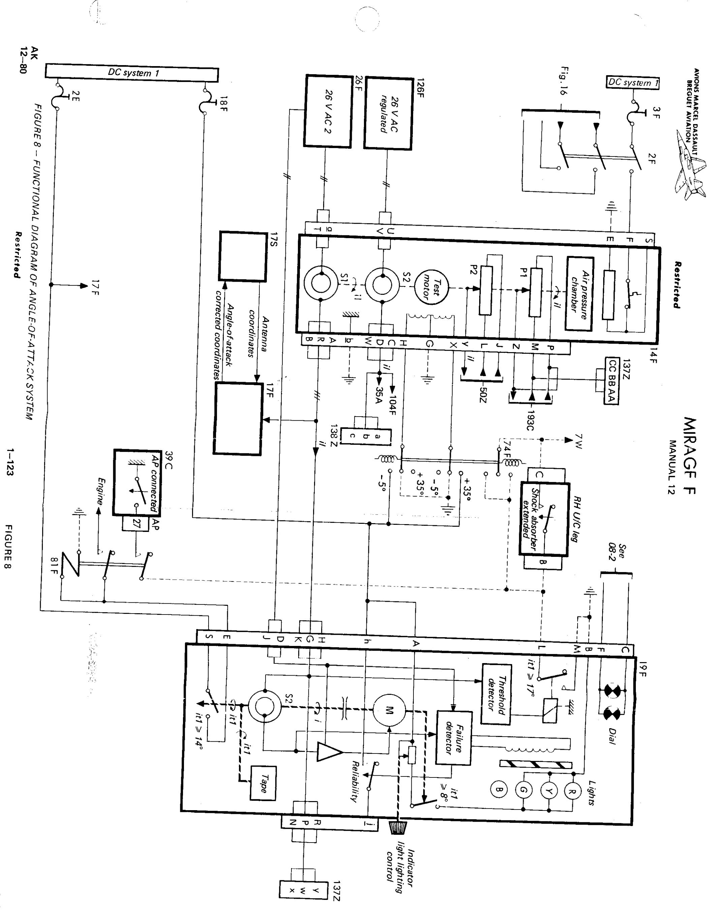

1-123

{81}------------------------------------------------

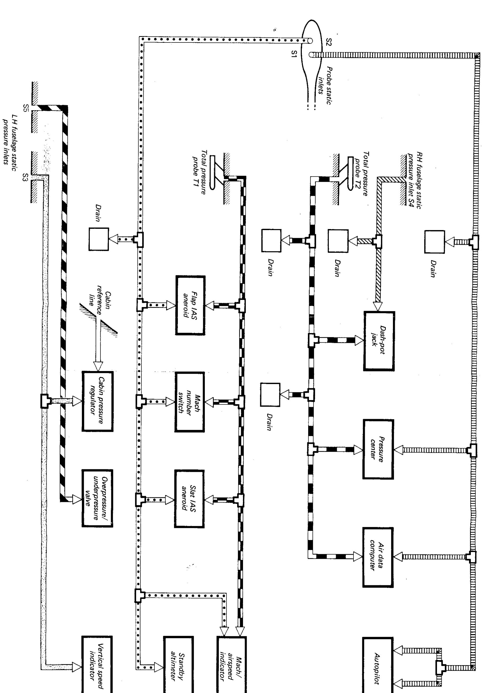

FIGURE 9 — SCHEMATIC DIAGRAM OF PITOT-STATIC PRESSURE DISTRIBUTION

1-127

FIGURE 9

1-127

{82}------------------------------------------------

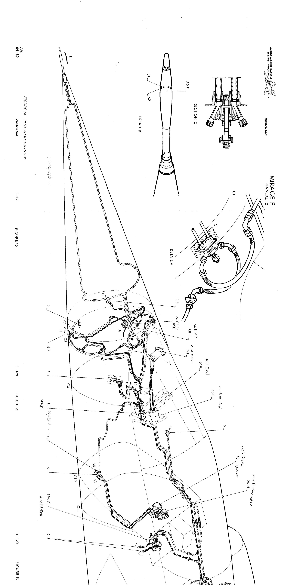

{83}------------------------------------------------

MIRAGE F

### PROBE HEATING CIRCUITS (Figure 16)

#### 1 - SCOPE

The heating system controls deicing of:

- pilot's pitot probe T1 6F
- pitot probe T2 13F
- angle-of-attack probe 14F
- static pressure probe 80F.

#### 2 - OPERATION

#### A - Power supplies :

When closed, probe heater switch 2F supplies:

- pilot's pitot probe T1 through the energization coil of current relay 5F
- pitot probe T2 through pitot static transformer 10F
- angle-of-attack probe
- static pressure probe through energized relay 78F and energization coil of heater monitoring relay 79F.

#### B - Monitoring:

Energization of relays 5F and 79F causes extinction of the «PITOT» light on the failure warning panel.

Failure of the power supply of pilot's pitot probe T1 or of the static pressure probe causes illumination of the «PITOT» warning light.

Failure of the power supply of pitot probe T2 13F or of the angle-of-attack probe is not signalled.

{84}------------------------------------------------

......................................

{85}------------------------------------------------

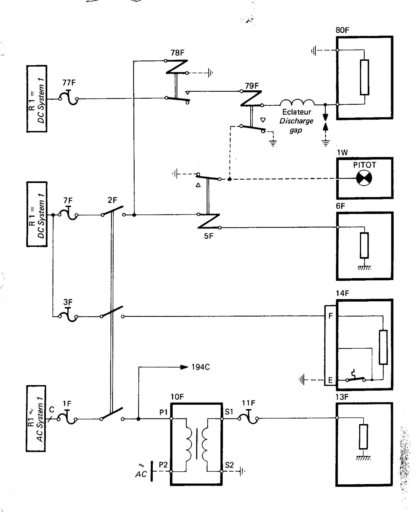

FIGURE 16 – CIRCUITS RECHAUFFAGE DES SONDES PROBE HEATING CIRCUITS

{86}------------------------------------------------

-4 

{87}------------------------------------------------

### TROUBLE SHOOTING OF PROBE HEATING CIRCUITS

#### 1 - SCOPE

To locate the failed unit with the aircraft equipment. For a failure reported by a pilot the mechanic shall confirm the trouble (brief check) by attempting to restore the flight conditions.

#### 2 - TROUBLE SHOOTING PROCEDURE

The trouble shooting procedure is described in the charts below.

{88}------------------------------------------------

{89}------------------------------------------------

AVIONS MARCEL DASSAULT

Restricted

# MIRAGE F

| 1-202    |        |                         |                             | 1-202                                                                                                                        |            | Rostricted                                                                                                                    | 07-74                                                                            | 0                |
|----------|--------|-------------------------|-----------------------------|------------------------------------------------------------------------------------------------------------------------------|------------|-------------------------------------------------------------------------------------------------------------------------------|----------------------------------------------------------------------------------|------------------|
|          |        |                         |                             |                                                                                                                              |            |                                                                                                                               | 0                                                                                |                  |
|          |        |                         |                             |                                                                                                                              |            |                                                                                                                               | ·                                                                                |                  |
|          |        | ·                       | Probe 6F or relay 5F        | (3) L/H pitot probe not heated.                                                                                              |            |                                                                                                                               |                                                                                  | •                |
|          |        |                         | Relay 78F                   | (b) If $R = 1.45 \pm 0.2 \Omega$                                                                                             |            |                                                                                                                               |                                                                                  | I                |
|          |        |                         | Static pressure probe | (a) If R≠1.45 ± 0.2 Ω                                                                                                        |            |                                                                                                                               |                                                                                  |                  |
|          |        |                         |                             | Remove radome - Measure heating resistance across terminals 1 and 3 of disconnect 129 Δ                                      |            |                                                                                                                               |                                                                                  |                  |
|          |        |                         |                             | ted.                                                                                                                         |            |                                                                                                                               |                                                                                  | 74               |
|          |        |                         | Switch 2F                   | <ul> <li>A — Check static pressure probe and L/H pitot probe heating for efficiency.</li> <li>(1) No probe heated</li> </ul> | yes        | Set «PITOT» switch 2F to «ON»                                                                                                 |                                                                                  |                  |
|          |        |                         |                             |                                                                                                                              |            | Supply aircraft with electrical power, check DC system power supplies and ensure that fuse-breakers 7F and 77F are pushed in. | In flight, «PITOT» warning light and amber master failure warning light come on. | _                |
| SDAP     | Result | Procedure               | Change                      | Check                                                                                                                        | reproduced | Procedure                                                                                                                     |                                                                                  | ** *** **** **** |
| LOCATING | T      | CHECK AFTER REPLACEMENT | ō                           | LOCATING BY MECHANIC                                                                                                         | Collins of | CONFIRMATION                                                                                                                  | TROUBLE                                                                          |                  |

{90}------------------------------------------------

# MIRAGE F

#### MANUAL 12

#### MISE A JOUR PROVISOIRE TEMPORARY REVISION

N° 001-12

INSTRUCTIONS DE CLASSEMENT : A ajouter au début du manuell 2 derrière la "liste des décisions de modifications appliquées au manuel"

CONTROLE D'ETANCHEITE DES CIRCUITS ANEMO-METRIQUES

Page 12-1-504

#### ESSAI D'ETANCHEITE DU CIRCUIT STATIQUE S5

Si la tolérance < 5 mb/mn ne peut être respectée, effectuer l'essai d'étanchéité comme suit :

- a) Débrancher la tuyauterie statique de la soupape
- b) Obturer cette tuyauterie, côté avion, (voir NOTA)
- c) Effectuer l'étanchéité du circuit S5 seul :
  - appliquer une dépression de 200 mb dans le circuit (correspondant à une altitude de 6000 pieds)
  - attendre une minute pour la stabilisation du circuit
  - . isoler le circuit de la source de dépression et vérifier que la fuite ne dépasse pas 0,5 mb/mn.
- d) Ramener progressivement le circuit à l'ambiance
- e) Déposer le système d'obturation de la tuyauterie statique
- f) Rebrancher la tuyauterie statique S5 sur la soupape de surpression
- g) Effectuer un essai d'étanchéité cabine (Voir 09-2-502)

NOTA: Matériel d'obturation nécessaire:

- Raccord droit ARSAERO Réf. RA 5606
- Obturateur ARSAERO Réf. R 10406
- Bague de compression ARSAERO Réf. R5006
- Ecrou spécial ARSAERO Réf. R 5306

CE-EE-CK-ED-AD-CJ-EJ-EQ-CH-EH

FILING INSTRUCTIONS: To be added at the beginning of the manual 2 after the "list of modifications included in the manual"

#### PITOT-STATIC SYSTEM LEAK TEST

Page 12-1-504

1/2

#### TEST OF STATIC SYSTEM S5

If the tolerance < 5 mb per minute cannot be maintained accomplish the leak test as follows:

- a) Disconnect the static line from the valve
- b) Cap this line on aircraft side (see NOTE)
- c) Accomplish leak test of the S5 system only:
  - . subject the system to a negative pressure of 200 mb (equivalent of a 6000 ft altitude)
  - wait one minute for the system to stabilize
  - . isolate the system from the negative pressure source and check that the leak does not exceed 0.5 mb per minute
- d) Slowly return the system to ambient pressure
- e) Remove the cap from the static line
- f) Reconnect the S5 static line to the pressure relief valve
- g) Accomplish a cockpit leak test (see 09-2-502)

NOTE: Capping equipment required:

- ARSAERO straight coupling P/N RA 5606
- ARSAERO cap

P/N R 10406

- ARSAERO compression ring P/N R 5006
- ARSAERO special nut P/N R 5306

09,11,81

{91}------------------------------------------------

{92}------------------------------------------------

# AVIONS MARCEL DASSAULT BREGUET AVIATION

### MIRAGE F

MANUAL 12

#### SECTION 2

#### AIR DATA SYSTEM

#### TABLE OF CONTENTS

| 2-0                                             | GENERAL                                                                                                                                                                                                                    | rage                                                                                            |
|-------------------------------------------------|----------------------------------------------------------------------------------------------------------------------------------------------------------------------------------------------------------------------------|-------------------------------------------------------------------------------------------------|
|                                                 | - Principle of air data system                                                                                                                                                                                             | 2-001                                                                                           |
| 2-1                                             | DESCRIPTION - OPERATION                                                                                                                                                                                                    |                                                                                                 |
|                                                 | - Table of components                                                                                                                                                                                                      | 2-101 2-107 2-116 2-118                                                                |
| 2-2                                             | FAILURES                                                                                                                                                                                                                   |                                                                                                 |
|                                                 | - Trouble shooting of air data system                                                                                                                                                                                      | 2-201                                                                                           |
|                                                 | LIST OF ILLUSTRATIONS                                                                                                                                                                                                      |                                                                                                 |
| Figu                                            | ire No.                                                                                                                                                                                                                    | Page                                                                                            |
| 1 2 3 4 5 6 7 8 9 10 | SCHEMATIC DIAGRAM OF AIR DATA SYSTEM GENERAL LAYOUT LAYOUT IN COCKPIT DIAGRAM OF AIR DATA COMPUTER H - Ps CHANNEL M - $\Delta$ P CHANNEL TAS - Tt CHANNEL ANGLE-OF-ATTACK CHANNEL POWER SUPPLIES SELF-MONITORING SELF-TEST | 2-002 2-105 2-106 2-108 2-111 2-112 2-113 2-114 2-117 2-120 2-121 |
| 12                                              | AIR DATA DISTRIBUTION                                                                                                                                                                                                      | 2-122                                                                                           |

{93}------------------------------------------------

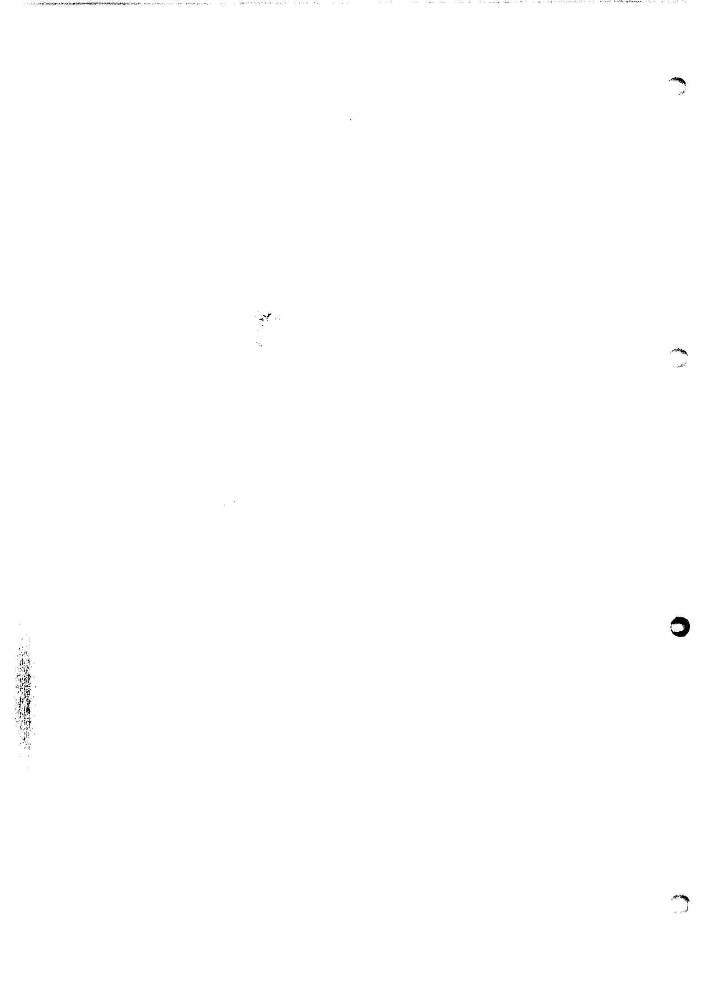

{94}------------------------------------------------

MIRAGE

MANUAL 12

AVIONS MARCEL DASSAULT
BREGUET AVIATION

#### Restricted

### PRINCIPLE OF AIR DATA SYSTEM (Figure 1)

The air data system includes:

- one air data computer 17F
- one temperature probe 43F.

The air data computer collects data from:

- total pressure system T2
- static pressure system S2
- temperature probe 43F
- angle-of-attack probe 14F.

From pickoffs sensing static pressure, dynamic pressure, total temperature and the local angle of attack, the air data computer generates :

- static pressure Ps
- air density
- pressure altitude H
- Mach number M
- true airspeed TAS
- dynamic pressure ΔP
- indicated airspeed IAS
- total temperature Tt
- true angle of attack

Figure 1 shows the distribution of the data generated by the system.

{95}------------------------------------------------

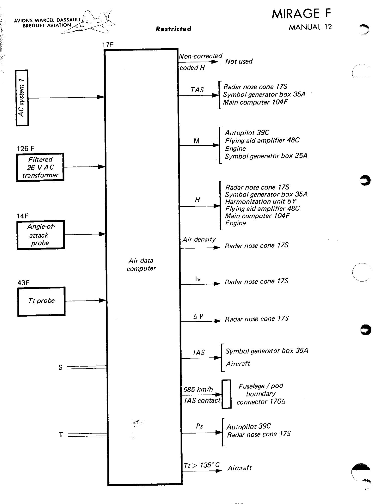

FIGURE 1 - AIR DATA SYSTEM SCHEMATIC

{96}------------------------------------------------

MANUAL 12

Restricted

### TABLE OF COMPONENTS

For layout, see figures 2 and 3

| Item | Name - Characteristics and Functions                                                                                                                                                                                 | Location Access Door No. |   | oc I |
|------|----------------------------------------------------------------------------------------------------------------------------------------------------------------------------------------------------------------------|-----------------------------|---|---------|
| 35A  | SYMBOL GENERATOR BOX (see 14-3)                                                                                                                                                                                      |                             |   |         |
| 38A  | SIGHT DC SUPPLY FUSE-BREAKER (see 14-3)                                                                                                                                                                              |                             |   |         |
| 107A | SIGHT SYSTEM OPERATION RELAY (see 14-3)                                                                                                                                                                              |                             |   |         |
|      | Energized when power is applied to the sight system, this relay supplies H, IAS, M and TAS reliability contacts of air data computer 17F (for symbol generator box 35A) with 28 V DC from load-shedding DC system 2. |                             |   |         |
| 8C   | FLAP MICROSWITCH UNIT (see 04-4)                                                                                                                                                                                  |                             |   |         |
| 38C  | SHOCK CONE POSITION INDICATOR (see 06-3)                                                                                                                                                                             | Cockpit (instrument      | X |         |
|      | The shock cone position indicator displays the position of the shock cones in automatic and manual modes.                                                                                                            | panel)                      |   |         |
| 39C  | AUTOPILOT (see 13-2)                                                                                                                                                                                              |                             |   |         |
| 48C  | FLYING AIDS AMPLIFIER (see 13-1)                                                                                                                                                                                     |                             |   |         |
| 101C | AP DC SUPPLY FUSE-BREAKER (see 13-2)                                                                                                                                                                                 |                             |   |         |
| 192C | FLAP SERVO UNIT (see 04-4)                                                                                                                                                                                        |                             |   |         |
| 193C | SLAT SERVO UNIT (see 04-4)                                                                                                                                                                                        |                             |   |         |
| 2E   | MACH = 1.4 OVERSPEED FUSE-BREAKER (see 06-5)                                                                                                                                                                         |                             |   |         |
| 14F  | ANGLE-OF-ATTACK PROBE (see 12-1)                                                                                                                                                                                     |                             |   |         |
|      | Supplies local angle-of-attack information to air data computer 17F.                                                                                                                                                 |                             |   |         |
|      |                                                                                                                                                                                                                      |                             |   |         |
|      |                                                                                                                                                                                                                      |                             |   |         |

{97}------------------------------------------------

### MIRAGE F

| ſ | 14   | Name - Characteristics and Functions                                                                                                | Location        | Do | oc.      |
|---|------|-------------------------------------------------------------------------------------------------------------------------------------|-----------------|----|----------|
| l | Item |                                                                                                                                     | Access Door No. | S  | 1        |
|   | 17F  | AIR DATA COMPUTER                                                                                                                   | Equipment bay   | ×  |          |
| I |      | From the following air data:                                                                                                        | 13.00           |    | 1        |
| ı |      | - static pressure Ps                                                                                                                | multiple        |    |          |
| ı |      | - pitot pressure Pt                                                                                                                 | chassis         |    |          |
| ı |      | - total temperature Tt                                                                                                              | 1               |    |          |
| ı |      | - local angle of attack il                                                                                                          |                 |    |          |
| ı |      | the air data computer generates the following infor-                                                                                |                 |    |          |
| ı |      | mation:                                                                                                                             | -               |    | 1        |
| ١ |      | - static pressure Ps                                                                                                                |                 |    | İ        |
| ı |      | - air density                                                                                                                       |                 |    |          |
| ۱ |      | - pressure altitude H                                                                                                               |                 |    |          |
| ı |      | - dynamic pressure ΔP                                                                                                               |                 |    | ŀ        |
| ı |      | - Mach number M                                                                                                                     |                 |    | ļ        |
| ı |      | - true airspeed TAS                                                                                                                 |                 |    |          |
| ļ |      | - indicated airspeed IAS                                                                                                            |                 |    |          |
| ١ |      | - total temperature Tt                                                                                                              |                 |    |          |
| ١ |      | - true angle of attack it                                                                                                           |                 |    |          |
|   |      | Moreover, the air data computer codes the non- corrected pressure altitude for possible use.                                     |                 |    |          |
|   |      | The air data computer carries the following on the top:                                                                             |                 |    |          |
|   |      | - one static pressure inlet 1 - one pitot pressure inlet 2                                                                          |                 |    |          |
| ١ |      | - one test button 3                                                                                                                 | 1               |    |          |
|   |      | <ul> <li>one test light 4</li> <li>three air data computer test and maintenance connectors 5.</li> </ul>                        |                 |    |          |
|   |      | Self-monitoring                                                                                                                     |                 |    |          |
|   |      | In case of failure of the air data computer, a master alarm system illuminates the «ADC» light on failure warning panel 1W.         |                 |    |          |
| ı |      | Test                                                                                                                                |                 |    |          |
|   |      | When the operation is correct, keeping test button 3 depressed causes test light 4 to come on after approx. 6 seconds have elapsed. |                 |    |          |
| ĺ |      |                                                                                                                                     |                 |    |          |
|   | 38F  | ROLL/PITCH OUTPUT MULTIPLIER (See 14-2)                                                                                             |                 |    |          |
|   |      |                                                                                                                                     |                 |    |          |
|   |      |                                                                                                                                     |                 |    |          |
| - |      |                                                                                                                                     |                 |    |          |
|   |      |                                                                                                                                     |                 |    |          |
|   |      |                                                                                                                                     |                 |    |          |
|   |      |                                                                                                                                     |                 |    |          |
|   |      |                                                                                                                                     |                 |    | 1        |
| 1 |      |                                                                                                                                     |                 |    |          |
| ľ |      |                                                                                                                                     |                 | Ì  |          |
| 1 |      |                                                                                                                                     |                 | ļ  | •        |
| l |      |                                                                                                                                     |                 |    | <u> </u> |

{98}------------------------------------------------

|      |                                                                                                                                                                                                                                                                    |                             | MUA     |    |
|------|--------------------------------------------------------------------------------------------------------------------------------------------------------------------------------------------------------------------------------------------------------------------|-----------------------------|---------|----|
| Item | Name - Characteristics and Functions                                                                                                                                                                                                                               | Location Access Door No. | Do S | c. |
| 43F  | TEMPERATURE PROBE  Senses the total temperature which it furnishes to air data computer 17F. It is composed of a plate resistor (100 $\Omega$ at 0°C) with a resistivity varying as temperature. A compensation line corrects for transmission line resistance.    | RH frame 2               | ×       |    |
| 45F  | AIR DATA COMPUTER FUSE-BREAKER  Protects AC system 1 of air data computer 17F.                                                                                                                                                                                     | Electrical master box    | Х       |    |
| 104F | MAIN COMPUTER (See 10-5)                                                                                                                                                                                                                                        |                             |         |    |
| 126F | FILTERED 26 V AC TRANSFORMER (See 10-2)                                                                                                                                                                                                                         |                             |         |    |
| 141F | NAVIGATION POWER SUPPLY RELAY (See 12-6)  Energized when power is applied to navigation system, this relays supplies H, TAS and it reliability contacts (for main computer 104F and roll/pitch output multiplier 38F) with 28 V DC from load-shedding DC system 2. |                             |         |    |

{99}------------------------------------------------

### MIRAGE F

MANUAL 12

|      | <u> </u>                                                                                                                                                                                                                                                                                                                                     | 1917                             | NUAL |                |
|------|----------------------------------------------------------------------------------------------------------------------------------------------------------------------------------------------------------------------------------------------------------------------------------------------------------------------------------------------|----------------------------------|------|----------------|
| Item | Name - Characteristics and Functions                                                                                                                                                                                                                                                                                                         | Location Access Door No.      | Doc. |                |
| 7G3  | U/C UP MICROSWITCH (See 05-6)                                                                                                                                                                                                                                                                                                             |                                  |      |       |
| 23G  | DOORS-CLOSED MICROSWITCH (See 05-6)                                                                                                                                                                                                                                                                                                       |                                  |      |                |
| 17K  | A/B FUSE-BREAKER (See 06-2)                                                                                                                                                                                                                                                                                                               |                                  |      |                |
| 41K  | «IAS < 415 km/h» RELAY (See 06-5)                                                                                                                                                                                                                                                                                                         |                                  |      |                |
| 15S  | PROGRAM UNIT (See 14-2)                                                                                                                                                                                                                                                                                                                   |                                  |      |                |
| 17S  | RADAR NOSE CONE (See 14-2)                                                                                                                                                                                                                                                                                                                |                                  |      |                |
| 1W   | FAILURE WARNING PANEL  - See manual 08-3 for description and operation.  - As regards the air data system, the warning panel carries an amber «ADC» light, the illumination of which is controlled by the master alarm system.  - Illumination of the amber warning light is repeated by master failure warning light 17W of the same color. | Cockpit (RH panel)         | ×    |                |
| 7W   | WARNING HORN (See 08-3)                                                                                                                                                                                                                                                                                                                      |                                  |      |                |
| 11W  | «LIMIT» WARNING LIGHT (See 08-3)                                                                                                                                                                                                                                                                                                          | Cockpit (Instrument panel) |      |                |
| 5Y   | HARMONIZATION UNIT (See 15-4)                                                                                                                                                                                                                                                                                                             |                                  |      |                |
| 170∆ | FUSELAGE/POD BOUNDARY CONNECTOR (See 10-1)                                                                                                                                                                                                                                                                                                |                                  |      |                |
|      | Interconnects air data computer and fuselage pod.                                                                                                                                                                                                                                                                                            |                                  |      |                |

Restricted

{100}------------------------------------------------

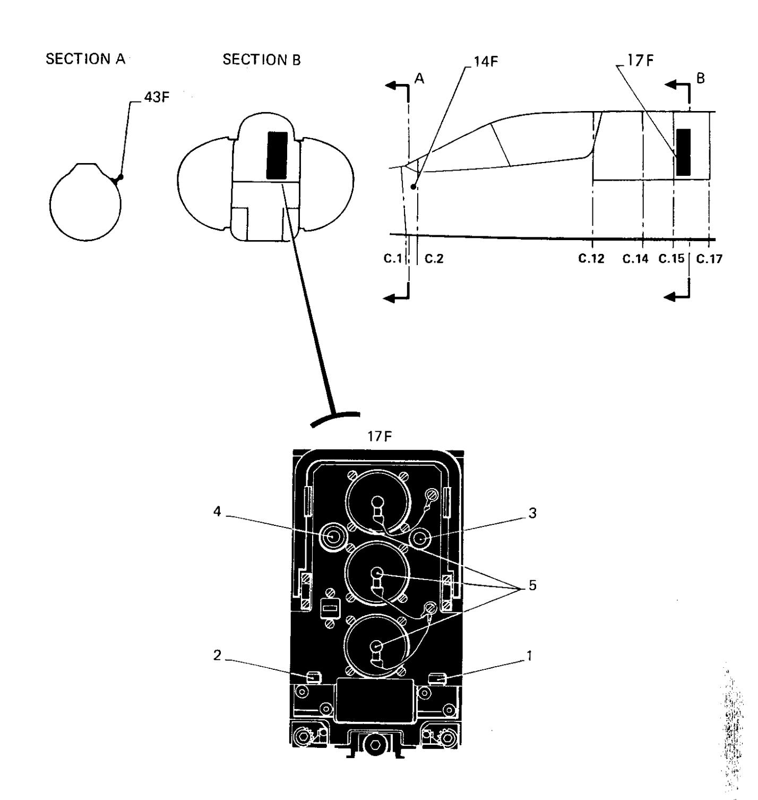

FIGURE 2 - IMPLANTATION GENERALE GENERAL LAYOUT

{101}------------------------------------------------

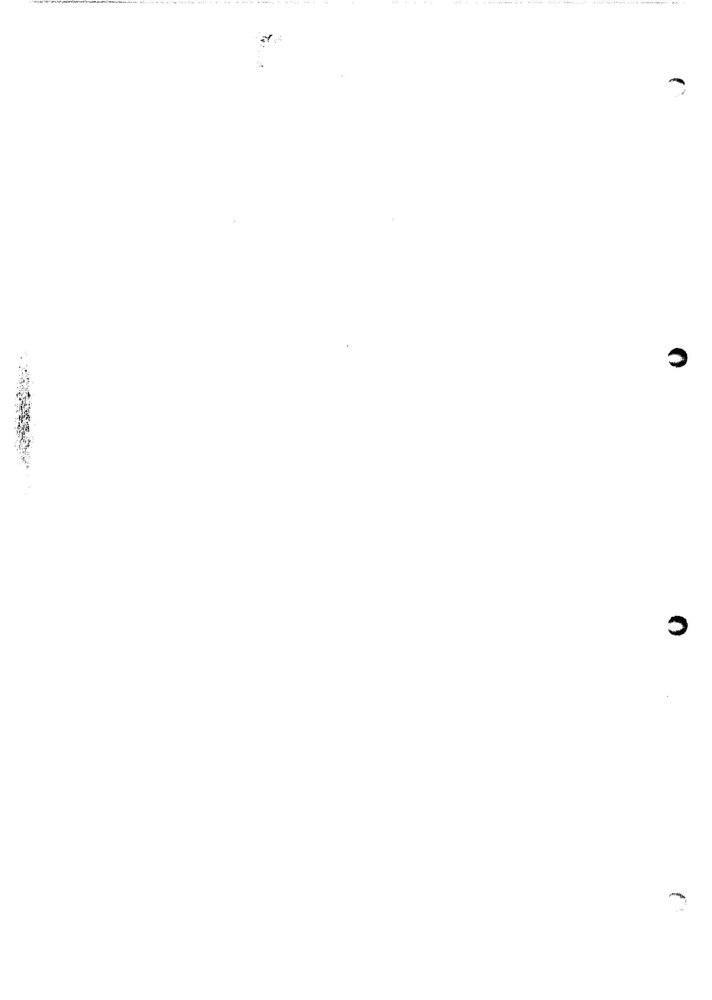

{102}------------------------------------------------

{103}------------------------------------------------

### MIRAGE F MANUAL 12

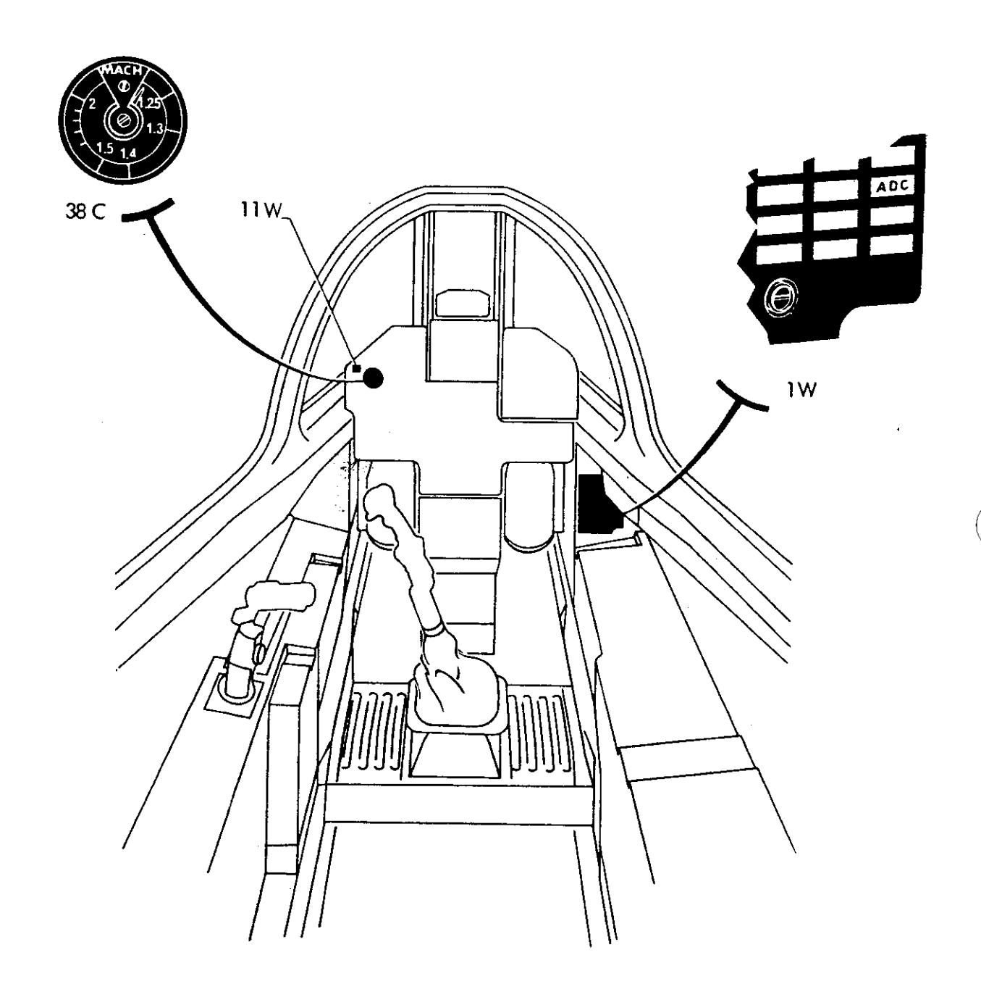

FIGURE 3 – IMPLANTATION AU POSTE PILOTE LAYOUT IN COCKPIT

{104}------------------------------------------------

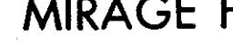

MANUAL 12

#### AIR DATA COMPUTER

#### 1 - GENERAL (figure 4)

The air data computer is a unit processing, generating and distributing data in connection with the aircraft flight (airspeed, altitude and angle of attack).

These data result from four physical data:

- static pressure
- collected by the pitot-static system
- total pressure
- total temperature, collected by the total temperature probe
- local angle of attack, measured by the angle-of-attack probe.

The measured static pressure Ps is subjected to a correction for antenna error dPs depending on the Mach number.

 $\Delta P = Pt - Ps$  is computed from the two pressure measurements and also subjected to a correction against the Mach number.

The following data are generated from these corrected measurements:

$$M = f \left[ \begin{pmatrix} \Delta P \\ Ps \end{pmatrix} \right]$$

$$IAS = f(\Delta P)$$

$$TAS = f(M, Tt)$$

#### 2 - PICKOFFS

The following units transform the physical data into electrical information, usable by the computation channels:

- for Ps, one pickoff in the computer,
- for  $\Delta P$ , one pickoff in the computer, also receiving Ps and Pt,
- for Tt, the total temperature probe of the aircraft,
- for local angle of attack (il), the angle-of-attack probe.

The pickoffs deliver a DC voltage which is a linear function of the measured datum.

The temperature probe forms one branch of a resistor bridge. The electrical information corresponding to Tt measurement is generated by the computer from the resistance variation of the probe.

The angle-of-attack probe delivers a synchro signal (XYZ) depending on the local angle of attack.

### 3 - STATIC PRESSURE Ps AND ALTITUDE H CHANNEL (figures 5 and 10)

#### A - Computation of Ps

The output voltage from the Ps pickoff depends on the static pressure collected by the inlet of the pitot-static system.

This pressure is erroneous because of various sources, and specially that of the Mach number. Computing the actual Ps consists in correcting according to a Mach number schedule, the raw Ps for antenna errors dPs which are specific to the aircraft and the pitot-static system. The  $\epsilon$ Ps voltage resulting from Ps processing is used to generate two voltages (V1 and V2) intended to supply the slave control potentiometer. The servo-driven slider of this potentiometer delivers an error voltage  $\epsilon Ps$  which supplies the electronic control circuit of servomotor B1.

{105}------------------------------------------------

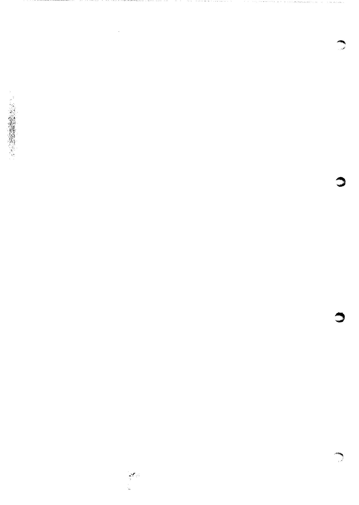

{106}------------------------------------------------

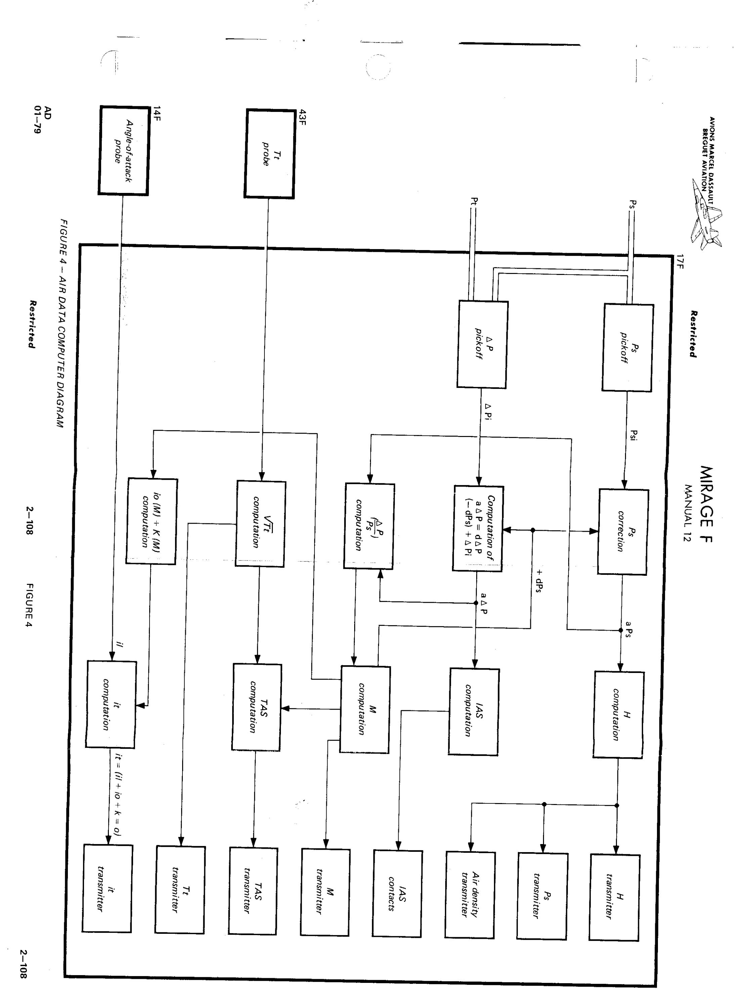

{107}------------------------------------------------

MANUAL 12

Motor B1 drives:

- the following repeater potentiometers :
  - H2, H3, H4, H5, H6
  - H fine 2
  - air density
  - Ps1, Ps2
- the servo system control potentiometer
- synchro-transmitters BCX1 and BCX2
- the altitude coder
- contact track AT H allowing channel testing to be controlled with a simulation of Ps = 227.3 mb corresponding to a computer H value of 11,000 meters.

Voltage sPs is also used to supply the electronic circuits controlling the relays associated with H > 8,400 m and H > 12,000 m contacts; voltage  $\epsilon$ Ps is fed to the H monitoring circuit (monitor).

#### 4 - DYNAMIC PRESSURE AND IAS CHANNEL (Figures 6 and 10)

#### A - Computation of $\Delta P$

The output voltage from the  $\Delta P$  pickoff depends on the raw dynamic pressure generated from data Pt and Ps collected by the pitot static system. This voltage is corrected for antenna error  $d\Delta P$  versus data M and Ps. Resulting information  $a\Delta P$  is used for computing the IAS and Mach number information.

#### B — Computation of IAS

Voltage  $a\Delta P$  is used to supply one end of resistor bridge R1-R2, the other end being supplied by the wiper of potentiometer  $\Delta Pn$  driver by the IAS servo system. Error signal  $\epsilon\Delta P$ , collected at the common point of R1-R2, supplies the electronic circuit controlling servo motor B2.

Motor B2 drives:

- repeater potentiometers IAS1 and IAS2,
- servo system control potentiometer ΔPn
- contact track AT IAS allowing channel testing to be controlled with a simulation of  $\Delta P = 426.8$  mb corresponding to a computed M value of 1.35 and to a computed IAS value of 890 km/h.

Voltage  $a\Delta P$  is also used to supply the electronic circuits controlling the relays associated with the various IAS contacts; voltage  $\epsilon\Delta P$  is fed to the IAS monitoring circuit (monitor).

#### 5 - MACH NUMBER CHANNEL (Figures 6 and 10)

The Mach number (M) is a function of  $\frac{\Delta P}{Ps}$  generated from the voltages corrected for antenna error, i.e. aPs (H channel) and  $a\Delta P$  ( $\Delta P$  channel).

Voltage aPs is inverted to obtain voltage cPs to which is added voltage  $d\Delta P$  available after IAS computation; this voltage is used to supply one end of the M servo system control potentiometer.

The other end of that potentiometer is fed with voltage  $a\Delta P$ , available after  $\Delta P$  computation, and the wiper, driven by the M servo system, supplies error signal  $\epsilon M$  used to supply the electronic circuit controlling servo motor B3.

1

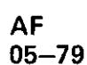

Restricted

2-109

{108}------------------------------------------------

A 8 

{109}------------------------------------------------

Motor B3 drives :

- the synchro-transmitter
- repeater potentiometers M1 and M2
- the potentiometer intended for TAS computation
- the potentiometer used for antenna correction computations (dps)
- potentiometers Mit1 and Mit2 used for true angle-of-attack computation
- the servo system control potentiometer
- contact track AT M allowing channel testing with a computed M value of 1.35.

Voltages  $a\Delta P$  and aPs are also used to supply the electronic circuits controlling the relays associated with the various Mach number contacts; voltage  $\epsilon M$  is fed to the M monitoring circuit (monitor).

#### 6 - TOTAL TEMPERATURE CHANNEL (Figures 7 and 10)

The total temperature results from the measurement of a voltage across the terminals of a resistor bridge consisting of fixed elements internal to the computer, and of an element varying as the temperature and which forms the Tt probe. The Tt probe is connected to the computer through a three-conductor circuit used to correct for the spurious resistance due to the probe-to-computer connection. The Tt information is generated in the form of  $\sqrt{Tt}$  and is used to supply the TAS channel control potentiometer and the electronic circuit controlling the relay which controls «Limit» warning light 11W through the Tt  $\geq$  135 °C contact (see manual 08-3).

#### 7 - TRUE AIRSPEED CHANNEL (Figures 7 and 10)

True airspeed TAS is generated from the  $\sqrt{\text{Tt}}$  data as computed above and from M, which is computed by the Mach number channel.

The TAS = f (M $\sqrt{\text{Tt}}$ ) function is performed by a potentiometer supplied with voltage  $\sqrt{\text{Tt}}$  and whose wiper is driven by the Mach number servo system. The signal collected by the potentiometer wiper is summed up with the TAS signal fed by the TAS potentiometer wiper and supplies the electronic circuit controlling servo motor B4.

#### Motor B4 drives:

- repeater potentiometers TAS1, TAS2, TAS3, TAS4 and TAS5
- the servo system control potentiometer
- contact track AT TAS allowing channel testing with a simulation of Tt = 22.7 °C corresponding to a computed TAS value of 771.6 kt.

#### 8 - TRUE ANGLE-OF-ATTACK CHANNEL (Figures 8 and 10)

The true angle of attack (it) is generated from the local angle of attack (it) provided by the angle-of-attack probe and including corrections io and K which vary as the Mach number.

The io (M) and K (M) functions are performed by potentiometers Mit1 and Mit2 whose wipers are driven by the Mach number channel servo system.

Synchro BCR1 receives at its rotor the il signal from the angle-of-attack probe. The rotor is driven by the it servo system. As slaving proceeds, the it servo system control potentiometer wiper gives the repeated angle-of-attack value. The signal from BCR1 is therefore the il signal offset by the repeated angle-of-attack value. This signal supplies one end of resistor bridge R3-R4 through the NC contact of the test relay. The other end of the bridge is supplied with the sum of the correction signals from Mit1 and Mit2 potentiometer wipers and with the repeated angle-of-attack.

AB 11-83

Restricted

2-109M

{110}------------------------------------------------

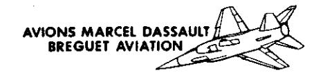

MIRAGE F

MANUAL 12

The  $\epsilon$ it error signal received at R3 and R4 common point is used to supply the electronic control circuit of servo-motor B5.

Motor B5 drives:

- synchro-resolvers BRX1 and BRX2 (set at 0° for + 5° of true angle of attack);
- it slave control potentiometer;
- it AT contact track which triggers the channel test with an it computed value of + 10°.

The  $\epsilon$ it error signal is also transmitted to the it monitoring circuit (monitor).

AE 01-79

Restricted

2-110

{111}------------------------------------------------

Coded altitude not used

-48C

{112}------------------------------------------------

2-112

48C

{113}------------------------------------------------

AF 10-79

and the second

2-113

FIGURE 7

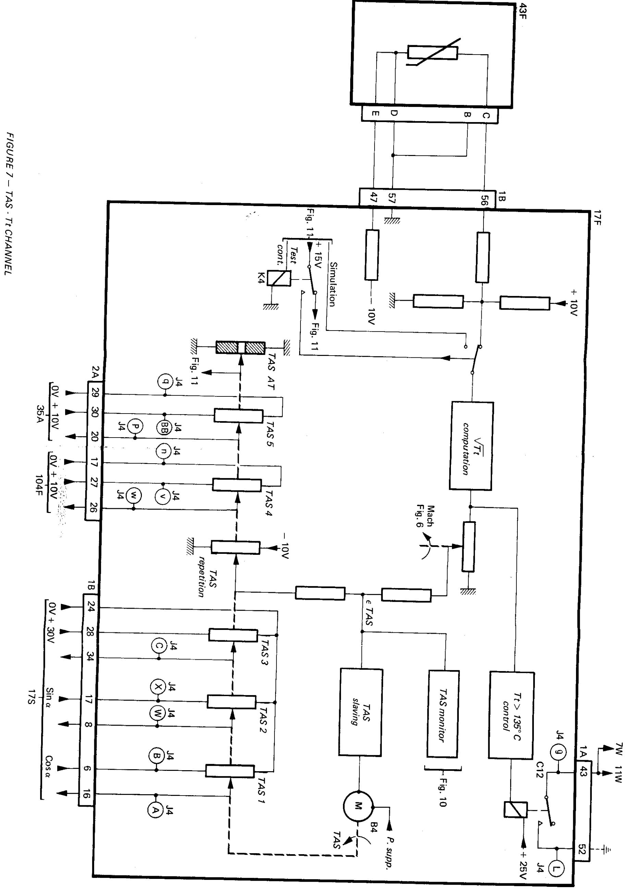

{114}------------------------------------------------

MIRAGE F

MANUAL 12

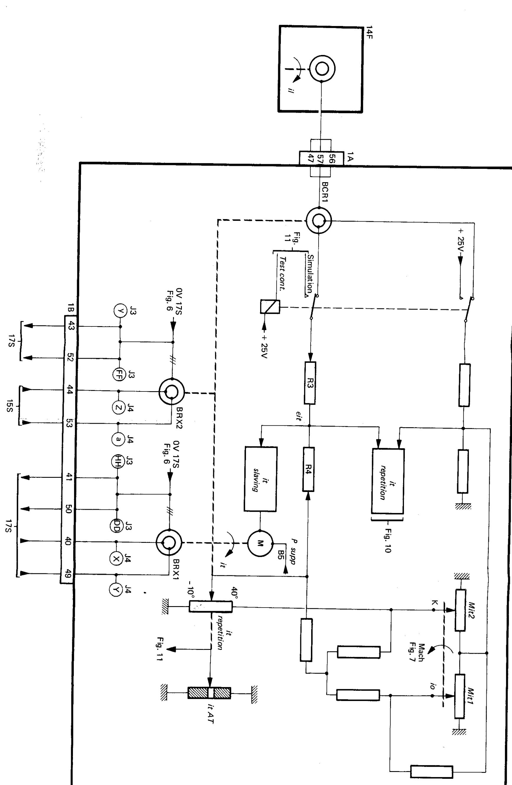

AF 01-79

Restricted

FIGURE 8 — ANGLE-OF-ATTACK CHANNEL

2-114

FIGURE 8

2-114

{115}------------------------------------------------

### POWER SUPPLIES (Figure 9)

The aircraft power system supplies the air data computer with:

- 115 V/400 Hz, phase A through AC system 1,
- filtered 26 V/400 Hz through 26 V AC transformer 126F.

The air data computer generates the following voltages from the 115 V/400 Hz supply :

- + and 5 V AC reference voltage for the monitoring devices
- + and 6 V rectified voltage for the servo motor control push-pull units
- + and 10 V reference voltage for the computing circuits
- + 15 V, 15 V and 15 V ground for the pressure pickoffs and amplifiers
- + 25 V and 25 V ground for the power supply of relays.

The 26 V/400 Hz voltage is used for the power supply of altitude synchro-transmitter BCX2.

{116}------------------------------------------------

{117}------------------------------------------------

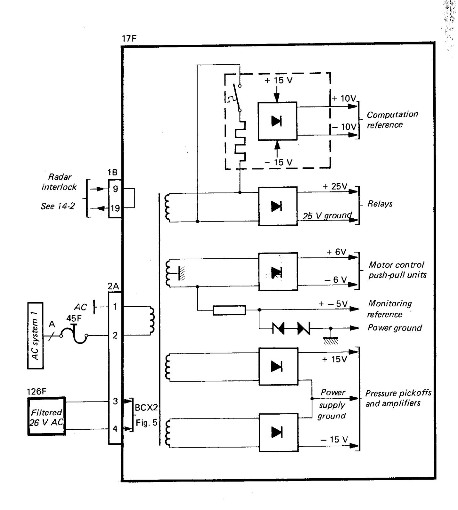

{118}------------------------------------------------

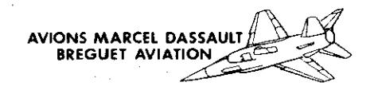

MIRAGE F

#### MONITORING AND TESTING

#### 1 - MONITORING (figure 10)

#### A - Principle

The servo systems repeating data H, IAS, M, TAS and it from the air data computer are monitored.

Each monitor analyses the error voltage of the monitored servo system and delivers a failure information when the error voltage exceeds a preset threshold for a period of time  $\Delta t$  (approx. 2 seconds for H, IAS, M and TAS channels, and approx. 0.3 second for it channel).

The failure of a servo system triggers:

- a master alarm
- an individual alarm corresponding to the monitored datum.

#### B - Operation

#### (1) Air data computer master alarm

The detection by a monitor of a failure affecting a servo system repeating H, IAS, M, TAS and it causes deenergization of relay K7 which then causes:

- the «ADC» light on failure warning panel 1W to come on
- the reliability signal intended for autopilot 39C to be cut off.
- (2) Individual alarms
- (a) Altitude coder output (figure symbol: 35)

The detection of a failure in the servo system repeating H causes deenergization of relays K1 and K2.

Relay K1 cuts off the coder common circuit

#### (b) Symbol generator box 35A

The detection of a failure in the servo systems repeating H, IAS, M and TAS causes deenergization of relays K1, K2, K3, K4 and K5 respectively.

Relays K1, K3, K4 and K5 cause the corresponding reliability signals intended for symbol generator box 35A to be cut off.

#### (c) Main computer 104F

Relays K2 and K5, deenergized by a failure in the servo systems repeating H and TAS respectively, cause the reliability signals intended for the main computer to be cut off.

#### (d) Roll/pitch output multiplier 38F

The detection of a failure in the servo systems repeating it or M causes deenergization of relay K6 which, in turn, causes the it reliability signal intended for the roll/pitch output multiplier to be cut off.

{119}------------------------------------------------

#### MANUAL 12

Restricted

#### (f) Flying aid amplifier 48C

The detection of a failure affecting the servo systems repeating H or M causes deenergization of relay K8 which, in turn, causes the H + M reliability signal intended for flying aid amplifier 48C to be cut off.

#### 2 - SELF-TEST (Figure 11)

The operation of the H, IAS, M, TAS and it servo systems is tested by switching the inputs of the Ps,  $\Delta P$ , Tt and il channels to reference voltages.

Depressing the test button causes relay K4 to be energized; this relay causes:

- the Ps,  $\Delta P$  and Tt channels to be electronically switched to simulation voltages,
- transistor Q1 to conduct, allowing relay K1 to be energized and to switch the it channel to the test voltage.

From the input simulations tabulated below, the computing channels determine the computed values also tabulated below:

| Simulated values                                                                   | Computed values                                              |
|------------------------------------------------------------------------------------|--------------------------------------------------------------|
| $P_{S} = 227 \text{ mb}$ $\Delta P = 427 \text{ mb}$ $T_{t} = 22.7^{\circ}C$ | H = 1,000 m M = 1.35 TAS = 1430 km/h IAS = 890 km/h |
| U ref.                                                                             | $it = +10^{\circ}$                                           |

The H, IAS, M, TAS and it computing channels each control the opening of the corresponding AT contact when the repeating servo system is correctly positioned. Contacts AT, which are connected in parallel, allow transistor Q2 to conduct and therefore relay K3 to be energized and the test light to come, only when they are all open.

The simulated Mach number can be read from shock-cone position indicator 38C when hydraulic system 1 is under pressure and when the shock-cones are in automatic operating mode.

The simulated altitude can be read from the head-up display (see brief check).

#### 3 - EXTERNAL TESTS (Figure 11)

The above self-test can be electrically controlled:

- by the main computer during navigation system testing,
- from connector J3 located on the front face of the air data computer. For this type of test, the result provided through the closing of one contact in relay K3 is available at test connector J3.

The Ps and  $\Delta P$  pressures and the total temperature can be simulated from test connector J5 located on the front face of the air data computer.

{120}------------------------------------------------

# 100 m

{121}------------------------------------------------

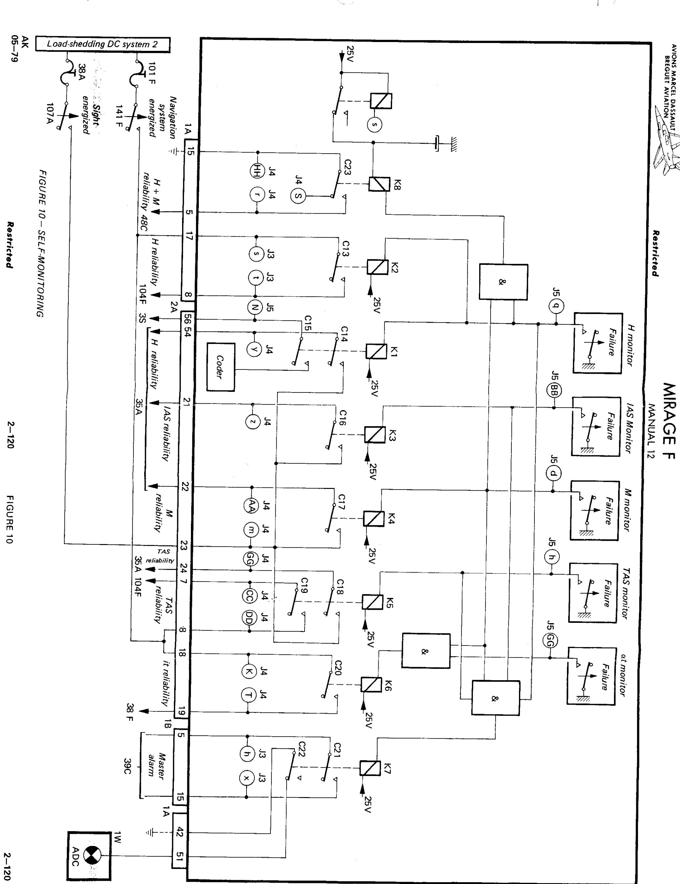

{122}------------------------------------------------

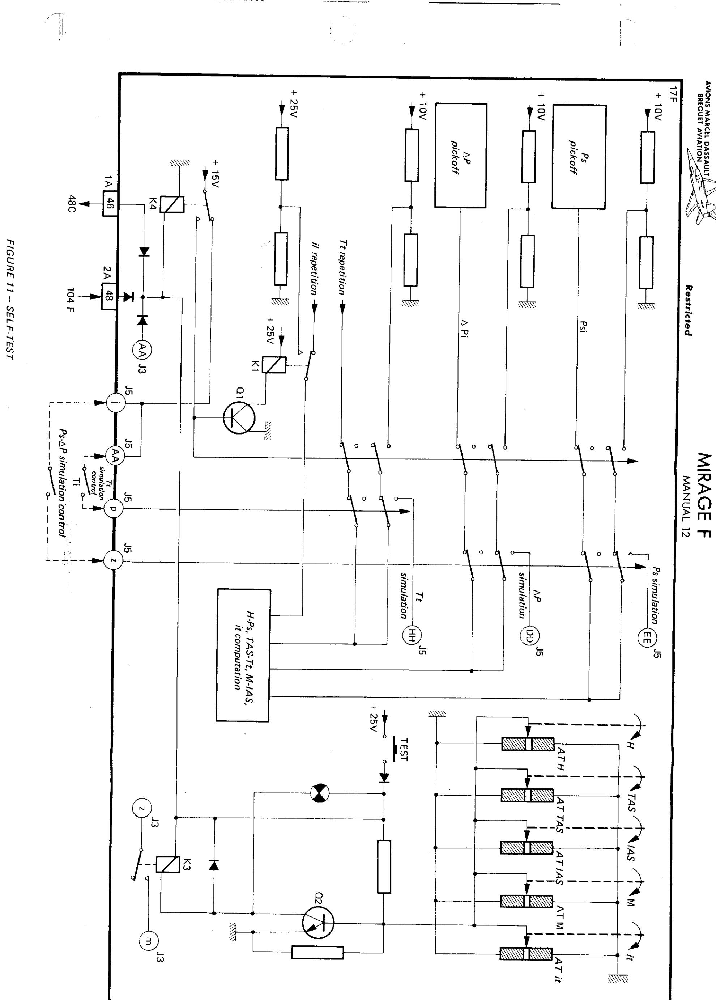

AG 05--79

Restricted

2-121

FIGURE 11

{123}------------------------------------------------

|                                                                | <del>T</del>                              |                                                                          | <del>-</del>                               |                                                         |                                                                                                                                                                                            |                                                 | <u> </u>                                                         |                                         |
|----------------------------------------------------------------|-------------------------------------------|--------------------------------------------------------------------------|--------------------------------------------|---------------------------------------------------------|--------------------------------------------------------------------------------------------------------------------------------------------------------------------------------------------|-------------------------------------------------|------------------------------------------------------------------|-----------------------------------------|
| Alarms                                                         | <del>≓</del> :                            | T t                                                           | TAS                                        | 3                                                       | ΔΡ                                                                                                                                                                                         | Ps                                              | Ι                                                                |                                         |
| 1 contact C15* : H reliability Coder common              |                                           |                                                                          |                                            |                                                         |                                                                                                                                                                                            |                                                 | ICAO coder                                                       | Symbol 3S (altitude coder output) |
|                                                                | 2 synchro- transmitters BRX1 - BRX2 |                                                                          | 1 linear pot. TAS1* 1 linear pot. TAS2* |                                                         | 1 linear pot. ΔP1 for M < 1.1 and M > 1.5                                                                                                                                            | 1 linear pot. Ps2 for M < 1.1 and M < 1.5 | 1 linear pot. H4* 1 contact C2*: H > 12,000 m 1 air density pot. | Radar                                   |
| 4 contacts * : C 14 H - C16 IAS C17 M - C18 TAS          |                                           |                                                                          | 1 linear pot. TAS5*                        | 1 linear pot. M2*                                       | 1 linear pot. IAS2*                                                                                                                                                                        |                                                 | 1 linear pot. H5* 1 pot. H fine 2*                            | Symbol generator box 35A                |
|                                                                |                                           |                                                                          |                                            |                                                         |                                                                                                                                                                                            |                                                 | 1 linear pot. H2*                                                | Harmonization unit 5Y             |
| 1 contact C21* : master alarm                               |                                           |                                                                          |                                            | 1 linear pot.M1* 2 contacts*: C10 M > 0.96 C11 M > 1.07 |                                                                                                                                                                                            | 1 linear pot. Ps1*                              |                                                                  | Autopilot 39C                           |
|                                                                |                                           |                                                                          |                                            | 1 synchro-trans- mitter BCX1*                        |                                                                                                                                                                                            |                                                 | 1 synchro- transmitter BCX1 (H coarse)                  | Flying aids amplifier 48C         |
| 1 contact C19* : TAS 1 contact C13* : H                     |                                           |                                                                          | 1 linear pot. TAS4*                        |                                                         |                                                                                                                                                                                            |                                                 | 1 pot. H6 coarse 1 synchro- transmitter BCX2 * H fine   | Main computer 104F                |
|                                                                |                                           |                                                                          |                                            | 1 contact C9* M > 1.4                                | 1 contact C7 : IAS < 470 km/h                                                                                                                                                           |                                                 | 1 contact C1* : H > 8 400 m                                   | Engine                                  |
| 1 contact C22 : master alarm → «ADC» warning light of 1W |                                           | 1 contact C12*: Tt > 135°C → warning horn 7W and limit warning light 11W |                                            |                                                         | 5 IAS contacts: C3* IAS 685 km/h → 170∆ C4* IAS < 400 km/h → (U/C) C5* IAS > 415 km/h → (flaps) C6* IAS > 445 km/h → (U/C) C8 IAS < 815 km/h → (slats) 1 linear pot. IAS1* Flap servo unit |                                                 |                                                                  | Aircraft                                |

\* Information tested at air data computer test connectors

FIGURE 12 - AIR DATA DISTRIBUTION

FIGURE 12

{124}------------------------------------------------

MIRAGE F

#### TROUBLE SHOOTING IN AIR DATA SYSTEM

#### 1 - SCOPE

This operation is intended to locate a failed component, using the aircraft equipment.

For any symptom reported by the pilot, the mechanic shall confirm the trouble (brief check) by attempting to restore flight conditions:

A — If the symptoms reported by the pilot cannot be reproduced, use the SDAP (See 10-1) complying with the programme specified in the following charts.

B — If the symptoms reported by the pilot are reproduced, follow the procedure described in the following charts.

#### 2 - TROUBLE SHOOTING PROCEDURE

The trouble shooting procedure is described in the following charts.

NOTE: In the case where the SDAP is to be used for detecting a trouble, the applicable programme number is specified in the charts (See 10-1 for preparation and operating procedure).

{125}------------------------------------------------

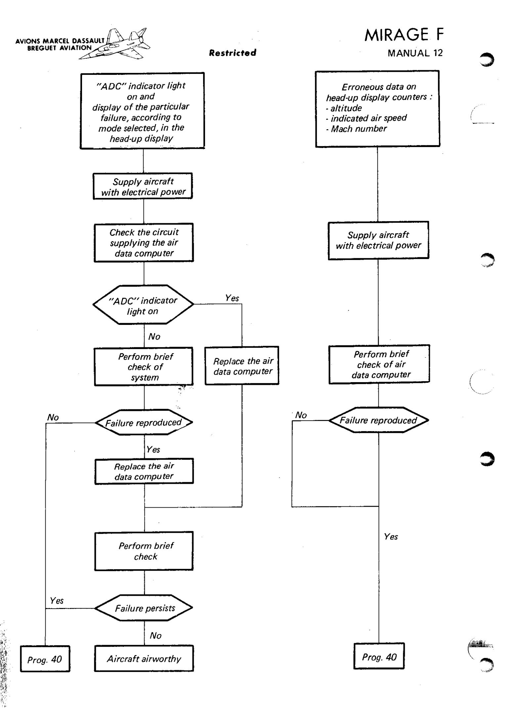

{126}------------------------------------------------

Page

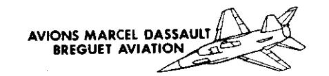

#### Restricted

#### **SECTION 3**

#### ATTITUDE AND HEADING SYSTEM

#### TABLE OF CONTENTS

| 3-0                    | GENERAL                                                                                                     |                                           |
|------------------------|-------------------------------------------------------------------------------------------------------------|-------------------------------------------|
|                        | - Principle of attitude and heading system                                                                  | 3-001                                     |
| 3-1                    | DESCRIPTION - OPERATION                                                                                     |                                           |
|                        | - Table of components                                                                                       | 3-101 3-111 3-116 3-121 3-125 |
|                        | LIST OF ILLUSTRATIONS                                                                                       |                                           |
| Figu                   | ure No.                                                                                                     | Page                                      |
| 1 2 3 3P 4 | SCHEMATIC DIAGRAM OF ATTITUDE AND HEADING SYSTEM GENERAL LAYOUT LAYOUT IN COCKPIT CONDITIONING ROLL CHANNEL | 3-002 3-109 3-110 3-112 3-114 |
| 5 6 7 8       | PITCH CHANNEL  NORMAL HEADING CHANNEL  EMERGENCY HEADING CHANNEL  POWER SUPPLIES                            | 3-115 3-120 3-123 3-125P         |
| 9 10                | MONITORING                                                                                                  | 3-126 3-128                            |

{127}------------------------------------------------

1000年間の日本の日本の日本の日本の日本の日本の日本の日本の日本の日本の日本の日本の日本の

{128}------------------------------------------------

MIRAGE F

MANUAL 12

### PRINCIPLE OF ATTITUDE AND HEADING SYSTEM (Figure 1)

The attitude and heading system, which is incorporated in the DICS (Doppler radar/Inertial unit Combined System) dealt with in 12-6, supplies this system and several other associated systems with vertical reference (roll and pitch) and heading information.

The system includes a vertical reference channel and two heading channels (normal and emergency heading channels).

The vertical reference channel is composed of the following:

- one sensing component : gyro/accelerometer platform 35F (vertical reference gyro)
- one interface electronics box 145F
- one roll/pitch output multiplier 38F
- display components : spherical indicator 28F, head-up display 34A.

The aircraft attitude, sensed by the gyro/accelerometer platform in analog form, is distributed in this form and in the following manner to display components and associated systems :

- directly by the platform to spherical indicator 28F and autopilot 39C
- through the interface electronics box to symbol generator box 35A for head-up display 34A
- through the interface electronics box and the roll/pitch output multiplier to the radar.

The aircraft attitude is also distributed in digital form by the interface electronics box to main computer 104F.

The normal heading channel is composed of the following:

- two sensing components : gyro/accelerometer platform 35F (directional gyro) and flux valve
  - one generating component: interface electronics box 145F
  - display components: spherical indicator 28F, navigation indicator 68F, head-up display 34A.

The interface electronics box receives, in analog form, a directional heading from the gyro/accelerometer platform, and a magnetic heading from the flux valve. With these two data, the interface electronics box generates a gyromagnetic heading (GMH) which it distributes in analog form to the various display components and to all associated systems. The gyromagnetic heading is also distributed in digital form to main computer 104F.

The emergency heading channel is composed of the following:

- one sensing component: flux valve 75F
- one sensing and generating component: emergency gyromagnetic compass 30F
- one transmitting component : interface electronics box 145F
- display components: spherical indicator 28F, navigation indicator 68F, head-up display 34A.

The flux valve monitors the emergency gyromagnetic compass which generates an emergency gyromagnetic heading (EGMH) in analog form which is distributed to all associated systems by the interface electronics box (including main computer 104F).

Figure 1 shows the distribution of roll, pitch and heading data to the various associated systems.

{129}------------------------------------------------

.d では、 一大学の大学の大学の大学の大学の大学の大学の大学の大学の大学の大学の大学の大学の大

{130}------------------------------------------------

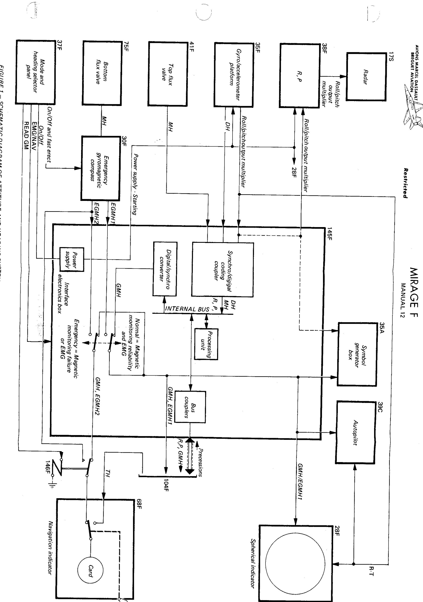

FIGURE 1 — SCHEMATIC DIAGRAM OF ATTITUDE AND HEADING SYSTEM

Restricted

AP 08-79

FIGURE 1

3-002

3-002

{131}------------------------------------------------

MANUAL 12

#### TABLE OF COMPONENTS

For layout, see figures 2 and 3

| Item | Name - Characteristics and Functions                                                                                                                                                                                                   | Location Access Door No. | Do S | 0C |
|------|----------------------------------------------------------------------------------------------------------------------------------------------------------------------------------------------------------------------------------------|-----------------------------|---------|----|
| 34A  | HEAD-UP DISPLAY (See 14-3)                                                                                                                                                                                                          |                             |         |    |
|      | Displays:  - the aircraft roll and pitch attitudes through the horizon reticle,  - the aircraft heading (MH, GMH, EGMH) in low position for the approach mode and in high position for all the other modes, through the heading scale. |                             |         |    |
| 35A  | SYMBOL GENERATOR BOX (See 14-3)                                                                                                                                                                                                        |                             |         |    |
|      | Receives and codes the roll and pitch data fed by interface electronics box 145F.                                                                                                                                                      |                             | :       |    |
| 39C  | AUTOPILOT (See 13-2)                                                                                                                                                                                                                |                             |         |    |
| 9F   | NAVIGATION CONTROL PANEL (See 12-6)                                                                                                                                                                                                    |                             |         |    |
|      | Supports the operating mode indicator lights associated with the attitude and heading system.                                                                                                                                          |                             |         |    |
| 24F  | AC SYSTEM 1 26 V TRANSFORMER (See 10-2)                                                                                                                                                                                             |                             |         |    |
| 26F  | AC SYSTEM 2 26 V TRANSFORMER (See 10-2).                                                                                                                                                                                               |                             |         |    |
|      |                                                                                                                                                                                                                                        |                             |         |    |
|      |                                                                                                                                                                                                                                        |                             |         |    |
|      |                                                                                                                                                                                                                                        |                             |         |    |

{132}------------------------------------------------

### MIRAGE F

MANUAL 12

| Item | Name-Characteristics and Functions                                                                                                                                                                                                                                                                                                                                                                                                                                                                                                                                                             | Location Access Door No. | i    | ос |
|------|------------------------------------------------------------------------------------------------------------------------------------------------------------------------------------------------------------------------------------------------------------------------------------------------------------------------------------------------------------------------------------------------------------------------------------------------------------------------------------------------------------------------------------------------------------------------------------------------|-----------------------------|------|----|
| 28F  | Name-Characteristics and Functions  SPHERICAL INDICATOR  Repeats and displays: -aircraft attitude detected and transmitted by gyro/accelerometer platform 35F, -normal or emergency gyromagnetic heading supplied by interface electronics box 145F, -navigation data (see 12-4 and 12-5).  The front panel carries: Display and monitoring components: -roll index 1 moving in front of scale 2, -bicolored sphere 3 (black earth) displaying vertical reference (roll/pitch) and heading, -aircraft symbol 4 representing aircraft in front of sphere, -alarm flag 5, -sideslip indicator 6. |                             | ļ —— |    |
|      |                                                                                                                                                                                                                                                                                                                                                                                                                                                                                                                                                                                                |                             |      |    |

Restricted

{133}------------------------------------------------

| Item | Name - Characteristics and Functions                                                                                                                                                                                                                                                                                                                                                                                                                                                                                                                                                                                                                                                                                                                                                                                                                                                                                                                                                                                                                                                                                                                                                                                                                                                                                                                                                                                                                                                                                                                                                                                                                                                                                                                                                                                                                                                                                                                                                                                                                                                                                           | Location Access Door No. | Do S | c. |
|------|--------------------------------------------------------------------------------------------------------------------------------------------------------------------------------------------------------------------------------------------------------------------------------------------------------------------------------------------------------------------------------------------------------------------------------------------------------------------------------------------------------------------------------------------------------------------------------------------------------------------------------------------------------------------------------------------------------------------------------------------------------------------------------------------------------------------------------------------------------------------------------------------------------------------------------------------------------------------------------------------------------------------------------------------------------------------------------------------------------------------------------------------------------------------------------------------------------------------------------------------------------------------------------------------------------------------------------------------------------------------------------------------------------------------------------------------------------------------------------------------------------------------------------------------------------------------------------------------------------------------------------------------------------------------------------------------------------------------------------------------------------------------------------------------------------------------------------------------------------------------------------------------------------------------------------------------------------------------------------------------------------------------------------------------------------------------------------------------------------------------------------|-----------------------------|---------|----|
|      | One control component: - «N/P» control knob 7 for pole setting (turn) and test (push). «N»: normal «P»: pole setting preventing use of indicator in heading and vertical reference modes.                                                                                                                                                                                                                                                                                                                                                                                                                                                                                                                                                                                                                                                                                                                                                                                                                                                                                                                                                                                                                                                                                                                                                                                                                                                                                                                                                                                                                                                                                                                                                                                                                                                                                                                                                                                                                                                                                                                                      |                             |         |    |
|      | Test Keeping control knob 7 depressed in «N» position allows to check for correct operation of: - the sphere (approx. 15-degree offsetting in roll, pitch and heading), - the crossed pointers (centering), - «MARKER» light (lighting-up).                                                                                                                                                                                                                                                                                                                                                                                                                                                                                                                                                                                                                                                                                                                                                                                                                                                                                                                                                                                                                                                                                                                                                                                                                                                                                                                                                                                                                                                                                                                                                                                                                                                                                                                                                                                                                                                                                    |                             |         |    |
|      | Monitoring Failure of power supply or of one of the vertical reference servo channels (roll or pitch) causes alarm flag 5 to appear.                                                                                                                                                                                                                                                                                                                                                                                                                                                                                                                                                                                                                                                                                                                                                                                                                                                                                                                                                                                                                                                                                                                                                                                                                                                                                                                                                                                                                                                                                                                                                                                                                                                                                                                                                                                                                                                                                                                                                                                           |                             |         |    |
|      | Lighting (see 08-2).                                                                                                                                                                                                                                                                                                                                                                                                                                                                                                                                                                                                                                                                                                                                                                                                                                                                                                                                                                                                                                                                                                                                                                                                                                                                                                                                                                                                                                                                                                                                                                                                                                                                                                                                                                                                                                                                                                                                                                                                                                                                                                           |                             |         |    |
|      |                                                                                                                                                                                                                                                                                                                                                                                                                                                                                                                                                                                                                                                                                                                                                                                                                                                                                                                                                                                                                                                                                                                                                                                                                                                                                                                                                                                                                                                                                                                                                                                                                                                                                                                                                                                                                                                                                                                                                                                                                                                                                                                                |                             |         |    |
|      |                                                                                                                                                                                                                                                                                                                                                                                                                                                                                                                                                                                                                                                                                                                                                                                                                                                                                                                                                                                                                                                                                                                                                                                                                                                                                                                                                                                                                                                                                                                                                                                                                                                                                                                                                                                                                                                                                                                                                                                                                                                                                                                                |                             |         |    |
|      |                                                                                                                                                                                                                                                                                                                                                                                                                                                                                                                                                                                                                                                                                                                                                                                                                                                                                                                                                                                                                                                                                                                                                                                                                                                                                                                                                                                                                                                                                                                                                                                                                                                                                                                                                                                                                                                                                                                                                                                                                                                                                                                                |                             |         |    |
|      |                                                                                                                                                                                                                                                                                                                                                                                                                                                                                                                                                                                                                                                                                                                                                                                                                                                                                                                                                                                                                                                                                                                                                                                                                                                                                                                                                                                                                                                                                                                                                                                                                                                                                                                                                                                                                                                                                                                                                                                                                                                                                                                                |                             |         |    |
|      |                                                                                                                                                                                                                                                                                                                                                                                                                                                                                                                                                                                                                                                                                                                                                                                                                                                                                                                                                                                                                                                                                                                                                                                                                                                                                                                                                                                                                                                                                                                                                                                                                                                                                                                                                                                                                                                                                                                                                                                                                                                                                                                                |                             |         |    |
|      |                                                                                                                                                                                                                                                                                                                                                                                                                                                                                                                                                                                                                                                                                                                                                                                                                                                                                                                                                                                                                                                                                                                                                                                                                                                                                                                                                                                                                                                                                                                                                                                                                                                                                                                                                                                                                                                                                                                                                                                                                                                                                                                                |                             |         |    |
|      |                                                                                                                                                                                                                                                                                                                                                                                                                                                                                                                                                                                                                                                                                                                                                                                                                                                                                                                                                                                                                                                                                                                                                                                                                                                                                                                                                                                                                                                                                                                                                                                                                                                                                                                                                                                                                                                                                                                                                                                                                                                                                                                                |                             |         |    |
|      | in the second second second second second second second second second second second second second second second second second second second second second second second second second second second second second second second second second second second second second second second second second second second second second second second second second second second second second second second second second second second second second second second second second second second second second second second second second second second second second second second second second second second second second second second second second second second second second second second second second second second second second second second second second second second second second second second second second second second second second second second second second second second second second second second second second second second second second second second second second second second second second second second second second second second second second second second second second second second second second second second second second second second second second second second second second second second second second second second second second second second second second second second second second second second second second second second second second second second second second second second second second second second second second second second second second second second second second second second second second second second second second second second second second second second second second second second second second second second second second second second second second second second second second second second second second second second second second second second second second second second second second second second second second second second second second second second second second second second second second second second second second second second second second second second second second second second se |                             |         |    |

{134}------------------------------------------------

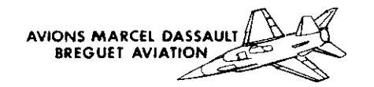

### MIRAGE F

|      |                                                                                                                                                                                                                                                                                                                                                                                                                                                                                                                                                     |                             |   | oc. |
|------|-----------------------------------------------------------------------------------------------------------------------------------------------------------------------------------------------------------------------------------------------------------------------------------------------------------------------------------------------------------------------------------------------------------------------------------------------------------------------------------------------------------------------------------------------------|-----------------------------|---|-----|
| Item | Name - Characteristics and Functions                                                                                                                                                                                                                                                                                                                                                                                                                                                                                                                | Location Access Door No. | S |     |
| 30F  | Generates and furnishes to interface electronics box 145F and EGMH display relay 146F an emergency gyromagnetic heading from a directional gyro slaved to a magnetic heading provided by flux valve 75F.  The front panel carries:  - one latitude setting potentiometer 1,  - two «N-S» and «E-W» potentiometers 2 for semi-circular compensation setting,  - one test connector 3.  Fast heading alignment rate: 70°/min.  Magnetic monitoring rate: 2°/min.  Gyro rotor spinning-up time: 10 s  Delivered gyromagnetic heading accuracy: ~ ± 1°. | Equipment bay 13-00   | × |     |
| 31F  | GYRO SYSTEM POWER SUPPLY FUSE-BREAKER  Protects DC system 2 of : - spherical indicator 28F - roll/pitch output multiplier 38F - navigation indicator 68F - interface electronics box 145F.                                                                                                                                                                                                                                                                                                                                                          | Electrical master box    | X |     |
| 32F  | GYRO CENTER FUSE-BREAKER  Protects phases A, B and C of AC system 1 of interface electronics box 145F.                                                                                                                                                                                                                                                                                                                                                                                                                                              | Electrical master box    | × |     |

{135}------------------------------------------------

|      |                                                                                                                                                                                                                                                                                                                                                                                                                                                                                                                                                                                                                                                                                                                                                                                                                                                                                                                                                                                                                                                                           |                             | ANUA    | _   _ |
|------|---------------------------------------------------------------------------------------------------------------------------------------------------------------------------------------------------------------------------------------------------------------------------------------------------------------------------------------------------------------------------------------------------------------------------------------------------------------------------------------------------------------------------------------------------------------------------------------------------------------------------------------------------------------------------------------------------------------------------------------------------------------------------------------------------------------------------------------------------------------------------------------------------------------------------------------------------------------------------------------------------------------------------------------------------------------------------|-----------------------------|---------|-------|
| ltem | Name - Characteristics and Functions                                                                                                                                                                                                                                                                                                                                                                                                                                                                                                                                                                                                                                                                                                                                                                                                                                                                                                                                                                                                                                      | Location Access Door No. | Do S | c.    |
| 33F  | EMERGENCY GYROMAGNETIC COMPASS FUSE  Protects phase A of emergency AC system, channel 1, of emergency gyromagnetic compass 30F.                                                                                                                                                                                                                                                                                                                                                                                                                                                                                                                                                                                                                                                                                                                                                                                                                                                                                                                                           | Electrical master box    | ×       |       |
| 34F  | ROLL/PITCH OUTPUT MULTIPLIER FUSE-BREAKER Protects phase A of AC system 1 of roll/pitch output multiplier 38F.                                                                                                                                                                                                                                                                                                                                                                                                                                                                                                                                                                                                                                                                                                                                                                                                                                                                                                                                                            | Electrical master box    | x       |       |
| 35F  | Detects aircraft attitude and generates any directional heading.  It is composed of:  one vertical reference gyro with two degrees of freedom, slaved to the Earth's vertical reference through mercury levelling switches,  one directional gyro keeping any constant directional heading and signalling any instantaneous airCraft heading variation,  one heating and ventilating system maintaining 50 ± 2°C temperature inside the platform.  Performance characteristics:  the characteristics of the information usable after 2-min operation are as follows:  Roll and pitch vertical reference accuracy: ± 0.5° around zero ± 1.5° for R or P ≥ 30°. \nprecession rate of the directional gyro during flat turns is ± 12°/h, gyro rotor spinning rate is 24,000 rpm, gyro rotor spinning-down time is 10 min.  Attachment:  The platform is set 5° nose-down in relation to the FRL. It is attached to a mount which is harmonized at three places (one self-aligning bearing and two screws).  NOTE: The platform is paired with the interface electronics box. | Equipment bay 13-00         | X       |       |

{136}------------------------------------------------

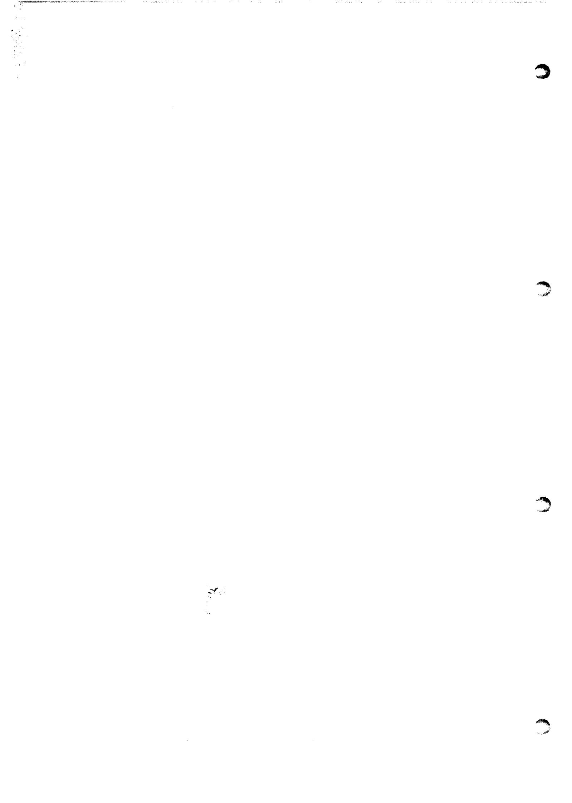

{137}------------------------------------------------

| Item | Name - Characteristics and Functions                                                                                                                                                                                                                                                                                                                                                                                                                                                                     | Location                            | Do       | c. |
|------|----------------------------------------------------------------------------------------------------------------------------------------------------------------------------------------------------------------------------------------------------------------------------------------------------------------------------------------------------------------------------------------------------------------------------------------------------------------------------------------------------------|-------------------------------------|----------|----|
|      |                                                                                                                                                                                                                                                                                                                                                                                                                                                                                                          | Access Door No.                     | <u>s</u> | _  |
| 36F  | NAVIGATION CONTROL FUSE-BREAKER  Protects the circuit breaker bar of the mode and heading selector panel.                                                                                                                                                                                                                                                                                                                                                                                                | Circuit breaker box (cockpit) | X        |    |
| 37F  | MODE AND HEADING SELECTOR PANEL  Permits: - control of navigation system (see 12-6),                                                                                                                                                                                                                                                                                                                                                                                                                     | Cockpit (RH console)             | x        |    |
|      | - control of attitude and heading system. In addition to controlling certain items of equipment of the navigation system, rotary selector switch 1 provides for the following:  «ST-BY» Starting of conditioning circuit associated with gyro/accelerometer platform 35F.  «ALN TRF» Starting of interface electronics box 145F, «ALN STR» platform 35F, roll/pitch output multi- «NAV» plier 38F and spherical indicator 28F; these positions also maintain the conditioning circuit of the platform in |                                     |          |    |
|      | operating condition.  «EMG» Emergency control of interface electronics box 145F, in addition to above-mentioned functions.  «TEST» Same functions as above (interface electronics box set to «normal» position).                                                                                                                                                                                                                                                                                         |                                     |          |    |
|      | NOTE: Rotary selector switch 1 is provided with three mechanical locking devices preventing the switch from being rotated from:  «OFF» to «TEST»  «ST-BY» to «OFF»  «NAV» to «EMG».  To switch the control knob from one of these positions to another, it is necessary to pull the knob before rotating it.                                                                                                                                                                                             |                                     |          |    |
|      | When set to «ON», «EMG GYRO» switch 2 controls the starting of emergency gyromagnetic compass 30F.  Switch 3 provides for the following:  - in «ERECT» position: fast erection of emergency gyromagnetic compass 30F,  - in «READ GM» position: control of relay 146F selecting the emergency gyromagnetic heading for the compass card of navigation indicator 68F.                                                                                                                                     |                                     |          |    |
|      | Lighting (see 08-2).                                                                                                                                                                                                                                                                                                                                                                                                                                                                                     |                                     |          |    |
|      |                                                                                                                                                                                                                                                                                                                                                                                                                                                                                                          |                                     |          |    |

{138}------------------------------------------------

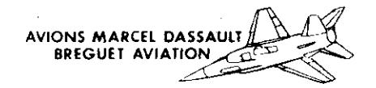

### MIRAGE F

|      |                                                                                                                                                                                                                                                                                                                                                              | <del> </del>                | יט ט | oc. |
|------|--------------------------------------------------------------------------------------------------------------------------------------------------------------------------------------------------------------------------------------------------------------------------------------------------------------------------------------------------------------|-----------------------------|---------|-----|
| ltem | Name - Charactéristics and Functions                                                                                                                                                                                                                                                                                                                         | Location Access Door No. | S       | J., |
| 38F  | ROLL/PITCH OUTPUT MULTIPLIER  Receives the roll and pitch data generated by gyro/ accelerometer platform 35F through interface electronics box 145F. Repeats these data for the radar.                                                                                                                                                                       | Equipment bay 13-00   | ×       |     |
|      | Monitoring The roll/pitch output multiplier monitors the repetition of roll and pitch data and the + and — 15 V power supply voltages. When operation is correct, the roll/pitch outpout multiplier transmits the vertical reference reliability signal fed by interface electronics box 145F to test connector 40Z (normal operation).                      |                             |         |     |
| 41F  | TOP FLUX VALVE  Detects and delivers the magnetic heading to interface electronics box 145F for generation of normal gyromagnetic heading (GMH).  It is supplied with 23.5 V/400 Hz by interface electronics box 145F.  Attachment Elongated holes in the mounting plate permit the flux valve to be positioned within ± 10° about the aircraft lubber line. | Fin D2-32                | X       |     |
|      |                                                                                                                                                                                                                                                                                                                                                              |                             |         |     |
|      |                                                                                                                                                                                                                                                                                                                                                              |                             |         |     |
|      |                                                                                                                                                                                                                                                                                                                                                              |                             |         |     |

{139}------------------------------------------------

|      | Restricted                                                                                                                                                                                                                                                                                                                                                                                                    | M                           | ANU            | AL 1 |
|------|---------------------------------------------------------------------------------------------------------------------------------------------------------------------------------------------------------------------------------------------------------------------------------------------------------------------------------------------------------------------------------------------------------------|-----------------------------|----------------|------|
| Item | Name - Characteristics and Functions                                                                                                                                                                                                                                                                                                                                                                          | Location Access Door No. | D i | oc.  |
| 62F  | NAVIGATION INDICATOR FUSE (See 12-6)                                                                                                                                                                                                                                                                                                                                                                       |                             |                |      |
| 68F  | NAVIGATION INDICATOR (See 12-6)                                                                                                                                                                                                                                                                                                                                                                            |                             |                |      |
|      | Displays the following on compass card 1, depending on the position of selector 2: - gyromagnetic or emergency gyromagnetic heading fed by interface electronics box 145F (selector 2 on pointer), - true heading fed by main computer 104F (selector 2 on dot).  The appearance of flag 3 indicates either a heading system failure (external equipment) or an indicator failure (heading repeating system). |                             |                |      |
| 73F  | EMERGENCY GYROMAGNETIC COMPASS CONTROL FUSE-BREAKER                                                                                                                                                                                                                                                                                                                                                        | Electrical master box    | ×              |      |
|      | Protects DC system 1 of mode and heading selector panel 37F, emergency gyromagnetic compass 30F and navigation power supply relay 141F.                                                                                                                                                                                                                                                                       |                             | ; ; ;    |      |
| 75F  | BOTTOM FLUX VALVE                                                                                                                                                                                                                                                                                                                                                                                             | Fin D1-33                   | х              |      |
|      | Detects and delivers the magnetic heading to emergency gyromagnetic compass 30F for generation of emergency gyromagnetic heading.  It is supplied with 23.5 V/400 Hz by emergency gyromagnetic compass 30F.  Attachment similar to 41F.                                                                                                                                                                       |                             |                |      |
| 104F | MAIN COMPUTER (See 10-5)                                                                                                                                                                                                                                                                                                                                                                                   |                             |                |      |
| 126F | FILTERED 26 V AC TRANSFORMER (See 10-2)                                                                                                                                                                                                                                                                                                                                                                    |                             |                |      |
| 141F | NAVIGATION POWER SUPPLY RELAY (See 12-6)                                                                                                                                                                                                                                                                                                                                                                   |                             | :              |      |
|      | When energized (position controlled either by the «EMG GYRO» switch or by the rotary selector switch of the mode and heading selector panel in any position other than the «OFF» position), it supplies navigation indicator 68F with 26 V and 115 V/400 Hz.                                                                                                                                                  |                             |                |      |
|      |                                                                                                                                                                                                                                                                                                                                                                                                               |                             |                |      |

{140}------------------------------------------------

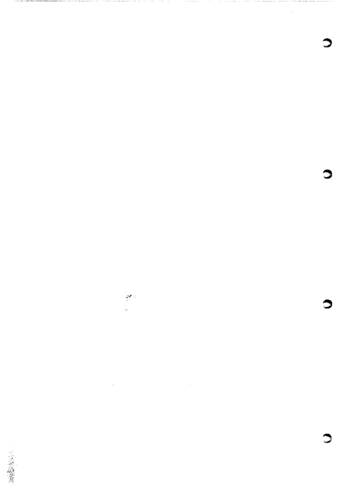

{141}------------------------------------------------

|      | T                                                                                                                                                                                                                                                                                                                                                                                                                                                                                                                                                                                                                                                                                                                                                                                                                                                                                                                                                                                                                                                                                                                                                                                                                                                                                                                                                                                |                          | Do | c. |
|------|----------------------------------------------------------------------------------------------------------------------------------------------------------------------------------------------------------------------------------------------------------------------------------------------------------------------------------------------------------------------------------------------------------------------------------------------------------------------------------------------------------------------------------------------------------------------------------------------------------------------------------------------------------------------------------------------------------------------------------------------------------------------------------------------------------------------------------------------------------------------------------------------------------------------------------------------------------------------------------------------------------------------------------------------------------------------------------------------------------------------------------------------------------------------------------------------------------------------------------------------------------------------------------------------------------------------------------------------------------------------------------|--------------------------|----|----|
| Item | Name - Characteristics and Functions                                                                                                                                                                                                                                                                                                                                                                                                                                                                                                                                                                                                                                                                                                                                                                                                                                                                                                                                                                                                                                                                                                                                                                                                                                                                                                                                             | Location Access Door No. | S  |    |
| 142F | SPHERICAL INDICATOR FUSE-BREAKER  Protects phase A of AC system 1 of mode and heading selector panel 37F and spherical indicator 28F.                                                                                                                                                                                                                                                                                                                                                                                                                                                                                                                                                                                                                                                                                                                                                                                                                                                                                                                                                                                                                                                                                                                                                                                                                                            | Electrical master box | ×  |    |
| 145F | Contains most of the electronic components ensuring a correct operation of the gyro/accelerometer platform.  Generates all power supply voltages required for platform operation and provides time delays for platform starting.  Converts and codes the signals fed by platform accelerometers and transmits these signals to the main computer through the digibus link.  In normal operation (Doppler radar/Inertial unit operation), receives the vertical reference correction coded signals fed by the main computer, decodes and converts these signals into control voltages which it transmits to the torque motors of the platform vertical reference gyro.  Transmits the vertical reference data (roll and pitch) in analog form to all associated systems, except the spherical indicator which receives them directly from the platform; these data are transmitted in digital form to the main computer through the digibus link.  Generates the gyromagnetic heading from the directional heading fed by the platform, and from the magnetic heading fed by flux valve 41F.  Distributes the gyromagnetic heading in analog form to all associated systems, including the main computer which also receives this data in digital form through the digibus link.  Monitors all the above data and delivers reliability signals to the various associated systems. | Equipment bay 13-00      |    |    |

{142}------------------------------------------------

1000年間の大学の大学の大学の大学の大学の大学の大学の大学の大学の大学の大学の大学の大学の

{143}------------------------------------------------

### MIRAGE F

| ltem | Name - Characteristics and Functions                                                                                                                                                                                                                                                                                                                                                                                                                                                                                                                                                                                                         | Location Access Door No.              | S | c. |
|------|----------------------------------------------------------------------------------------------------------------------------------------------------------------------------------------------------------------------------------------------------------------------------------------------------------------------------------------------------------------------------------------------------------------------------------------------------------------------------------------------------------------------------------------------------------------------------------------------------------------------------------------------|------------------------------------------|---|----|
|      | In addition to test connector 1, the upper face of the box is provided with a removable cover 2 giving access to: - devices 3 controlling the drift correction potentiometers for vertical reference gyros («LONGITUDINAL» and «TRANSVERSAL») and directional gyros («AZIMUTH»); - removable compensator 4 supporting the «SEMI-CIRCULAR» and «QUADRANTAL» compensation controls for the flux valve.  NOTE: Each interface electronics box is associated with a platform; however, an interface electronics box can be associated with another platform, but it will be mandatory to readjust to obtain correct performance characteristics. |                                          |   |    |
| 146F | NORMAL/EMERGENCY GYROMAGNETIC HEADING RELAY  When energized (switch of mode and heading selector panel held in «READ GM» position), it switches the servo channel of the compass card and alarm flag (navigation indicator 68F) to the corresponding data fed by emergency gyromagnetic compass 30F.                                                                                                                                                                                                                                                                                                                                         | Navigation junction box (17-04) |   |    |
| 176F | NAVIGATION INDICATOR POWER SUPPLY FUSE-BREAKER  Protects DC system 1 of the mode and heading selector panel and of navigation indicator power supply relay 141F.                                                                                                                                                                                                                                                                                                                                                                                                                                                                             | Electrical master box                 | X |    |
|      |                                                                                                                                                                                                                                                                                                                                                                                                                                                                                                                                                                                                                                              |                                          |   | •  |

{144}------------------------------------------------

### MIRAGE F

|      |                                                                                                            | <u> </u>                    | ANUA |    |
|------|------------------------------------------------------------------------------------------------------------|-----------------------------|------|----|
| ltem | Name - Characteristics and Functions                                                                       | Location Access Door No. | S Do | C. |
| 145  | RADAR SCOPE (See 14-2)                                                                                  |                             |      |    |
| 158  | PROGRAM UNIT (See 14-2)                                                                                 |                             |      |    |
| 178  | RADAR NOSE CONE (See 14-2)                                                                              |                             |      |    |
| 195  | RADAR SCOPE ELECTRONICS (See 14-2)                                                                      |                             | :    |    |
| 40Z  | GYRO CENTER TEST CONNECTOR                                                                                 | (See 10-1)                  | х    |    |
|      | Permits connection of test equipment for checking and trouble shooting the attitude and heading system.    |                             |      |    |
| 42Z  | NAVIGATION INDICATOR TEST CONNECTOR                                                                        | (See 10-1)                  | X    |    |
|      | Permits connection of test equipment for checking and trouble shooting of spherical indicator 28F.         |                             |      |    |
| 137Z | VERTICAL REFERENCE CHANNEL TEST CONNECTOR                                                               | (See 10-1)                  | x    |    |
|      | Permits connection of test equipment for checking and trouble shooting the attitude and heading system.    |                             |      |    |
| 140Z | FILTERED POWER SUPPLY TEST CONNECTOR                                                                       | (See 10-1)                  | X    |    |
|      | Permits connection of test equipment for checking and trouble shooting filtered 26 V AC power supply 126F. |                             |      |    |
|      |                                                                                                            |                             |      |    |
|      |                                                                                                            | 1                           |      |    |
|      |                                                                                                            |                             |      |    |
|      |                                                                                                            |                             |      |    |
|      |                                                                                                            |                             |      |    |

{145}------------------------------------------------

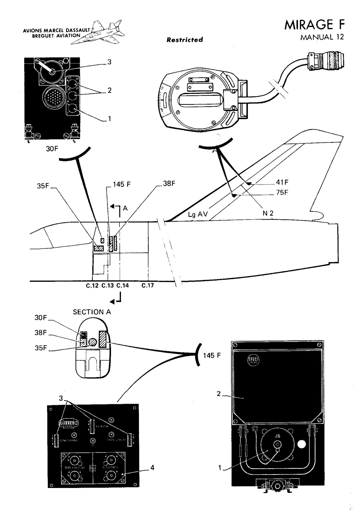

{146}------------------------------------------------

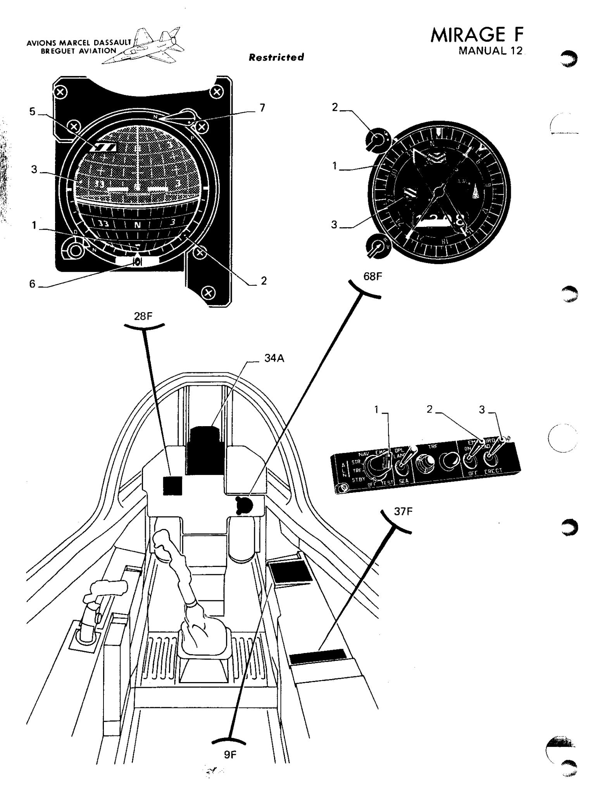

FIGURE 3 – IMPLANTATION AU POSTE PILOTE LAYOUT IN COCKPIT

{147}------------------------------------------------

### MIRAGE F

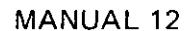

#### Restricted

### VERTICAL REFERENCE CHANNEL (Figures 4 and 5)

The vertical reference channel is composed of the following:

- gyro/accelerometer platform 35F

- interface electronics box 145F

- spherical indicator 28F

- roll/pitch output multiplier 38F.

#### 1 - OPERATION OF GYRO/ACCELEROMETER CENTER

The center includes two paired components: the platform containing the gyroscopic components and the accelerometers, and the interface electronics box containing the platform electronic servo components, the DICS (Doppler radar/Inertial unit Combined System) connecting components and the power supply.

#### A - Principle

The platform consists of a vertical reference gyro with the gyro rotor axis slaved to the Earth's vertical reference, and two gimbals arranged as follows:

- an inner gimbal (pitch gimbal) supporting the vertical reference gyro and turning about the transverse aircraft axis.

- an outer gimbal (roll gimbal) supporting the pitch gimbal and pivoting in relation to the aircraft structure, about the longitudinal aircraft axis.

Both gimbals are slaved to the vertical axis of the vertical reference gyro by two servo systems, from deviation information collected by two pickups mounted on the longitudinal and transverse axes of the aircraft. The vertical deviation detected by differential transformer PU (Pick Up) is cancelled by motors M101 (roll) and M201 (pitch).

The rotational axis of the gyro rotor is slaved to the local Earth's vertical reference by two mercury levelling switches mounted on the gyro frame along the transverse and longitudinal axes of the aircraft (fast erection during initial setting in emergency erection or alignment performed by main computer in normal operation).

The signals delivered either by the mercury levelling switches or by the main computer are amplified and applied to the precession torque motors which, by gyrostatic effect, permanently return the gyro rotor axis to the Earth's vertical reference.

The combined actions of the servo system slaving the gyro rotor to the Earth's vertical reference and the servo system slaving the roll and pitch gimbals to the vertical reference gyro, result in determining a perfectly horizontal plane.

The aircraft roll and pitch data are delivered by synchro-machines with stators integral with the platform structure and rotors coupled to the gimbal shafts.

#### B - Operation

#### (1) Power supply (figure 8)

The attitude and heading system is energized from the mode and heading selector panel (rotary selector switch set to any position other than «OFF» or «ST.BY») which delivers a 28 V DC voltage controlling relay K801. Relay K802 is energized as the 26 V/400 Hz AC voltage from transformer 126F is applied to relay K801.

All the voltages required for the platform/interface electronics box assembly are supplied by the power supply unit.

#### (2) Starting

The starting sequence is divided into three periods of time ranging between 0 and 100  $\pm$  20 seconds.

#### (a) From 0 to 30 seconds

This period covers the following functions:

- spinning-up of the vertical reference and directional gyro rotors,

- caging of the vertical reference gyro rotor by supplying electro-magnet E1,

- switching of erection circuits to fast erection, but there is no erection since the rotor is caged

{148}------------------------------------------------

at o

{149}------------------------------------------------

# AVIONS MARCEL DASSAULT BREGUET AVIATION

#### Restricted

- alignment of the roll and pitch gimbals with the corresponding aircraft axes by electronic switching of the gimbal servo systems (amplifiers and motors M101 and M201) onto X and Y deviations as detected by roll and pitch synchro transmitters, respectively CX102 and CX202.

#### (b) From 0 to 45 seconds

This period is characterized by the disabling of the directional gyro elevation gimbal servo system.

#### (c) From 30 to 100 seconds

This period covers the following functions:

- uncaging of vertical reference gyro,
- fast erection of vertical reference gyro : one of the two windings of each torque motor (M1002 and M1003) is supplied with the signal fed by the mercury levelling switches (amplified current),
  - supply of PU's with 6 V/5 kHz,
- electronic switching of roll and pitch gimbal servo systems onto information delivered by pickup PU001,
  - restoring of directional gyro elevation gimbal slaving (after 45 seconds).

#### (d) After 100 seconds: period of normal operation.

The sequence of above-mentioned operations is controlled by time delay circuits (30 sec., 45 sec. and 100 sec.) and by a signal allowing the effects of the watch-dog» and winertial unit reliability signals to be inhibited during the starting phase.

#### (3) Normal operation

Precession commands are generated by the main computer which transmits them to the interface electronics box through the digibus link. These signals are shaped by the «precession control» coupler of interface electronics box 145F to supply one of the two windings of each torque motor M1002 and M1003.

#### (4) Emergency operation

In this mode of operation, one of the two windings of each torque motor M1002 and M1003 is directly supplied with the signal fed by the mercury levelling switches.

The gyro/accelerometer center operates in «emergency erection» mode when :

- a control signal is fed by the main computer (depending on the mode in which the computer generates the basic parameters)
- faulty operation is detected by the software of the interface electronics box (absence of the «Iner-

tial unit reliability» or «watch-dog» bit)

- a control signal is fed by the pilot: «EMG» position selected on mode and heading selector panel.

A special logic controls the illumination of the «AHRS» light on navigation control panel 9F (see 12-6). Warning is provided when the «NAV» position is selected on the mode and heading selector panel and when the gyro/accelerometer center operates in «emergency erection» mode.

{150}------------------------------------------------

MANUAL 12

#### Restricted

#### C -- Conditioning (figure 3P)

To obtain maximum efficiency, the gyro/accelerometer platform is maintained in operation at an even and constant internal temperature of 50  $\pm~2^\circ$  C.

This temperature is obtained by means of fan M001, which agitates the heat emitted by resistors R601, and is regulated by thermistor TH601 controlling relay K301 via a comparator (cut off with T  $\geq$  50° C, energized with T  $\leq$  50° C). With T  $\geq$  50° C and relay K301 at rest, power supplies to R601 and M001 are cut off; however to prevent internal temperature from exceeding a certain value, contact CT003 restores the supply of M001 when this value exceeds 70° C.

A safety device, contact CT601, shorts the power supply to relay K301 when the internal temperature exceeds 85° C (fuse F1 blown).

Temperature builds up in the gyro/accelerometer platform as soon as the rotary selector switch is set to «ST.BY» on the mode and heading selector panel.

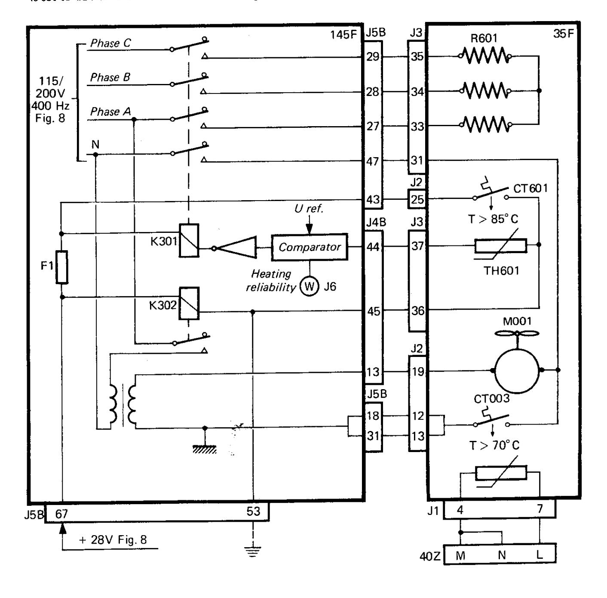

FIGURE 3P - CONDITIONING

{151}------------------------------------------------

MIRAGE F

D - Monitoring

- (1) The hardware-monitored functions are as follows:
- (a) Roll and pitch gimbal servo systems.
- (b) Pickup power supply voltage: 6 V/6kHz
- (c) Gyro rotor speed
- (d) Interface electronics box power supply.
- (e) Time delay: any time delay inadvertently triggered during normal operation will cause the «time delay reliability» signal to disappear. On the other hand, the «time delay reliability» signal is not applied during the starting phase.

When no anomaly is detected by all the monitoring circuits, the «vertical reference reliability» signal is generated.

- (2) The software-monitored functions are as follows:
- (a) Watch-dog: this is a releasable monostable which should be cyclically reset by the processor program. This system allows the program of the interface electronics box to be checked for correct operation. The «watch-dog» signal is then generated.
- (b) Inertial unit reliability. The «inertial unit reliability» signal is a logical AND between :
  - various results of tests performed by the software of the interface electronics box :
    - coupling to the digibus of the interface electronics box
    - operation of microprocessor and associated components of the interface electronics box
    - synchro/digital conversion
    - reliability of data fed by accelerometers
    - reliability of precession control signals
  - the «vertical reference reliability» signal
  - the emergency erection control signal fed by the main computer.

#### 2 - OPERATION OF ROLL/PITCH OUTPUT MULTIPLIER

#### A - Operation

Upon energization (rotary selector switch of mode and heading selector panel 37F set to a position other than «OFF» or «ST.BY»), the output multiplier is supplied. The roll and pitch repeating servo systems set the output potentiometer wipers and synchro-machines to the roll and pitch references of the platform.

#### B - Monitoring

The roll and pitch repeating servo systems and the power supplies (26 V AC, 115 V AC and 28 V DC) are monitored.

When the roll/pitch output multiplier operates correctly, its transmits the «vertical reference reliability» signal from the interface electronics box to test connector 40Z and to the radar contour mapping system which is also fed with a  $\pm$  28 V voltage from the aircraft system (see 14-2).

{152}------------------------------------------------

\*\*

{153}------------------------------------------------

MIRAGE F

#### 3 - OPERATION OF SPHERICAL INDICATOR

#### A - Principle

The sphere, which is independently subjected to the three heading, pitch and roll data, consists of two hemispheres carried by a disc simulating the equator.

It moves in the heading direction about an axis passing through the center of the disc and through the poles.

This pitch-slaved disc is supported by a roll-slaved stirrup.

#### B - Operation

Each rotating shaft of the sphere is driven by a specific servo channel which is energized:

for heading: by the gyromagnetic heading information controlling torque motor M3 and fed, in normal operation, by the interface electronics box (digital/synchro converter) and, in emergency operation, by the emergency gyromagnetic compass (synchro-transmitter CX1) through the interface electronics box (Fig. 6)

- for roll : by the information fed by platform synchro-transmitter CX101 and controlling torque

motor M1 (Fig. 4),

- for pitch : by the information fed by platform synchro-transmitter CX201 and controlling torque motor M2 (Fig. 5).

The spherical indicator is energized when aircraft electrical systems are energized and when the rotary selector switch of the mode and heading selector panel is set to any position other than «OFF» or «STB».

#### C - Pole setting (figures 4, 5, 6)

When the «N-P» control knob is held in the «P» position, relays RL1 (fig. 4 and 5) and RL2 (figure 6) are energized, switching off the servo-systems of the sphere about its three axes.

In this configuration, the energized relay RL1 applies a 12 V voltage to the pitch servo motor which controls the sphere's rotation about the pitch axis toward the pole (South pole) up to abutment.

#### D - Monitoring (figures 5, 6, 9)

The spherical indicator monitoring system monitors the three servo systems of the sphere.

When a failure is detected in the vertical reference servo systems, the monitoring circuit no longer delivers the signal controlling relay RL5 (Fig. 5). This causes the LF vertical reference reliability signal fed by the interface electronics box and intended for the indicator alarm flag, and the external + 28 V signal intended for the energized contact of heading reliability relay RL6 (Fig. 6) and for test connector 42Z (Fig. 9) to be cut off.

When a failure is detected in the heading servo system, the monitoring circuit no longer delivers the signal controlling relay RL6 (Fig. 6), which causes the external + 28 V signal intended for test connector 42Z to be cut off

#### E — Test operation (Figure 5)

NOTE: Test of the spherical indicator is possible only if:

- all the indicator power supplies are operational,

the reliability signal fed by the interface electronics box energizes terminal K of the indicator.

Depressing the control knob in «N» position causes a fixed voltage to be applied to the three servo systems which then offset the sphere by approx. 15° about the three axes.

{154}------------------------------------------------

{155}------------------------------------------------

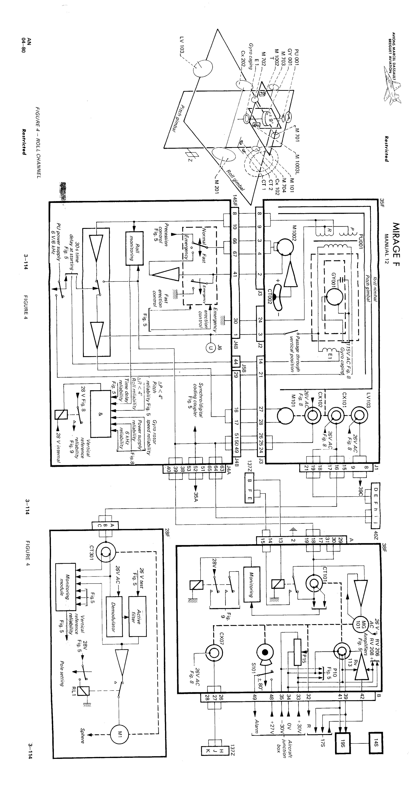

and of

C

{156}------------------------------------------------

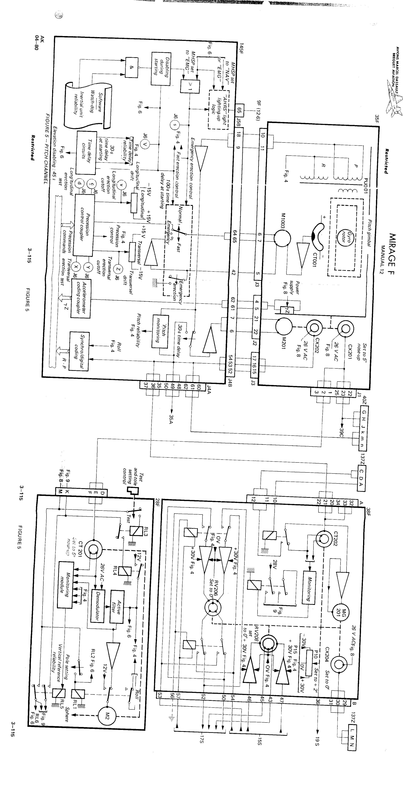

- Alphania with a factor

{157}------------------------------------------------

MIRAGE F

### NORMAL HEADING CHANNEL (Figure 6)

The normal heading channel is composed of the following:

- gyro accelerometer platform 35F,
- flux valve 41F,
- interface electronics box 145F,
- mode and heading selector panel 37F.
- spherical indicator 28F.

#### 1 - OPERATION

#### A - Flux valve

The flux valve delivers a magnetic heading reference in the form of 800 Hz electrical signals to the interface electronics box.

#### B - Directional gyro (figure 6)

The directional gyro consists of a rotor with a horizontal shaft, and three gimbals arranged as follows:

- one elevation gimbal with horizontal shaft, in which turns the gyro rotor shaft (the elevation gimbal and gyro rotor shafts form an angle of  $90^{\circ}$ ),
- one heading gimbal with vertical shaft ZZ', accommodating the elevation gimbal and gyro rotor assembly,
- one pitch gimbal slaved to the vertical reference gyro, supporting all the above components, and mounted horizontal inside the roll gimbal of the platform.

As the gyro rotor and elevation gimbal assembly must be permanently kept horizontal to obtain correct heading data, two servo systems are required:

(1) Heading gimbal shaft slaving to vertical reference

This is obtained with the pitch gimbal slaved to the vertical reference gyro.

(2) Elevation gimbal slaving to heading gimbal perpendicular component

This is obtained with the following:

- one optical pickup detecting the elevation gimbal position relative to the heading gimbal PU002, (deviation and direction detection),
  - one deviation signal amplifier,
- one torque motor MC301, with the stator secured to the pitch gimbal and the rotor linked to vertical shaft ZZ' of the heading gimbal to cause the gyro rotor to precess in the suitable direction so as to return the elevation gimbal perpendicular to the heading gimbal.

Synchro-transmitter CX001 driven by heading gimbal shaft ZZ' provides the directional heading to the interface electronics box.

{158}------------------------------------------------

\*\*\*\*\*\*\*\*\*\*\*\*\*\*\*\*\*\*\*\*\*\*\*\*\*\*\*\*\*\*\*\*\*\*\*\*\*\*

{159}------------------------------------------------

MANUAL 12

#### C - Interface electronics box

#### (1) Operation in normal gyromagnetic heading mode

Platform synchro-transmitter CX001 delivers a directional heading to the interface electronics box. This heading is received by the synchro/digital coding unit.

The magnetic heading from the flux valve is also received by the synchro-digital coding unit of the interface electronics box through the removable compensator.

From these two data, the software of the interface electronics box generates a gyromagnetic heading (magnetic heading filtered by directional heading) and delivers this heading in digital form :

- to the main computer through the digibus link and through required couplers,

- to a digital/synchro converter which converts the digital information into an analog information.

At the output of the digital/synchro converter, the gyromagnetic heading is distributed to the associated systems through the NO contact of relays K1 and K2 controlled either by the interface electronics box monitoring circuits or by the «EMG» position of the rotary selector switch of the mode and heading selector panel.

#### (2) Operation in emergency gyromagnetic heading mode

This operating mode is controlled:

- either automatically by the monitoring system of the interface electronics box : absence of «magnetic monitoring reliability» or «watch-dog» signal,

or manually by setting the rotary selector switch of the mode and heading selector panel to «EMG».

In this operating mode, relays K1 and K2 switch the analog outputs intended for all associated systems to the emergency gyromagnetic heading data delivered by emergency gyromagnetic compass 30F.

A special logic generates a signal controlling the illumination of the «CG90» light on navigation control unit 9F (see 12-6) when the system operates in emergency heading mode with the rotary selector switch of the mode and heading selector unit set to «NAV» or «EMG».

#### (3) Starting

The use of gyromagnetic heading data delivered by the interface electronics box is possible immediately after the time required for platform starting has elapsed.

The effect of the «magnetic monitoring reliability» and «watch-dog» signals is inhibited throughout the starting phase.

#### D - Monitoring

The «magnetic monitoring reliability» and «watch-dog» are generated by a monitoring program of the interface electronics box.

- (1) Watch-dog: see vertical reference channel.
- (2) Magnetic monitoring reliability. This signal is generated if the following conditions exist:
- (a) No anomaly is detected in the following monitored functions:
  - synchro amplifier
  - magnetic monitoring (probability check)
  - digital/synchro and synchro/digital coding
  - digibus coupling.

{160}------------------------------------------------

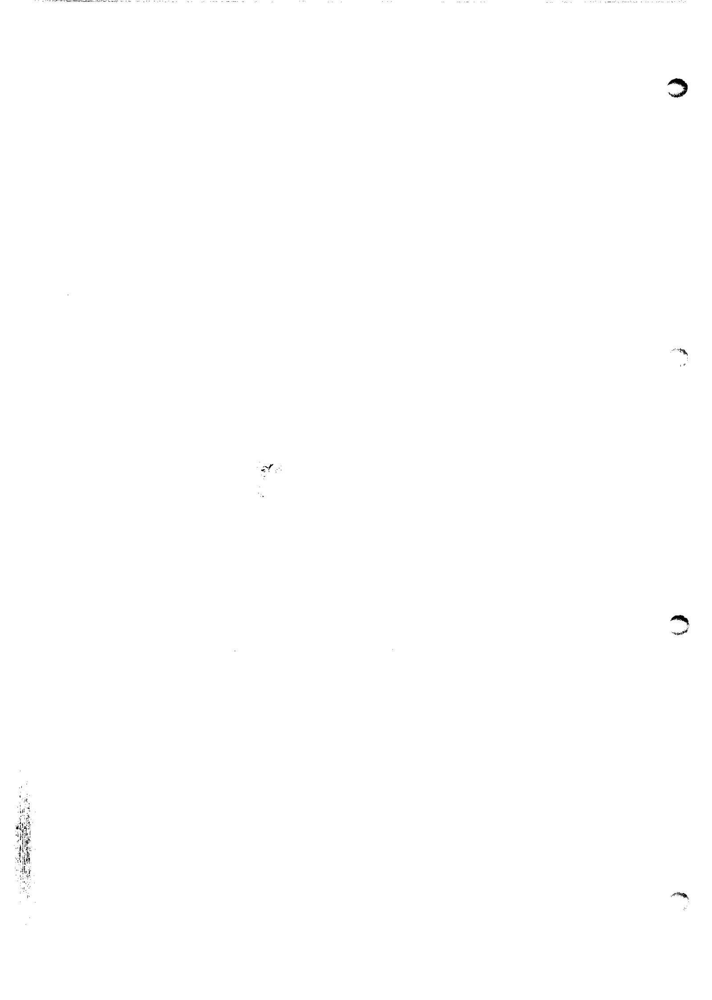

{161}------------------------------------------------

### AVIONS MARCEL DASSAULT BREGUET AVIATION

#### Restricted

### MIRAGE F

MANUAL12

- microprocessor and microprocessor components associated with the interface electronics box.

(b) The vertical reference reliability signal (see vertical reference channel) is absent.

#### E - Flux valve compensation

The compensation of flux valve 41F consists in lubber line correction, semi-circular correction and quadrantal correction.

#### (1) Lubber line correction

This correction is performed by positioning the flux valve on its support.

#### (2) Semi-circular and quadrantal corrections

These corrections are performed from «SEMI-CIRCULAR» «N/S-E/W» and «QUADRANTAL» controls located underneath the removable cover at the upper part of interface electronics box 145F.

These controls drive the potentiometers delivering corrective voltages applicable to the data delivered by the flux valve.

{162}------------------------------------------------

{163}------------------------------------------------

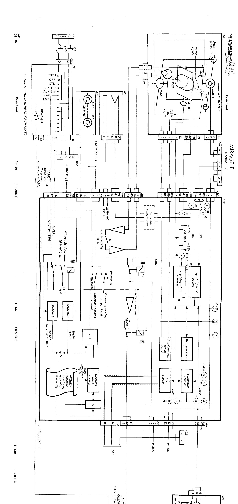

{164}------------------------------------------------

### EMERGENCY HEADING CHANNEL (Figure 7)

The emergency heading channel is composed of the following:

- emergency gyromagnetic compass 30F,
- mode and heading selector panel 37F,
- flux valve 75F.
- interface electronics box 145F.

#### 1 - OPERATION OF EMERGENCY HEADING CHANNEL IN STABILIZED FLIGHT

#### A - Flux valve

The flux valve supplies the emergency gyromagnetic compass with a magnetic heading reference in the form of 800 Hz electrical signals.

#### B - Emergency gyromagnetic compass

This is a gyro with two degrees of freedom in elevation and heading.

The gyro is composed of three major sections:

- one rotor,
- one elevation gimbal,
- one heading gimbal.

The gyro rotor shaft turns in the elevation gimbal and the gyro rotor is driven at 24,000 rpm by a synchronous motor. The rotational axis keeps a fixed horizontal direction.

The elevation gimbal remains perpendicular to the heading gimbal.

The heading gimbal is slaved to the magnetic heading information. It is free with reference to the case integral with the airframe along shaft ZZ'.

Torque motors MC1 and MC2 slaving the elevation and heading gimbals are mounted:

MC1: on elevation shaft YY' for slaving the heading gimbal MC2: on heading shaft ZZ' for slaving the elevation gimbal.

#### Elevation gimbal slaving

The purpose of elevation slaving is to keep the heading and elevation gimbals perpendicular to each other. The perpendicular position is monitored by an optical electronic system which detects any deviation and delivers a 0 or 180° phase signal depending on whether the deviation is positive or negative. This signal, applied to control phase of torque motor MC2, generates a torque on the heading gimbal which causes the rotor to precess in the appropriate direction so as to bring the elevation gimbal back to 90° from the heading gimbal.

#### (2) Heading gimbal slaving

The purpose of heading gimbal slaving is to keep the shaft XX' of the gyro rotor strictly parallel to the axis of the magnetic North detected by the flux valve. Synchro detector CT1 detects the parallelism variation between these two axes and supplies an error signal which, amplified, is used to supply the control phase of torque motor MC1. The torque applied by MC1 to elevation gimbal shaft YY', causes the rotor to precess in such a way as to bring back its XX' shaft parallel to the axis of the magnetic North.

{165}------------------------------------------------

# MIRAGE F

#### 2 - OPERATION OF EMERGENCY HEADING CHANNEL ON STARTING

#### A - Starting sequence

On energization («OFF-ON» switch of the mode and heading selector panel to «ON»), the gyro is in any position. The starting sequence is as follows:

- on energization, the gyro rotor is supplied and starts spinning up,

- after 10 seconds and up to a time shorter than 1 minute (depending on the initial deviation between the heading of the gyro rotor axis and the magnetic heading), fast resetting of the elevation and azimuth gimbals takes place automatically. The heading resetting rate is then positively higher than  $70^{\circ}$ /min., since the gyro rotor has not yet reached its nominal speed. Fast resetting is automatically stopped when the heading deviation becomes lower than 2.5 to  $5^{\circ}$ .

- the remaining heading deviation is suppressed in slow resetting mode (normal operation). The

gyro rotor reaches the nominal speed 80 seconds after switching-on.

#### B - Slow resetting/fast resetting selection

Slow or fast resetting operation is determined by the resetting logic.

This logic receives the following data:

- end of 10 sec. time delay

- MH - EGMH heading deviation

- manual fast resetting control.

#### It acts on:

- relay K1

- latitude correction (potentiometer P1).

The energization of relay K1 shorts resistor R1 and potentiometer P1, which causes the following:

- for elevation resetting, it increases the voltage applied to the energization winding of torque motor MC2 to increase its speed;

for heading resetting, it increases the voltage applied to both the energization winding and the control winding of torque motor MC1 by modifying the slaving amplifier gain, to increase its speed.

Latitude correction is cut off in fast resetting mode by suppressing power supply to potentiome-

A monitoring unit causes relay K2 to be energized as soon as the servo systems operate in slow resetting mode. Relay K2 delivers a navigation indicator reliability signal to the main computer and the interface electronics box.

Fast resetting can be controlled manually on the ground or in flight through the fast resetting

selector of the mode and heading selector panel.

#### NOTE:

(1) It is possible to continue fast resetting up to  $0^{\circ}$ , when the heading deviation is less than 2.5 to  $5^{\circ}$ , provided the selector switch is kept on «ERECT».

(2) When the MH - EGMH deviation is between 175 and 185°, fast resetting does not occur Every time the emergency heading channel is started, the selector switch must be maintained at «ERECT» to preclude this error.

#### 3 - FLUX VALVE COMPENSATION - LATITUDE CORRECTION

#### A - Emergency heading channel compensation.

Flux valve magnetic compensation is performed on emergency gyromagnetic compass 30F using two N-S and E-W potentiometers which apply correcting DC voltages to the windings of the flux valve.

#### B - Latitude correction

Latitude correction is performed by injecting a voltage into the input of the heading servo amplifier through potentiometer P1.

Its purpose is to correct the gyro drift according to the latitude by applying a constant angular variation to the directional heading.

This voltage corresponding to the angular variation is a mean value for the latitude in which the aircraft is to be operating during the mission.

AK 08-79

{166}------------------------------------------------

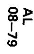

3-123

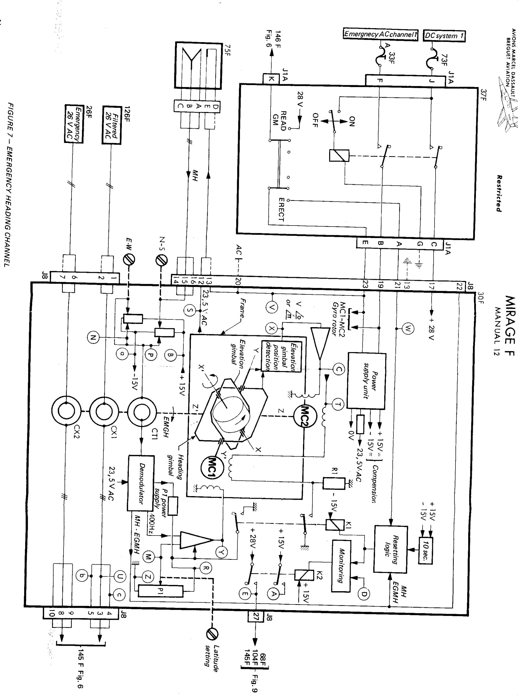

3-123

{167}------------------------------------------------

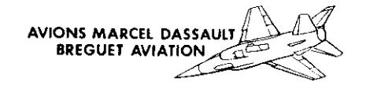

MANUAL 12

### MONITORING OF ATTITUDE AND HEADING SYSTEM (Figure 9)

Attitude and heading system monitoring is performed by the following:

- interface electronics box 145F
- emergency gyromagnetic compass 30F
- roll/pitch output multiplier 38F
- spherical indicator 28F.

#### 1 - INTERFACE ELECTRONICS BOX

The monitoring hardware and software system of the interface electronics box generates three reliability discrete signals.

#### A - Vertical reference reliability

This signal is directly fed by the monitoring system associated with gyro/accelerometer center ancillary systems (see vertical reference channel) and is independent of the operating mode (normal or emergency erection) of the center.

This signal is transmitted to the following:

- symbol generator box 35A
- spherical indicator 28F
- test connector 40Z
- test connector 137Z if no anomaly is detected by the internal monitoring system of the roll/pitch output multiplier.

#### B - Heading reliability

This discrete signal indicates that the gyromagnetic heading transmitted to the various equipment items is correctly generated. It is applied if:

- the system does not operate in «emergency heading» mode (see normal heading channel),
- no anomaly is detected by the internal monitoring system of the emergency gyromagnetic compass (CG90) reliability) when the system operates in «emergency heading» mode.

This reliability signal is transmitted to the following:

- navigation indicator (through relay 146F)
- test connector 137Z
- symbol generator box 35A.

### C - Heading and vertical reference reliability

The heading and vertical reference reliability discrete signal, intended for the autopilot, is applied if the following two conditions exist:

- «vertical reference reliability» discrete signal applied,
- system operating in «normal heading» mode. In the case where the system operates in «emergency heading» mode, the following two conditions exist :
  - reliability signal transmitted by the emergency gyromagnetic compass,
- «synchro amplifier» and «watch-dog» discrete signals transmitted by the software of the interface electronics box (see normal heading channel and vertical reference channel).

### 2 - EMERGENCY GYROMAGNETIC COMPASS

When the emergency gyromagnetic compass is operating, it delivers a reliability signal if the following conditions exist:

ΑL

08-79

{168}------------------------------------------------

{169}------------------------------------------------

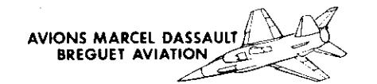

MIRAGE F MANUAL 12

- no anomaly detected by the associated monitoring system

- fast resetting of emergency gyromagnetic heading with respect to magnetic heading completed.

The «CG90 reliability» signal is transmitted to the following:

- navigation indicator (through relay 146F)

- main computer 104F

- interface electronics box 145F

- test connector 40Z.

#### 3 - ROLL/PITCH OUTPUT MULTIPLIER

The «vertical reference reliability» signal is no longer transmitted to test connector 137Z by the monitoring system of the roll/pitch output multiplier when an anomaly is detected in the repeating circuits by this monitoring system.

#### 4 - SPHERICAL INDICATOR

The flag alarm appears on spherical indicator 28F when:

- the «vertical reference reliability» signal generated by interface electronics box 145F is applied,

- a signal is fed by the spherical indicator internal monitoring system.

{170}------------------------------------------------

{171}------------------------------------------------

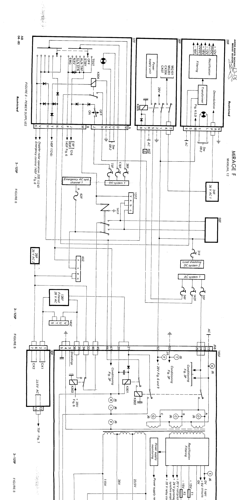

{172}------------------------------------------------

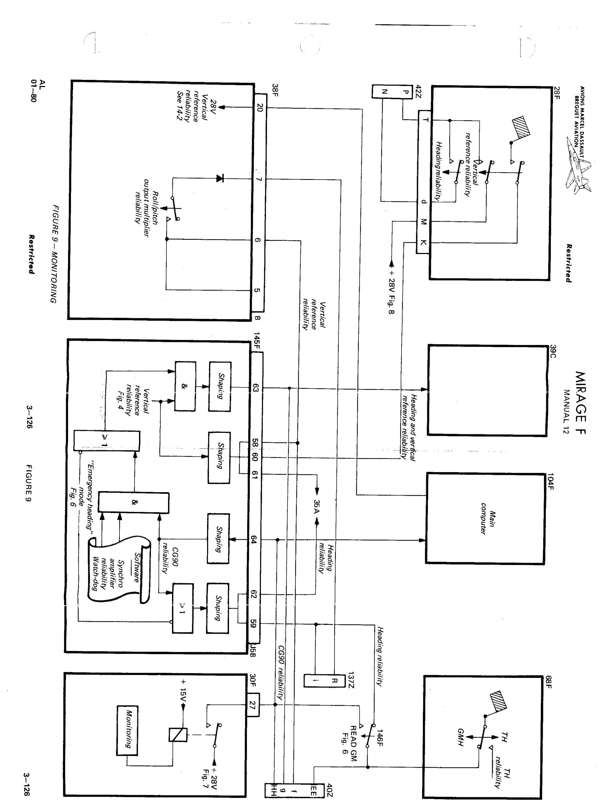

{173}------------------------------------------------

Roll/pitch output multiplier 38F

| AVIONS MARCEL DASSAULT BREGUET AVIATION |
|-----------------------------------------|
| <b>₹</b> 0                              |

|   | ı                              |                                                 |                                    |                                                   |                                |                                                            |                                                   |                                      |                                                    |                                |
|---|--------------------------------|-------------------------------------------------|------------------------------------|---------------------------------------------------|--------------------------------|------------------------------------------------------------|---------------------------------------------------|--------------------------------------|----------------------------------------------------|--------------------------------|
|   |                                | <del>-  </del>                                  | Pitch                              |                                                   |                                | Roll                                                       |                                                   |                                      | Heading                                            | Information                    |
|   | electronics box                |                                                 | Roll/pitch output multiplier | accelerometer platform                         | electronics box             | output multiplier                                       | accelerometer platform                            | gyromagnetic compass                 | Interface electronics box  Emergency               | From                           |
|   |                                |                                                 |                                    | Synchro- transmitter CX201*                 |                                |                                                            | transmitter CX101*                             | through 145F                         | Digital/synchro converter*                         | Spherical indicator 28F        |
|   |                                |                                                 |                                    |                                                   |                                |                                                            |                                                   | cX2 through 145F                  | Digital/synchro converter*                         | Navigation indicator 68F       |
|   |                                | Resolvers RV206 and RV208 set to 0° → 17S | Pot. P10 (set to + 2°) → 10° |                                                   | ·                              | Pot. P15 → 17S contact S101 closed when R > ± 80° |                                                   |                                      |                                                    | Radar                          |
| - | Synchro/digital coding coupler |                                                 |                                    |                                                   | Synchro/digital coding coupler |                                                            |                                                   | Synchro-transmitter CX1 through 145F | Digital/synchro converter and bus coupler | Main computer 104F       |
|   |                                |                                                 |                                    | Synchro- transmixter CX202* through 145F |                                |                                                            | Synchro- transmitter CX102* through 145F | Synchro-transmitter CX1 through 145F | Digital/synchro converter                       | Symbol generator box 35A |
|   |                                |                                                 |                                    | Synchro- transmitter CX201*                 |                                |                                                            | Linvar LV103                                   | Synchro-transmitter CX1 through 145F | Digital/synchro converter*                      | Autopilot 39C                  |
|   | 1                              |                                                 | ļ                                  |                                                   | 1                              | I                                                          | ſ                                                 | 7                                    |                                                    |                                |

Synchro-transmitter CX102\* through 145F

FIGURE 10 - ROLL, PITCH AND HEADING DATA DISTRIBUTION

FIGURE 10

Tested outputs

{174}------------------------------------------------

# AVIONS MARCEL DASSAULT BREGUET AVIATION

#### Restricted

### MIRAGE F

MANUAL 12

#### **SECTION 5**

#### MARKER BEACON SYSTEM

#### TABLE OF CONTENTS

|        |                                              | Page           |
|--------|----------------------------------------------|----------------|
| 5-0    | GENERAL                                      |                |
|        | - Principle of Marker beacon system          | 5-001          |
| 5-1    | DESCRIPTION - OPERATION                      |                |
|        | - Table of components                        | 5-101 5-119 |
|        | LIST OF ILLUSTRATIONS                        |                |
| Figu   | re No.                                       | Page           |
| 1 2 | LAYOUTSCHEMATIC DIAGRAM MARKER BEACON SYSTEM | 5-106 5-120 |

{175}------------------------------------------------

{176}------------------------------------------------

MIRAGE F
MANUAL 12

#### PRINCIPLE OF MARKER BEACON SYSTEM

The Marker beacon system is a radio-navigational facility operating with radio beacons and indicating to the pilot the moment at which the aircraft flies over these radio beacons.

The system includes:

- MARKER beacon receiver 90R
- MARKER beacon selector switch 175R
- MARKER beacon antenna 91R.

The MARKER beacon indicator light, located on spherical indicator 28F, indicates to the pilot the moment at which the aircraft flies over a radio beacon.

Radio selector box 29R is fed with the radio beacon identification signals.

{177}------------------------------------------------

**એ** 

{178}------------------------------------------------

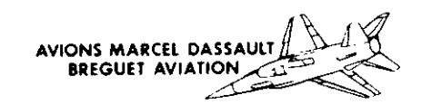

#### TABLE OF COMPONENTS

For layout, see figure 1

| Item | Name - Characteristics and Functions                                                                                                                                                                                                                                                                                                                       | Location Access Door No.      | Do       | c. |
|------|------------------------------------------------------------------------------------------------------------------------------------------------------------------------------------------------------------------------------------------------------------------------------------------------------------------------------------------------------------|----------------------------------|----------|----|
|      |                                                                                                                                                                                                                                                                                                                                                            |                                  | <u>s</u> |    |
| 28F  | SPHERICAL INDICATOR (See 12-3)                                                                                                                                                                                                                                                                                                                          | Cockpit (Instrument panel) | X        |    |
|      | MARKER beacon indicator light 8, whose intensity can be adjusted by turning to position D (Day) or N (Night), indicates the moment at which the aircraft flies over the radio beacon.  The MARKER beacon indicator light can be tested by depressing pole setting knob 7.                                                                                  | panon                            |          |    |
| 29R  | RADIO SELECTOR BOX (See 11-3)                                                                                                                                                                                                                                                                                                                           | Cockpit                          | X        |    |
|      | Permits audio adjustment of radio beacon indentification signal through the «MKR» potentiometer.                                                                                                                                                                                                                                                           |                                  |          |    |
| 52R  | MARKER BEACON FUSE-BREAKER                                                                                                                                                                                                                                                                                                                                 | Electrical master box         |          |    |
|      | Protects DC system 2 of the MARKER beacon receiver.                                                                                                                                                                                                                                                                                                        | Thaster box                      |          |    |
| 90R  | MARKER BEACON RECEIVER                                                                                                                                                                                                                                                                                                                                     | Bottom of frames 37-38           | Х        |    |
|      | Receives the signals transmitted by radio beacons. This is a receiver tuned to 75 MHz with direct amplification. Receiving a signal results in generating a signal modulated at 400, 1300 or 3000 Hz, according to the overflown radio beacon. This signal is transmitted to the MARKER beacon indicator light on spherical indicator 28F and to the audio | (access through antenna)   |          |    |
|      | circuit of radio selector box 29R.  Test: The receiver can be tested using the MARKER beacon selector switch.                                                                                                                                                                                                                                              |                                  |          |    |
| 91R  | MARKER BEACON ANTENNA                                                                                                                                                                                                                                                                                                                                      | Bottom of frames 37-38           | X        |    |
|      | This is an embedded directional antenna Polarization : Horizontal - Tuned to 75 MHz frequency - Impedance : 50 $\Omega$ - SWR : $\leq$ 3.                                                                                                                                                                                                                  | 7,41,103 07 00                   |          |    |
| 175R | MARKER BEACON SELECTOR SWITCH                                                                                                                                                                                                                                                                                                                              | Cockpit                          | X        |    |
|      | Three-position selector switch allowing the MARKER beacon receiver to be stopped, started and tested.                                                                                                                                                                                                                                                      | (RH console)                     |          |    |
|      |                                                                                                                                                                                                                                                                                                                                                            |                                  |          |    |

{179}------------------------------------------------

**.** 

{180}------------------------------------------------

### MIRAGE F

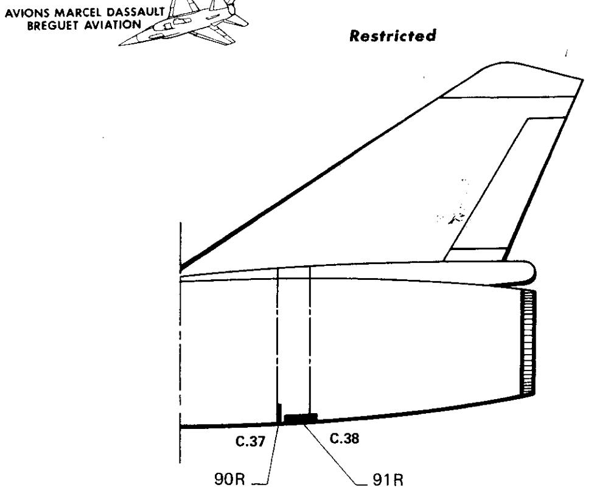

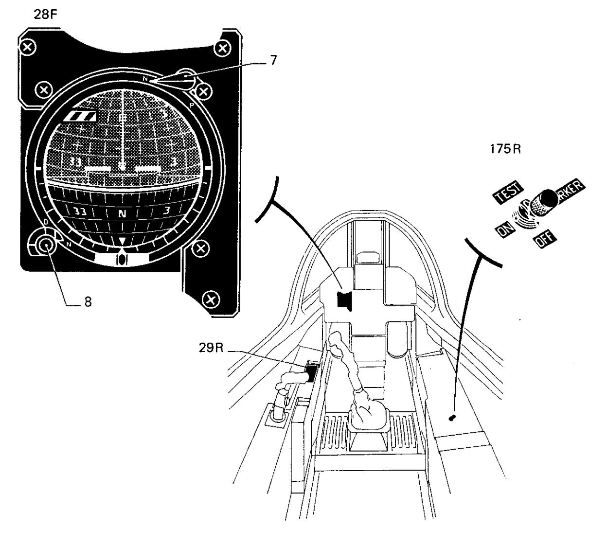

FIGURE 1 - IMPLANTATION LAYOUT

{181}------------------------------------------------

{182}------------------------------------------------

# AVIONS MARCEL DASSAULT BREGUET AVIATION

#### Restricted

### OPERATION OF MARKER BEACON SYSTEM (Figure 2)

The MARKER beacon receiver operates when the MARKER beacon selector switch is set to «ON». When the aircraft flies over the radio beacon, the receiver receives the 75 MHz RF signals modulated at 400, 1300 or 3000 Hz corresponding to the overflown radio beacon.

The MARKER beacon system signals the moment the aircraft flies over each radio beacon by a double information:

- aural information through the telephone system (radio selector box)

- visual information through the MARKER beacon indicator light on the spherical indicator.

#### The receiver includes:

- RF reception circuits

- circuits detecting and shaping the signal displayed on the spherical indicator.

#### 1 - RF AND DETECTION CIRCUITS

The modulated carrier is filtered and amplified before being transmitted to the detection unit. The detection unit delivers AF information to an audio AF channel which distributes this information to the AF amplifier (for headset) and to the visual indicating channel.

Two oscillators, controlled by the «TEST» position of the MARKER beacon selector switch, simulate the radio beacon signals for the self-test of receivers.

#### 2 - DISPLAY CIRCUITS

The detected AF signal, collected at the output of the audio AF channel preamplifier, is transmitted to the three channels corresponding to the 400, 1300 and 3000 Hz modulation frequencies. Each channel is composed of a selective amplifier, a filter and a relay.

The three channels are interconnected through the aircraft wiring, and channel signals are transmitted to the spherical indicator where they are displayed through the MARKER beacon indicator light.

The audio AF signal is amplified and transmitted to the radio selector box.

#### 3 -- POWER SUPPLY

The 28 V DC power supply of the MARKER beacon receiver is ensured by DC system 2 through fuse-breaker 52R and is controlled from the MARKER beacon selector switch.

A power supply unit, built into the MARKER beacon receiver, generates the 15 V DC voltages required for operation of the receiver.

The contacts of the relays controlling the MARKER beacon indicator light are supplied with 28 V DC power.

{183}------------------------------------------------

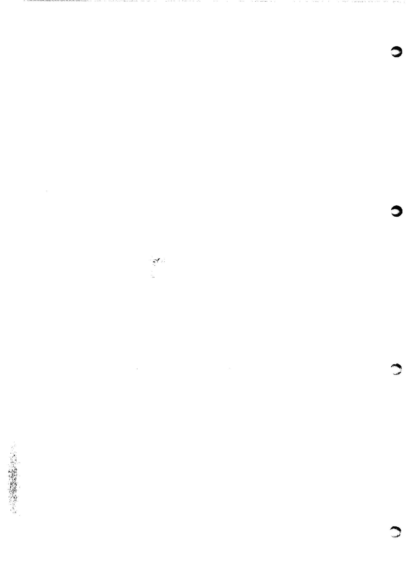

{184}------------------------------------------------

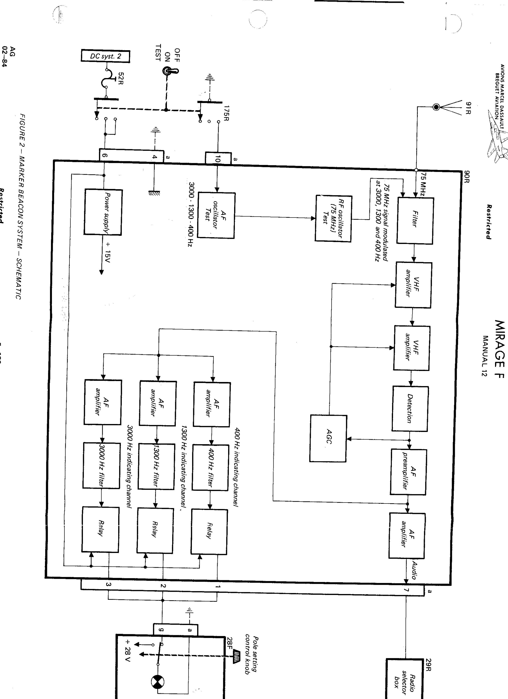

5-120

FIGURE 2

5-120

{185}------------------------------------------------

### AVIONS MARCEL DASSAULT BREGUET AVIATION

#### Restricted

#### SECTION 6

#### NAVIGATION SYSTEM

#### TABLE OF CONTENTS

| 6-0 | PRINCIPLE OF NAVIGATION SYSTEM                                                                                              | 6-001                                                        |
|-----|-----------------------------------------------------------------------------------------------------------------------------|--------------------------------------------------------------|
| 6-1 | DESCRIPTION - OPERATION                                                                                                     |                                                              |
|     | TABLE OF COMPONENTS                                                                                                         | 6-101                                                        |
| A – | HYBRID GYRO-INERTIAL NAVIGATION SYSTEM.                                                                                     | 6-117                                                        |
|     | - General                                                                                                                   | 6-117H                                                       |
|     | PRINCIPLE OF GYRO-INERTIAL NAVIGATION                                                                                       | 6-118                                                        |
|     | - Introduction                                                                                                              | 6-118 6-118 6-120 6-122 6-128 6-128 6-128M |
|     | OPERATION OF GYRO-ACCELEROMETER CENTER - INERTIA - DOPPLER SOFTWARE                                                         | 6-132                                                        |
|     | - Description                                                                                                               | 6-132 6-132 6-134                                      |
|     | HYBRIDIZATION OF GYRO-INERTIAL SYSTEM - INERTIA - DOPPLER SOFTWARE                                                          | 6-142                                                        |
|     | - Principle Application Inertia-Doppler coupling Inertia-air data coupling Pure inertia Special coupling cases Flight modes | 6-142 6-142 6-142 6-144 6-145 6-146           |
|     | RECAPITULATION OF THE VARIOUS OPERATION MODES OF THE SYSTEM                                                                 | 6-150                                                        |

{186}------------------------------------------------

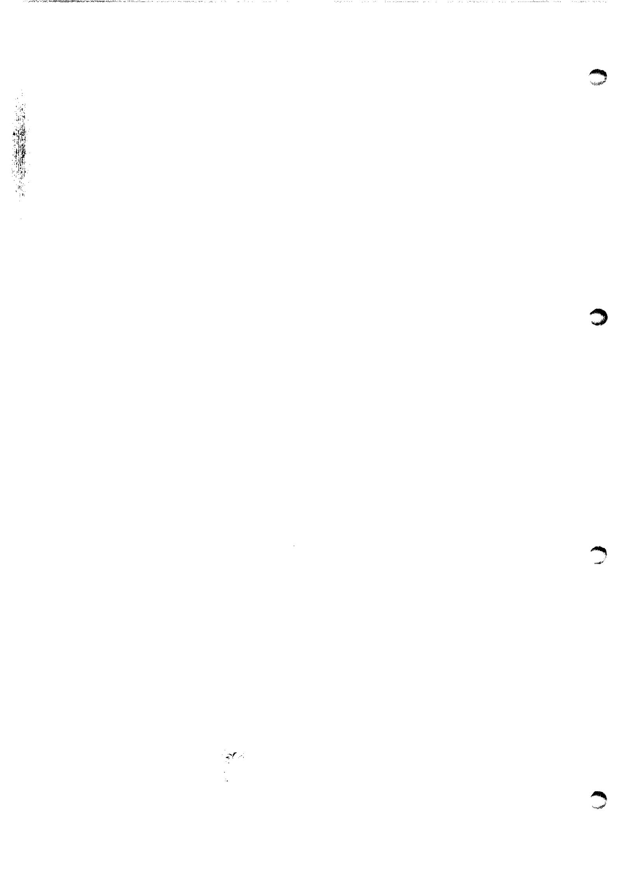

{187}------------------------------------------------

| В — | NAVIGATION CONTROL PANEL (NCP) AND MODE AND HEADING SELECTOR PANEL (MHSP) | 6-155                            |
|-----|---------------------------------------------------------------------------|----------------------------------|
|     | - Presentation                                                            | 6-156 6-156 6-162 6-164 |
| C – | NAVIGATION INDICATOR                                                      | 6-165                            |
|     | - Scope                                                                   | 6-166 6-166 6-167 6-171 |
| D – | NAVIGATION OUTPUT MULTIPLIER                                              | 6-179                            |
|     | - Parameters supplied to radar                                            | 6-180 6-180 6-180          |
| E   | DOPPLER RADAR SYSTEM                                                      | 6-185                            |
|     | - Scope                                                                   | 6-186 6-186 6-192          |

{188}------------------------------------------------

{189}------------------------------------------------

### PRINCIPLE OF NAVIGATION SYSTEM (Figure 1)

#### 1 - SCOPE

The purpose of the navigation system is:

- to compute and display the true heading
- to compute and display the steering parameters for the aircraft (distance and true bearing) to a target chosen by the pilot
  - to display the true bearing of a radio-electrical beacon (see 12-8)
  - to display the autopilot heading deviation.

#### 2 - COMPOSITION

The navigation system consists of:

- gyro-accelerometer center 35F and interface electronics box 145F
- Doppler radar 34S
- main computer 104F.

These equipment items are linked up with the control, selection and display units.

#### A - Control and selection units

Navigation control panel 9F determines the operation mode to be used for navigation. It allows for the selection of the navigation target to which various parameters are attached. The latter can be inserted or computed for display.

#### B - Detection units

They are:

- interface electronics box 145F and its flux valve 41F which furnish the magnetic or gyromagnetic heading to symbol generator box 35A and to navigation indicator 68F,
- air data computer 17F which furnishes the aircraft speed and altitude information to symbol generator box 35A and the altitude information to main computer 104F.

#### C - Display units

#### They are:

- spherical indicator 28F
- navigation indicator 68F which displays:
  - the true heading or the gyromagnetic or magnetic heading
  - the steering parameters to a target
  - the autopilot heading deviation
  - the computation faults during the navigation sequence
- head-up display 34A which displays:
  - the gyromagnetic or magnetic heading
  - the altitude
  - the aircraft parameters (indicated airspeed, Mach number)
  - the distance to the navigation target.

This data is displayed through digital values.

{190}------------------------------------------------

{191}------------------------------------------------

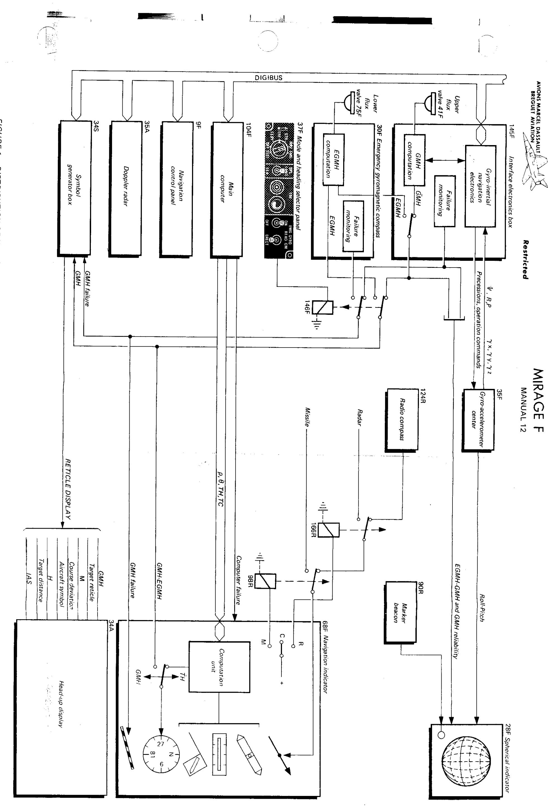

FIGURE 1 - DISTRIBUTION OF NAVIGATION SYSTEM DATA

AN 04-81

Restricted

6-002

FIGURE 1

6-002

{192}------------------------------------------------

MIRAGE F

MANUAL 12 On the other hand, and according to their relative position to each other, certain symbols determine:

- the inertial speed of the aircraft
- the drift
- the course deviation from direct navigation
- the relative bearing of the navigation target.

### 3 - STARTING

The navigation system equipment items are started up through a control located on mode and heading selector panel 37F.

### 4 - MONITORING

The gyro-accelerometer center, the interface electronics box and the main computer are monitored. The failures covered by this monitoring are displayed on the navigation indicator and on the navigation

The navigation indicator receives the failure warning signals from the peripheral equipment items and displays them.

The display depends on the switchings carried out on the navigation indicator.

{193}------------------------------------------------

{194}------------------------------------------------

MANUAL 12

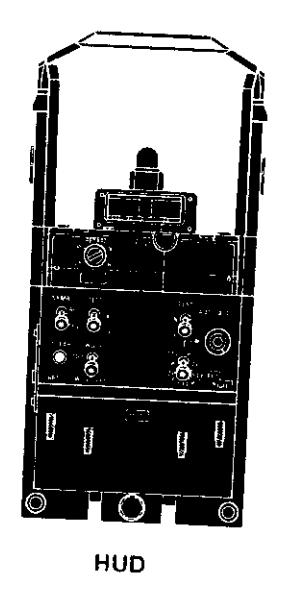

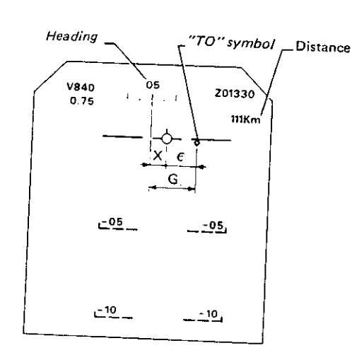

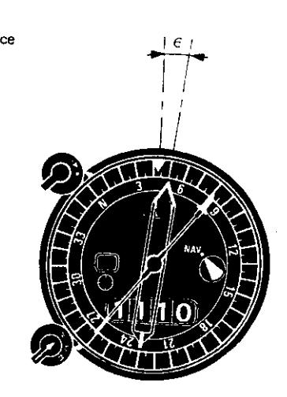

NAVIGATION INDICATOR

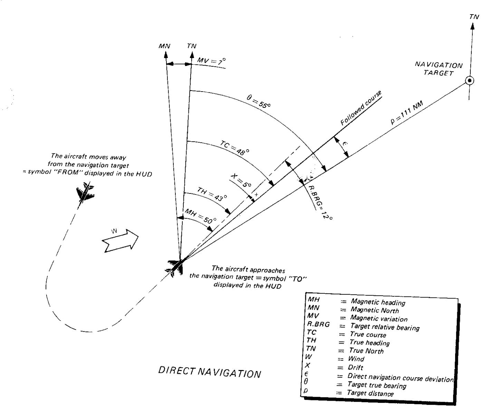

FIGURE 2 -- OPERATION AND DISPLAY IN NAVIGATION MODE

{195}------------------------------------------------

\*\*\*\*\*\*\*\*\*\*\*\*\*\*\*\*\*\*\*\*\*\*\*\*\*\*\*\*\*\*\*\*\*\*\*\*\*\*

{196}------------------------------------------------

### MIRAGE F

MANUAL 12

### TABLE OF COMPONENTS

Restricted

For layout, see figures 3 and 4

| Item | Name - Characteristics and Functions                                                                                                                                                                                                                                                                                                                                                                                                                                                                                                                                                                                                                                                                                                                                                                                                                                                                                                                                                                                                                                                           | Location Access Door No. | Doc      |
|------|------------------------------------------------------------------------------------------------------------------------------------------------------------------------------------------------------------------------------------------------------------------------------------------------------------------------------------------------------------------------------------------------------------------------------------------------------------------------------------------------------------------------------------------------------------------------------------------------------------------------------------------------------------------------------------------------------------------------------------------------------------------------------------------------------------------------------------------------------------------------------------------------------------------------------------------------------------------------------------------------------------------------------------------------------------------------------------------------|-----------------------------|----------|
| 1    | TRANSFER GYRO MOUNTING PLATE                                                                                                                                                                                                                                                                                                                                                                                                                                                                                                                                                                                                                                                                                                                                                                                                                                                                                                                                                                                                                                                                   | TOOLS BOOK NO.              | <u> </u> |
|      | Permits aligment of transfer gyro. It consists of hooking point 1 and alignment stops of transfert gyro 2.                                                                                                                                                                                                                                                                                                                                                                                                                                                                                                                                                                                                                                                                                                                                                                                                                                                                                                                                                                                     |                             |          |
| 2A   | ARMAMENT AND MODE CONTROL PANEL (See 14-3)                                                                                                                                                                                                                                                                                                                                                                                                                                                                                                                                                                                                                                                                                                                                                                                                                                                                                                                                                                                                                                                     |                             |          |
| 34A  | HEAD-UP DISPLAY (See 14-3)                                                                                                                                                                                                                                                                                                                                                                                                                                                                                                                                                                                                                                                                                                                                                                                                                                                                                                                                                                                                                                                                  |                             |          |
| 35A  | SYMBOL GENERATOR BOX (See 14-3)                                                                                                                                                                                                                                                                                                                                                                                                                                                                                                                                                                                                                                                                                                                                                                                                                                                                                                                                                                                                                                                             |                             |          |
| 39C  | AUTOPILOT (See 13-2)                                                                                                                                                                                                                                                                                                                                                                                                                                                                                                                                                                                                                                                                                                                                                                                                                                                                                                                                                                                                                                                                        |                             |          |
| 9F   | NAVIGATION CONTROL PANEL                                                                                                                                                                                                                                                                                                                                                                                                                                                                                                                                                                                                                                                                                                                                                                                                                                                                                                                                                                                                                                                                       | Cockpit                     |          |
|      | Its front face includes:  a parameter selector 1 which is used to display, enter and update in main computer 104F all the navigation and flight control data,  a navigation target selector 4 and its counter («DES-STEER») 5,  an alphanumerical keyboard 13 with twelve buttons;  a selector 10 with counter («DATA») 9 for setting and display of parameters relating to another target than navigation target, selected on «DES-STEER»;  a button 3 for overfly position updating («POS») and a button 11 for updating cancellation («CAN»);  a button 2 (not used) for mark insertion(«MRK»);  a dual alphanumerical display window 7 (luminous display units);  status indicator lights for certain components of the inertia/Doppler system;  a test button «TST» 8;  an NCP lighting adjustment button 12.  It numerical interface transmits in digital mode onto the Digibus the Doppler test and mode control discrete signals sent by MHSP 37F to computer 104F.  The «SEA» annunciator button comes on for the corresponding position selected with switch «LAND-SEA» of the MHSP. | RH console                  |          |

{197}------------------------------------------------

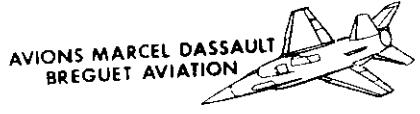

### MIRAGE F MANUAL 12

|     |                                                                                                                                                                                                                                                                                                            | Location .                  | Doc. | _ |
|-----|------------------------------------------------------------------------------------------------------------------------------------------------------------------------------------------------------------------------------------------------------------------------------------------------------------|-----------------------------|------|---|
| tem | Name - Characteristics and Functions                                                                                                                                                                                                                                                                       | Access Door No.             | S    | - |
|     | AIR DATA COMPUTER (See 12-2)                                                                                                                                                                                                                                                                            |                             |      |   |
| 24F | 26 V AC SYSTEM 1 TRANSFORMER (See 10-2)                                                                                                                                                                                                                                                                 |                             |      |   |
| 26F | 26 V AC SYSTEM 2 TRANSFORMER (See 10-2)                                                                                                                                                                                                                                                                 |                             |      |   |
| 28F | SPHERICAL INDICATOR (See 12-3)                                                                                                                                                                                                                                                                          | Cockpit Instrument panel | X    |   |
| 30F | EMERGENCY GYROMAGNETIC COMPASS (See 12-3)                                                                                                                                                                                                                                                                  | Equipment bay (13-00)    | ×    |   |
|     | The emergency gyromagnetic compass generates, by means of the rough magnetic heading from lower flux valve 75F, an emergency gyromagnetic heading (EGMS). It distributes this heading to interface electronics box 145F, spherical indicator 28F and symbol generator box 35A through two synchromachines. |                             |      |   |
|     | It consists of a single box comprising a directional gyroscope slaved: - in elevation, to the lubber reference line (LRL) - in azimuth, to the compensated magnetic heading.                                                                                                                               |                             |      |   |
|     | In addition it comprises: - a potentiometer for setting the mean flight latitude (correction of the Earth rotation) - a rough magnetic heading compensating system (only in semi-circular mode) - a self-test unit supplying a reliability signal.                                                         |                             |      |   |
|     | It is controlled by MHSP 37F: - starting-up («EMG GYRO-ON/OFF») - fast resetting («ERECT»).                                                                                                                                                                                                                |                             |      |   |
|     |                                                                                                                                                                                                                                                                                                            |                             |      |   |
|     |                                                                                                                                                                                                                                                                                                            |                             |      |   |

{198}------------------------------------------------

|      | Kestricted                                                                                                                                                                                                                                                                                                                                                                                                                                                                                                                                                                                                                                                                                                                                                                                                                                         | M                           | ANU |
|------|----------------------------------------------------------------------------------------------------------------------------------------------------------------------------------------------------------------------------------------------------------------------------------------------------------------------------------------------------------------------------------------------------------------------------------------------------------------------------------------------------------------------------------------------------------------------------------------------------------------------------------------------------------------------------------------------------------------------------------------------------------------------------------------------------------------------------------------------------|-----------------------------|-----|
| Item | Name - Characteristics and Functions                                                                                                                                                                                                                                                                                                                                                                                                                                                                                                                                                                                                                                                                                                                                                                                                               | Location Access Door No. | D   |
| 31F  | GYRO SYSTEM DC SUPPLY FUSE-BREAKER  Protects the load shedding DC system 2 of GMH repetition forcing on navigation indicator 68F.                                                                                                                                                                                                                                                                                                                                                                                                                                                                                                                                                                                                                                                                                                                  | Electrical master box       | x   |
| 32F  | GYRO SYSTEM AC SUPPLY FUSE-BREAKER  Protects the AC system 1 supply of interface electronics box 145F.                                                                                                                                                                                                                                                                                                                                                                                                                                                                                                                                                                                                                                                                                                                                             | Electrical master box    | x   |
| 33F  | EMERGENCY GYROMAGNETIC COMPASS SUPPLY FUSE Protects the emergency AC system.                                                                                                                                                                                                                                                                                                                                                                                                                                                                                                                                                                                                                                                                                                                                                                       | Electrical master box    |     |
| 35F  | GYRO-ACCELEROMETER CENTER (See 12-3)                                                                                                                                                                                                                                                                                                                                                                                                                                                                                                                                                                                                                                                                                                                                                                                                               | Equipment bay (13-00)    | x   |
|      | The gyro-accelerometer center is located in a helium-filled and heat-controlled box.  It comprises a vertical reference gyroscope slaved to the Earth vertical, and a free directional gyroscope.  These gyroscopes stabilize the gimbals which support two horizontal reference accelerometers and one vertical reference accelerometer.  The center can operate: \nin vertical mode: \neither in «inertial» mode in conjunction with the main computer which sends out the precession commands of the vertical reference gyroscope  or in «attitude» mode, in which case the center operates as a self-contained unit with respect to the computer, just like a conventional gyroscopic center; \nin heading mode:  the center operates always in free directional mode.  The center is set to 5° in nose-down direction with regard to the LRL. |                             |     |

{199}------------------------------------------------

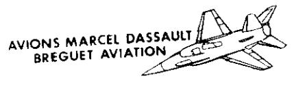

### MIRAGE F MANUAL 12

| BREGUET AV | DASSAULT Restricted                                                                                                                                                                                                                                                                                                                                                                                                                                                                                                                                                                                                                                                                                                                                                        |                                   |      |  |
|------------|----------------------------------------------------------------------------------------------------------------------------------------------------------------------------------------------------------------------------------------------------------------------------------------------------------------------------------------------------------------------------------------------------------------------------------------------------------------------------------------------------------------------------------------------------------------------------------------------------------------------------------------------------------------------------------------------------------------------------------------------------------------------------|-----------------------------------|------|--|
|            | Name - Characteristics and Functions                                                                                                                                                                                                                                                                                                                                                                                                                                                                                                                                                                                                                                                                                                                                       | Location Access Door No.       | Doc. |  |
| 36F        | Data received by the center consist of : - operation commands and precession commands from interface electronics box 145F.  Data supplied by the center consist of : - roll and pitch, in synchro form, to spherical indicator 28F - platform roll, pitch and azimuth, platform northward, eastward and vertical accelerations to interface electronics box 145F.  NAVIGATION CONTROL FUSE-BREAKER  Protects DC system 1 supply of mode and heading selector panel 37F.                                                                                                                                                                                                                                                                                                    | Cockpit Circuit breaker box | X    |  |
| 37F        | MODE AND HEADING SELECTOR PANEL                                                                                                                                                                                                                                                                                                                                                                                                                                                                                                                                                                                                                                                                                                                                            | Cockpit RH console             |      |  |
|            | On the front face, it comprises:  - a mode operation selector 1 of the inertia/Doppler system; it provides footstarting of main computer 104F, interface electronics box 145F, gyro-accelerometel center 35F, Doppler radar 34S, navigation indicator 68F spherical indicator 28F and navigation control panel 9F,  - a land/sea operation switch 6 for the Doppler radar («DPL LAND/SEA»)  - a button 2 and indicator light 5 in relation with the transfer gyroscope («TRF»);  - a switch 3 controlling the starting-up of emergency gyromagnetic compass 30F («EMG GYRO - ON/OFF»)  - a switch 4 used for fast erection of the gyroscope of emergency gyromagnetic compass 30F or reading of the emergency gyromagnetic heading on navigation indicator 68F («READ GM») | ;                                 |      |  |
|            |                                                                                                                                                                                                                                                                                                                                                                                                                                                                                                                                                                                                                                                                                                                                                                            |                                   |      |  |

{200}------------------------------------------------

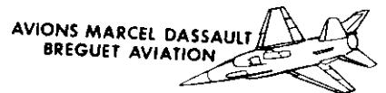

### MIRAGE F

Restricted MANUAL 12 Item Name - Characteristics and Functions Doc. Location Access Door No. S 38F ROLL/PITCH OUTPUT MULTIPLIER (See 12-3) 41F UPPER FLUX VALVE Fin Х Provides the magnetic heading to interface electronics 61F NAVIGATION FUSE-BREAKER Electrical Χ Protects DC system 1 supply of mode and heading selector master box 62F INTERFACE ELECTRONICS BOX FUSE Electrical Х Protects emergency AC system supply of navigation master box indicator 68F 68F NAVIGATION INDICATOR Cockpit Х Displays data provided by various navigation Instrument aid components through panel - a compass card showing the gyromagnetic heading provided either by interface electronics box 145F or by emergency gyromagnetic compass 30F, or the true heading provided by main computer 104F; - a switch for selecting gyromagnetic or true heading to be shown on the card; - a double pointer showing the true bearing of the navigation target or auxiliary target; - a navigation distance counter (graduated in km); - a switch for selecting data to be shown by the single pointer;

{201}------------------------------------------------

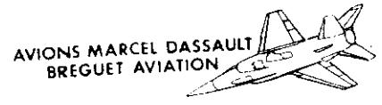

### MIRAGE F

|      |                                                                                                                                                                                                                                                                                                                                                                                                                                                                               | Location                 | Doc      |                          |
|------|-------------------------------------------------------------------------------------------------------------------------------------------------------------------------------------------------------------------------------------------------------------------------------------------------------------------------------------------------------------------------------------------------------------------------------------------------------------------------------|--------------------------|----------|--------------------------|
| tem  | Name - Characteristics and Functions                                                                                                                                                                                                                                                                                                                                                                                                                                          | Access Door No.          | <u>s</u> | -                        |
|      | <ul> <li>a single pointer providing, according to selection:</li> <li>relative bearing of radio compass</li> <li>relative bearing of AIR-to-GROUND missile homer</li> <li>relative bearing of radar antenna;</li> <li>a symbol repeating the heading followed by the autopilot;</li> <li>the failure warning flags signaling:</li> <li>heading failure (TH or GMH)</li> <li>double pointer data failure</li> <li>distance failure</li> <li>single pointer failure.</li> </ul> |                          |          |                          |
| 73F  | EMERGENCY GYROMAGNETIC COMPASS FUSE-BREAKER                                                                                                                                                                                                                                                                                                                                                                                                                                | Electrical master box | ×        |                          |
|      | Protects DC system 1 supply of emergency gyromagnetic compass 30F through mode and heading selector panel 37F.                                                                                                                                                                                                                                                                                                                                                                |                          |          |                          |
| 75F  | LOWER FLUX VALVE (See 12-3)                                                                                                                                                                                                                                                                                                                                                                                                                                                   |                          |          |                          |
| ,    | Provides the magnetic heading to emergency gyromagnetic compass 30F.                                                                                                                                                                                                                                                                                                                                                                                                          | Navigation               | ×        |                          |
| 91F  | DIODE MODULE                                                                                                                                                                                                                                                                                                                                                                                                                                                                  | junction box             |          |                          |
|      | Protects navigation supply relay 141F.                                                                                                                                                                                                                                                                                                                                                                                                                                        | Navigation               |          | <                        |
| 92F  | DIODE MODULE  Protects fan unit supply relay 151F.                                                                                                                                                                                                                                                                                                                                                                                                                            | junction bo              | ×        |                          |
| 102F | NAVIGATION CONTROL PANEL FUSE-BREAKERS                                                                                                                                                                                                                                                                                                                                                                                                                                        | Electrical master box |          | ×                        |
|      | Protect AC system 1 supply of navigation control panel 9                                                                                                                                                                                                                                                                                                                                                                                                                      | )F.                      |          |                          |
|      |                                                                                                                                                                                                                                                                                                                                                                                                                                                                               |                          |          |                          |
|      |                                                                                                                                                                                                                                                                                                                                                                                                                                                                               |                          |          |                          |
|      |                                                                                                                                                                                                                                                                                                                                                                                                                                                                               |                          |          |   -  -  -  - |
|      |                                                                                                                                                                                                                                                                                                                                                                                                                                                                               |                          |          | ]                        |
|      |                                                                                                                                                                                                                                                                                                                                                                                                                                                                               |                          |          |                          |

{202}------------------------------------------------

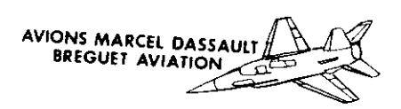

MIRAGE F MANUAL 12

| Item | Name - Characterists                                                                                                                                                                                                                                                                                                                                                                                                                                                                                                                                                                                                                                                                                                                             |                             | <del></del> |
|------|--------------------------------------------------------------------------------------------------------------------------------------------------------------------------------------------------------------------------------------------------------------------------------------------------------------------------------------------------------------------------------------------------------------------------------------------------------------------------------------------------------------------------------------------------------------------------------------------------------------------------------------------------------------------------------------------------------------------------------------------------|-----------------------------|-------------|
|      | Name - Characteristics and Functions                                                                                                                                                                                                                                                                                                                                                                                                                                                                                                                                                                                                                                                                                                             | Location Access Door     |             |
| 104F | MAIN COMPUTER (See 10-5)  The main computer has the following functions: - computation of platform angle $\alpha$ - computation of inertial speed and position - computation of gyro-accelerometer center precession commands - computation of Doppler reference speed - computation of prepositioning of Doppler tracking windows when Doppler data is stored - computation of aerodynamic reference speed - updating of inertial speed in relation to reference speed - management of operating modes of inertia/Doppler system as a function of the status of its various components.                                                                                                                                                         | Equipmen bay (13-00)        |             |
| 126F | FILTERED 26 V AC TRANSFORMER (See 10-2)                                                                                                                                                                                                                                                                                                                                                                                                                                                                                                                                                                                                                                                                                                       |                             |             |
| 127F | TRANSFER GYROSCOPE CONNECTOR  Allows for connection of the transfer gyroscope during alignment of the gyro-inertial system.                                                                                                                                                                                                                                                                                                                                                                                                                                                                                                                                                                                                                      | LH main U/C well         |             |
|      | NAVIGATION OUTPUT MULTIPLIER  It is an electronics box intended to convert certain digital data supplied by main computer 104F into analog data that can be used by the radar and by the reconnaissance system.  These data consist of: - coordinates LA and GA of present point - true heading TH - roll R - altitude H - radio-altimeter height h - horizontal ground speed GSH - horizontal ground speed/radio altimeter height ratio GSH/h - course deviation $\sin (\theta - TH)$ , $\cos (\theta - TH)$ - target altitude HB - target distance $\rho$ - drift X - radar antenna relative bearing BRG ant - radar antenna tilt T ant.  The electronics box has its own power supply which provides the voltages required for its operation. | Equipment bay (13-00) | X           |

{203}------------------------------------------------

# MIRAGE F MANUAL 12

|      | Name - Characteristics and Functions                                                                                                                                                                                                                                                                                                                                                                                                                                                                                                                                                                                                                                                                                                                                                                                                                                                                                                                                                                                                                                                                                                                                                                                                                                                                                                                                                                                                                                                                                                                                                                                                                                                                                                                                                                                                                                                                                                                | Location Access Door No. | S | - |
|------|-----------------------------------------------------------------------------------------------------------------------------------------------------------------------------------------------------------------------------------------------------------------------------------------------------------------------------------------------------------------------------------------------------------------------------------------------------------------------------------------------------------------------------------------------------------------------------------------------------------------------------------------------------------------------------------------------------------------------------------------------------------------------------------------------------------------------------------------------------------------------------------------------------------------------------------------------------------------------------------------------------------------------------------------------------------------------------------------------------------------------------------------------------------------------------------------------------------------------------------------------------------------------------------------------------------------------------------------------------------------------------------------------------------------------------------------------------------------------------------------------------------------------------------------------------------------------------------------------------------------------------------------------------------------------------------------------------------------------------------------------------------------------------------------------------------------------------------------------------------------------------------------------------------------------------------------------------|-----------------------------|---|---|
| 141F | NAVIGATION SUPPLY RELAY Controlled by MHSP 37F, it allows for emergency supply of NAV IND 68F.                                                                                                                                                                                                                                                                                                                                                                                                                                                                                                                                                                                                                                                                                                                                                                                                                                                                                                                                                                                                                                                                                                                                                                                                                                                                                                                                                                                                                                                                                                                                                                                                                                                                                                                                                                                                                                                      | Navigation junction box     | × |   |
| 142F | SPHERICAL INDICATOR FUSE-BREAKER Protects DC system 1 supply of spherical indicator 28F through mode and heading selector panel 37F.                                                                                                                                                                                                                                                                                                                                                                                                                                                                                                                                                                                                                                                                                                                                                                                                                                                                                                                                                                                                                                                                                                                                                                                                                                                                                                                                                                                                                                                                                                                                                                                                                                                                                                                                                                                                                | Electrical master box    | X |   |
| 145F | INTERFACE ELECTRONICS BOX This box fulfills the following functions: - electrical operation of center 35F: - slaving circuits of the center gimbals in roll, pitch and elevation, - precession control of the vertical reference gyroscope through signals received from computer 104F or from the center erectors, - various ancillary systems: supply, temperature control, starting-up timing, - failure detection of the above mentioned functions; - data acquisition: consists of the digitalization of certain parameters provided by center 35F and flux valve 41F: - coding of roll, pitch and directional reference data, - coding and processing (inclusive of magnetic compensation) of flux valve magnetic heading, - conversion of accelerometer signals into speed incrementand coding; - magnetic monitoring function: - consists in the generation of the normal gyromagnetic heading data through numerical combination and filtering: - of the directional reference signal, - of the compensated magnetic heading; - interface with the NWS: - amplification, matching and distribution of the heading analog data, - coupling with the digibus.  This box comprises: - a microprocessor and its memory, whose functions are: - to dialog with the center computer through the digibus.  This box comprises: - a microprocessor and its memory, whose functions are: - to dialog with the center computer through the digibus.  This portion the self-test of the box and of the center; - to generate the gyromagnetic heading data, - to perform the self-test of the box and of the center; - electrical circuits: - for data acquisition - for coding - for slaving - for roupling with the digibus; - an internal supply On the front face of this box are located: - a magnetic compensation plug-in box of the flux valve the display of the gyroscope drift corrections - the controls of the ground maintenance tests. | g s,                     | X |   |

{204}------------------------------------------------

|      | Restricted                                                                                                                                                                                                                                                                               | MAN                                            |
|------|------------------------------------------------------------------------------------------------------------------------------------------------------------------------------------------------------------------------------------------------------------------------------------------|------------------------------------------------|
| lten | Name - Characteristics and Functions                                                                                                                                                                                                                                                     | Location                                       |
| 1461 | SWITCHING RELAY Controlled by MHSP 37F, it allows for selection either GMH or of EGMH intended for the NAV IND 68F.                                                                                                                                                                      | Access Door No.  IG Navigation junction box of |
| 147F | MARK BUTTON When depressed a first time, this button allows for recording of the coordinates of a noteworthy point upor overflight. The coordinates are displayed, and then are successively assigned to one of the three marks (M21, M22, M23) by pressing a second time on the button. | Cockpit LH console                          |
| 148F | NAVIGATION OUTPUT MULTIPLIER FUSE-BREAKE Protects DC system 1 supplying navigation output multiplier 135F.                                                                                                                                                                               | R Electrical X master box                      |
| 149F | NAVIGATION OUTPUT MULTIPLIER SUPPLY RELAY Controlled by MHSP 37F, it allows for supply of navigation output multiplier 135F.                                                                                                                                                             | Navigation X junction box                      |
| 150F | MARK FUSE-BREAKER Ensures supply to mark button 147F through DC system 1                                                                                                                                                                                                                 | Electrical X master box                        |
| 151F | FAN UNIT SUPPLY RELAY Allows for supply of fan unit 10M.                                                                                                                                                                                                                                 | Navigation X Junction box                      |
| 176F | NAVIGATION INDICATOR FUSE-BREAKER Protects DC system 1 supply of navigation indicator 68F through mode and heading selector panel 37F                                                                                                                                                    | Electrical X master box                     |
| 96F  | DIODE MODULE Protects heading switching relay 146F.                                                                                                                                                                                                                                      | Navigation X junction box                      |
| 97F  | DIODE MODULE Protects the NOM supply relay 149F.                                                                                                                                                                                                                                         | Navigation X junction box                      |
| MO   | FAN UNIT Allows for cooling of the navigation system.                                                                                                                                                                                                                                    | Equipment bay (13-00)                          |
|      |                                                                                                                                                                                                                                                                                          |                                                |
|      |                                                                                                                                                                                                                                                                                          |                                                |

{205}------------------------------------------------

### MIRAGE F MANUAL 12

|       |                                                                                                                                                                                                                                                                                                                                    | Location                         | Doc.       | _   |
|-------|------------------------------------------------------------------------------------------------------------------------------------------------------------------------------------------------------------------------------------------------------------------------------------------------------------------------------------|----------------------------------|------------|-----|
| tem   | Name - Characteristics and Functions                                                                                                                                                                                                                                                                                               | Access Door No.                  | <u>s</u> 1 | -\. |
| 98R   | RADIO COMPASS/MISSILE SWITCHING RELAY                                                                                                                                                                                                                                                                                              | Navigation junction box       | ×          |     |
| 9811  | It is controlled by the single pointer selector switch of navigation indicator 68F: in «M» position, it allows for transit of the missile head true bearing, and in «C» position, for transit of the radio compass true bearing.                                                                                                   |                                  |            |     |
| 124R  | RADIO COMPASS RECEIVER (See 12-8)                                                                                                                                                                                                                                                                                               |                                  |            |     |
| 166R  | RADIO COMPASS/RADAR SWITCHING RELAY                                                                                                                                                                                                                                                                                                | Navigation junction box          | ×          |     |
| 10011 | It is controlled by the single pointer selector switch of navigation indicator 68F: in «R» position, it allows for transit of the radar true bearing and in «C» position, for transit of the radio compass true bearing.                                                                                                           |                                  |            |     |
| 167R  | DIODE MODULE                                                                                                                                                                                                                                                                                                                       | Navigation junction box       | ×          |     |
|       | Protects radio compass/radar switching relay 166R.                                                                                                                                                                                                                                                                                 | Navigation                       | ×          |     |
| 168R  | DIODE MODULE                                                                                                                                                                                                                                                                                                                       | junction box                     |            |     |
|       | Protects radio compass/missile switching relay 98R.                                                                                                                                                                                                                                                                                | Electrical                       | ×          |     |
| 32\$  | DOPPLER SUPPLY FUSE-BREAKER  Doppler radar 34S.                                                                                                                                                                                                                                                                                    | master box                       |            |     |
|       | Protects AC system 2 supplying Doppler radar 34S.                                                                                                                                                                                                                                                                                  | Navigation                       | . ×        |     |
| 33\$  | DOPPLER RADAR SUPPLY RELAY  Controlled by the MHSP 37F, it allows for supply of                                                                                                                                                                                                                                                    | junction bo                      | ×          |     |
|       | Controlled by the MHSP 377, it and a Doppler radar 34S through AC system 2.                                                                                                                                                                                                                                                        |                                  |            |     |
| 34\$  | DOPPLER RADAR                                                                                                                                                                                                                                                                                                                      | Doppler be between F.3 and | 1          |     |
|       | Characteristics: - transmission of three beams following a Y configuratio - transmission of three beams following a Y configuratio (two forward beams, one backward beam); - continuous transmission in wavelengths held to frequence of:                                                                                          | n ncies                       |            |     |
|       | of: - 13,325 MHz for the forward beams - 13,314.3 MHz for the backward beam; - width of beams at 3dB (transmission or reception) - longitudinal ≤ 6° - transversal ≤ 13° - storage threshold: S/N ratio = 7 dB; - acquisition time (research) ≤ 15 s; - availability after start ≤ 10s; - test: longitudinal test speed = 360 m/s. |                                  |            |     |

{206}------------------------------------------------

|      | Name - Characteristics and Europiana                                                                                                                                                                                                                                                                                                                                                                                      | Location                   | Do       | C. |
|------|---------------------------------------------------------------------------------------------------------------------------------------------------------------------------------------------------------------------------------------------------------------------------------------------------------------------------------------------------------------------------------------------------------------------------|----------------------------|----------|----|
| Item | Name - Characteristics and Functions                                                                                                                                                                                                                                                                                                                                                                                      | Access Door No.            | <u>S</u> | 1  |
|      | Range: - altitude: 0 to 15,000 m; - speed: 90 to 2700 km/h; - attitude: - roll < 30° - pitch over land or sea of Beaufort force superior to 3: ∓60° at low altitude and ∓20° at max. altitude, over sea of force 2: ∓40° at altitudes lower than 3000 m.  The Doppler radar provides the main computer with the Doppler frequencies (according to beams A, B, C), transposed around the reference frequency fo = 100 kHz. |                            |          |    |
| 98S  | DIODE MODULE  Protects Doppler radar supply relay 33S.                                                                                                                                                                                                                                                                                                                                                                    | Navigation junction box | ×        |    |
| 1U   | DOPPLER SHUNTING UNIT (See 10-5)                                                                                                                                                                                                                                                                                                                                                                                       |                            |          |    |
| 2U   | NCP SHUNTING UNIT (See 10-5)                                                                                                                                                                                                                                                                                                                                                                                           |                            |          |    |
| 4U   | COMPATIBILITY SHUNTING UNIT (See 10-5)                                                                                                                                                                                                                                                                                                                                                                                 |                            |          |    |
| 40Z  | TEST CONNECTOR                                                                                                                                                                                                                                                                                                                                                                                                            | Nose U/C well           |          |    |
|      | Allows for connection of test equipment for repair of interface electronics box 145F and gyro-accelerometer platform 35F.                                                                                                                                                                                                                                                                                                 | WEII                       |          |    |
| 42Z  | TEST CONNECTOR                                                                                                                                                                                                                                                                                                                                                                                                            | Cockpit                    |          |    |
|      | Allows for connection of test equipment for repair of navigation indicator 68F, mode and heading selector panel 37F, spherical indicator 28F and navigation control panel 9F.                                                                                                                                                                                                                                             | control pedestal        |          |    |
| 135Z | TEST CONNECTOR                                                                                                                                                                                                                                                                                                                                                                                                            | F.10                       |          |    |
|      | Allows for connection of test equipment for repair of interface electronics box 145 F and Doppler radar 34S.                                                                                                                                                                                                                                                                                                              |                            |          |    |
| 137Z | TEST CONNECTOR                                                                                                                                                                                                                                                                                                                                                                                                            |                            |          |    |
|      | Allows for connection of test equipment for repair of roll/pitch output multiplier 38F, angle-of-attack indicator 19F, radio compass 124R, navigation indicator 68F and Doppler radar 34S.                                                                                                                                                                                                                                | Nose U/C well           |          |    |

{207}------------------------------------------------

\*\* · · · · · · · · · · · · · · · · · · ·

{208}------------------------------------------------

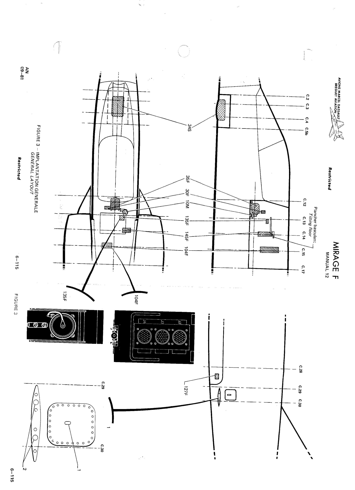

{209}------------------------------------------------

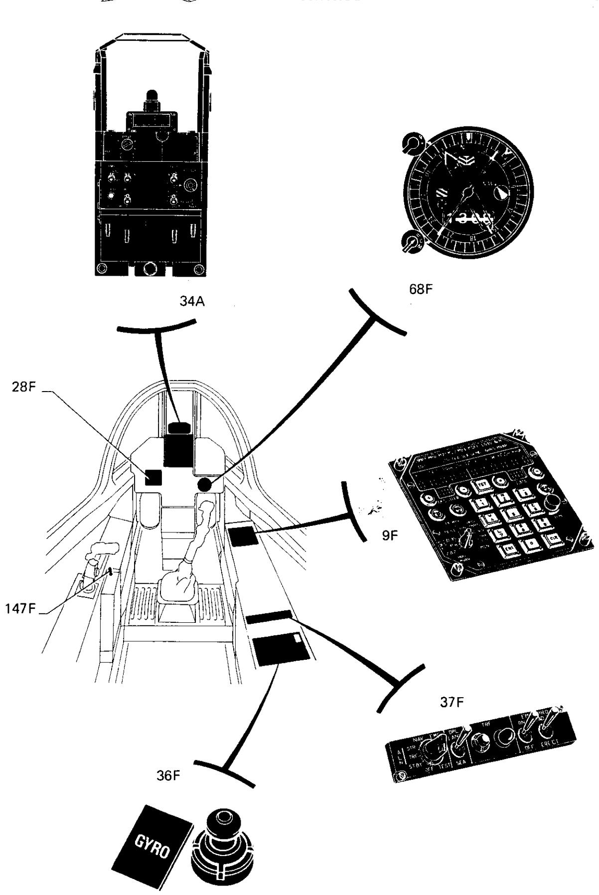

FIGURE 4 – IMPLANTATION AU POSTE PILOTE COCKPIT LA YOUT

{210}------------------------------------------------

{211}------------------------------------------------

#### HIBRID GYRO-INERTIAL NAVIGATION SYSTEM

- GENERAL
- PRINCIPLE OF GYRO-INERTIAL NAVIGATION
- OPERATION OF GYRO-ACCELEROMETER CENTER INERTIA-DOPPLER SOFTWARE
- HYBRIDIZATION OF GYRO-INERTIAL SYSTEM INERTIA-DOPPLER SOFTWARE
- RECAPITULATION OF VARIOUS OPERATING MODES OF THE SYSTEM AND OF VARIOUS DATA SUPPLIED.

{212}------------------------------------------------

4. 4.

{213}------------------------------------------------

#### **HYBRID GYRO-INERTIAL NAVIGATION SYSTEM**

#### **GENERAL**

The purpose of the hybrid gyro-inertial navigation system is to provide all data regarding the accelerations, speeds, attitudes and position of the aircraft.

These data are transmitted to the indicators and to the localization, navigation and attack software modules of the main computer (see 10-8).

The gyro-inertial navigation system comprises the following:

- the gyro-accelerometer center, which senses the attitude, heading and acceleration data; these data are transmitted to the main computer through the interface electronics box which sets the information in code form to allow for its use;
- the interface electronics box, which dialogs with the main computer and interchanges the information between the main computer and the gyro-accelerometer center;
- the Doppler radar, which senses the aircraft horizontal speed components and transmits them to the main computer; this horizontal speed is taken as a reference information for computing the updating of data provided by the gyro-accelerometer center and resetting the latter with respect to the local vertical;
- the air data computer; connected with the angle-of-attack probe, it allows the computer to determine the air speed; this speed is used for various operation modes as a reference information for computing the updating of data provided by the gyro-accelerometer center;
- the main computer, which processes the data required for the resetting and updating of the gyro-accelerometer center and for the navigation computation.
- It dialogs with the interface electronics box and computes the data for resetting of the gyro-accelerometer center (comparison of accelerometer speed with reference speed and computation of accelerometer data updating).

Resetting, stabilization and updating of the gyro-accelerometer center through speed information from the Doppler radar or the air data computer, are functions generated by the inertia-Doppler system software.

The gyro-accelerometer center, interface electronics box and main computer assembly allows for carrying out inertial navigation. The updating of the pavigation data provided by this assembly, through data coming from the Doppler radar or the air data system, allows for greatly improved performance.

{214}------------------------------------------------

{215}------------------------------------------------

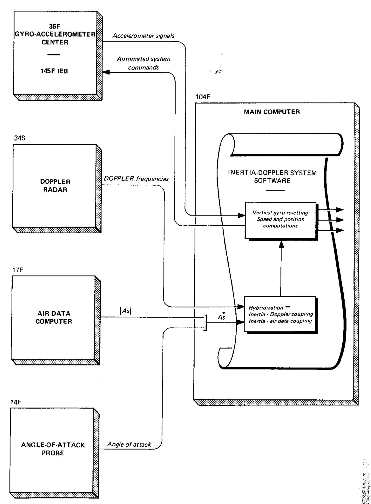

FIGURE 4M - ORGANIZATION CHART OF HYBRID GYRO-INERTIAL NAVIGATION SYSTEM

{216}------------------------------------------------

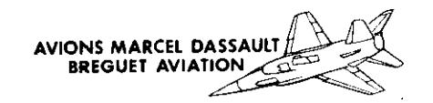

# MIRAGE F

#### PRINCIPLE OF GYRO-INERTIAL NAVIGATION

#### 1 - INTRODUCTION

As for any navigation procedure, gyro-inertial navigation is intended to determine the position and speed of a moving object.

Since inertia is a mechanical property of matter, expressing its dislike for alteration of its speed condition, let us take an example to introduce this notion of inertia.

Suppose a moving car, with a blind folded passenger sitting next to the driver. This passenger having no visual contact with the outside, let us see to what extent he can reason out the distance covered through the feeling imparted by the car's motion.

An increase in the car's speed will convey to the passenger a feeling of his being pressed firmly against the back of his seat. Conversely, braking by the driver will convey the feeling of his being propelled forward. Add to this that cornering to the right or to the left will cause the passenger to topple over to the left or to the right. We may therefore deduce that, if he be sufficiently responsive, this passenger could in principle carry out the following operations:

- detect the speed variations of the car, through his feeling of being pushed forward or pushed

back,

- detect the changes in direction of the car, also through his feeling of being pushed to the right or to the left.

- deduce the distance covered by means of a number of suitable mathematical operations.

One would say that this passenger is performing inertial navigation, that is localization of the car in relation to the terrain over which it travels, by shrewdly analyzing the forces to which he is subject due to the car's motion.

These forces are mainly in response to the inertia of his body: inertia is characterized by the relation (a constant ratio for each physical body) that exists between these forces and the corresponding speed variations within a given time limit.

Of course, to carry out such a program within the required precision limits would be most difficult, if not impossible, for a human being.

It is however possible for a computer to fulfill this program, with the aid of data provided by high-precision mechanisms and by command mechanisms.

#### 2 - BASIC PRINCIPLES OF GYRO-INERTIAL NAVIGATION (figure 5)

We have just seen that, placed in a vehicle acting as a screen against outside information, it is possible to solve the fundamental navigation problem, that is the knowledge at all times of the vehicle's travel, based solely on the data that can be measured under these conditions: the accelerations to which the vehicle has been submitted and which have been measured by detectors installed in this vehicle (accelerometers).

Computations allowing to determine the distance covered, through data provided by the accelerometers, are carried out by an electronic computer.

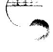

{217}------------------------------------------------

### MIRAGE F

#### MANUAL 12

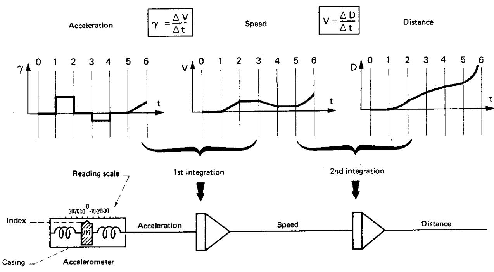

Restricted

### A - MEASUREMENT OF ACCELERATION - DETERMINATION OF SPEED AND DISPLACEMENT

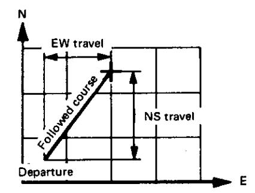

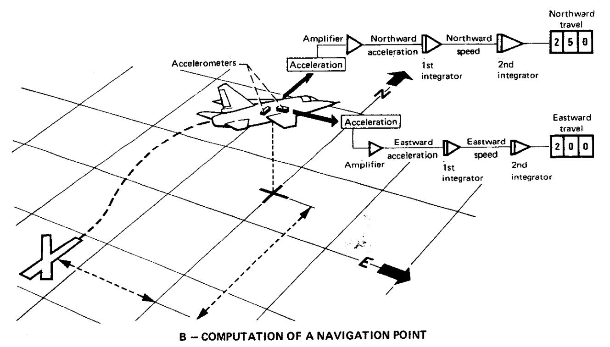

FIGURE 5 - SCHEMATIC DIAGRAM OF INERTIAL NAVIGATION

{218}------------------------------------------------

MIRAGE F

MANUAL 12

The function of the computer thus mainly consists in computing the distance covered by double introduction of the time factor into the processing of the measured acceleration signals (introduction of the time factor into the signal processing constitutes the integration of this signal).

As a matter of fact, by definition, the acceleration corresponds to the speed variation within a given period of time; speed itself corresponds to the variation in covered distance within a given period of time. Reciprocally:

-speed is obtained from processing of the acceleration with introduction of the time factor,

i.e. an integration of acceleration;

- the covered distance is obtained from processing of the speed with introduction of the time factor, i.e. an integration of speed.

To conclude, two successive integrations of the acceleration in time lead to the expected result:

- the first integration gives speed,

- the second integration gives the distance covered.

The previous figure gives, for various accelerations, the corresponding values of speeds and displacements.

In an aircraft, the need to know the displacements has led to use two horizontal accelerometers. One is for measuring the accelerations along North-South axis, the other for measuring the accelerations along East-West axis.

So, knowing the aircraft position upon departure, it will be possible to determine its instantaneous position at every moment.

The figure represents the two accelerometric channels associated with the North-South and East-West accelerometers; in the example shown, the aircraft has covered 250 nautical miles northward, and 200 nautical miles eastward since take-off.

### 3 - PRINCIPLE OF ACCELEROMETERS AND NOTION OF ACCELEROMETER READING (figure 6)

#### A - Principle

Placed in a moving body, an accelerometer permits to measure the acceleration undergone by this body along a given axis.

The operation of an accelerometer can be understood by considering it as a mass m sliding without any friction along two parallel and rigid rails whose purpose is to limit the displacements of this mass to a direction X specific to the casing and called axis of sensitivity or axis of entry of the accelerometer. The mass m is linked to the casing by a spring acting as a dynamometer.

Whenever the accelerometer undergoes an acceleration  $\gamma$  along its axis of sensitivity, the mass m is subjected to a force  $F=m\gamma$  whose direction is opposite to the acceleration. Such force causes a displacement of the mass resulting in an extension (or compression) of the spring which then exerts a return force Fr=Kx (where x represents the displacement of «m» and k the coefficient of elongation of the spring); a balance between these two forces is expressed by F=Fr, i.e.  $m\gamma=kx$ .

Hence it is possible to deduct :  $x = \frac{m}{k} \gamma$ .

Since  $\frac{M}{k}$  is a permanent ratio for a given accelerometer, one simply has to measure the displacement x to obtain a signal proportional to the acceleration.

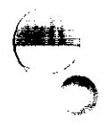

{219}------------------------------------------------

### MIRAGE F

MANUAL 12

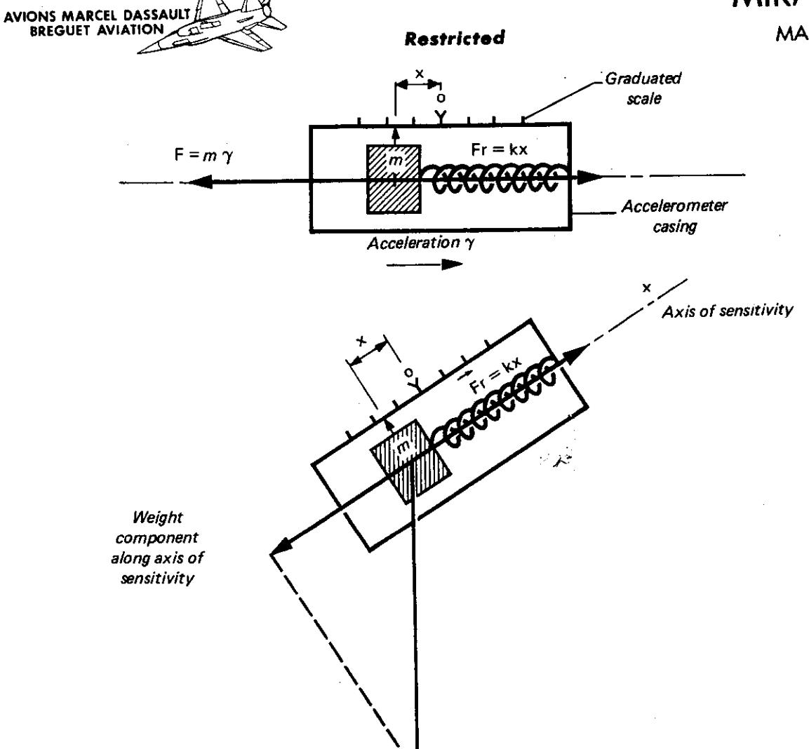

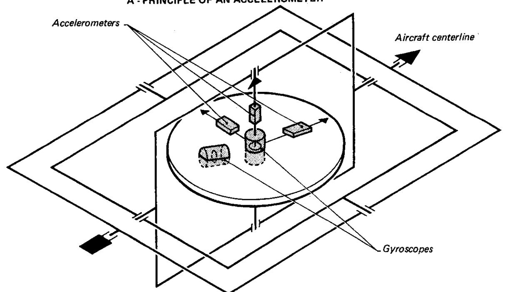

B - INSTALLATION OF ACCELEROMETERS ON A STABILIZED PLATFORM

FIGURE 6 — PRINCIPLE OF ACCELEROMETERS AND INSTALLATION ON A STABILIZED PLATFORM

{220}------------------------------------------------

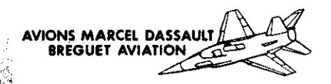

### MIRAGE F

MANUAL 12

NOTE: It should be remembered that, when an accelerometer is subjected to acceleration along any direction at variance with its axis of sensitivity, it will detect only the acceleration projection exerted along its axis of sensitivity.

Restricted

B - Applying the principle of accelerometers to gyro-inertial navigation

Two accelerometers mounted on a gyro-inertial platform measure: the one, accelerations of the bearer vehicle following the North-South ground axis; the other, accelerations of the bearer vehicle following the East-West ground axis.

However, should one of these accelerometers not be absolutely perpendicular to the local gravity field, it will detect the projection of the Earth's gravitational force (mg) on its axis of sensitivity. This means that an acceleration cannot be measured directly by means of an accelerometer, since it cannot mark the difference between inertia forces (function of the acceleration) and Earth gravity force. And so, the concept of accelerometer reading. Therefore, to usefully digest an accelerometer reading one should:

- either know precisely, on the one hand, the directions of the accelerometer axes of sensitivity in relation to gravity and on the other hand, know with great precision the gravity import at a given spot,
- or make use of a system which will hold the accelerometers in a horizontal plane and thereby break free from gravity. It is this last solution which has been retained.

#### 4 - INSTALLATION OF ACCELEROMETERS ON A STABILIZED PLATFORM

A - Platform suspension (figure 6-B)

Whatever be the attitude of the aircraft in which they are installed, the accelerometers must be able to retain their horizontal position.

To this end, it is required to install them on a support called a platform, connected with the aircraft through a gimbal device which provides freedom from the aircraft's movements.

- B Platform stabilization (figure 7-A)
- (1) Purpose of the gyroscope in a gyro-inertial center.

To retain the platform in a horizontal position, one uses one of the essential characteristics of the gyroscope : its fixed position relative to space.

If one has a top spinning at high speed, with its pin hung by gimbals, this pin will remain fixed in space in relation to the stars. This fundamental characteristic is in fact the very first characteristic of the gyroscope.

(2) Preparation principle for stabilizing a platform.

The figure shows how to stabilize a platform using a gyroscope.

Accelerometers and gyroscopes are installed together on this platform. Assuming that this platform is initially horizontal in relation to an axis, if some disturbance causes it to swerve from this neutral position, the axis of the gyroscope will remain firm. However, the gyro box will move and the import of this travel will be translated into a signal by a sensor integrated with the gyro.

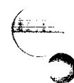

{221}------------------------------------------------

This signal is then amplified and sent to a slaving motor which will bring the assembly back to the initial stable position. In this configuration, the accelerometer will again perform normally and since it no longer detects any component brought about by gravity, it will solely measure the horizontal accelerations to which it is subjected in flight.

NOTE: This figure is simplified. It shows a stabilized platform, relative to a single axis, whereas the deviations must be measured in relation to two axes : roll, pitch.

Accelerometer stabilization must also occur around the yaw axis of the platform, so that these accelerometers may retain a known fixed direction.

NOTE: This type of system provides a vertical reference which may very well take the place of that given by a conventional vertical gyro.

C - Horizontal stabilization for navigation at ground level : automated system.

The aircraft bearing this platform moves in relation to Earth which is spherical and revolves on its axis.

The tendency of the platform, with its previously described stabilization device, is thus to be slaved to a fixed direction in relation to space. This will cause it to lose its initial horizontal position in relation to Earth.

One must therefore take these two factors into account : spherical Earth and its revolving around its axis, so as to be able to apply the corresponding corrections.

The automated system will thus modify the orientation of the platform as a function of these corrections so as to maintain it in horizontal position in relation with Earth (that is, perpendicular to the local vertical).

(1) Balancing due to the rotation of Earth (figure 7-B)

Take the case of a parked aircraft with its gyro-inertial system operating.

Let us then consider an observer located over the pole and looking at the gyro-inertial center located, let us suppose at the equator.

Now let us observe what happens if we apply no correction (the platform itself remaining in position on the equator):

- at the instant T the platform has been set level,

- at the instant T  $\pm$   $\Delta t$  for example, the gyroscope has well maintained the orientation, but the platform is no longer perpendicular to the local vertical.

To counteract this inconvenience, the platform is compelled to take its bearing around its North-South axis in proportion to the Earth rotation ratio so as to keep it at all times, perpendicular to the local vertical.

NOTE: As this correction is applied around a North-South axis, it should be noted that for a platform located elsewhere than on the equator, this correction is a function of the latitude; at the extreme, for a platform located at the pole, this correction would be zero.

{222}------------------------------------------------

### MIRAGE F

MANUAL 12

(2) Compensation caused by displacement of Earth's surface (curvature of the Earth) (figure 7-C)

Restricted

If we now consider the instance of an aircraft moving on the surface of the Earth, the local vertical will show a shift from its position at departure point.

Correction of the vertical can then be carried out in a fashion similar to that caused by the Earth's rotation.

If no correction is applied, since the platform maintains a fixed course in relation to space, it will seem to bank in relation to the aircraft, between the moment of its take-off and that of its landing.

The correction forces the platform to take its bearing so that the accelerometers will retain their horizontal position throughout the flight.

It will therefore be necessary that the platform rotate at the rotation speed of the aircraft in relation to Earth; the platform will otherwise remain parallel to itself and when the local vertical has turned by an angle A, the accelerometers will likewise make this angle A with the horizontal position.

This rotation speed equals:

$$\omega = V \times \frac{1}{R}$$

with V = speed of the aircraft R = radius of the Earth

NOTE: This correction is applicable along the two axes North-South and East-West.

(3) Introduction of correction commands: precession command (figure 7-D)

Thus, to maintain a platform constantly in a horizontal position, its orientation will have to be modified as a function of the corrections dealt with previously. This is done by shifting the axes of the gyroscopes. This correction is known as the precession command.

To this end, the various corrections are added, converted into signals and sent to the torque motors of the gyroscopes involved. The gyroscopes precess; these precessions once detected are in turn converted into signals. These signals are amplified and sent on to the slaving motors which modify the platform attitudes in proportion to the values of these corrective signals, as in the case of stabilization.

- D Orientation of the platform in azimuth (figure 8)
- (1) Need for a defined platform orientation

To obtain latitude and longitude data from accelerometric measurements, one should know precisely the orientation of the accelerometers in relation to the North-South and East-West axes of the Earth.

This orientation must not vary as a function of the yawing of the aircraft. It is therefore required to stabilize the platform in azimuth.

{223}------------------------------------------------

MANUAL 12

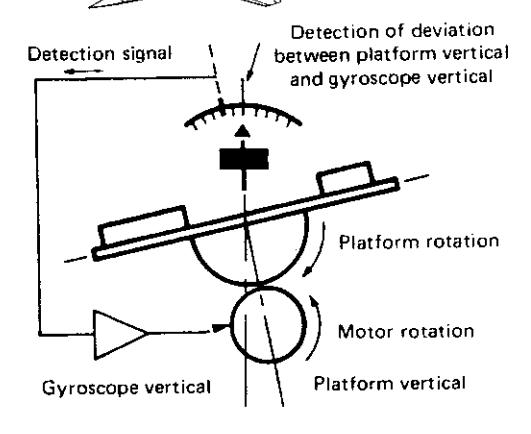

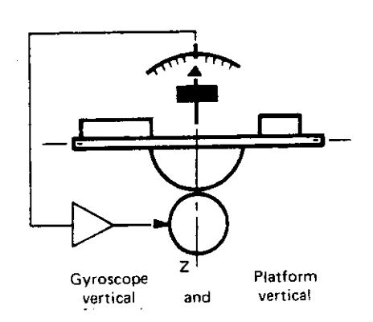

#### A - PRINCIPLE OF PLATFORM STABILIZATION

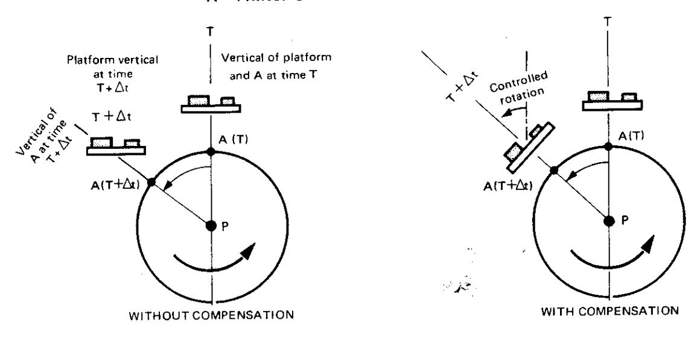

#### **B - COMPENSATION FOR EARTH ROTATION**

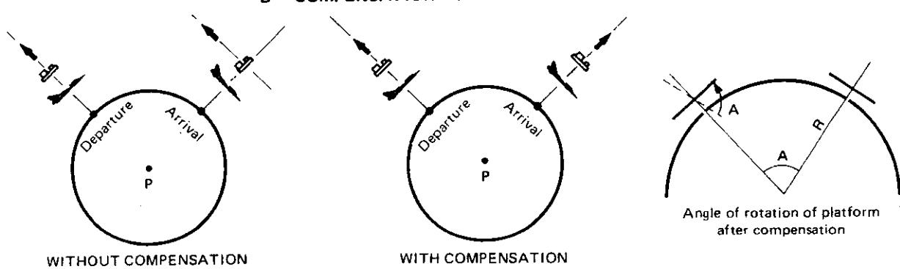

#### C - COMPENSATION FOR AIRCRAFT DISPLACEMENT WITH RESPECT TO EARTH SURFACE

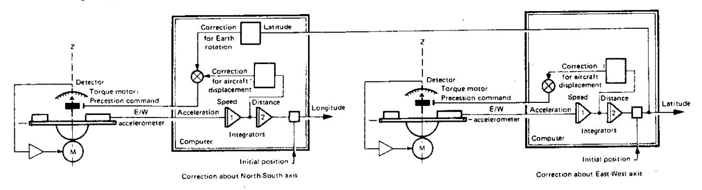

D - PRECESSION CONTROL

FIGURE 7 - STABILIZATION - AUTOMATED SYSTEM

{224}------------------------------------------------

MIRAGE F

One should remember that an accurate knowledge of the orientation of the platform in azimuth is also needed to correctly distribute the automated system commands: if these corrections were to be distributed in haphazard fashion, the platform would soon loose its horizontality.

#### (2) Determination of platform orientation in azimuth (figure 8-A)

When setting the gyro-accelerometer center in operation, the platform orientation is determined in relation to the geographic North.

This operation completed, the platform is left free and stabilized in azimuth, that is, it retains its orientation in relation to space and not in relation to landmarks.

Thus when one moves along the path AB, the axis of the North-South accelerometer shifts gradually in relation to the North due to this travel and to the Earth's rotation, thereby forming an angle  $\alpha$ .

As the computer knows the value of the Earth's rotation and the latitude of the spot, it computes constantly the value of this angle  $\alpha$ . The orientation of the center is therefore known at all times. It can therefore compute the accelerations according to the North-South and East-West ground

axes and correctly dispatch the required corrections to the automated system.

#### (3) Results affecting the position computation (figure 8-B)

The North-South and East-West accelerometers are not systematically set to Earth North-South and East-West directions. The computer will therefore proceed with an axis change operation through use of the computed accelerations, so as to obtain the accelerations in accordance with the Earth North-South and East-West axes.

#### 5 - PLATFORM ALIGNMENT (figure 9)

In the line of argument developped up to now, it has been accepted that the equipment was lined up and ready for operation. In reality, when starting up a gyro-inertial center, two essential operations have to be performed:

- the accelerometers have to be leveled (platform in horizontal position)
- the platform must be set in relation to the true North (or geographic North).

#### A - Search for horizontal position

During alignment, the platform is set in horizontal position by making use of data provided by erectors which detect the visible vertical (thus the need for the aircraft to remain motionless during alignment).

#### B - Determining the platform orientation in relation to the North

Orientation of the directional gyroscope axis is to be compared to a true heading information (provided by a transfer gyroscope or inserted by the pilot). This allows to find the initial azimuth angle  $\alpha$  of the platform, angle from which all gyro-inertial navigation computations will be carried out.

{225}------------------------------------------------

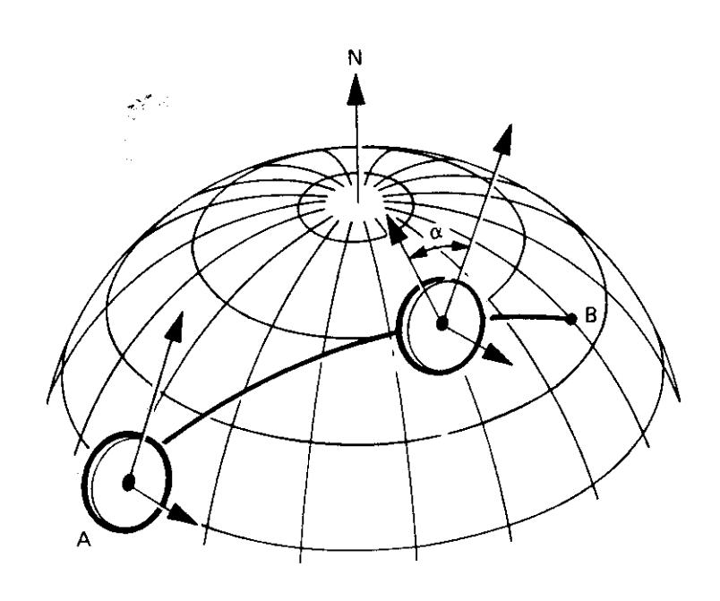

 ${\bf A}-{\bf DETERMINATION}$  OF PLATFORM ORIENTATION IN AZIMUTH

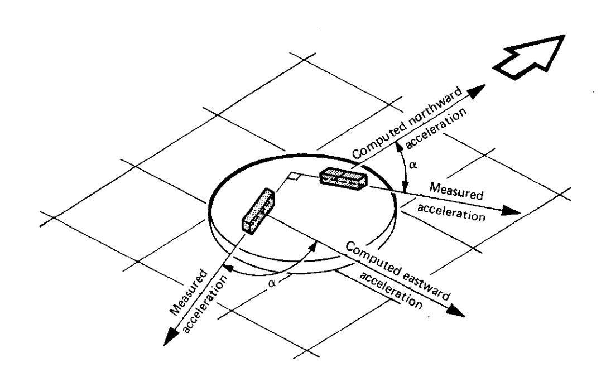

**B -- CONSEQUENCES ON COMPUTATION OF POSITION** 

{226}------------------------------------------------

MIRAGE F

MANUAL 12

#### 6 - OPERATION SYNTHESIS

In short, a gyro-inertial center installed in an aircraft functions as follows: the dual integration of acceleration measured by two accelerometers, provides the distance covered, and then the position (latitude, longitude).

These accelerometers must be perfectly horizontal:

- whatever be the attitude of the bearer aircraft: thus their installation on a platform hung on gimbals and their stabilization by means of gyroscopes;

- whatever be the position and the travel speed at ground level: thus, the automated system which permanently resets the horizontality of the platform, while recording the fact that the aircraft is located and travels over an approximately spherical Earth rotating about its polar axis. This automated system correction is computed from speed and position data, which in turn are prepared on the basis of accelerometric information.

Starting-up of a gyro-inertial center presupposes perfect horizontality and accurate setting of the accelerometers in relation to the North, and so an alignment phase.

To improve the system's performance, its indications are updated through use of data provided by another source. Indeed, pure inertial information will drift in the long run. It must therefore be reset in relation to a more permanent information.

This is the function of the Doppler radar system. Updating is computed through the error between the pure inertial navigation North and East speeds (detected by the accelerometers) and the North and East speeds computed from the horizontal speed provided by the Doppler radar.

The error signal allows:

- in the short run, and after major amplification, to correct the vertical setting of the vertical reference gyroscope of the gyro-accelerometer center,

- in the long run, to correct the pure inertial speed information (acquired by integration of the accelerometers).

A similar updating, even though less precise, can be carried out through aerodynamic speed information. But it should only be put to use if the Doppler radar information is unavailable.

1

{227}------------------------------------------------

MIRAGE F

MANUAL 12

#### 7 - POSITIONING IN VERTICAL PLANE - PRINCIPLE OF BARO-INERTIAL ALTITUDE

The information usually recorded for gyro-inertial navigation involves essentially horizontal plane navigation. Yet, in addition to the two horizontal accelerometers, the platform is also equipped with a vertical accelerometer.

A rapid increase of errors in the vertical plane as a function of the altitude will prevent attaining pure inertial speed in this plane (that is to say attained solely through the integration of accelerometric measures).

Thus, in the case of long term maneuvers of the aircraft in vertical plane, one is led to substitute inertial altitude information by barometric altitude information.

Inversely, in the case of short term maneuvers, inertial altitude information becomes a leading factor. Indeed, since the inertial information response time is sharply lower than the barometric aneroid response time, a greater altitude reading precision is attained while the aircraft travels at high speed in a vertical plane.

It is thus mainly during bombing and ground attack that information provided by the vertical accelerometer is necessary.

In short, the baro-inertial altitude is a result of the combination of a barometric and an accelerometric information: this baro-inertial altitude is reset, in the long run, in relation to the barometric information; in the short run, the accelerometric information is added thereto.

{228}------------------------------------------------

{229}------------------------------------------------

### OPERATION OF GYRO-ACCELEROMETER CENTER INERTIA-DOPPLER SOFTWARE

#### 1 - DESCRIPTION (figure 9)

The gyro-accelerometer center comprises fundamentally a vertical reference gyroscope and two gimbals positioned as follows :

- a roll gimbal which pivots about an axis parallel to the longitudinal axis of the aircraft; the roll gimbal is supported by the mount of that center;

- a pitch gimbal positioned within the roll gimbal; it pivots about an axis parallel to the cross-axis of the aircraft and supports the vertical reference gyroscope;

- the pitch gimbal is slaved to the vertical by the vertical reference gyroscope;

- in addition to the vertical reference gyroscope, the pitch gimbal supports a directional gyroscope which comprises an elevation gimbal and an azimuth gimbal; the elevation gimbal is slaved so as to remain perpendicular to the azimuth gimbal; this allows the directional gyroscope rotor axis to remain in horizontal position;

- two accelerometers are positioned on the azimuth gimbal of the directional gyroscope.

- a third accelerometer is positioned on the pitch gimbal of the center.

Due to the slaving of the pitch gimbal of the center to the vertical and the positioning of the directional gyroscope within this pitch gimbal, we have again the conditions allowing to consider inertial navigation, in accordance with the theory treated earlier:

the accelerometers are attached to a support hung by gimbals. This provides them with the mechanical possibility to be held horizontally notwithstanding the motion of the aircraft. They are stabilized horizontally by means of the vertical reference gyroscope and through slaving to the pitch gimbal. They are stabilized in azimuth by the directional gyroscope.

- the horizontal gyroscopes evaluate the acceleration components of the aircraft from the direction of their axis of sensitivity. The dual integration of their output signal provides first the distance covered by the aircraft, and then its position.

- the horizontality of these accelerometers is corrected as a function of the position and of the speed of travel of the aircraft. This correction is computed through speed and position data themselves generated from accelerometric data. These corrections are applied to the torque motors of the vertical reference gyroscope.

#### 2 - AUTOMATED SYSTEM : SLAVING OF ROLL/PITCH GIMBALS (figure 10)

#### A - Slaving of roll/pitch gimbals to vertical reference gyroscope

Any orientation deviation between the pitch gimbal and the rotation axis of the vertical reference gyroscope rotor is detected by sensors. The sensors comprise an energization coil, located on the lower gimbal of the vertical reference gyroscope, and detector coils integral with the pitch gimbal.

Assuming that the rotor axis be in vertical position, any deviation sensed would indicate that either the rotation axis of the pitch gimbal is not horizontal or that the pitch gimbal itself is not vertical.

The resetting motor M101 will correct the lack of horizontality of the rotation axis of the pitch gimbal, until cancellation of the transverse deviation. The resetting motor M201 will correct the lack of vertical of the pitch gimbal, until cancellation of the longitudinal deviation.

{230}------------------------------------------------

{231}------------------------------------------------

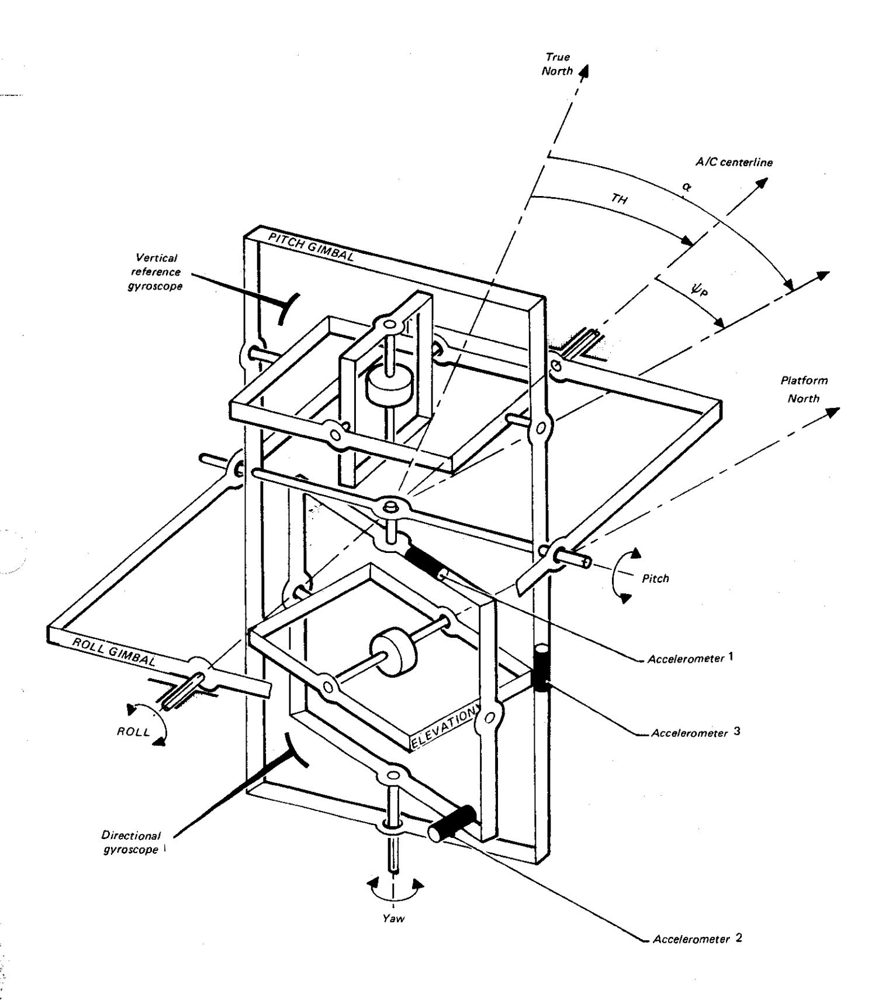

FIGURE 9 -- FUNCTIONAL DIAGRAM OF GYRO-ACCELEROMETER CENTER-INSTALLATION OF ACCELEROMETERS

{232}------------------------------------------------

MIRAGE F

B - Principle of slaving of vertical reference gyroscope to the vertical

The system functions in two steps to hold the rotation axis of the vertical reference gyroscope rotor to the vertical.

On the ground, with the aircraft immobile, the direction of the local vertical is given to the system during an operation phase called alignment. The rotation axis of the rotor is slaved to this direction.

After alignment, the automated system commands reset the gyroscope to the computed orientation of the local vertical.

C - Slaving of vertical reference gyroscope during alignment

The direction of the local vertical is provided by means of two mercury erectors located on the pitch gimbal. They sense any deviation of the pitch gimbal in relation to the vertical and control the vertical reference gyroscope torque motors. Taking into account the slaving of the pitch gimbal to the vertical reference gyroscope, balance is attained when the vertical reference gyroscope axis is actually vertical.

NOTE: To shorten the time needed for realignment of the system to the vertical, the gimbals are set to their synchro zero prior to being aligned, with the erectors.

D - Slaving of vertical reference gyroscope after alignment

After alignment, the vertical reference gyroscope orientation is corrected as a function of the local vertical changes. This is automation. It is computed through the travel of the aircraft and the Earth rotation.

The import of the correction imposed by the travel of the aircraft depends on its travel speeds following North and East directions. The import of the correction imposed due to Earth rotation depends on the latitude.

The computed corrections are shared out amongst the torque motors of the vertical reference gyroscope as a function of its gimbal orientation relative to true North, that is to say function of true heading.

NOTE: In emergency mode, the vertical correction is generated by the mercury erectors.

3- ORIENTATION OF ACCELEROMETERS IN AZIMUTH : determination of angle  $\alpha$  (figure 11)

A — Principle for computation of angle  $\alpha$ 

The pitch gimbal (therefore the accelerometer support) is kept slaved to Earth vertical. The axes of sensitivity of accelerometers 1 and 2 are horizontal. To free their orientation from the aircraft yawing, their support is stabilized in azimuth by the directional gyroscope which determines a directional reference in the horizontal plane.

To compute the North and East travels of the aircraft, the computer has to know the direction of this directional reference relative to true North. It functions in two steps.

On the ground, with the aircraft immobile, during an alignment phase, the system determines the initial orientation  $\alpha$  i of the accelerometers in relation to true North from a true heading information THi given to the system. The computer knows the orientation of the azimuth gimbal of the directional gyroscope in relation to the pitch gimbal (angle  $\Psi p$ ). It deduces there from  $\alpha$ i ( $\alpha$ i = THi +  $\Psi p$ ). This value is stored.

After alignment, the directional gyroscope is left free in azimuth. The computer computes the change of  $\alpha$  from  $\alpha$ i as a function of the aircraft position and the change of this position.

02-80

{233}------------------------------------------------

### MIRAGE F

MANUAL 12

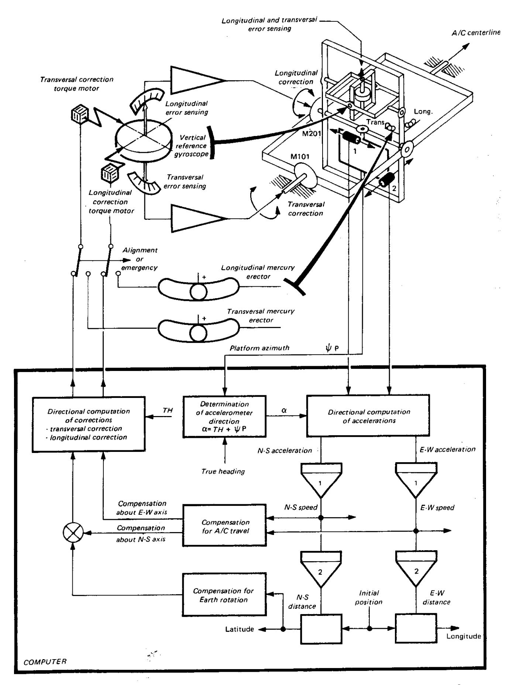

Restricted

FIGURE 10 — INERTIA - DOPPLER SOFTWARE - AUTOMATED SYSTEM - SLAVING OF ROLL AND PITCH GIMBALS TO EARTH VERTICAL

{234}------------------------------------------------

#### B - Nature of initial true heading THi data

The initial true heading can be given to the system in several ways:

- either by a transfer gyro : the heading data can be immediately put to use or stored for later use ;
- or manually by the pilot after orientation of the aircraft to a known geographic axis (for example a runway axis);
- or from the magnetic heading given through the magnetic heading channel and from the variation that has been stored or is fed by the pilot.

#### C - Initial alignment procedure

(1) Modes in which the initial true heading THi has initially been given by the transfer gyro. This is the normal way in which the system is used.

When the transfer gyro is mounted in the aircraft, the computer receives the initial true heading which it stores in a volatile memory, if the mode selector of MHSP is set to «ALN-TRF». This corresponds to an immediate utilization of the data THi. If the mode selector of MHSP is on «ST-BY», the initial true heading is stored in a non-volatile memory. The data is then available for later use, even when the electrical supply of the system has been switched off.

If one knows the actual true heading of the aircraft, it is possible to introduce it directly into the memory by writing through the NCP.

The initial true heading THi is registered by the computer when one presses «TRF» button of the MHSP.

The registered initial true heading is the one introduced directly into the volatile memory by the transfer gyroscope, when the mode selector of MHSP is set to «ALN-TRF». It is the one stored by the non-volatile memory when the mode selector is set to «ALN-STR». In the latter case, it is important that the aircraft be perfectly oriented to the stored heading, when pressing the «TRF» button.

As the computer knows the platform azimuth  $\Psi p$  and initial true heading THi values, it may then determine the angle  $\alpha i$ .

(2) Modes in which the initial true heading THi has not been initially given. These are called MAG-VAR modes.

As long as «TRF» button of MHSP has not been depressed, the system will function in these modes.

The initial true heading is determined from a gyromagnetic heading GMH and from the stored variation MV: THi = GMH + MV.

The computer will then determine, as done earlier, the initial setting angle  $\alpha i$  of the accelerometers.

The variation MV may be modified by the pilot from the NCP. It is never computed while a «MAG-VAR» mode is being used.

These modes are possible only if the magnetic monitoring channel operates correctly, the true heading TH2 used for navigation computation being obtained through the gyromagnetic heading GMH and through the stored variation MV (see 10-8, «Localization»).

In these modes, indicator light «M-VAR» of the NCP remains on.

02 - 80

{235}------------------------------------------------

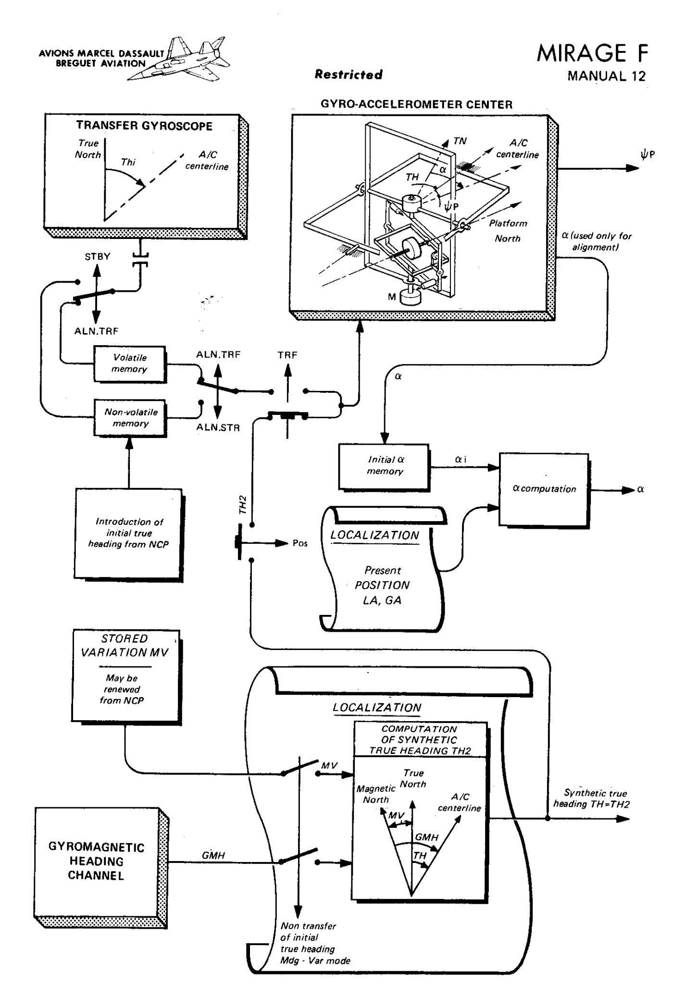

FIGURE 11 - INITIAL HEADING ALIGNMENT LOGIC

{236}------------------------------------------------

{237}------------------------------------------------

MANUAL 12

# HYBRIDIZATION OF GYRO-INERTIAL SYSTEM INERTIA-DOPPLER SOFTWARE (Figure 12)

#### 1 - PRINCIPLE

The speed data supplied by the gyro-inertial system previously described is accurate in the short run. However this data is subject to errors.

On the one hand, these errors are liable to increase with time.

On the other, any error, as small as it may be, in one of the initial conditions, will cause an oscillation situation which in turn will produce constantly increasing errors.

Thus one is led to couple the gyro-inertial system to a system which, on the one hand, will damp these oscillations and on the other, will curtail the errors in the long run.

To avoid an increase of errors after a long period of time, the gyro-inertial system is coupled to a navigation system which provides accurate long-term speed data. This speed data is used as reference.

The coupling consists in slaving the speed obtained from the accelerometers to the reference speed. It also allows updating of the gyro-inertial system.

#### 2 - APPLICATION

The speed data obtained from the accelerometers is compared with the reference speed.

The difference between these two data corrects the accelerometric output of the gyro center (updating) and resets the vertical of the center (reduction of long-term errors, especially those caused by the vertical reference gyroscope drift).

The speed signal coming from the first integrator of each channel (North and East) constitutes the so-called «hybrid» speed data which is characterized as follows: in the long run, it practically equals the reference speed; in the short run, data secured from the accelerometers is superimposed on it.

The reference speed is provided either by the Doppler radar or by the air data computer.

Depending on the utilization conditions for the aircraft, three main modes of coupling are available:

- inertia-Doppler coupling
- inertia-air data coupling
- pure inertia : no coupling.

#### 3 - INERTIA-DOPPLER COUPLING

This is the basic mode for operation of the system.

Let us remember that the Doppler radar measures the ground speed of the aircraft.

This ground speed remains accurate over a long period of time. In the short run, its value may be marred by appreciable errors in transit mode, during maneuvers of the aircraft or fast variations in the ground speed.

{238}------------------------------------------------

>

{239}------------------------------------------------

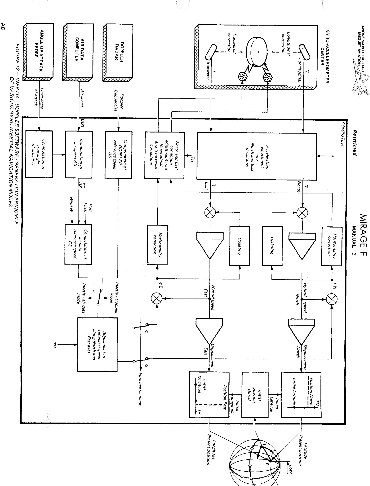

AC 02-80

Restricted

6 - 143

FIGURE 12

{240}------------------------------------------------

### MIRAGE F

MANUAL 12

We do thus notice that the gyro-inertial navigation system and the Doppler navigation system have complementary qualities which allow to take the fullest advantage of each other's information, within the mixed system that has been considered in the previous paragraphs.

Restricted

- Gyro-inertial navigation : good accuracy in the short run, major errors in the long run,

- Doppler navigation : poor accuracy in the short run, good accuracy in the long run.

This leads us to take the Doppler speed as reference for resetting of the inertial speed.

The Doppler radar provides Doppler frequencies according to the transmission beam paths. The computer determines the ground speed and provides the coupling of the inertial data.

#### 4 - INERTIA-AIR DATA COUPLING

The air speed ASI data provided by the air data computer offers the same long-term accuracy and short-term inaccuracy characteristics as the Doppler speed.

It is therefore used, after adjustment, as reference when coupling it with the gyro-inertial data is intended.

The air data computer provides the computer with the air speed ASI module. By using the angle-of-attack, the computer will establish the vector AS (magnitude and direction). Adjustment as a function of the roll and pitch angles will allow to achieve the value of the horizontal projection.

Since the air speed is the speed of the aircraft within the air mass, the wind speed should be added, to achieve the ground speed.

The relative inaccuracy of this last value provides less satisfactory accuracy for the data secured through inertia-air data coupling than for the data obtained through inertia-Doppler coupling.

The computer ensures the coupling with the inertial data, in accordance with the principle enunciated earlier.

#### 5 - PURE INERTIA

No correction is to be applied to the data provided by or computed from the gyro-accelerometer center signals.

In the long run, the quality of the various data that have been obtained will diminish.

Thus, the pure inertia mode is not to be used over an extended period.

02 - 80

{241}------------------------------------------------

一大小人 医二种 医二种 医二种 医二种 医二种 医二种 医二种 医二种 医二种 医二种 n je

{242}------------------------------------------------

# AVIONS MARCEL DASSAULT BREGUET AVIATION

#### MIRAGE F

MANUAL 12

### 6 - SPECIAL COUPLING CASES

A certain number of operation particularities are to be found, which correspond to each of the coupling modes. These particularities are subject to the aircraft conditions, the availability of sensors enabling the coupling and the presence of jammer transmission.

Restricted

- On the ground, with the aircraft motionless during alignment, there is not truly a coupling mode : in fact it is a matter of initialization of the system operation.

- On the ground, after alignment: taxiing mode.

The system enters the «emergency taxiing» mode when it receives the «CG90 reliability» data.

The system operates in inertia-air data mode with air speed forced to zero.

- Normal taxiing mode.

The system enters the «normal taxiing» mode when it receives the «platform alignment completed» information (setting to local vertical by means of the mercury erectors and transferred true heading). The system operates in inertia-Doppler mode with Doppler speed forced to zero.

- Take-off mode

The system enters this mode when the registered acceleration is greater than 0.2 g or the inertial speed greater that 90 km/h. It operates in pure inertia.

- Flight mode

The system enters this mode when it receives the «U/C shock absorbers extended data». This is the normal operation mode for the system. It is examined in detail in the following paragraph.

- Chopped mode

This is a special flight mode which corresponds to the use of the Remora jammer. In such a situation, the Doppler radar is useless as long as the jammer continues its transmission. The system operates in what is called a chopped mode:

- for a time t1, the computer inhibits the Remora transmission and authorizes Doppler reception to be taken into account; the inertia-Doppler coupling is normal, with a set of different factors:

- for a time t2, the computer authorizes the Remora transmission and inhibits Doppler reception; the inertia-Doppler coupling proceeds with the same set of factors as in the previous case, with a Doppler speed equal to the average of the speed during cycle t1.

- Unavailability of sensors

Should the Doppler be unavailable (out of range, failure) and the air data computer likewise, the corresponding coupling is not possible.

02 - 80

{243}------------------------------------------------

MIRAGE F MANUAL 12

#### 7 - FLIGHT MODES (figure 13)

A — Scope of hybridization mode switching logic.

The inertia-Doppler coupling is the basic mode. When operating in this mode, we will assume that the system is functioning with optimum accuracy.

When, for whatever reason it may be, Doppler data cannot be used, a switching logic will permit the choice of a coupling mode (or the absence of coupling) to provide the greatest accuracy possible.

This switching logic must therefore assess the accuracy value of the system, compare it with the accuracy that the other modes may provide and switch to another mode if deemed to give a better performance.

B - Accuracy assessment of each coupling mode

In pure inertia mode, degradation of navigation accuracy as a function of time, and in relation to optimum operating mode, is depicted as a parabole reduced to three segments of a straight line.

In Remora mode, as also in inertia-air data mode, degradation of accuracy is considered constant in relation to optimum operating mode. The inertia-air data mode however, provides less satisfactory performance than the Remora mode.

The contents of a counter is associated with each value of the accuracy degradation.

• The zero value characterizes absence of accuracy degradation : such is the case for the inertia-Doppler coupling mode, which has been in use for quite some time, as it corresponds to an optimum operation of the system.

- In pure inertia mode, the counter contents are incremented: its contents evolve as a function of

time, and are depicted as a parabole reduced to three segments of a straight line.

- In Remora mode, the value 2500 characterizes the accuracy degradation. The Remora coupling has been in use for quite some time.

- In inertia-air data mode, the value 5000 characterizes the accuracy degradation.

Let us assume, that at the start, the counter contents equal zero. This corresponds to a situation in which the inertia-Doppler mode has been in use for quite some time.

Should the inertia-Doppler coupling have to be abandoned, two possibilities arise :

- the inertia-Doppler is abandoned due to a Remora transmission. In which case the system goes over to the most performing mode; this will be the pure inertia mode; the counter is incremented; passage to 2500 on the counter leads to abandonment of the pure inertia mode in favor of the better performing chopped mode;

the inertia-Doppler coupling is abandoned due to faulty operation of the Doppler radar (out of range, failure); the system switches to the pure inertia mode; the counter is incremented; passage to 5000 on the counter leads to abandonment of the pure inertia mode in favor of the better perfor-

ming inertia-air data mode.

ALL.

{244}------------------------------------------------

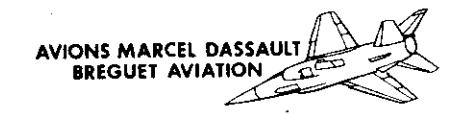

MIRAGE F

#### C - Disincrementation of counter

When a system is able to switch from one coupling mode to another mode offering better performance, the maximum efficiency of the coupling is reached only after some time. This means that a return to optimum precision for the new coupling mode is not immediate. Which has the following repercussions for the counter disincrementation law:

- when the system switches back to the inertia-Doppler mode, disincrementation of the counter to zero (return to optimum performance) is accomplished following an exponential decreasing in relation to time; this exponential is reduced to two segments of a straight line;

- when the system switches back to the Remora mode, the counter disincrementation is accomplished following a straight line decreasing in relation to time until it reaches the 2500 scale.

This disincrementation law allows at all time for correspondence between the navigation data accuracy degradation and the counter contents. This is required when, during a transition phase of returning to a coupling which offers better performance, the conditions once again impose a coupling corresponding to a more degraded coupling mode: the precision of the system has not reached its optimum value and the degradation in the new mode has to cumulate with the remains of the accuracy degradation due to the operation in the preceding coupling modes.

#### D - Operation example

The figure shows a situation in which the system has been operating for some time in inertia-Doppler mode.

At t = 0 time, starting of Remora. The system switches to pure inertia. The counter increments itself.

At t = 3 min 20 s, the counter reaches 2500. The system switches to chopped mode.

At  $t=5\,$  min, the Doppler is out of range ant the Doppler data is unavailable. The system switches to pure inertia. The counter increments itself.

At t=6 min, the Doppler data is again available. The system switches to chopped mode. The counter disincrements to 2500 and remains at 2500.

At t=8 min, the Remora ceases transmission. The system switches to inertia-Doppler. The counter disincrements.

At t = 9 min 35 s, the Doppler is no longer valid. The system switches to pure inertia and the counter increments itself.

At t = 13 min 45 s, the counter reaches 5000. The system switches to inertia-air data. The counter remains at 5000.

At t = 14 min 40 s, the Doppler data is again available. The system switches to inertia-Doppler. The counter disincrements to zero and remains at zero.

{245}------------------------------------------------

# MIRAGE F

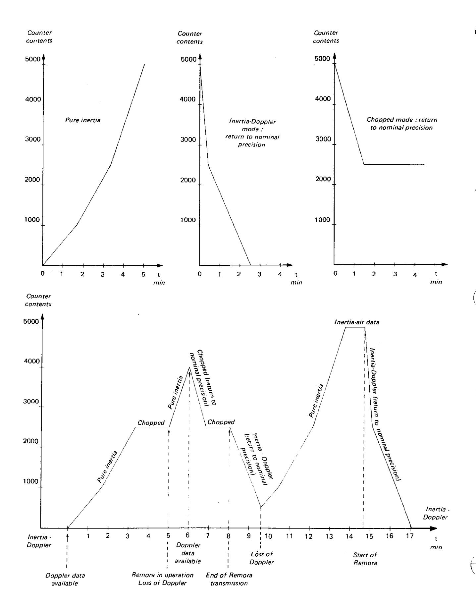

FIGURE 13 - GYRO-INERTIAL NAVIGATION FLIGHT MODES

{246}------------------------------------------------

MANUAL 12

#### Restricted

#### RECAPITULATION OF VARIOUS OPERATING MODES OF THE SYSTEM AND OF VARIOUS DATA SUPPLIED

#### ALIGNMENT

The position is supplied to the system.

#### **EMERGENCY TAXIING**

It occurs when the CG90 supplies a «CG90 reliability» signal.

- The true heading is generated from the CG90 gyromagnetic heading and from the magnetic variation stored or displayed by the pilot.
  - The speed data for navigation computations are forced to zero.
  - The altitude provided is a barometric altitude.
  - The system operates in inertia-air data mode with an air speed forced to zero.

#### MAG-VAR TAXIING

It occurs when the «end of platform alignment» data is available.

- The true heading is generated from the gyromagnetic heading and from the magnetic variation stored or displayed by the pilot (TH2).
  - The speed data for navigation computations are forced to zero.
  - The position is forced on the alignment position.
  - The altitude provided is the baro-inertial altitude.
  - The wind is forced to nil value.
  - The system operates in inertia-Doppler mode with a Doppler speed forced to zero.

#### **NORMAL TAXIING**

This mode is identical to the MAG-VAR taxiing mode, excepting that the true heading has been supplied to the system at alignment time. The system provides a true heading independently of the gyromagnetic heading (TH1).

The difference between MAG-VAR modes and normal modes reflects on all other modes : for MAG-VAR modes, the true heading has not been inserted in the system. It is generated during take-off and flight modes from a gyromagnetic heading reading and from the stored magnetic variation. For the other modes called normal modes, the true heading is directly generated from the gyroaccelerometer center data.

#### NORMAL TAKE-OFF

This operation mode occurs when the longitudinal acceleration is greater than 0.2 g or when the inertial speed registers more than 90 km/h.

- The true heading is generated from the gyro-accelerometer center data.
- The speed data are obtained from pure inertial data.
- The position is forced on the alignment position.
- The altitude provided is the baro-inertial altitude.
- The system operates in pure inertia.

#### NORMAL FLIGHT

This mode occurs when the U/C shock absorber is extended.

- The true heading is generated from the gyro-accelerometer center data.
- The speed and position data are computed in normal operation by a system operating in inertia-Doppler mode.

{247}------------------------------------------------

{248}------------------------------------------------

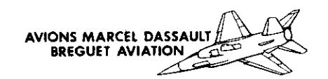

MIRAGE F
MANUAL 12

#### NAVIGATION CONTROL PANEL

<u>AND</u>

MODE AND HEADING SELECTOR PANEL

{249}------------------------------------------------

MANUAL 12

# NAVIGATION CONTROL PANEL (NCP) AND MODE AND HEADING SELECTOR PANEL (MHSP) (Figures 17 and 18)

#### 1 - PRESENTATION

The navigation control panel (NCP) and the mode and heading selector panel (MHSP) are two complementary assemblies combining navigation and control functions for the inertia-Doppler navigation system.

#### 2 - NAVIGATION CONTROL PANEL

A -- Description of the front face of the NCP

The front face of the NCP comprises:

- a parameter selector (1) with ten positions performing the following functions :
- DEST (destination). It permits reading and/or insertion of the coordinates (in degrees, minutes and 1/10 minute) of a navigation or bombing target corresponding to the number of the «DATA» counter (LH window : latitude ; RH window : longitude).
- OFS (offset)  $\Delta L/\Delta G$ . It permits reading and/or insertion of the coordinate variations (in minutes, 1/10, 1/100 and 1/1000 minute) in latitude (LH window) and in longitude (RH window) in relation to the navigation or bombing target displayed on the «DATA» counter.
- OFS (offset) P- $\theta$ . It permits reading and/or insertion of the coordinate variations in distance P (LH window : in km and 1/10 km) and in true bearing  $\theta$  (RH window : in degrees and 1/10 degree) in relation to the navigation or bombing target displayed on the «DATA» counter.
- $H/\Delta H$ . It permits reading and/or insertion of the target altitude and altitude difference of the initial position in relation to the target displayed on the «DATA» counter or «mark» altitude (LH window : altitude in meters ; RH window : altitude difference in meters).
- HDG/MVAR. It permits reading and/or insertion of the true heading HDG (LH window in degrees, 1/10 and 1/100 degree) and the magnetic variation (RH window in degrees and 1/10 degree).

02 - 80

{250}------------------------------------------------

# AVIONS MARCEL DASSAULT BREGUET AVIATION

# MIRAGE F

#### Restricted

- PP/MRK (present position - marking). It permits reading of the present position or of a «mark» position in geographical coordinates (LH window: latitude; RH window: longitude, in degrees, minutes and 1/10 minute). In this position, the normal display is the present position. This position is frozen as soon as a «mark» has been performed. Present position reappears as soon as the «mark» coordinates have been inserted (by pressing «ENT») or cancelled (by pressing «CAN»).

- UPD/RNG/BRG (update - range - bearing). It permits reading of the horizontal distance and of the true bearing from the present position of the aircraft to any navigation target displayed on the «DATA» counter.

When updating a position (by pressing on control stick button or on «POS» of NCP), the display will show the true bearing and distance variations between the computed position and the true position of the aircraft. These variations will be erased as soon as the updating is validated or invalidated.

The distance is displayed in the LH window (in km and 1/10 km) and the true bearing in the RH window (in degrees and 1/10 degree).

- WD-WS (wind direction - wind speed). It permits reading and/or insertion of the wind direction (LH window in degrees) and speed (RH window in km/h).

- TRK-GS (track - ground speed). It permits reading of the horizontal speed (RH window in km/h) and true course (LH window in degrees and 1/10 degree).

 MON (monitor). Reading or writing of coded data. Permits to read various monitoring and control data for the system, and to read or modify stored data of the main computer.

When on «MON», the main computer sends the six digits of the system status word into the RH window. The three LH digits represent the failure status of the first equipment and the three RH digits that of the second equipment. In each group:

the two LH digits give the equipment number,

- the last digit gives the type of failure.

02-80

{251}------------------------------------------------

#### MIRAGE F

MANUAL 12

Whenever more than two equipment items fail simultaneously, alone the first two are displayed, according to their numerical order.

Restricted

To display some other data, one must select the LH window by pressing key «L.7» and insert coded data (from 1 to 70) by pressing key «ENT». The computer displays the coded data in the LH window and the corresponding value in the RH window.

- A twelve-key alphanumerical keyboard (13). These keys permit to display data in the display windows and to enter them in the computer. When writing, the first key to be touched will always correspond to the sign of the data to be introduced. The meaning for the keys goes as follows:

| - Key «O»   | : Digit 0                                                                                    |
|-------------|----------------------------------------------------------------------------------------------|
| - Key «1+»  | : Digit 1, sign «+ »                                                                         |
| - Key «2N»  | : Digit 2, sign «North» (for latitudes)                                                      |
| - Key «3 –» | : Digit 3, sign «—»                                                                          |
| - Key «4W»  | : Digit 4, sign «West» (for longitudes)                                                      |
| - Key «5»   | : Digit 5                                                                                    |
| - Key «6E»  | : Digit 6, sign «East» (for longitudes)                                                      |
| - Key «7L»  | : Digit 7, sign «Left». Permits selection of data display in LH window                       |
| - Key «8S»  | : Digit 8, sign «South» (for latitudes)                                                      |
| - Key «9R»  | : Digit 9, sign«Right». Permits selection of data display in RH window                       |
| - Key «CLR» | : Clear. Permits erasure of writing which has just been put in a window before insertion.    |
| - Key «ENT» | : Enter. Permits to introduce into the memory of the computer the writing just completed. |

#### - Control buttons

- Button «POS» (position) (3). Permits:
  - 1) insertion of present ground position
- 2) updating of position. Pressing a first time on «POS» or on the corresponding button on the pilot's stick causes «POS» light to come on. The error in position is then computed and displayed. Pressing on «POS» a second time updates the navigation.
  - Button «MRK» (mark) (2). Not used.
  - Button «CAN» (cancel) (11). Permits to cancel a position or altitude updating or a mark.

{252}------------------------------------------------

# AVIONS MARCEL DASSAULT BREGUET AVIATION

#### MIRAGE F

MANUAL 12

- Counters. These counters display the numbers 0 to 13 and 21 to 23.

The display in the window is controlled by two buttons «+» and «-» which permit to increment or disincrement the value displayed.

Restricted

- «DATA» counter (9). It displays the number of the navigation target. The data displayed according to the selection chosen on the parameter selector correspond to this number.
- «DES STEER» counter (4). It displays the number of the navigation target to which correspond the actual navigation computations.
- Display windows (7). The data corresponding to the position chosen on the parameter selector are displayed in the LH (five digits) and RH (six digits) windows.
  - System status indicator lights (6)
    - «ALN» (alignment) green indicator light
      - steadily on as soon as one switches to alignment.
      - blinks when alignment has been completed,
      - goes out when the system switches to navigation.
    - «MVAR» (magnetic variation) green indicator light
- steadily on to show that there has been no initial heading setting and that the system is using the stored variation.
  - «WIND» green indicator light
    - steadily on whenever the system is in a mode using the stored wind data.
  - «AHRS» (attitude and heading reference system) green indicator light
- steadily on whenever the system uses the gyro-accelerometer center as a heading and vertical reference center.

{253}------------------------------------------------

# AVIONS MARCEL DASSAULT BREGUET AVIATION

### MIRAGE F

MANUAL 12

- «CG 90» (emergency gyromagnetic compass) green indicator light.
  - steadily on when the system uses the emergency gyromagnetic compass.

Restricted

- «SEA» green indicator light
  - steadily on when selector switch «DPL LAND-SEA» of the MHSP is on «SEA».
- «M21», «M22», «M23» (three marks) green indicator lights
  - blinking when a mark position is frozen but not introduced
  - steadily on when the associated mark coordinates have been introduced.
- «IN.A» (inertia-air data) green indicator light
  - steadily on when the system is in inertia-air data mode.
- «STBI» (stand-by inertia) green indicator light
- steadily on when the pure inertia accrued time is greater than 5 minutes and the air data system has broken down.
  - «MDPL» (Doppler memory) green indicator light
- steadily on when the Doppler is set in memory for more than 15 seconds and in its range.
  - «CDU» (control display unit) amber indicator light
    - steadily on in case of NCP breakdown
  - «COMP» (computer) amber indicator light
    - blinking when the inside temperature of the main computer reaches too high a level.
    - steadily on in case of breakdown of the main computer or of the digibus.
  - «PRIO» (priority) amber indicator light, not used.
  - «DIM» knob (12)

Permits adjustment of display window brilliance as also that of «POS», «MRK» and «CAN» button lights.

- «TST» test button (8)

By pressing the «TST» button, all the indicator and display lights, the punctuations and the segments of each indicator come on.

{254}------------------------------------------------

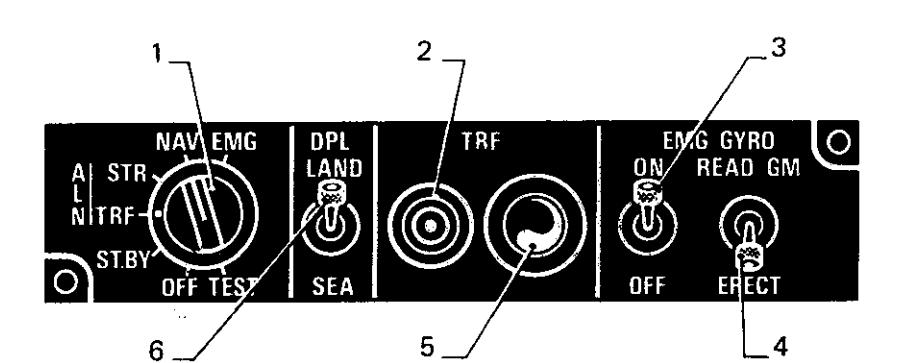

37F POSTE DE SELECTION MODES ET CAPS PSMC MODE AND HEADING SELECTOR PANEL (MHSP)

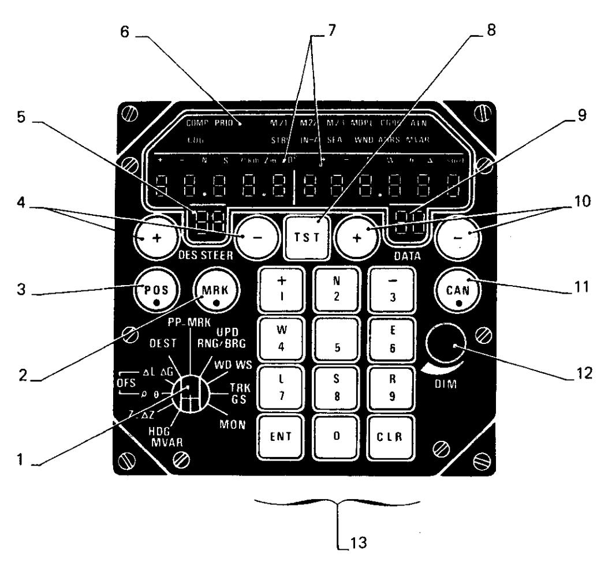

9F POSTE DE COMMANDE NAVIGATION PCN NAVIGATION CONTROL PANEL (NCP)

{255}------------------------------------------------

### MIRAGE F

#### Restricted

MANUAL 12

AVIONS MARCEL DASSAUL BREGUET AVIATION

The NCP interface and data processing circuits of the main computer permit, subject to the NCP commands:

- to introduce the parameters for navigation use,
- to display on demand various flight and navigation parameters provided by the navigation system,
- to monitor the operation of the inertia-Doppler system,
- to select the navigation target number which will be used.

The NCP and the main computer dialog through the digibus. It also receives discrete signals related to navigation system status and operating modes.

The NCP fulfills three functions:

- an interface function : shaping of the data exchanged,
- a data management function: computation and storage of navigation computation data,
- a display function: display of data according to the selected parameter on the parameter selector.

Data coming from or directed to the digibus are managed by the NCP computation system. Every 20 ms, the NCP sends out its validity status word to the main computer. Every 200 ms, the main computer sends the navigation parameter display data to the NCP.

It sends out its commands as a function of the position of its various controls. These commands specify the operation to be carried out by the navigation system, depending on the parameter selector position and the target number selected : command for display on NCP or writing in memory of the main computer.

These data are contained in a word directed to the main computer and sent out by the NCP.

- Where a display command is involved, the NCP sends out the control word. The main computer selects the memory address which contains the requested data, carries out the operation and sends the result to the NCP, after shaping. The NCP receives this data, checks the validity of the address and displays the result.
- Where a main computer memory writing is involved, the data is typed into the NCP which sends out a word corresponding with the typed data. The main computer will make use of this data only after transmission of the carrier word of the introduction command.

The data processing circuits of the NCP also permit other functions:

- updating of the position
- updating of the altitude.

The operation of the NCP is controlled from the mode and heading selector panel.

{256}------------------------------------------------

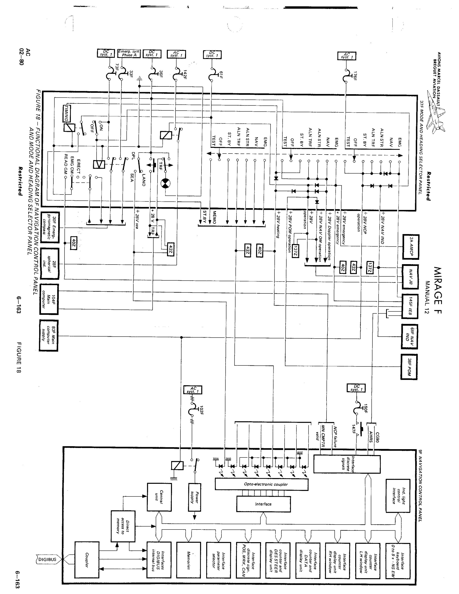

{257}------------------------------------------------

#### 3 - MODE AND HEADING SELECTOR PANEL (MHSP)

A - Description of the front face of the MHSP

The front face of the MHSP is divided into four separate parts:

(1) A part depending on mode selection:

It comprises:

- A seven-position mode selector (1) fulfilling the following functions :
- TEST: allows to carry out an overall ground test of the navigation system, that is, a simulated internal navigation. It allows to check the reliability of the various elements of the navigation computation and display channel.
  - OFF : allows to switch off the various navigation channel equipment items.
  - STBY: (standby) which allows:
    - to start the navigation control panel, the main computer, the navigation indicator;

- heating of the gyro-accelerometer center;

- introduction of navigation data by means of the NCP;

- to store in the main computer the initial true heading generated by the transfer gyroscope; this stored initial true heading will be used during alignment on the stored true heading.
  - ALN-TRF (alignment transfer), which allows:
- to start the equipment used in navigation (navigation control panel, navigation indicator, main computer, Doppler radar, spherical indicator, interface electronics box, roll-pitch output multiplier, navigation output multiplier, gyro-accelerometer center);

- heating of the gyro-accelerometer center;

- introduction of navigation data into the main computer by means of the NCP;
- introduction of the initial true heading generated by the transfer gyroscope during the alignment with transfer gyroscope.
  - ALN-STR (alignment store), which allows :
    - to start the equipment used in navigation (see ALN-TRF);

- heating of the gyro-accelerometer center;

- introduction of navigation data into the computer by means of the NCP;

- introduction of initial true heading stored earlier (see STBY) or the initial true heading typed manually by means of the NCP keyboard during the alignment on stored heading.
  - NAV (navigation), which allows:
    - to start the equipment used in navigation (see ALN-TRF);
    - introduction of navigation data into the computer by means of NCP
    - to follow up the navigation according to the various navigation modes.

{258}------------------------------------------------

{259}------------------------------------------------

## AVIONS MARCEL DASSAULT BREGUET AVIATION

### MIRAGE F

MANUAL 12

- EMG (emergency), which allows:

to start in emergency the various equipment items used in navigation (gyro-accelerometer center, interface electronics box, navigation indicator, navigation control panel, main computer, roll-pitch output multiplier, navigation output multiplier, spherical indicator),

Restricted

- heating of the gyro-accelerometer center,

- emergency control of armament control panel.
- (2) A part «DPL» depending on operation of Doppler radar

It comprises:

- a «LAND-SEA» selector switch (6). In «SEA» position, it allows the main computer to correct the data generated by Doppler radar when it operates over sea (correction of the Doppler spectrum distortion).
- (3) A part «TRF» used during initial true heading transfer sequences

It comprises:

- a button (2) allowing introduction of initial true heading into the main computer,

- an indicator light (5) allowing to signal end of transfer of initial true heading in the main computer (blinking) and end of introduction of initial true heading into the navigation computation circuits of the main computer (blinking lights go out).
- (4) A part «EMG GYRO» used for emergency heading

It comprises:

- an «ON-OFF» selector switch (3) which, in the «ON» position, allows to start the navigation indicator and the emergency gyromagnetic compass;
  - a selector (4) with three positions :

- a center rest position

- a «READ GM» position allowing display on NAV IND of the emergency gyromagnetic heading generated by the emergency gyromagnetic compass;

- an «ERECT» position allowing fast erection of the emergency gyromagnetic compass gyroscope during the starting sequence.

{260}------------------------------------------------

{261}------------------------------------------------

MIRAGE F

MANUAL 12

NAVIGATION INDICATOR

{262}------------------------------------------------

MIRAGE F

#### NAVIGATION INDICATOR (Figures 19 - 20)

#### 1 - SCOPE

The navigation indicator is an equipment which displays for the pilot, data generated by various navigation aid equipment.

The main functions of the instrument are to provide:

- the aircraft heading (true or gyromagnetic)
- a target position in relation to the aircraft
- the relative bearing of a radio compass beacon, of the radar antenna or of the target locked on by the missile homer
  - the heading deviation displayed for the autopilot
  - failure data related to the data displayed.

#### 2 - DESCRIPTION

#### A - Display

The indicator is provided with the following elements:

- a fixed index (2) representing the longitudinal axis of the aircraft;
- a graduated heading compass card (1) displaying the aircraft heading :
- gyromagnetic heading; this information is provided as a synchro signal by the interface electronics box or in emergency by the emergency gyromagnetic compass; a validity signal is associated with this synchro signal;
- true heading; this information is provided by the computer in digital form (ARINC link); the display of either one or the other hinges on the position of the associated selector (11);
  - a double pointer (3) displaying:
- the direct navigation course deviation  $\epsilon$ ; this is the deviation between the true course TC followed by the aircraft and the true course  $\theta$ t to be followed to re-acquire the navigation target whose number is displayed on the NCP ( $\theta$ t is equal to the target true bearing); the  $\theta$ t and TC data are provided by the computer in digital form (ARINC link);
- a single pointer (5) displaying the radio compass beacon relative bearing supplied by the ADF receiver or the radar antenna relative bearing supplied by the radar program box or the relative bearing of the target locked on by the missile homer, which information is supplied by the harmonization unit; a validity signal is associated with the radio compass relative bearing information; selection of this information is ensured by selector (10);
- a mobile index (6) displaying the heading to be followed by the aircraft in autopilot mode when in «displayed heading» function; the deviation between heading followed and heading to be followed is supplied by the autopilot;
- a four-digit distance counter (4) graduated in km or in 1/10 km; this displays the distance between aircraft and navigation target as supplied by the computer (ARINC link);

{263}------------------------------------------------

MIRAGE F
MANUAL 12

- Four flags corresponding to failure of each information displayed, excepting for AP heading :

- flag (15): heading failure

flag (13) : double pointer failure
flag (12) : single pointer failure

- counter bar (14) : distance or computer failure.

<u>NOTE</u>: The flag indicates the invalidity of the associated information, irrespective of the fact that the error be of internal or external origin to the indicator.

#### B - Controls

The NAV IND comprises two controls:

- Heading display selector (11)

This control has two positions. Independently of the selected mode, it provides:

for position : the gyromagnetic heading

for position : the true heading.

- Single pointer display selector (10)

This display has three positions:

- «C»: corresponding to the display of the relative bearing of the radio compass beacon used;
- «R»: corresponding to the display of the radar antenna relative bearing;
- «M»: corresponding to the display of the relative bearing of the target locked on by the missile homer.

#### C - Signals provided by the NAV IND

The NAV IND provides the heading information to the data recorder acquisition unit (information provided by potentiometer).

#### 3 - OPERATION

#### A - General

The navigation indicator receives analog and digital data as also the reliability discrete signals.

The analog data are provided as synchro voltages used for some angular repetitions.

The data intended for the computation unit are received as digital messages.

These messages are controlled by specific reception circuits and are set to use by the indicator computation unit which then controls the associated display elements.

The reliability discrete signals are used for control of the various failure display flags.

The controls located on the front face of the indicator allow to send out display orders either to the angular repetition circuits or to the computation unit which uses and displays the data required.

{264}------------------------------------------------

{265}------------------------------------------------

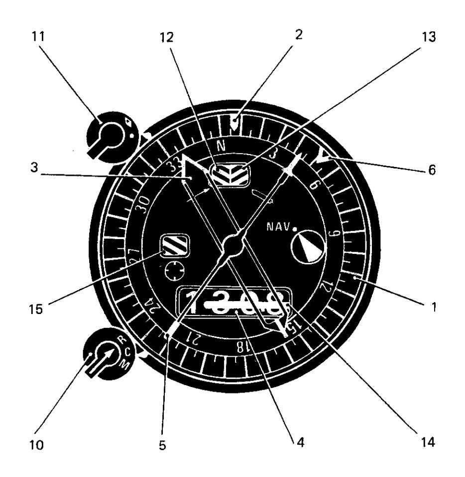

{266}------------------------------------------------

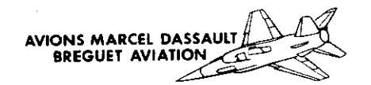

MIRAGE F

- B Angular repetitions
- (1) Single pointer repetition circuit

This is a conventional repetition circuit.

This circuit comprises essentially a slaving system composed of the BCT2 synchro, an amplifier and a motor.

This slaving system is monitored by a monitoring circuit which takes also into account the validity signal associated with the repeated data.

(2) Displayed AP heading repetition circuit

This circuit comprises a slaving system similar to that of the single pointer repeat

- C Heading compass card slaving circuit
- (1) Gyromagnetic heading repetition

This circuit repeats the gyromagnetic heading as long as the NAV IND heading selector is positioned to this heading.

In these circumstances, heading data are provided as synchro voltages. The matching system allows to convert these voltages into usable data for the slaving circuits of the card.

The  $\pm$  28 V reliability discrete signal allows the heading failure flag to disappear, through a heading monitoring circuit.

(2) True heading repetition

When the heading selector is set to true heading position, the heading data in digital form is checked and validated prior to being transmitted to the computation unit which will put it to use for positioning of the true heading compass card.

In this eventuality, the discrete signal for disappearance of the heading failure flag is provided by the computation unit.

(3) Heading repetition

The heading repetition slaving motor drives a repetition potentiometer at the same time as the compass card.

- D Double pointer slaving circuit
- (1)  $\theta t$  TC repetition (NAV mode)

In this case, it is ensured by two slaving systems which receive their data from the computation unit.

The first slaving system  $\theta$  repeats the data  $\theta t$ .

The second slaving system repeats the true course data.

A mechanical differential performs the operation  $\theta$  - TC and positions the double pointer in direct navigation course deviation  $\epsilon$ .

02 - 80

{267}------------------------------------------------

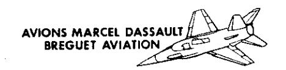

### MIRAGE F

MANUAL 12

#### (2) Double pointer failure warning

The  $\theta$ t data is received by the computation unit in digital form only.

Since the validity of this data is checked at input, the monitoring of the computation unit itself will detect the processing or display shortcomings.

Restricted

Any possible failings are indicated by the double pointer flag.

#### E - Distance counter control

The control of the distance counter wheels is solely ensured by the computation unit which receives the distance data.

Distance data, its processing and display are subject to monitoring which, in case of fault, causes the distance counter bar to appear.

#### F - Digital input circuit

NAV reception circuit

This is a coupling and decoding circuit which sets navigation data into suitable digital form.

These data are received in the form of a serial digital message comprising a parity bit and a sign + validity bit.

The message is checked upon reception and its possibly poor conformation will be cause for indication of an associated failure.

#### 4 - POWER SUPPLY

#### A - 115 V/400 Hz power supply

It is provided through the aircraft 115 V/400 Hz AC system 1 in normal operation or through the 115 V/400 Hz emergency system in case of failure of system 1. Switching-over from one system to the other is automatic.

Through the aircraft power system, the internal power supply module of the indicator generates all voltages required for reliable performance of the instrument.

#### These voltages are:

- + 5 V logic required for supply of logic circuits
- - 5 V logic required for supply of memories and computation unit
- + 5 V and 5 V for slaving modules
- - 12 V for slaving modules
- + 12 V required for distance counter wheel control.

{268}------------------------------------------------

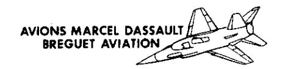

MIRAGE F

MANUAL 12

B - 26 V/400 Hz power supply

This voltage is provided by the 26 V/400 Hz computation transformer.

It serves as a reference for demodulation of synchro analog data (MH, single pointer relative bearing, AP heading deviation).

C - Ancillaries + 28 V power supply

This voltage is provided by the aircraft DC system 1 and serves to control the failure flags.

D - Lighting 5 V/400 Hz power supply

The lighting voltage is provided by the lighting distributor, controlled itself by the lighting control box.

E - System 2 + 28 V power supply

This voltage is not a true power supply but a forcing of the heading slaving for repetition of the GMH in case of alternator failure, even if the NAV IND heading selector is set to true heading position.

{269}------------------------------------------------

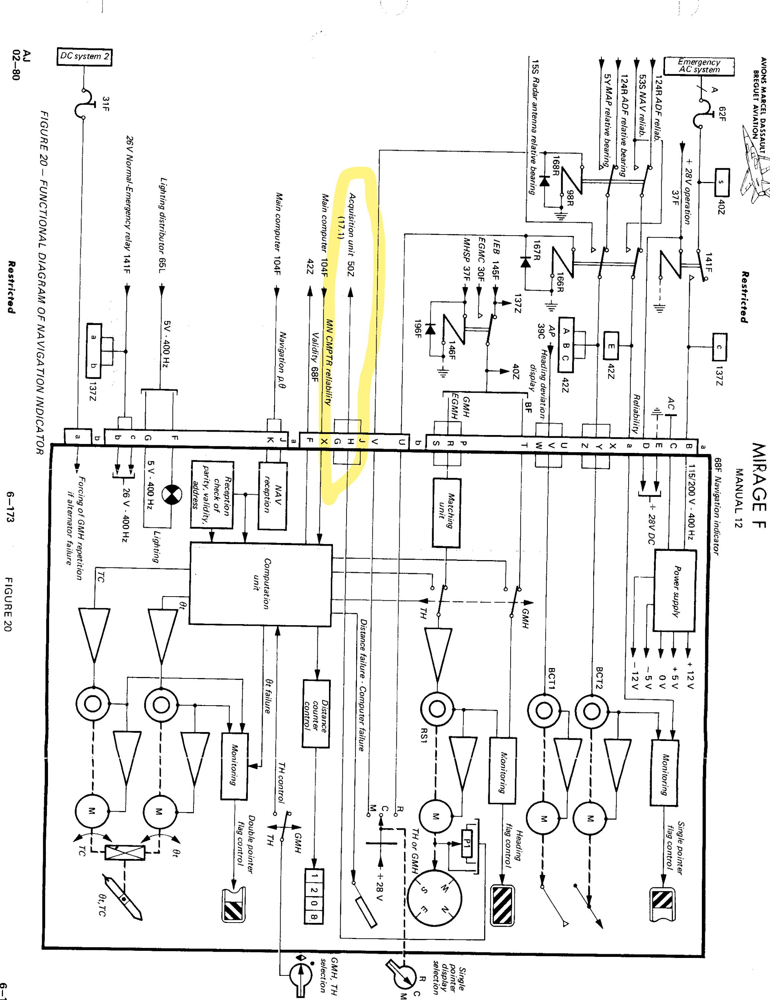

6-173

{270}------------------------------------------------

### MIRAGE F

MANUAL 12

NAVIGATION OUTPUT MULTIPLIER

{271}------------------------------------------------

#### MIRAGE F

MANUAL 12

### NAVIGATION OUTPUT MULTIPLIER (Figure 22)

Restricted

#### 1 - PARAMETERS SUPPLIED TO RADAR

Through the navigation output multiplier, the radar system receives the following data supplied in analog form :

- height of aircraft with respect to target h target
- oblique distance between aircraft and target  $\rho$  obl
- course deviation sin and  $\cos \theta$ -TC
- horizontal ground speed GSH
- antenna relative bearing plus drift sin and cos BRG ant + Dr (synchro)
- target relative bearing
- target elevation.

#### 2 - PARAMETERS SUPPLIED TO RECONNAISSANCE SYSTEM

The reconnaissance system receives the following data:

- aircraft latitude LA
- aircraft longitude GA
- true heading TH
- roll R
- radio altimeter height h
- altitude H
- horizontal ground speed GSH
- horizontal ground speed/radio altimeter height GSH/h

It also receives the navigation computer and navigation output multiplier reliability signals.

#### 3 - OPERATION OF NAVIGATION OUTPUT MULTIPLIER

It receives the parameters in serial digital form. Each datum (serial word) includes an address (identification of datum) and an quantity part.

It distributes the data in analog form (voltages).

After reception, the datum is transmitted to an input register.

The address is decoded if the monitoring system authorizes it.

The quantity is sent to the digital-to-analog converter.

The decoder orients the selected output channel to the corresponding datum contained in the converter.

The output channels include an analog store followed or not by an output multiplier.

The output to the reconnaissance system is in the serial digital form.

{272}------------------------------------------------

104F

37F

AC syst. 1

{273}------------------------------------------------

MIRAGE F MANUAL 12

**DOPPLER RADAR SYSTEM** 

{274}------------------------------------------------

# AVIONS MARCEL DASSAULT BREGUET AVIATION

#### Restricted

MIRAGE F

#### DOPPLER RADAR SYSTEM

#### 1 — <u>SCOPE</u> (figure 25)

The Doppler radar system calculates the aircraft ground speed by using the Doppler effect: it measures the difference between the frequency of an electromagnetic wave beamed at the ground and the frequency of the same wave received after reflection.

The ground speed is used for long-term correction of the speed calculated by the accelerometers of the gyro-accelerometer system, and for the updating and stabilizing of this speed.

The system comprises:

- Doppler radar 34S
- main computer 104F
- mode and heading selector panel 37F
- navigation control panel 9F.

The system is supplied with 115 V/400 Hz by system 2.

#### 2 - PRINCIPLE

A - Outline of principle of Doppler-Fizeau effect

Assume a wave of frequency FO emitted by a transmitter. It travels at a velocity C (velocity of electromagnetic waves: 3.108 m/s).

The fixed transmitter emits, during time interval t, N number of alternations. A fixed receiver receives during time interval t, the same number N of alternations. The frequency detected by the receiver is equal to FO.

Let us assume that the transmitter is moving towards the receiver at a speed S. The receiver will receive during the given time period a number of alternations N1, greater than N; the frequency detected by the receiver is higher than FO. If the transmitter is moving away from the receiver, the same principle applies, but with the reverse effect, i.e. the frequency received is less than FO.

Now let us assume that an object moving at a speed GS emits a wave of frequency FO, and that this wave is received by the same object after being reflected by a fixed obstacle located in the path of the emission.

The previously mentioned considerations apply, i.e. the frequency F' of the wave received by the obstacle is different from FO (greater than FO if the object is moving towards the obstacle, and less than FO if it is moving away from the obstacle). The frequency of the wave reflected by the obstacle is F'. Allowing for its speed, the object receives this wave at a frequency F".

It can be seen, that there are two successive alterations in the frequency of a wave emitted by an object and received by the same object following reflection from a fixed obstacle: the frequency alters from FO to F' and then from F' to F". The difference between frequencies FO and F", which is a function of speed, is called the Doppler frequency (DF).

#### B - Calculation of longitudinal ground speed DSX

The above conclusions may be applied to an aircraft in horizontal flight.

A transmitter-receiver in the aircraft emits an electromagnetic wave in the form of a conical pencil-beam whose axis is in the symmetry plane of the aircraft. The wave is beamed forwards and produces an angle  $\alpha$  with the horizontal fuselage reference line.

{275}------------------------------------------------

### MIRAGE F

MANUAL 12

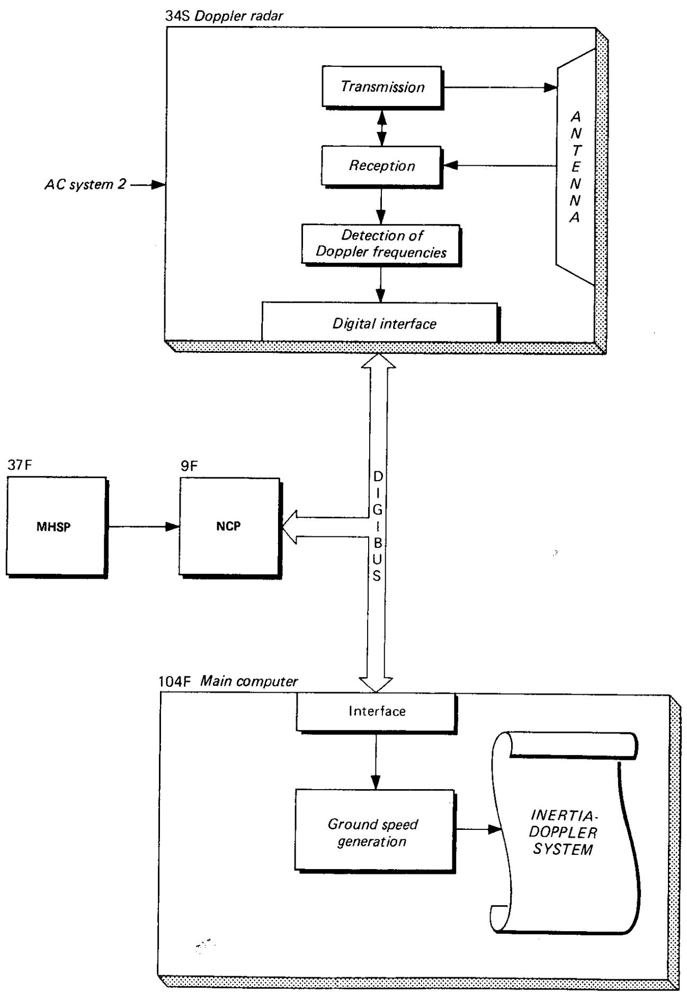

Restricted

FIGURE 25 - BLOCK DIAGRAM OF DOPPLER RADAR SYSTEM

{276}------------------------------------------------

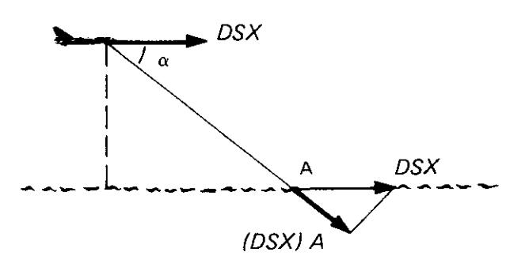

Because of the relative speed of the transmitter-receiver with regard to the ground, the wave which is received at the aircraft after reflection from the ground, has been subjected to changes in frequency due to the Doppler effect. Considering the relation which exists between Doppler frequency and the speed at which the transmitter-receiver is moving, it is possible to calculate the speed once the Doppler frequency has been measured.

It should be noted that the speed thus obtained is in fact the component of the aircraft speed along the axis of the beam (DSX)A. An adjustment based on angle  $\alpha$  permits the calculation of the aircraft speed DSX.

In horizontal flight, with no wind and at constant speed, DF is constant provided that the longitudinal attitude of the aircraft is constant, since the axis of the beam is fixed in relation to the aircraft. Any change in longitudinal attitude causes a variation between the inclination of the beam and the horizontal. This in turn modifies the component of DSX according to the axis of the beam, and again, alters DF (for a similar DSX value). This is interpreted as a variation in aircraft speed.

To correct this error, a pencil-beam is emitted rearwards from the aircraft with the same inclination from the fuselage horizontal reference line. For this rear beam, the Doppler frequency variation, resulting from aircraft pitch is the inverse of the Doppler frequency variation of the forward beam. Using this characteristic, it is possible to obtain a DSX practically insusceptible to pitch variations.

#### C - Calculation of transverse ground speed DSY

The above principle applies to calculation of the transverse ground speed: an electromagnetic wave is emitted in the form of a conical pencil-beam A inclined from the symmetry plane of the aircraft at an angle  $\beta$ .

The Doppler frequency measured is a function of the projection of speed DSY in the direction of the beam.

A second beam B is emitted, similar to the first in relation to the aircraft symmetry plane. For this second beam, the Doppler frequency variation resulting from aircraft pitch is the inverse of the Doppler frequency variation of the first beam. In the same way as for the calculation of longitudinal speed, this characteristic is used to obtain a value for transverse speed practically insusceptible to variations produced by aircraft roll.

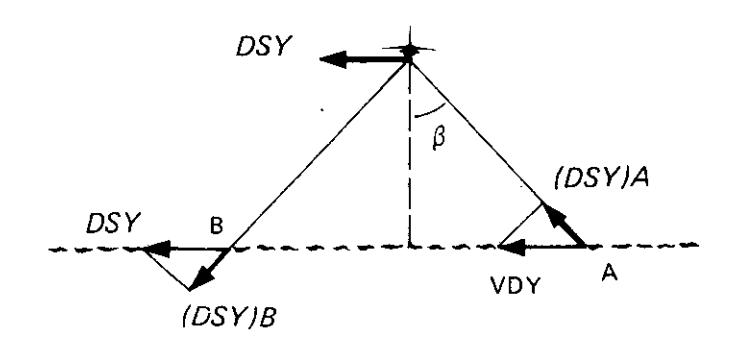

{277}------------------------------------------------

#### D - Calculation of ground speed components

#### (1) Orientation of beams

Optimum orientation of the beams allows their number to be kept to three; two beams A and B are directed forwards, symmetrically placed in relation to the symmetry plane of the aircraft, and inclined from it at an angle  $\beta$ . The plane of these beams forms an angle  $\alpha$  with the fuselage horizontal reference line.

For technical simplicity in the antenna, the rearward-pointing beam C has the same inclination in relation to the aircraft symmetry plane as beam B.

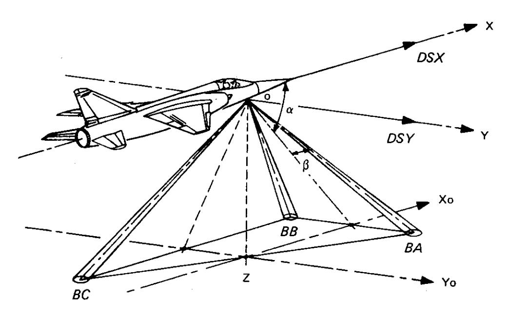

(2) Effect of ground speed components on Doppler frequency relative to each beam (figure 26).

The Doppler radar emits, then, three electromagnetic beams - A, B and C. It receives the signals reflected by the ground, each signal following the axis of its beam - A, B or C.

The longitudinal ground speed DSX has an effect upon beams A and B, in that the frequency of reception is offset in comparison with the frequency of emission. The difference in frequency corresponds to Doppler frequency DFX. It is identical for the paths of both beams, since the components of DSX, depending on the axes of the two beams (DSX)A and (DSX)B, are identical. Equally the longitudinal ground speed DSX acts on beam C, in that its frequency of reception is offset in comparison with the frequency of emission. This difference is equal to — DFX since the DSX component along the axis of beam C, (DSX)C, is equal and opposite in sign to the DSX component along beams A and B.

The transverse ground speed DSY acts on beam A, in that its frequency of reception is offset in comparison with the frequency of emission. This difference corresponds to Doppler frequency DFY. This speed DSY also has the effect of offsetting the frequencies of reception of beams B and C in relation to their frequencies of emission. The frequency difference is equal to - DFY, since the DSY components along the axes of beams B and C - (DSY)B and (DSY)C - are equal and opposite in sign to the DSY component of beam A (DSY)A.

The speed along axis Z, (DSZ), has the effect of offsetting the frequencies of reception of beams A, B and C in comparison with their relative frequencies of emission. This frequency difference corresponds to Doppler frequency DFZ. It is identical for the paths of all three beams, since the DFZ components along the axes of beams A, B and C = (DSZ)A, (DSZ)B and (DSZ)C = are equal.

{278}------------------------------------------------

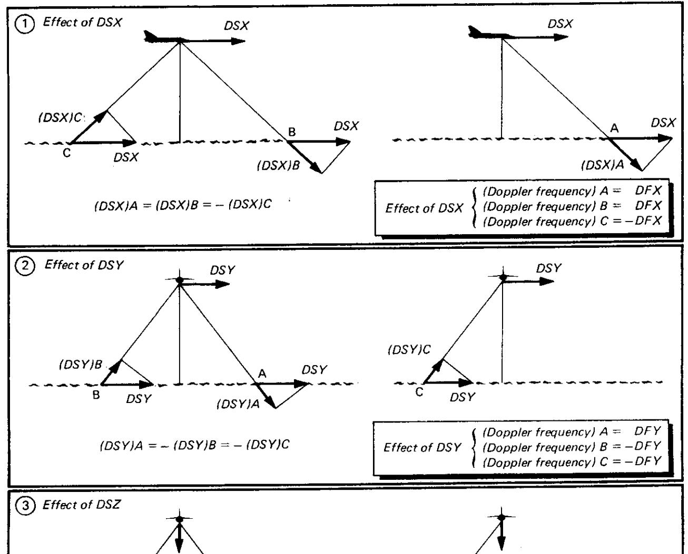

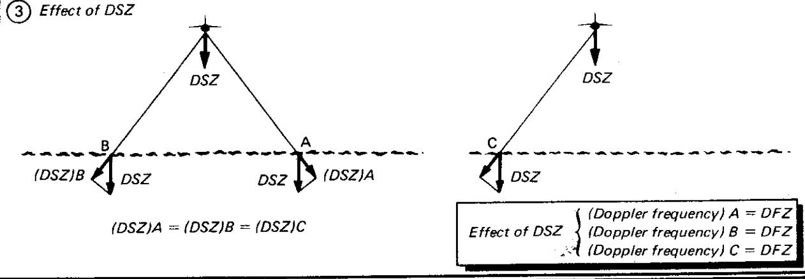

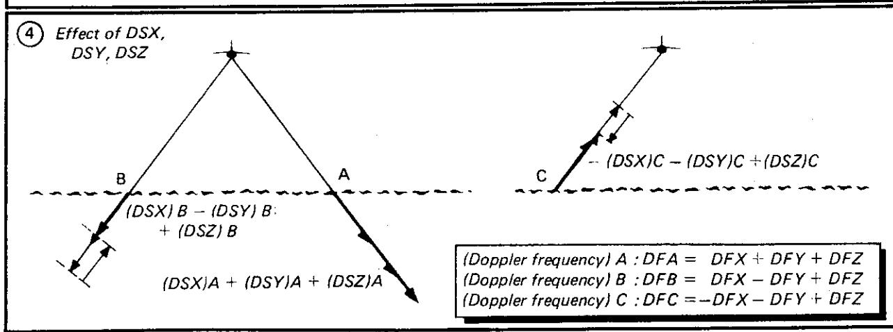

FIGURE 26 – EFFECT OF GROUND SPEED COMPONENTS ON DOPPLER FREQUENCY

{279}------------------------------------------------

AVIONS MARCEL DASSAULT BREGUET AVIATION . Restricted

MANUAL 12

The components of the ground speed are DSX, DSY and DSZ; therefore, for each beam, the ground speed will give rise to differences between the frequency at which each wave is emitted and the frequency at which it is received after reflection from the ground. For each wave, the difference in frequency («Doppler frequency») is equal to the sum of the differences caused by each speed component, i.e.

- for beam A: DFA = DFX + DFY + DFZ.

for beam B : DFB = DFX + DFY + DFZ.

- for beam C : DFC = DFX + DFY + DFZ.

The Doppler frequencies for the various beams are obtained by comparison of the frequencies of reception with those of emission. From these, the system calculates the three components of the aircraft speed — DSX, DSY and DSZ.

#### (3) Frequency spectrum

The beam emitted by the antenna is not of extreme fineness; rather, it has a certain width, which can be considered as a composite of individual, infinitely fine beams. Each of these individual beams has its own Doppler frequency depending on its inclination from the horizontal. Thus the energy received is distributed over a frequency spectrum.

In practice, the dispersion of Doppler frequencies resulting from this width of the beam gives the Doppler spectrum received from a normal ground a symmetrical aspect centered on a preferred frequency DF. This preferred frequency can be considered as being generated by the individual beam of inclination  $\alpha 1$  which practically merges with the mean axis of the beam. This value  $\alpha 1$  is known to the manufacturer of the equipment. Working from this known preferred frequency, it is therefore possible to determine the speed component of the aircraft along the axis along the is and from this, to calculate the aircraft speed. For a given aircraft speed, this preferred frequency DF is not exactly the same over water, since water will reflect a greater part of the energy along an angle  $\alpha 2$ , greater than  $\alpha 1$ . This value a2 is also known to the manufacturer of the equipment. From this measured frequency, it is therefore possible to obtain, in the same way as that already mentioned, the speed component of the aircraft along the axis  $\alpha 2$  (and not  $\alpha 1$ ) and from this, to calculate the aircraft speed (after a correction based on  $\alpha 2$ ).

It can be seen, therefore, that the formula which allows the calculation of the aircraft speed by measuring the preferred Doppler frequency must not be the same for an aircraft flying over water as for an aircraft flying over land. The changeover from one to the other is carried out manually using the «Land-Sea» control.

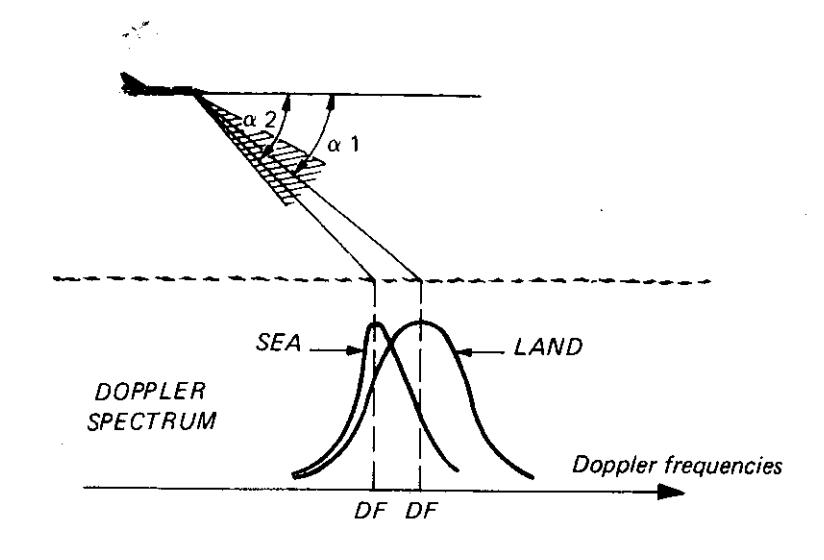

{280}------------------------------------------------

# AVIONS MARCEL DASSAULT BREGUET AVIATION

#### Restricted

#### 3 - FUNCTIONAL DESCRIPTION

#### A - Antennas

The antennas consist of two radiating beams situated side by side; one is used for emitting, the other for receiving. The emitting antenna produces three beams defining the three directions in which Doppler effect is to be measured. The receiving antenna receives the electromagnetic signals reflected by the ground for the respective beams.

Emission and reception take place on a continuous basis - continuous wave emission (CW principle).

#### B - Transmitter

The transmitter is composed of two microwave sources.

One source provides frequency F01 and delivers a continuous supply for the emission of the two forward beams. It also serves as a local oscillator for the rear beam receiver.

The second source provides frequency F02 and delivers a continuous supply for the emission of the rear beam. It also acts as a local oscillator for the front beam receivers.

#### C - Receivers

Each measurement beam has an associated super-heterodyne-type reception channel. Each channel comprises a band-pass microwave filter for protection against local jammers, and a mixer followed by an amplifier centered on the frequency difference of the solid sources, F1 = F01 - F02. The receiver gain is controlled by the level of the signal tapped after detection of the Doppler signal (AGC).

The Doppler signal contained in the receiver output signal is transposed around a stable frequency fo. The transposing circuit receives a signal F01 - F02. This enables a Doppler spectrum independent of frequency changes at the sources to be provided, with fo as its center.

#### D - Search - tracking

#### (1) Scope - principle

Each channel contains a «search-tracking» circuit.

For each channel, the purpose of this circuit is to provide a signal which is representative of the Doppler frequency of the associated beam.

The circuit has three operating modes : search, tracking, memory.

Search consists in adjusting the frequency of a voltage-controlled oscillator (VCO) to a frequency which corresponds to that of the signal delivered by the transposing circuit.

A recopy of the transposing circuit output signal is thus obtained.

Tracking consists in maintaining this value irrespective of how the Doppler signal changes in time. The frequency of the VCO thus determines the Doppler frequency (transposed around fo). This recopying of the transposing circuit output signal enables the frequency of the VCO to be aligned with the center frequency of the Doppler spectrum. It is thus possible to obtain a precise Doppler frequency.

In memory mode, the VCO frequency is adjusted from external speed information. This mode is selected when the Doppler signal cannot be used. Adjustment of the VCO frequency enables the supply of representative Doppler information (VCO frequency) to be readily renewed once the Doppler signal is able to be used again.

. . . . . . . . . . . . . . . . . . . .

{281}------------------------------------------------

MIRAGE F
MANUAL 12

#### (2) Circumstances for changing the operating modes

The search-tracking circuit will change from tracking mode to memory mode when one or other of the following situations is encountered:

- the quality of the signal received by one or other of the three channels is insufficient (signal/noise ratio too low);
- during a roll, the aircraft attitude causes the Doppler radar to exceed its measurement limits; this information is furnished by the main computer which transmits a «memory forcing» order when the angle of roll is greater than 30°;
  - an onboard jammer is operating: this information is provided by the main computer;
- a vertical parasite is detected on any of the three beams (see paragraph 5 Monitoring of vertical return).

Following a period of operation in memory mode, switching to search mode is permitted if the main computer estimates that the Doppler radar is operating within attitude limits that would enable operation in tracking mode (search enabling information), or if the jammer is no longer operating.

When operation in memory mode has been imposed following detection of a Doppler signal of insufficient quality, or following detection of a vertical parasite, switching to search mode is automatic after 30 seconds.

#### (3) Operation in tracking mode

The Doppler frequency information is obtained through a slaved system.

The operation of this system is schematized as follows:

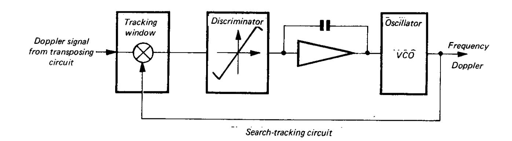

The frequency of a VCO is set by its control voltage. In the tracking window (narrow band filter), the oscillator output signal is compared with the Doppler signal (delivered by transposing circuit). The tracking window is linked to a discriminator and delivers to the integrator a voltage whose sign and amplitude depend on the direction and the value of the frequency gap between Doppler signal and oscillator signal.

The output voltage of the integrator is delivered to the VCO, in such a way that the frequency gap between the signals compared in the tracking window tends to cancel itself.

{282}------------------------------------------------

MIRAGE F

MANUAL 12

In equilibrium (slaving achieved), the oscillator frequency is identical to the center frequency of the Doppler spectrum (transposing circuit output signal) and the input voltage of the integrator is nil. Thus the oscillator control voltage (integrator output voltage) represents the Doppler frequency. From now on, the voltage-controlled oscillator constantly follows the variations of the Doppler signal, and the radar is locked on ; it is now operating in «tracking» mode. This is the normal operating mode for the radar, enabled by the aircraft attitude, absence of parasites or jamming and the quality of the signals received.

«Search» consists in scanning the frequencies with the VCO until lock-on with Doppler signal is achieved.

#### (4) Memory mode - Prepositioning of tracking windows

When operating in memory mode, the VCO frequency of each channel is adjusted using external speed information. This is achieved taking into account the following principles:

- the frequency of the voltage-controlled oscillator represents a speed. From the three VCO frequencies (channels A, B and C), a signal is generated which is representative of a ground speed. This speed is compared with the «hybrid» speed calculated from accelerations provided by the gyro-accelerometer center; the comparison is carried out in the main computer. The result (speed difference - Doppler realignment) is fed to the three search-tracking integrators which then modify their VCO frequencies until the difference is reduced to nil. The information generated by the Doppler signals has now been slaved to the hybrid speed. The tracking windows are said to be «prepositioned».

#### (5) Monitoring of vertical return

When the aircraft is flying over a stretch of calm water, a parasitic «vertical return» signal is received, whose Doppler frequency corresponds to the vertical speed of the aircraft. To eliminate interference from «Spurious lock-on» with this parasitic signal, the method used is to detect it in a window which covers the range of Doppler frequencies corresponding to the vertical speed of the aircraft. The setting of this window is relative to the vertical speed of the aircraft, determined by external information.

Presence of this parasitic signal in any of the three channels will cause switch-over to memory mode to avoid bringing the tracking windows onto the parasitic signal, should the signal proper disappear.

#### E - Processing of Doppler frequency information

The voltage-controlled oscillator of each channel supplies the Doppler frequency transposed about fo, to the main computer via a digital interface circuit. Provided that the Doppler radar system is neither in memory nor in search mode, the main computer determines the longitudinal and transverse speeds of the aircraft.

The law which enables calculation of speed using frequency information is modified according to the position of the «LAND - SEA» selector.

If the search-tracking circuits are operating in memory mode, the main computer takes the information received by the Doppler radar system and superimposes it on the speed value obtained from the gyro-accelerometer center (prepositioning of tracking windows).

{283}------------------------------------------------

### MIRAGE F

#### Restricted

MANUAL 12

#### F - Test initiation

AVIONS MARCEL DASSA

The doppler radar system can be qualitatively checked for operation and connection to the main computer by use of a test device.

The test consists in generating a Doppler signal which is then applied to the inputs of the receivers of each channel; therefore the test covers the entire radar system except for the antennas.

The test is initiated on the ground, with the MHSP mode selector set to TEST, using the main computer. The main computer checks the signal from the Doppler radar for conformity with the theoretical value of the Doppler test signals.

During the whole test, the «MDPL» light on the NCP is on.

In the event of malfunction, this light will flash, and will go out when operation becomes normal.

G - Signals exchanged between Doppler radar and main computer.

Via the Digibus, the Doppler radar supplies the main computer with the following information :

- Doppler radar status (radar working, operation in memory or search mode, presence of vertical parasite).
  - Doppler frequencies transposed about fo : FA = DFA + fo, FB = DFB + fo, FC = DFC + fo,
- variation of fo (difference between transposing frequency and its nominal value) memorized in main computer.

Via the Digibus the main computer supplies the Doppler radar with the following information:

- speed difference along the three beams and the corresponding validity,
- jammer in operation,
- memory forcing,
- test in progress,
- search enabling,
- vertical velocity VV.

{284}------------------------------------------------

{285}------------------------------------------------

FIGURE 27

6 - 196

MIRAGE F

AVIONS MARCEL DASSAULT BREGUET AVIATION

FIGURE 27 - FUNCTIONAL DIAGRAM OF DOPPLER RADAR SYSTEM

AA

{286}------------------------------------------------

### MIRAGE F

MANUAL 12

#### **SECTION 7**

Restricted

#### RADIO-ALTIMETER

#### TABLE OF CONTENTS

|       |                                                                                                                                        | Page                                                        |
|-------|----------------------------------------------------------------------------------------------------------------------------------------|-------------------------------------------------------------|
| 7-0   | GENERAL                                                                                                                                |                                                             |
|       | - Principe of radio-altimeter system                                                                                                   | 7-001                                                       |
| 7-1   | DESCRIPTION - OPERATION                                                                                                                |                                                             |
|       | - Table of components - Operation of radio-altimeter system - Transmitter-receiver - Indicator - Monitoring - Power supply - Self-test | 7-101 7-106 7-109 7-109 7-109 7-109 7-110 |
|       | LIST OF ILLUSTRATIONS                                                                                                                  |                                                             |
| Figu  | ure No.                                                                                                                                | Page                                                        |
| 1 2 3 | SCHEMATIC DIAGRAM OF RADIO-ALTIMETER SYSTEM                                                                                            | 7-002 7-104 7-105                                     |

OPERATION OF RADIO-ALTIMETER SYSTEM .....

7-108

{287}------------------------------------------------

10000000000000000000000000000000000000 .

{288}------------------------------------------------

MIRAGE F

### PRINCIPLE OF RADIO-ALTIMETER SYSTEM (Figure 1)

The radio-altimeter system is intended to measure the exact height between the aircraft wheels and the overflown ground, independently of the atmospheric pressure.

The system includes:

- transmitter-receiver 102R
- transmission antenna 104R
- reception antenna 105R
- ECM filter 165R
- diode-resistor box 114R
- radio-altimeter test relay 97R.

The aircraft height is displayed on the head-up display.

Besides, the radio-altimeter system is connected to :

- the autopilot (not used),
- the main computer which receives the height and a reliability signal
- the symbol generator box which receives the height and displays it as well as the reliability signal,
  - the radar scope to warn the pilot when the preset height is reached.

The transmitter-receiver generates and transmits towards the ground a wave (frequency-modulated by a sawtooth signal) through the transmission antenna.

It receives this wave reflected by the ground through the reception antenna and, after mixing the received signal with a fraction of the signal transmitted at the same time, it deduces the beat signal from which it determines the aircraft height above ground level.

The radio-altimeter system is equipped with a monitoring system and a self-test system.

{289}------------------------------------------------

{290}------------------------------------------------

MIRAGE F

FIGURE 1 -- SCHEMATIC DIAGRAM OF RADIO ALTIMETER SYSTEM

M 105R Reception

104R
Transmission

AK 08--81

Restricted

7-002

FIGURE 1

{291}------------------------------------------------

### MIRAGE F MANUAL 12

#### TABLE OF COMPONENTS

| Item | Name - Characteristics and Functions                                                                                                                                                                                                                                                                                                                                                                                                                      | Location Access Door No. | Do S | oc. |
|------|-----------------------------------------------------------------------------------------------------------------------------------------------------------------------------------------------------------------------------------------------------------------------------------------------------------------------------------------------------------------------------------------------------------------------------------------------------------|-----------------------------|---------|-----|
| 34A  | HEAD-UP DISPLAY                                                                                                                                                                                                                                                                                                                                                                                                                                           | Cockpit                     | ×       |     |
|      | Permits radio-altimeter transmitter-receiver starting and test through selector switch (1). Also permits a safety height to be selected through knob (2). Displays height indication and selected safety height as well as transmitter-receiver reliability information, on sighting glass (3). (See 14-3).                                                                                                                                               |                             |         |     |
| 35A  | SYMBOL GENERATOR BOX (See 14-3)                                                                                                                                                                                                                                                                                                                                                                                                                        |                             |         |     |
| 39C  | AUTOPILOT (See 13-2)                                                                                                                                                                                                                                                                                                                                                                                                                                   |                             |         |     |
| 65L  | LIGHTING DISTRIBUTOR (See 08-2)                                                                                                                                                                                                                                                                                                                                                                                                                        |                             |         |     |
| 104F | MARKER COMPUTER (See 10-5)                                                                                                                                                                                                                                                                                                                                                                                                                             |                             |         |     |
| 97R  | RADIO-ALTIMETER TEST RELAY                                                                                                                                                                                                                                                                                                                                                                                                                                |                             |         |     |
|      | When energized it permits test function to be started and safety height lights to illuminate on the radar scope.                                                                                                                                                                                                                                                                                                                                          |                             |         |     |
| 100R | RADIO-ALTIMETER FUSE-BREAKER                                                                                                                                                                                                                                                                                                                                                                                                                              | Electrical master box    | X       |     |
|      | Protects AC system 1, phase B, of radio-altimeter transmitter-receiver 102R.                                                                                                                                                                                                                                                                                                                                                                              | master box                  |         |     |
| 101R | RADIO-ALTIMETER FUSE-BREAKER                                                                                                                                                                                                                                                                                                                                                                                                                              | Electrical master box    | Х       |     |
|      | Protects DC system 1 of radio-altimeter transmitter- receiver 102R.                                                                                                                                                                                                                                                                                                                                                                                    | master box                  |         |     |
| 102R | RADIO-ALTIMETER TRANSMITTER-RECEIVER                                                                                                                                                                                                                                                                                                                                                                                                                      | IFF compartment          | Х       |     |
|      | Determines the exact height between the aircraft wheels (U/C down) and the overflown ground. Operates within the range from 4200 to 4400 MHz. The center transmission frequency is 4300 MHz, the (fixed) frequency deviation is 123 MHz and the (variable) modulation period is slaved to be the height. The operating range extends up to 4572m. Maximum attitudes: ± 40° for pitch ± 80° for roll. The A.I.D. (Aircraft Installation Delay) is 21.33 m. | 17-00                       |         |     |

{292}------------------------------------------------

### MIRAGE F

|      |                                                                                                                                                                                                                                                                                                                                                                                                                                                                                                                     |                             | ANUAI    |    |
|------|---------------------------------------------------------------------------------------------------------------------------------------------------------------------------------------------------------------------------------------------------------------------------------------------------------------------------------------------------------------------------------------------------------------------------------------------------------------------------------------------------------------------|-----------------------------|----------|----|
| Item | Name - Characteristics and Functions                                                                                                                                                                                                                                                                                                                                                                                                                                                                                | Location Access Door No. | Dod S | 3. |
|      | The transmitter receiver transmits the height data through two outputs: - one linear output for the autopilot and the symbol genetor box (0 to 1524 m) - one linear output for the main computer (0 to 4572 m).                                                                                                                                                                                                                                                                                                     |                             |          |    |
|      | According to the safety height value preset on the head-up display, the transmitter transmits a control voltage to the height indicator lights of the radar scope.                                                                                                                                                                                                                                                                                                                                                  |                             |          |    |
|      | These lights come on in the following conditions: - red light on when: aircraft height hra $<$ preset height ha $-2 \Delta h$ ( $\Delta h = 6.095 \text{ m}$ between 0 and 152.4 m; above: proportional to height). - red and green lights on when: $ha - 2 \Delta h \le h \le ha - \Delta h$ - green light on when $ha - \Delta h \le h < ha + \Delta h$ - green and amber lights on when: $ha + \Delta h \le h \le ha + 2 \Delta h$ - amber light on when: $ha + 2 \Delta h < h$ |                             |          |    |
|      | Self-monitoring: A self-monitoring device cuts off a reliability information delivered to the sight system in the following cases: - system switched off or no power supply to the transmitter-receiver - transmitter-receiver not cut in, either because of a failure, or because of the aircraft height exceeding the cut-out height.                                                                                                                                                                             |                             |          |    |
|      | Test: - a self-test system, triggered from the head-up display, permits partial test of the equipment. The test result is displayed on the sighting glass of the head-up display a test connector (1) on the front panel of radio-altimeter transmitter-receiver 102R permits connection of the test equipment.                                                                                                                                                                                                     |                             |          |    |
|      | ·                                                                                                                                                                                                                                                                                                                                                                                                                                                                                                                   |                             |          |    |
|      |                                                                                                                                                                                                                                                                                                                                                                                                                                                                                                                     |                             |          |    |
|      |                                                                                                                                                                                                                                                                                                                                                                                                                                                                                                                     |                             |          |    |

{293}------------------------------------------------

| ltem | Name - Characteristics and Functions                                                                                                                        | Location Access Door No. | Do S | c.   |
|------|-------------------------------------------------------------------------------------------------------------------------------------------------------------|-----------------------------|---------|------|
| 104R | TRANSMISSION ANTENNA                                                                                                                                        | F. 1 - 2                    | х       |      |
|      | RF impedance : 50 ohms Gain : 8 dB Radiation diagram : ± 30° at 3 dB for roll ± 25° at 3 dB for pitch SWR ≤ 1.30 within the range of from 4200 to 4400 MHz. |                             |         |      |
| 105R | RECEPTION ANTENNA                                                                                                                                           | F. 7 - 8                    | Х       |      |
|      | (See 104R)                                                                                                                                                  |                             |         |      |
| 114R | DIODE-RESISTOR BOX                                                                                                                                          | IFF compartment          | х       |      |
| :    | Contains the diodes and resistors required for operation and testing of height lights on radar scope.                                                       | 17-00                       | :       |      |
| 150R | RADIO-ALTIMETER OPERATION RELAY                                                                                                                             | 15-02 (RH junction       | х       |      |
|      | Permits radio-altimeter system to be started.                                                                                                               | box)                        |         |      |
| 165R | ECM FILTER                                                                                                                                                  | IFF compartment          | Х       |      |
|      | Band-pass filter. Protects the radio-altimeter against jamming due to counter-measure system.                                                               | 17-00                       |         |      |
| 148  | RADAR SCOPE                                                                                                                                                 | Cockpit (RH panel)       | х       |      |
|      | Supports the safety height lights: - one amber light (1) - one green light (2) - one red light (3)                                                          |                             |         |      |
| 137Z | VERTICAL REFERENCE CHANNEL TEST CONNECTOR                                                                                                                   | (See 10-1)                  |         |      |
|      | (See 10-1)                                                                                                                                                  | i                           |         |      |
| 140Z | 26 V AC POWER SUPPLY TEST CONNECTOR                                                                                                                         |                             |         |      |
|      | (See 10-1)                                                                                                                                                  |                             |         |      |
|      |                                                                                                                                                             |                             |         |      |
|      |                                                                                                                                                             |                             |         |      |
|      |                                                                                                                                                             |                             |         |   |

{294}------------------------------------------------

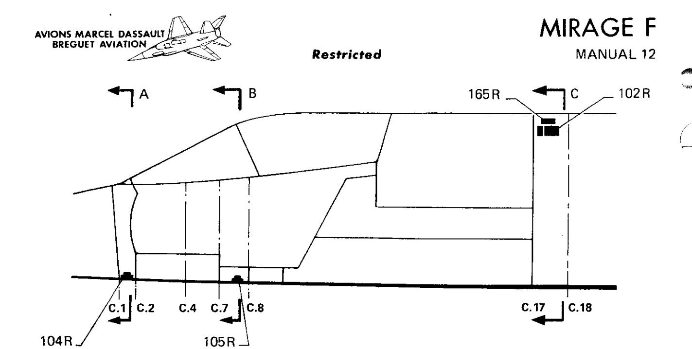

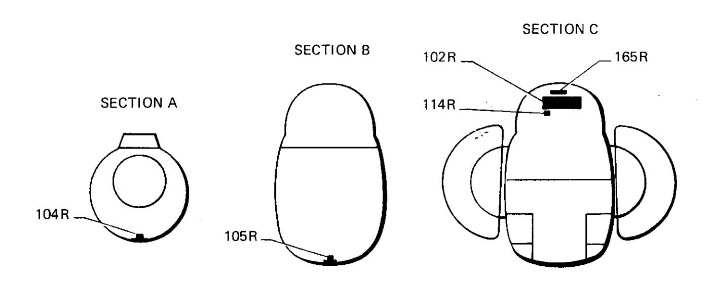

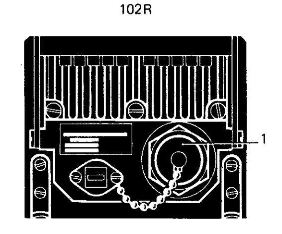

FIGURE 2 – IMPLANTATION GENERALE GENERAL LAYOUT

{295}------------------------------------------------

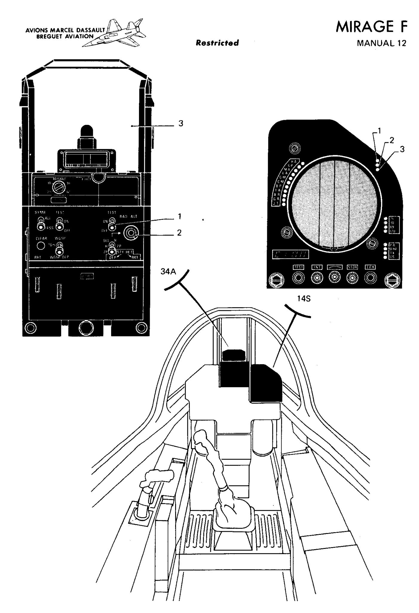

FIGURE 3 — IMPLANTATION AU POSTE PILOTE LAYOUT IN COCKPIT

{296}------------------------------------------------

### OPERATION OF RADIO-ALTIMETER SYSTEM (Figure 4)

#### 1 - TRANSMITTER-RECEIVER

#### A - Principle

A wave frequency modulated by a sawtooth signal is transmitted to ground. At time t1, the wave frequency is f1. At time t2, after being reflected by ground, the wave is received with the same frequency f1.

At this time t2, the transmission frequency has become f2.

In a mixer, the received signal, with frequency f1, is multiplied by a fraction of the transmission signal, with frequency f2.

The beating signal with the following frequency is then collected:

$$fb = f2 - f1$$

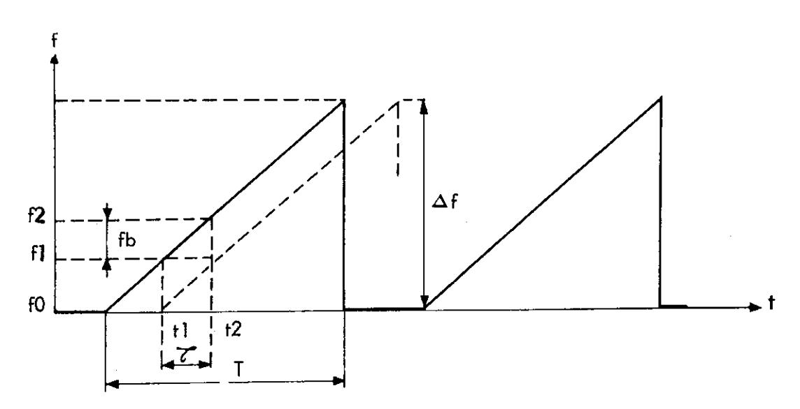

Let us call  $\mathcal C$  the time interval t2-t1: this is the duration of the two-way travel of the wave between the aircraft and ground. It is called «transition time».

Applying basic relations between similar triangles provides:

$$\frac{fb}{\Delta f} = \frac{\mathcal{C}}{T}$$

where  $\Delta f$  is the fixed frequency deviation in the radio-altimeter.

On the other hand:

$$\mathcal{C} = \frac{2Hra}{C}$$

where Hra is the aircraft height and C the radio-electrical wave speed.

Consequently:

Hra = 
$$\frac{C}{2} \frac{T}{\Delta f}$$
 fb

{297}------------------------------------------------

### MIRAGE F

MANUAL 12

AVIONS MARCEL DASSAULT RESTRICTED RESTRICTED

In the radio-altimeter, fb is kept constant by slaving T to height h, and so T provides the height information.

This measurement is made by period-meters performing the signal width/DC voltage conversion.

#### B - Operation

The radio-altimeter transceiver consists of a servo loop and several components external to the loop.

#### (1) Servo loop

The servo loop includes:

- one UHF source (modulator-transmitter) supplying the transmission signal; this signal is frequency modulated by a sawtooth signal from a sawtooth signal generator; the constant frequency deviation is set to  $\Delta f = 123$  MHz;
- one mixer generating beating signal fb from the transmission signal reflected by ground and a fraction of the signal transmitted at the same time;
- one audio frequency amplifier receiving beating signal fb, with the gain automatically matching the height;
- one tracking discriminator receiving the amplified beating signal and comparing it to its own frequency fo of 100 kHz; when fb is not strictly equal to fo, the circuit delivers an error voltage  $\epsilon$  p;
  - one integrator receiving error voltage  $\epsilon$  p ;
  - one dynamic gain corrector stabilizing the loop regardless of the operating height;
- one sawtooth signal generator controlled by the output voltage from the gain corrector and controlling the modulator frequency.

#### (2) Components external to servo loop

These are listed below.

- One contrast discriminator, with the positive peak centered on fo. This discriminator is also driven by the output of the audio frequency amplifier.

The discriminator detects the presence of a beating signal near frequency fo. If this signal disappears, or if its level is insufficient, the output DC voltage from this discriminator drops below a preset value called «contrast threshold».

- A series of «search/tracking logic» circuits, controlled by the contrast discriminator output; when the beating signal disappears or decreases, these circuits trigger an automatic signal search process, open the servo loop (gate), supply a warning information and suppress the height information. On acquisition of a beating signal of suitable level and frequency, the output voltage from the contrast discriminator becomes higher than the contrast threshold, and the search/tracking logic stops the search phase, closes the servo loop, authorizes the height information and cancels the warning information.

This is the normal radio-altimeter operation or «tracking phase».

- One semi-logarithmic period-meter performing the sawtooth width/DC voltage conversion.

{298}------------------------------------------------

{299}------------------------------------------------

MIRAGE F MANUAL 12

- two linear period-meters.

- a device comparing the A/C actual height information from the semi-logarithmic period-meter, with the preset height information.

According to the result obtained, a logic may or may not trigger the illumination of the height indicator lights.

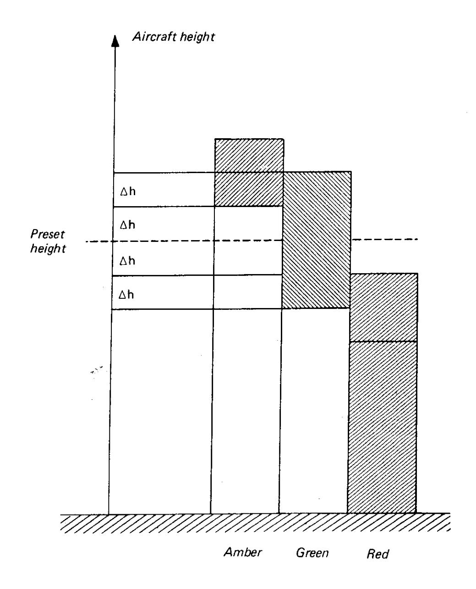

{300}------------------------------------------------

. . 

{301}------------------------------------------------

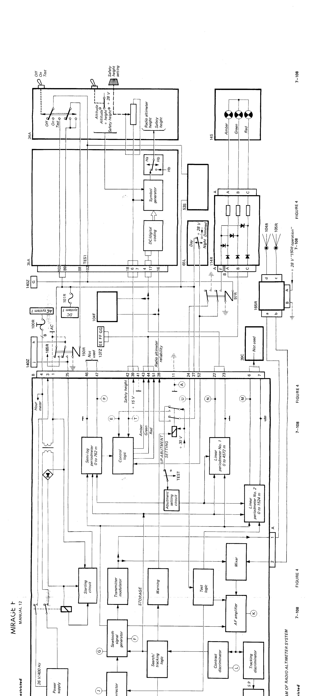

{302}------------------------------------------------

MIRAGE F

MANUAL 12

#### 2 - HEIGHT DISPLAY

#### A - Height repeating circuit

The signal from the linear periodic-meter No. 1 is used by the symbol generator box displaying the height scale in the HUD sight.

#### B - Preset safe height

The purpose of this presetting is to enable the pilot to fly the aircraft above a safe height by signalling, through illumination of the red light, that the aircraft reaches or is below this height.

The safe height selection control, located on the HUD sight, drives the needle of a potentiometer the output voltage of which, proportional to the preset height, is applied to a control logic of the transceiver which also receives the matched semi-log voltage representing the actual aircraft height. After comparison of both voltages, a control circuit acts on a relay which illuminates or extinguishes the safe height indicator lights.

#### 3 - MONITORING

Only the radio altimeter transceiver is monitored. Monitoring is performed on the transmission-reception loop, at the contrast discriminator.

When the beat signal disappears or becomes lower than the contrast threshold, the search/tracking logic triggers the search process by opening the transmission-reception loop, and controls storage of the output voltages from the period-meters.

If the beat signal does not return to a suitable level, the warning circuit cuts off the signal controlling the radio altimeter correct operation relay; this causes:

- suppression of the voltage which
  - cuts in the control logic of the height indicator lights on the radar scope (the lights go out)
- transmits to the main computer and to the symbol generator box the radio altimeter correct operation information.

#### 4 - POWER SUPPLY

The radio altimeter transceiver is fed with:

- 115V/400 Hz through AC system 1, phase B
- 28 V DC through DC system 1.

Built-in power supply units generate the voltages required for operation of the transceiver, from the 115 V/400 Hz power supply.

{303}------------------------------------------------

MIRAGE F
MANUAL 12

#### Transceiver

A starting circuit is supplied with 115 V/400 Hz as soon as the aircraft is energized.

It is controlled by the radio altimeter operation relay when this relay is energized, and permits switching of the starting relay to active position. The latter supplies a power supply unit which delivers the voltages required for operation of the transceiver.

The hour meter is also supplied with 115 V/400 Hz power.

The 28 V DC voltage from the aircraft system is distributed :

- to the common contact of the radio altimeter reliability relay for use by the main computer and the symbol generator box,

- to the control logic of safety height lights after the lighting distributor relay has passed through

deenergized position.

This voltage is also distributed to the safety height lights circuit through the test relay, and to the coil of the test prevention relay.

#### 5 - SELF-TEST

Pressing the test control on the head-up display causes the energization of the test relay which, through one of its active contacts, applies a ground to the transceiver test logic.

#### As a result:

- the AF channel is cut off, which causes the transmission-reception loop to open and the height counter reticle to appear on the head-up display;
  - the search is cancelled;
- a calibrated current is applied to the input of the dynamic gain corrector so as to obtain a frequency corresponding to a O foot height at the output of the sawtooth signal generator.

{304}------------------------------------------------

### MIRAGE F

MANUAL 12

#### **SECTION 8**

Restricted

#### **RADIO-COMPASS**

#### TABLE OF CONTENTS

| •    | OFNE DAT                                                            | Page           |
|------|---------------------------------------------------------------------|----------------|
| 8-0  | GENERAL                                                             |                |
|      | - Principle of radio-compass system                                 | 8-001          |
| 8-1  | DESCRIPTION - OPERATION                                             |                |
|      | - Table of components                                               | 8-101 8-106 |
|      | Incorporated documentation - Radio-compass sense antenna ARC 172 ED | 8-121          |
|      | LIST OF ILLUSTRATIONS                                               |                |
| Figu | ire No.                                                             | Page           |
| 1    | SCHEMATIC DIAGRAM OF RADIO-COMPASS SYSTEM                           | 8-002          |
| 2    | GENERAL LAYOUT                                                      | 8-104          |
| 3    | LAYOUT IN COCKPIT                                                   | 8-105          |
| 4    | LOOP ROTATION CONTROL PRINCIPLE                                     | 8-107          |
| 5    | SENSING PRINCIPLE                                                   | 8-108          |
| 6    | OPERATION OF RADIO-COMPASS SYSTEM                                   | 8-110 8-122 |
| 7    | RADIO-COMPASS SENSE ANTENNA                                         | 0-122          |

{305}------------------------------------------------

{306}------------------------------------------------

MIRAGE F MANUAL 12

### PRINCIPLE OF RADIO-COMPASS SYSTEM (Figure 1)

The radio-compass system is a radio-navigational facility operating with a ground beacon and supplying the pilot with the beacon bearing.

The system is composed of the following:

- radio-compass receiver 124R
- radio-compass control unit 123R
- loop antenna 130R
- quadrantal error corrector 129R
- sense antenna 128R
- antenna coupler 127R
- coaxial adapter 126R
- 26 V/400 Hz computing voltage filter 125R
- 28 V DC supply voltage filter 122R
- a display unit: navigation indicator 68F for reading the radio-compass beacon bearing
- radio selector box 29R which is supplied with the AF signals detected by the receiver (beacon identification and modulation).

The receiver can operate (according to selection made on control unit):

- automatically (ADF mode): tracking and sensing take place automatically
- as a traffic receiver (ANT mode).

The system is provided with a controlled test system.

{307}------------------------------------------------

{308}------------------------------------------------

FIGURE 1

8-002

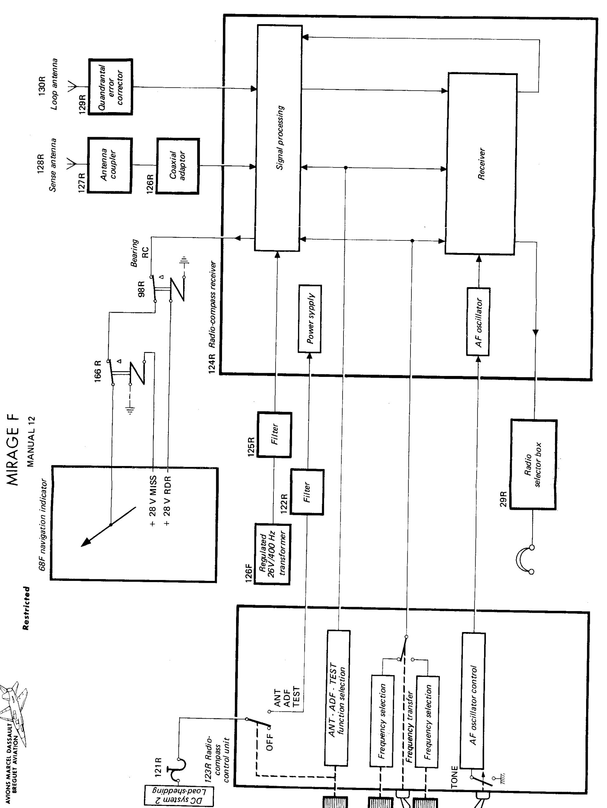

FIGURE 1 - SCEMATIC DIAGRAM OF RADIO-COMPASS SYSTEM

Restricted

BD 09--79

{309}------------------------------------------------

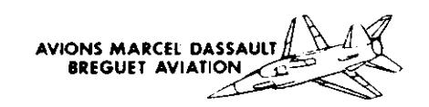

#### TABLE OF COMPONENTS

For layout, see Figures 2 and 3

| Item | Name - Characteristics and Functions                                                                                                                                                                                                                                                                                       | Location                         | Do       | oc. |
|------|----------------------------------------------------------------------------------------------------------------------------------------------------------------------------------------------------------------------------------------------------------------------------------------------------------------------------|----------------------------------|----------|-----|
|      |                                                                                                                                                                                                                                                                                                                            | Access Door No.                  | <u>s</u> | 1   |
| 68F  | NAVIGATION INDICATOR (See 12-6) Indicates beacon relative and true bearings by means of single pointer 5 and heading card 1.                                                                                                                                                                                               | Cockpit (instrument panel) | X        |     |
| 126F | REGULATED 26 V AC TRANSFORMER (See 10-2)                                                                                                                                                                                                                                                                                |                                  |          |     |
| 65L  | LIGHTING DISTRIBUTOR (See 08-2)                                                                                                                                                                                                                                                                                         |                                  |          |     |
| 29R  | RADIO SELECTOR BOX (See 11-3) Makes it possible to adjust radio-compass audio output                                                                                                                                                                                                                                       | Cockpit (LH console)       | ×        |     |
| 98R  | ADF/POLE SETTING SWITCHING RELAY (See 12-6)                                                                                                                                                                                                                                                                                |                                  |          |     |
| 121R | RADIO-COMPASS FUSE BREAKER Protects load-shedding DC system 2 of radio-compass control unit.                                                                                                                                                                                                                               | Electrical master box         | X        |     |
| 122R | RADIO-COMPASS FILTER Filters 28 V DC voltage supplied to radio-compass receiver 124R.                                                                                                                                                                                                                                      | IFF compartment 17-00      | X        |     |
| 123R | RADIO-COMPASS CONTROL UNIT Makes radio-compass system suitable for use. The front panel carries: - a function selector switch (1) with four positions: - «OFF» - «ANT»: the system operates as a traffic receiver - «ADF»: the system operates in automatic bearing tracking mode «TEST». The «TEST» position is unsteady. | Cockpit (RH console)          | ×        |     |

{310}------------------------------------------------

### MIRAGE F

| Name - Characteristics and Functions                                                                                                                                                                                                                                                                                                                                                                                                                                                                                                                                                                                                                                                                                                                                                                                       | Location Access Door No.                                                                                                                                                                                                                                                                                                                                                                                                                                                                                                                                                                                                                                                                                                                                                                                                                                                                                                                                                                                                                                                                                                                                                                                                                                                                                                                                                                                                                                                                                                                                                                                   | Doc.                                                                                                                                                                                                                                                                                                                                                                                                                                                                                                                                                                                                                                                                                                                                                                                                                                                                                                                                                                                                                                                                                                                                                                                                                                                                                                                                                                                                                                                                                                                                                                                                               |
|----------------------------------------------------------------------------------------------------------------------------------------------------------------------------------------------------------------------------------------------------------------------------------------------------------------------------------------------------------------------------------------------------------------------------------------------------------------------------------------------------------------------------------------------------------------------------------------------------------------------------------------------------------------------------------------------------------------------------------------------------------------------------------------------------------------------------|---------------------------------------------------------------------------------------------------------------------------------------------------------------------------------------------------------------------------------------------------------------------------------------------------------------------------------------------------------------------------------------------------------------------------------------------------------------------------------------------------------------------------------------------------------------------------------------------------------------------------------------------------------------------------------------------------------------------------------------------------------------------------------------------------------------------------------------------------------------------------------------------------------------------------------------------------------------------------------------------------------------------------------------------------------------------------------------------------------------------------------------------------------------------------------------------------------------------------------------------------------------------------------------------------------------------------------------------------------------------------------------------------------------------------------------------------------------------------------------------------------------------------------------------------------------------------------------------------------------|--------------------------------------------------------------------------------------------------------------------------------------------------------------------------------------------------------------------------------------------------------------------------------------------------------------------------------------------------------------------------------------------------------------------------------------------------------------------------------------------------------------------------------------------------------------------------------------------------------------------------------------------------------------------------------------------------------------------------------------------------------------------------------------------------------------------------------------------------------------------------------------------------------------------------------------------------------------------------------------------------------------------------------------------------------------------------------------------------------------------------------------------------------------------------------------------------------------------------------------------------------------------------------------------------------------------------------------------------------------------------------------------------------------------------------------------------------------------------------------------------------------------------------------------------------------------------------------------------------------------|
| The panel also includes a frequency selector system, which consists of the following:  - two frequency display windows (3); the window displaying the unused frequency is cancelled with a bar;  - two frequency display windows (4), each including three concentric crowns:  - external crown: display of MHz and hundreds of kHz.  - center crown: display of tens of kHz,  - internal crown: display of kHz and 0,5 kHz;  - a «TRF» transfer selector switch (5); this switch is used to select one of the two displayed frequencies by tilting the bar over the unused frequency;  - a «TONE» switch (6); this switch controls the operation of a 1020-Hz oscillator used to check the presence of the radio waves in case these are unmodulated.  Lighting  5 V AC lighting is provided by lighting distributor 65L. |                                                                                                                                                                                                                                                                                                                                                                                                                                                                                                                                                                                                                                                                                                                                                                                                                                                                                                                                                                                                                                                                                                                                                                                                                                                                                                                                                                                                                                                                                                                                                                                                               |                                                                                                                                                                                                                                                                                                                                                                                                                                                                                                                                                                                                                                                                                                                                                                                                                                                                                                                                                                                                                                                                                                                                                                                                                                                                                                                                                                                                                                                                                                                                                                                                                    |
| The radio-compass receiver permits the bearing of a radio-compass beacon to be known in automatic mode (ADF), or the unmodulated continuous or amplitude modulated signals transmitted (ANT mode) to be monitored.  Frequency range: 190 - 1749,5 kHz (0,5 kHz channel spacing).  On its front panel, the receiver includes: - a box housing the direction-finder; the latter is fitted with a test pushbutton (1); - a dial (2) with a pointer indicating the differential angle between the direction-finder reading and the reference zero; - a connector for the junction with loop antenna 130R, through quadrantal error corrector 129R; - a connector for junction with sense antenna 128R, through coaxial adaptor 126R and antenna coupler 127R; - a retractable handle for carrying the receiver.                | IFF compartment 17-00                                                                                                                                                                                                                                                                                                                                                                                                                                                                                                                                                                                                                                                                                                                                                                                                                                                                                                                                                                                                                                                                                                                                                                                                                                                                                                                                                                                                                                                                                                                                                                                         | X                                                                                                                                                                                                                                                                                                                                                                                                                                                                                                                                                                                                                                                                                                                                                                                                                                                                                                                                                                                                                                                                                                                                                                                                                                                                                                                                                                                                                                                                                                                                                                                                                  |
|                                                                                                                                                                                                                                                                                                                                                                                                                                                                                                                                                                                                                                                                                                                                                                                                                            | The panel also includes a frequency selector system, which consists of the following:  - two frequency display windows (3); the window displaying the unused frequency is cancelled with a bar;  - two frequency display windows (4), each including three concentric crowns:  - external crown: display of MHz and hundreds of kHz.  - center crown: display of tens of kHz,  - internal crown: display of tens of kHz;  - a «TRF» transfer selector switch (5); this switch is used to select one of the two displayed frequencies by tilting the bar over the unused frequency;  - a «TONE» switch (6); this switch controls the operation of a 1020-Hz oscillator used to check the presence of the radio waves in case these are unmodulated.  Lighting  5 V AC lighting is provided by lighting distributor 65L.  RADIO-COMPASS RECEIVER  The radio-compass receiver permits the bearing of a radio-compass beacon to be known in automatic mode (ADF), or the unmodulated continuous or amplitude modulated signals transmitted (ANT mode) to be monitored.  Frequency range: 190 - 1749,5 kHz (0,5 kHz channel spacing).  On its front panel, the receiver includes:  - a box housing the direction-finder; the latter is fitted with a test pushbutton (1);  - a dial (2) with a pointer indicating the differential angle between the direction-finder reading and the reference zero;  - a connector for the junction with loop antenna 130R, through quadrantal error corrector 129R;  - a connector for junction with sense antenna 128R, through coaxial adaptor 126R and antenna coupler 127R; | The panel also includes a frequency selector system, which consists of the following:  - two frequency display windows (3); the window displaying the unused frequency is cancelled with a bar;  - two frequency display windows (4), each including three concentric crowns:  - external crown: display of MHz and hundreds of kHz.  - center crown: display of tens of kHz,  - internal crown: display of thz and 0,5 kHz;  - a «TRF» transfer selector switch (5); this switch is used to select one of the two displayed frequencies by tilting the bar over the unused frequency;  - a «TOKE» switch (6); this switch controls the operation of a 1020-Hz oscillator used to check the presence of the radio waves in case these are unmodulated.  Lighting  5 V AC lighting is provided by lighting distributor  65L.  RADIO-COMPASS RECEIVER  The radio-compass receiver permits the bearing of a radio-compass beacon to be known in automatic mode (ADF), or the unmodulated continuous or amplitude modulated signals transmitted (ANT mode) to be monitored.  Frequency range: 190 - 1749,5 kHz (0,5 kHz channel spacing).  On its front panel, the receiver includes:  - a box housing the direction-finder; the latter is fitted with a test pushbutton (1);  - a dial (2) with a pointer indicating the differential angle between the direction-finder reading and the reference zero;  - a connector for the junction with loop antenna 130R, through quadrantal error corrector 129R;  - a connector for junction with sense antenna 128R, through coaxial adaptor 126R and antenna coupler 127R; |

{311}------------------------------------------------

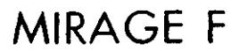

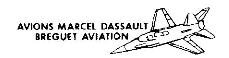

| Item | Name - Characteristics and Functions                                                                                                                                                                                                                                                                                                                                                                                                                                                                                                                                                                                                                                                                                        | Location Access Door No. | Do S | i |
|------|-----------------------------------------------------------------------------------------------------------------------------------------------------------------------------------------------------------------------------------------------------------------------------------------------------------------------------------------------------------------------------------------------------------------------------------------------------------------------------------------------------------------------------------------------------------------------------------------------------------------------------------------------------------------------------------------------------------------------------|-----------------------------|---------|---|
| 125R | FILTER  Filters the 26 V AC voltage supplied to the synchrotransmitter of radio-compass receiver 124R.                                                                                                                                                                                                                                                                                                                                                                                                                                                                                                                                                                                                                      | 1FF bay 17-00         | ×       |   |
| 126R | COAXIAL ADAPTOR                                                                                                                                                                                                                                                                                                                                                                                                                                                                                                                                                                                                                                                                                                             | IFF bay                  |         |   |
|      | Matches the impedance of sense antenna coaxial cable with receiver input circuits.                                                                                                                                                                                                                                                                                                                                                                                                                                                                                                                                                                                                                                          | 17-00                       |         |   |
| 127R | ANTENNA COUPLER                                                                                                                                                                                                                                                                                                                                                                                                                                                                                                                                                                                                                                                                                                             | Incorporated                | X       |   |
|      | Matches the antenna impedance with that of the coaxial cable leading to the receiver. Secured under the sense antenna.                                                                                                                                                                                                                                                                                                                                                                                                                                                                                                                                                                                                      | under sense antenna      |         |   |
| 128R | SENSE ANTENNA                                                                                                                                                                                                                                                                                                                                                                                                                                                                                                                                                                                                                                                                                                               | Fin base                    |         | Х |
|      | This antenna is interchangeable. It is of the capacitive type, used when the receiver operates as a traffic receiver (tuning in to a station) or for sensing when the radiocompass operates as an automatic direction finder (ADF). The radiation pattern of this antenna is omnidirectional.                                                                                                                                                                                                                                                                                                                                                                                                                               |                             |         |   |
|      | Attachment The sense antenna is attached to the dorsal fin of the A/C by means of 5 screws. In the front section it is equipped with a removable cowling (1) for connecting the antenna (front part) to the fuselage. The rear upper part of the antenna is screw fixed on a fairing (2) for connection with the fin leading edge. Two small side fillets (3) fixed by screws to the rear lower part of the antenna ensure its connection to the fin base fillet.                                                                                                                                                                                                                                                           |                             |         |   |
| 129R | QUADRANTAL ERROR CORRECTOR                                                                                                                                                                                                                                                                                                                                                                                                                                                                                                                                                                                                                                                                                                  | Loop antenna                | Х       |   |
|      | Attenuates magnetic field component distortion due to the airframe. It is screwed directly onto loop antenna 130R by its coaxial connector.                                                                                                                                                                                                                                                                                                                                                                                                                                                                                                                                                                                 | coaxial connector        |         |   |
| 130R | This fixed flat antenna is made up of two windings in quadrature around a cross-shaped flat ferrite core. In conjunction with the DF of receiver 124R, it can be used to detect the propagation direction of a radio wave. The antenna is installed under a laminated fairing integral with the equipment bay door skin.  Attachment The antenna is fixed by 4 screws to a floor forming part of the bay door structure. The retaining holes on the floor are elongated to enable the antenna to be adjusted in position. The antenna axis is marked with a colored line on the upper face of the antenna. This line is used to align the antenna with the aircraft lubber line represented by a colored line on the floor. | Door 13-00               | X       |   |

{312}------------------------------------------------

{313}------------------------------------------------

### MIRAGE F

| Item | Name - Characteristics and Functions                 | Location Access Door No. | Doc S | <u> </u> |
|------|------------------------------------------------------|-----------------------------|----------|----------|
| 137Z | VERTICAL REFERENCE CHANNEL TEST CONNECTOR (See 10-1) |                             |          |          |
| 166R | ADF/RADAR SWITCHING RELAY (See 12-6)              |                             |          |          |
| 53S  | COMPATIBILITY UNIT (See 14-6)                     |                             |          |          |
| 158  | PROGRAM UNIT (See 14-2)                           |                             |          |          |
| 5Y   | HARMONIZATION UNIT (See 15-4)                     |                             |          |          |
|      | ***.                                                 |                             |          |          |
|      |                                                      |                             |          |          |
|      |                                                      |                             |          |          |
|      |                                                      |                             |          |          |
|      |                                                      |                             |          |          |
|      |                                                      |                             |          |          |
|      |                                                      |                             |          | :        |
|      |                                                      |                             |          |          |
|      |                                                      |                             |          |          |
|      |                                                      |                             |          |          |

{314}------------------------------------------------

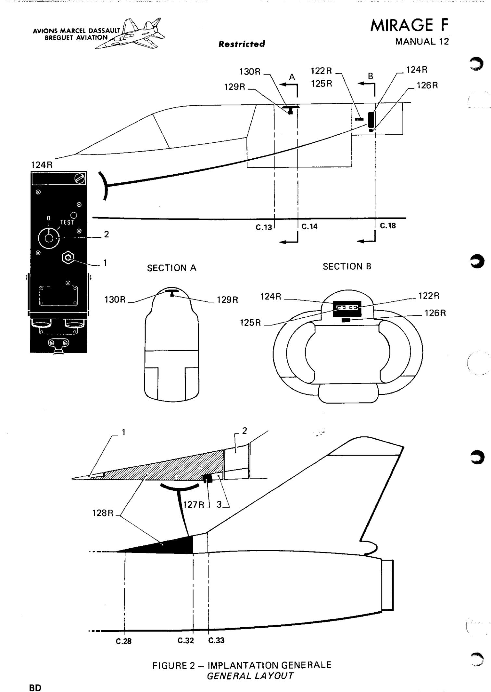

09-79

8-104

{315}------------------------------------------------

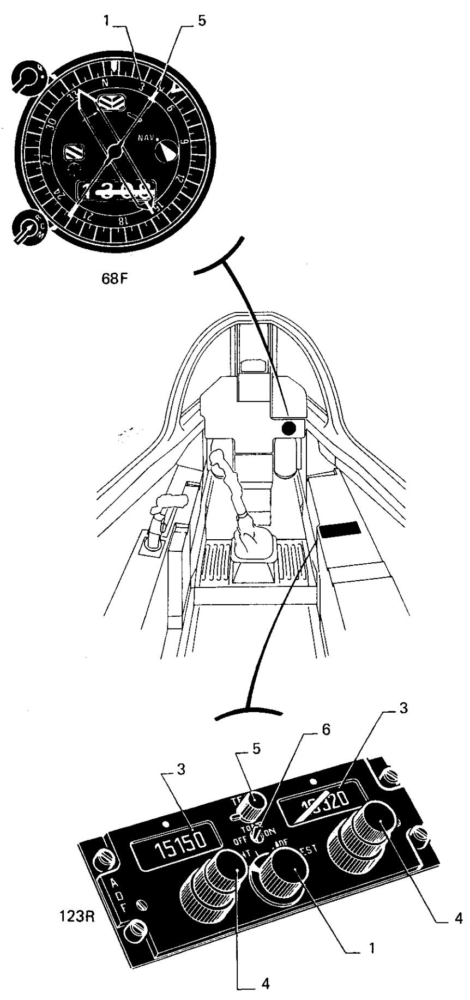

FIGURE 3 — IMPLANTATION AU POSTE PILOTE LAYOUT IN COCKPIT

{316}------------------------------------------------

MIRAGE F

### OPERATION OF RADIO-COMPASS SYSTEM (Figures 4, 5 and 6)

#### 1 - PRINCIPLE OF OPERATION

The method for finding the transmitting station direction is based upon the «radio direction-finding» principle.

The loop antenna consists of two stationary loops located in vertical and perpendicular planes. These two loops respectively feed power to two perpendicular-axis windings of a «radio direction-finder». The longitudinal and transverse components of the magnetic field radiated by the loop antenna are thus transmitted to the «radio direction-finder», in which the direction of the magnetic field is restored.

A winding able to turn about the reproduced field just acts as a rotating aerial. Each time the winding is set turning, the induced voltage goes through two zero values. These two zero values are such that the rotor winding axis is located at  $90^{\circ}$  from the magnetic field direction; therefore this axis follows the direction of the transmitting station on ground (since the component of a transmitted wave magnetic field is perpendicular to the propagation direction).

If the winding of the radio direction-finder rotor is not lined up with one of the two «zero» directions, an induced voltage is generated and amplified, then this voltage controls a motor which returns the rotor to a zero voltage position (rotor slaving to the zero voltage position - radio direction-finding principle).

#### 2 - SENSING

#### A - Principle

Now that the two zero detection positions can be obtained, it is necessary to remove the uncertainty margin of  $180^{\circ}$  in the indication of the transmitter direction; this is done using the «sensing» system.

To this end, the amplification and computation circuits make one of the two loop positions unsteady. In other words, assuming that both positions are possible, the least modification in the direction of the transmitting station will cause the loop in «unsteady» position, through the computation circuits, to tilt by 180° and resume its «steady» position.

Figure 4 shows the rotation control principle applicable to the direction-finder loop, from the two possible «zero detection» positions.

#### B - Circuit operation

(a) The diagrams in figure 4 show that, if the direction of rotation of the loop is determined by the direction in which the loop signal is phase-shifted with respect to the sensing signal, only one of the two zero detection positions is possible. Therefore, the computing circuits are intended to determine the direction of phase-shift.

It is a priori assumed that the equipment is constructed so that the loop signal has a phase lead which respect to the antenna signal, the electromagnetic finder will rotate counterclockwise, and vice versa.

{317}------------------------------------------------

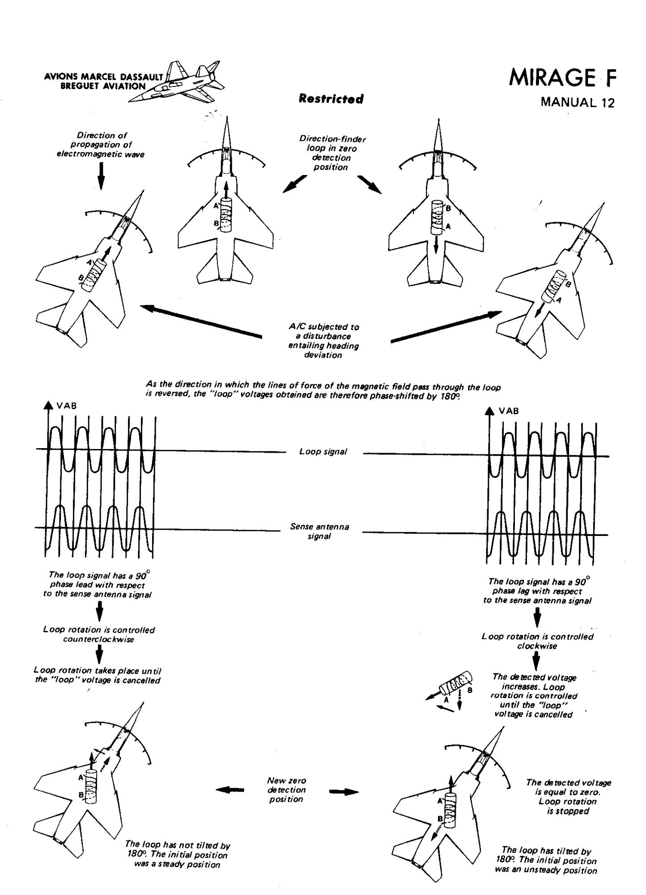

NOTE: So as to differentiate the direction in which the lines of force of the magnetic field pass through the direction-finder, an index integral with the loop is shown.

{318}------------------------------------------------

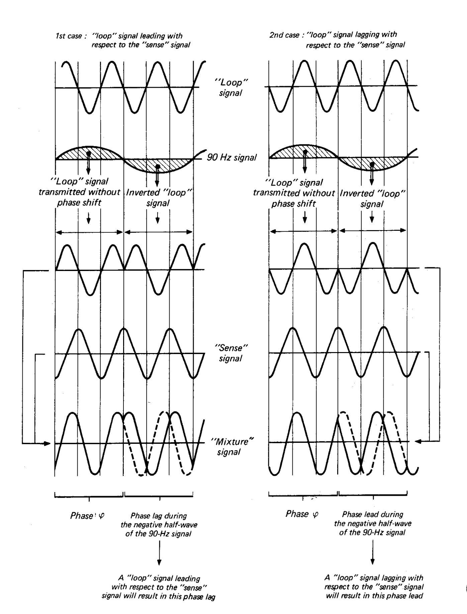

{319}------------------------------------------------

MIRAGE F MANUAL 12

(b) Determining the phase-shift direction of «loop» signal with respect to «sense» signal.

The «loop» and «sense» signals are phase-shifted by 90° one with respect to the other. A mixture of these two signals will result in a periodic signal with a phase value comprised between those of the two original signals.

As a matter of fact, for a «sense» signal lagging by 90° with respect to the «loop» signal, the signal resulting from their mixture will have a phase lead with respect to the «sense» signal. If, by some means or other, the «loop» signal is inverted (180° phase shift), the «sense» signal will be leading by 90° with respect to the new «loop» signal, and the resulting mixture will have a phase lag with respect to the «sense» signal.

Therefore by periodically inverting the «loop» signal, one obtains a «mixture» signal with a phase periodically varying in an abrupt way, according to the rhythm of the inversion command (i.e. a phase-modulated signal).

Such inversion is controlled by a 90 Hz oscillator : the positive half-wave enables the «loop» signal to be transmitted without modification, whereas the negative half-wave permits its inversion.

As shown by the diagrams of figure 5, in a phase detector, it is enough to take as a phase reference the «mixture» signal when the 90 Hz signal is in its positive half-wave, and to measure the sign of the phase-shift undergone by this «mixture» signal when the 90 Hz signal is in its negative half-wave.

If the «mixture» signal undergoes a phase lag, this means that the «loop» signal has a lead with respect to the «sense» signal.

On the contrary, if it undergoes a phase lead, this means that the «loop» signal has a lag with respect to the «sense» signal.

The phase detector output is then function of the phase-shift direction of the «loop» signal with respect to the «sense» signal. Therefore it is the phase detector which will determine, through a motor, the rotation direction of the loop.

#### (c) Remarks

- For easier understanding, the values of the various frequency scales have not been respected on the diagrams of figure 5.

- Before reaching the phase detector, the «mixture» signal is subject to various frequency modi-

fications.

- The amplitude modulation of the received signal is extracted to supply the audio identification signal.

- The phase-shift undergone by the «mixture» signal is function of the «loop» signal amplitude.

#### 3 - RECEPTION CIRCUIT TUNING

The «frequency selected» signal is transmitted to the ADF control unit in the binary form.

The base of the tuning circuit consists of a single-frequency synthesizer crystal and of an automatic band selector (solid-state circuits).

#### 4 - IDENTIFICATION

For identifying the selected transmitting station, various procedures can be used, depending on how the carrier wave is modulated.

{320}------------------------------------------------

{321}------------------------------------------------

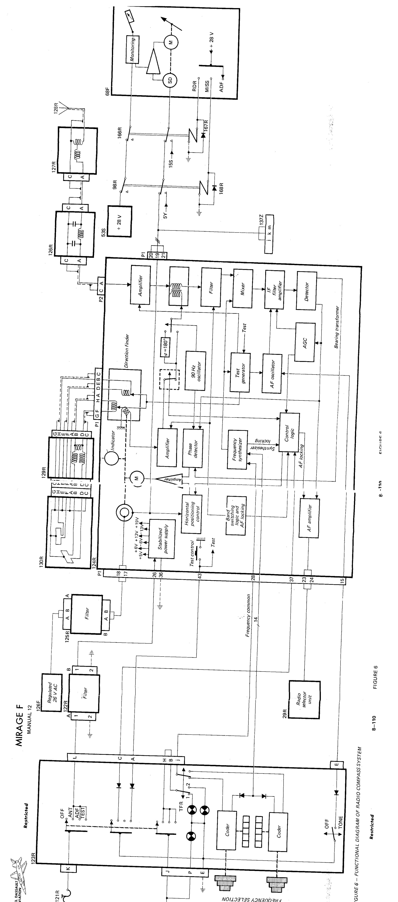

{322}------------------------------------------------

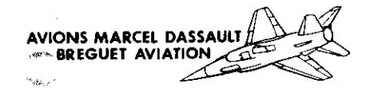

MIRAGE F MANUAL 12

#### ս - Sense antenna adaptation

The radio-compass receiver will operate correctly provided that a 3000 pF capacitance is inserted in the coaxial cable/sense antenna assembly, at the input of the receiver.

This is obtained by inserting a coaxial adaptor and an antenna coupler in the antenna circuit.

#### C - Remark

The electrical signals fed by the loop and sense antennas are phase-shifted by  $90^{\circ}$  one with respect to the other. As a matter of fact, the signal fed by the sense antenna is proportional to the electric field. On the other hand, the signal fed by the loop antenna is proportional to the magnetic field derivative. This induced voltage is therefore phase-shifted by  $90^{\circ}$  with respect to the magnetic field and consequently with respect to the electric field and to the voltage fed by the sense antenna.

#### BEARING INDICATION

The rotor of a synchro-transmitter is integral with the loop of the direction-finder. Therefore, mis rotor, which is fed with 26 V/400 Hz power, will indicate the setting position of the loop with respect to the A/C centerline. This information is transmitted to the synchro-receiver of the navigation indicator through the ADF/pole setting and ADF/radar switching relays.

#### 8 - AF LOCKING AND HORIZONTAL POSITIONING

The control logic circuit produces an AF circuit locking pulse, as well as a signal used for slaving the direction-finder loop and consequently the navigation indicator pointer at 90°, in one of the following cases: switching of tuning frequency band, no phase-locking of the synthesizer or loss of signal (no AGC).

{323}------------------------------------------------

# AVIONS MARCEL DASSAULT BREGUET AVIATION

#### Restricted

#### A - Operation in ANT mode

In this mode, the radio-compass operates as a radio wave receiver only.

The control logic then achieves the «loop» signal disconnection. Only the «sense» antenna signal is used to supply an audio output.

During this time, a circuit slaves the loop at 90°.

#### B - Unmodulated continuous wave reception

To provide for the identification of a station transmitting unmodulated continuous wave signals a 1020 Hz oscillator modulates the amplitude of the last intermediate frequency signal.

#### 5 - TEST CIRCUITS

The test consists in generating two signals representing the direction of a dummy beacon, and to apply these signals:

- to the windings of the direction-finder stator,
- to the input of the sense signal amplifier.

The test signals are generated from the frequency supplied by the synthesizer, which frequency is mixed-up with a signal delivered by a test oscillator. The frequency obtained corresponds to the frequency displayed on the control unit.

The signal processing and distribution take place in the same manner as in manual operation (ADF mode). The test result is obtained in the form of a determined bearing value.

In addition, the AF oscillator is triggered and permits the test of the AF section.

The test is controlled either from the control unit or directly on the receiver.

NOTE: During the test, the sense antenna is connected to the ground.

#### 6 - ANTENNAS

#### A - Loop antenna compensation

The electromagnetic field is distorted by the aircraft in such a manner that the direction from which the signal is received is shifted towards the nose within the first and fourth sectors, and towards the tail within the second and third sectors.

This is remedied by simply applying a given correction to the «direction» indication transmitted by the loop antenna. As the antenna sees the transmitting station offset towards the A/C centerline, it suffices, for the transmission of the two voltages representing the longitudinal and transversal components of the transmission propagation direction, to reduce the voltage representing the component along the A/C centerline. This is achieved by adjusting the alignment of the loop antenna with respect to the A/C centerline.

A quadrantal error corrector corrects the error due to loop antenna construction. As a matter of fact, this corrector is an additional attenuator inserted between one of the loop windings and the receiver amplifying circuits.

{324}------------------------------------------------

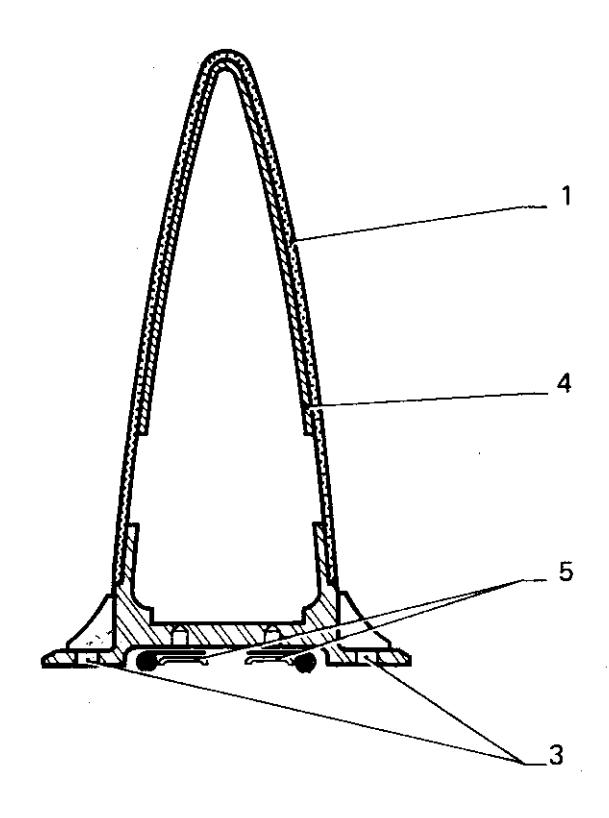

CROSS-SECTION A

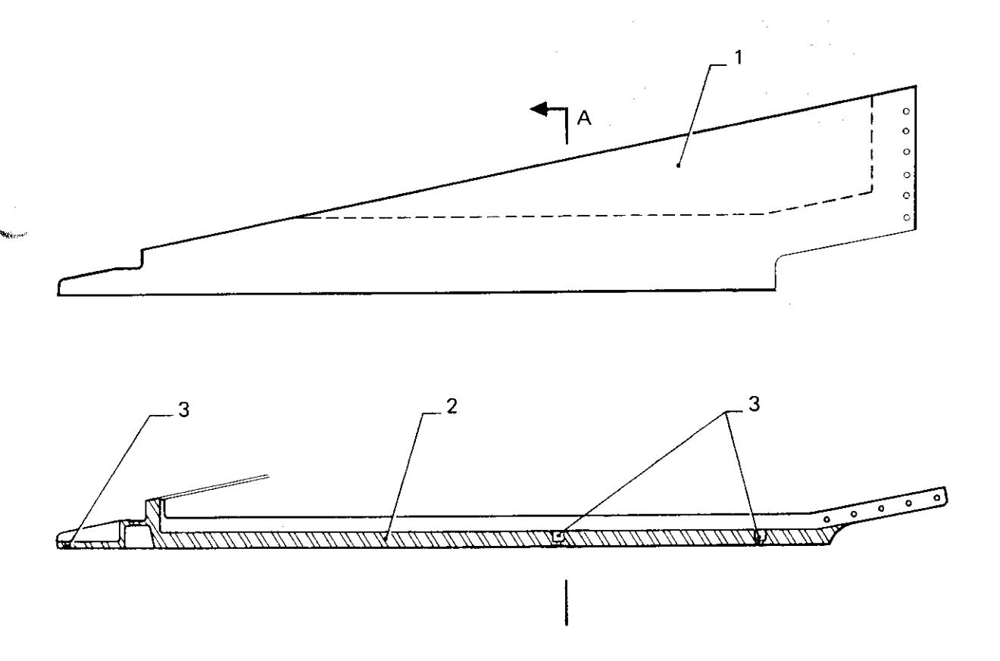

FIGURE 7 - RADIO-COMPASS SENSE ANTENNA

{325}------------------------------------------------

MIRAGE F
MANUAL 12

# INCORPORATED DOCUMENTATION SENSE ANTENNA (Figure 6)

#### 1 - GENERAL

This aerial is used for the radio-navigational reception of the radio-compass signals.

#### 2 - CHARACTERISTICS

- Bandwidth: 190 - 1799,5 kHz.

- Radiation pattern : omnidirectional

- Antenna capacity: 50 pF.

#### 3 - DESCRIPTION

The antenna consists of a glass fiber reinforced resin fairing (1) secured on a light alloy flange (2).

The flange is drilled with five holes (3) for passing the antenna attaching screws.

The fairing is internally lined with a metal sheet (4), and externally coated with metalized paint. This paint, which has a certain resistance, forms the second plate of the antenna capacitor. It is also provided as a conducting path for discharging the electrostatic charges.

The fairing assembly is protected with a coat of CELOMER lacquer spread over the whole surface, and with a coat of PYROLAC paint over the leading edge.

The internal face of the flange is fitted with a bonding seal (5) for proper electrical contact between the flange and the aircraft structure.