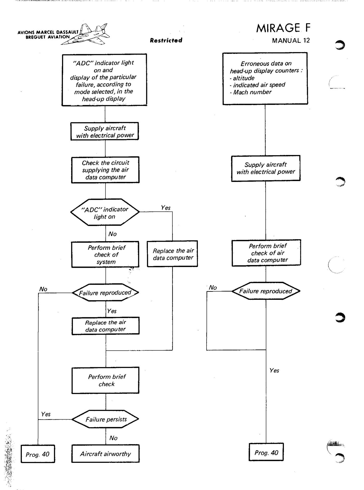

{0}------------------------------------------------

AG 05--79

Restricted

FIGURE 11 - SELF-TEST

2-121

FIGURE 11

{1}------------------------------------------------

|                                                          |                                           | · · · · · · · · · · · · · · · · · · ·                                             | <del>,</del>                               | -,                                                      |                                                                                                                                                                                                                        |                                                 |                                                                  |                                         |
|----------------------------------------------------------|-------------------------------------------|-----------------------------------------------------------------------------------|--------------------------------------------|---------------------------------------------------------|------------------------------------------------------------------------------------------------------------------------------------------------------------------------------------------------------------------------|-------------------------------------------------|------------------------------------------------------------------|-----------------------------------------|
| Alarms                                                   | #                                         | 77                                                                                | TAS                                        | 3                                                       | ΔP                                                                                                                                                                                                                     | Ps                                              | Ι                                                                |                                         |
| 1 contact C15* : H reliability Coder common        |                                           |                                                                                   |                                            |                                                         |                                                                                                                                                                                                                        |                                                 | ICAO coder                                                       | Symbol 3S (altitude coder output) |
|                                                          | 2 synchro- transmitters BRX1 - BRX2 |                                                                                   | 1 linear pot. TAS1* 1 linear pot. TAS2* |                                                         | 1 linear pot. ΔP1 for M < 1.1 and M > 1.5                                                                                                                                                                              | 1 linear pot. Ps2 for M < 1.1 and M < 1.5 | 1 linear pot. H4* 1 contact C2*: H > 12,000 m 1 air density pot. | Radar                                   |
| 4 contacts * : C 14 H - C16 IAS C17 M - C18 TAS    |                                           |                                                                                   | 1 linear pot. TAS5*                        | 1 linear pot. M2*                                       | 1 linear pot. IAS2*                                                                                                                                                                                                    |                                                 | 1 linear pot. H5* 1 pot. H fine 2*                            | Symbol generator box 35A                |
|                                                          |                                           |                                                                                   |                                            |                                                         |                                                                                                                                                                                                                        |                                                 | 1 linear pot. H2*                                                | Harmonization unit 5Y             |
| 1 contact C21* : master alarm                         |                                           |                                                                                   |                                            | 1 linear pot.M1* 2 contacts*: C10 M > 0.96 C11 M > 1.07 |                                                                                                                                                                                                                        | 1 linear pot. Ps1*                              |                                                                  | Autopilot 39C                           |
|                                                          |                                           |                                                                                   |                                            | 1 synchro-trans- mitter BCX1*                        |                                                                                                                                                                                                                        |                                                 | 1 synchro- transmitter BCX1 (H coarse)                  | Flying aids amplifier 、 48C       |
| 1 contact C19* : TAS 1 contact C13* : H               |                                           |                                                                                   | 1 linear pot. TAS4*                        |                                                         |                                                                                                                                                                                                                        |                                                 | 1 pot. H6 coarse 1 synchro- transmitter BCX2 * H fine   | Main computer 104F                |
|                                                          |                                           |                                                                                   |                                            | 1 contact C9* M > 1.4                                | 1 contact C7 : IAS < 470 km/h                                                                                                                                                                                       |                                                 | 1 contact C1* : H > 8 400 m                                   | Engine                                  |
| 1 contact C22 : master alarm → «ADC» warning light of 1W |                                           | 1 contact C12*: Tt > 135°C → warning horn 7W and limit warning light 11W |                                            |                                                         | 5 IAS contacts: C3* IAS 685 km/h → 170∆ C4* IAS < 400 km/h → (U/C) C5* IAS > 415 km/h → (flaps) C6* IAS > 445 km/h → (U/C) C8* IAS > 445 km/h → (U/C) C8* IAS < 815 km/h → (slats) 1 linear pot. IAS1* Flap servo unit |                                                 |                                                                  | Aircraft                                |

\* Information tested at air data computer test connectors

FIGURE 12 - AIR DATA DISTRIBUTION

{2}------------------------------------------------

#### Restricted

MIRAGE F

# TROUBLE SHOOTING IN AIR DATA SYSTEM

#### 1 - SCOPE

This operation is intended to locate a failed component, using the aircraft equipment.

For any symptom reported by the pilot, the mechanic shall confirm the trouble (brief check) by attempting to restore flight conditions:

A-If the symptoms reported by the pilot cannot be reproduced, use the SDAP (See 10-1) complying with the programme specified in the following charts.

 $\mathsf{B}-\mathsf{If}$  the symptoms reported by the pilot are reproduced, follow the procedure described in the following charts.

#### 2 - TROUBLE SHOOTING PROCEDURE

The trouble shooting procedure is described in the following charts.

NOTE: In the case where the SDAP is to be used for detecting a trouble, the applicable programme number is specified in the charts (See 10-1 for preparation and operating procedure).

{3}------------------------------------------------

{4}------------------------------------------------

### Restricted

## SECTION 3

### ATTITUDE AND HEADING SYSTEM

# TABLE OF CONTENTS

|                                                |                                                                                                                                                                                                      | Page                                                                 |
|------------------------------------------------|------------------------------------------------------------------------------------------------------------------------------------------------------------------------------------------------------|----------------------------------------------------------------------|
| 3-0                                            | GENERAL                                                                                                                                                                                              |                                                                      |
|                                                | - Principle of attitude and heading system                                                                                                                                                           | 3-001                                                                |
| 3-1                                            | DESCRIPTION - OPERATION                                                                                                                                                                              |                                                                      |
|                                                | - Table of components                                                                                                                                                                                | 3-101 3-111 3-116 3-121 3-125                            |
|                                                | LIST OF ILLUSTRATIONS                                                                                                                                                                                |                                                                      |
| Figu                                           | ure No.                                                                                                                                                                                              | Page                                                                 |
| 1 2 3 3 4 5 6 7 8 9 | SCHEMATIC DIAGRAM OF ATTITUDE AND HEADING SYSTEM GENERAL LAYOUT LAYOUT IN COCKPIT CONDITIONING ROLL CHANNEL PITCH CHANNEL NORMAL HEADING CHANNEL EMERGENCY HEADING CHANNEL POWER SUPPLIES MONITORING | 3-002 3-109 3-110 3-114 3-115 3-125 3-125 3-125 |
| 10                                             | ROLL, PITCH AND HEADING DATA DISTRIBUTION                                                                                                                                                            | 3-128                                                                |